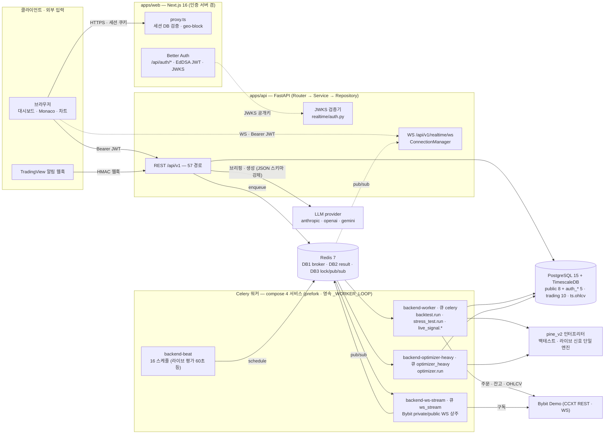
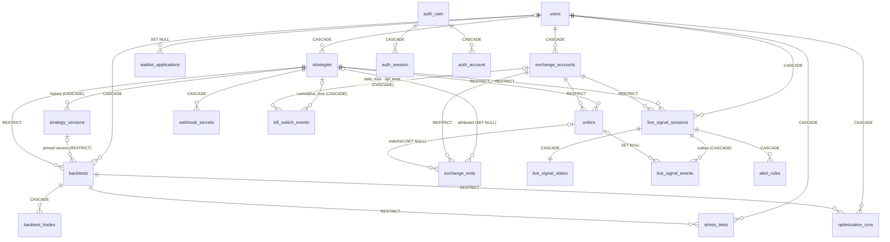

# QuantBridge

> **TradingView Pine Script 전략을 코드 한 줄 고치지 않고 가져와, 백테스트 → 스트레스 테스트 → 최적화 → 데모 자동매매(Bybit Demo)까지 하나의 파이프라인으로 잇는 퀀트 트레이딩 플랫폼.**

Pine Script 를 파이썬으로 **트랜스파일하지 않는다.** AST 를 봉(bar) 단위로 해석하는 자체 인터프리터(`pine_v2`)가 백테스트와 라이브 자동매매를 **같은 코드로** 실행한다. 미지원 함수가 하나라도 섞이면 부분 실행 대신 전체를 차단해서, 그럴듯하지만 틀린 백테스트를 애초에 만들지 않는다.

<!-- TODO: 히어로 스크린샷 촬영 후 삽입 — docs/assets/screenshots/hero-dashboard.png -->

| 항목       | 값 (2026-09-04 실측)                                                                                   |
| ---------- | ------------------------------------------------------------------------------------------------------ |
| 개발       | 2026-04-14 ~ 현재 · 1인 개발 · 커밋 1,384 · 머지 PR 723                                                |
| 백엔드     | Python 234파일 · 56.0k LOC · 3-Layer 도메인 7 · 테이블 24 (앱 19 + 인증 5) · 마이그레이션 45           |
| Pine 엔진  | `pine_v2` 24모듈 8.8k LOC · `ta.*` 23종 · `array.*` 15종                                               |
| 비동기     | Celery 태스크 28 · beat 스케줄 16 · 큐 3 (`celery` · `ws_stream` · `optimizer_heavy`) · 워커 컨테이너 4 |
| API        | REST 경로 57 · 오퍼레이션 67 · WebSocket 1 — 계약은 `contracts/openapi/openapi.json` 에 커밋            |
| 프론트엔드 | 라우트 26 · feature 도메인 12 · TypeScript 260파일 31.8k LOC                                            |
| 테스트     | pytest 555파일 4,616 케이스 · vitest 292파일 · Playwright 31 spec                                       |
| 설계 기록  | ADR 42건 (`docs/adr/`)                                                                                 |

> 숫자를 다시 세는 법 — 파일은 `find … | wc -l`, 테이블은 `SQLModel.metadata` 순회, 태스크는 `@shared_task`/`@celery_app.task` 데코레이터, ADR 은 `ls docs/adr | wc -l` 에서 `README.md` 를 뺀 값. **최대 번호로 세지 마라**(`013` 은 결번, `010a`/`010b` 가 있다).

---

## 목차

1. [주요 기능](#주요-기능)
2. [시스템 아키텍처](#시스템-아키텍처)
3. [데이터 모델](#데이터-모델)
4. [기술 스택](#기술-스택)
5. [설계 의사결정](#설계-의사결정)
6. [시작하기](#시작하기)
7. [프로젝트 구조](#프로젝트-구조)
8. [문서](#문서)

---

## 주요 기능

### 전략 (Strategy)

- **Pine v4/v5 소스 등록** — 붙여넣으면 즉시 파싱하고 문법 오류를 진단으로 되돌려 준다
- **Monaco 에디터** — Pine 전용 Monarch 문법 하이라이팅과 다크/라이트 테마를 직접 정의했다. `⌘/Ctrl + Enter` 로 재파싱
- **커버리지 판정** — 실행 _전에_ 미지원 builtin 을 전수 탐지해 실행 가능 여부를 all-or-nothing 으로 확정한다 (부분 실행 금지 — [ADR-003](./docs/adr/003-pine-runtime-safety-and-parser-scope.md))
- **전략 브리핑 · AI 생성** — 제출 전에 전략이 무엇을 하는지 결정론 층이 판정하고 LLM 이 해설만 덧붙인다([ADR-040](./docs/adr/040-strategy-brief-outside-trust-layer.md)). 자연어 → Pine 생성은 커버리지를 통과해야만 편집기에 들어온다([ADR-041](./docs/adr/041-ai-strategy-generation.md))
- **파라미터 조정 · Webhook 시크릿** — 전략별 실행 설정 슬라이더, TradingView 알림용 시크릿 발급·회전

### 백테스트 (Backtest)

- **봉 단위 시뮬레이션** — `pine_v2` 인터프리터가 전략 로직을 그대로 실행하고, 체결·수수료·슬리피지를 시뮬레이터가 정한다
- **9개 섹션 리포트** — 성과 요약 / 벤치마크 대비 / 상세 지표 / 체결 거래 / 거래·수익 분포 / 수익 구조 / 상승폭·낙폭 에피소드 / 가정 / 다음 단계
- **시각화** — 에쿼티·드로다운 차트(거래 마커 오버레이), 월별 수익 히트맵, 수익 워터폴, P&L 분포
- **공유 · 재실행** — 읽기 전용 공개 링크 발급(회수 가능), 같은 조건 재실행

<!-- TODO: 백테스트 리포트 스크린샷 — docs/assets/screenshots/backtest-report.png -->

### 스트레스 테스트 (Stress Test)

- **몬테카를로** — 거래 순서를 재배열해 자산 곡선의 분포와 최악 구간을 낸다
- **워크포워드** — 구간을 밀어 가며 in-sample/out-of-sample 성과를 분리한다
- **비용 가정 민감도** — 수수료 × 슬리피지 9-cell 격자로 손익분기 지점을 찾는다
- **파라미터 안정성** — 최적값 주변이 절벽인지 고원인지 히트맵으로 본다

### 최적화 (Optimizer)

- **Grid / Bayesian / Genetic** 3종 탐색 (Bayesian 은 scikit-optimize)
- **결과 해석** — 2D 히트맵, 반복·세대별 이력 차트, best-params 표
- **과최적화 방어** — OOS 검증 패널과 파라미터 안정성 섹션을 결과 화면에 함께 붙였다

<!-- TODO: 옵티마이저 히트맵 스크린샷 — docs/assets/screenshots/optimizer.png -->

### 트레이딩 (Trading)

- **거래소 연결** — Bybit 데모 계정 등록. API Key 는 AES-256(Fernet) 으로 암호화해 저장하고 평문 컬럼을 두지 않는다
- **두 갈래 자동 집행** — TradingView 웹훅 수신, 그리고 60초 주기로 `pine_v2` 가 직접 신호를 평가하는 라이브 세션
- **주문 원장** — 필터·CSV 내보내기·취소·상세 드로어. 30분 넘게 멈춘 주문은 스캐너가 자동으로 거래소와 대조해 정리한다
- **Kill Switch** — 손실·이상 감지 시 집행을 끊고 배너로 올린다. 해제는 사람이 명시적으로
- **실시간** — Bybit private/public WebSocket 스트림을 워커가 상주 구독하고, Redis pub/sub 을 거쳐 브라우저 WebSocket 으로 밀어 준다

<!-- TODO: 트레이딩 코크핏 스크린샷 — docs/assets/screenshots/trading-cockpit.png -->

---

## 시스템 아키텍처

앱은 **둘**이다 — `apps/web`(Next.js, 인증 서버 겸)과 `apps/api`(FastAPI + Celery). 별도 admin 앱은 없다. 관리자 표면은 web 의 `/admin/waitlist` 라우트, api 의 `/api/v1/admin/waitlist` 두 엔드포인트(`require_admin` 이메일 화이트리스트), 운영 CLI `apps/api/scripts/live_session_admin.py` 셋이 전부다.



### 인터랙티브 다이어그램 (Archify)

GitHub 은 HTML 을 렌더하지 않는다 — 클론한 뒤 브라우저로 열어라. 스펙은 같은 이름의 `.archify.json` 이고, 고치면 `archify deliver` 로 다시 만든다(결정적 렌더 — 같은 스펙은 바이트가 같다).

| 다이어그램        | 파일                                                                                         | 무엇을 보나                                                       |
| ----------------- | -------------------------------------------------------------------------------------------- | ----------------------------------------------------------------- |
| 런타임 아키텍처   | [`docs/architecture/diagrams/system-runtime.html`](./docs/architecture/diagrams/system-runtime.html) | 두 실행 경로 · 인증 경계 · 실시간 fan-out (가이드 뷰 3개)         |
| 데이터 모델       | [`docs/architecture/diagrams/data-model.html`](./docs/architecture/diagrams/data-model.html)         | 24 테이블 · FK 삭제 정책 · 멱등/배타 제약 (가이드 뷰 3개)         |
| 레포 구조와 경계  | [`docs/architecture/diagrams/repo-structure.html`](./docs/architecture/diagrams/repo-structure.html) | FE FSD Lite · BE 3-Layer · CI/계약 게이트가 지키는 것 (가이드 뷰 3개) |

### 구성 요소 — 어디서 무엇이 도나

| 구성 요소        | 무엇                                                                          | 로컬 (`mise run …`)                       | 서버 (오라클 A1 · aarch64)                                   |
| ---------------- | ----------------------------------------------------------------------------- | ----------------------------------------- | ------------------------------------------------------------ |
| `apps/web`       | Next.js 16 App Router · **Better Auth 서버 본체** · `proxy.ts` 세션 게이트    | `fe` → uvicorn 과 별도 프로세스, :3000    | `quantbridge-frontend` 컨테이너 (standalone), 루프백 :3200   |
| `apps/api`       | FastAPI 100% async · JWKS 검증 · WS fan-out · 백테스트 dispatch               | `be` → uvicorn :8000                      | 호스트 systemd `quantbridge-api.service` 의 uvicorn, 루프백 :8100 |
| Celery 워커 4    | `backend-worker` · `backend-ws-stream` · `backend-optimizer-heavy` · `backend-beat` | `up` → compose (`infra/compose/docker-compose.yml`) | 소크 compose 3층 — 워커는 `.soak/src` **고정 스냅샷**을 mount |
| PostgreSQL       | `timescale/timescaledb:2.14.2-pg15` · 스키마 `public` · `trading` · `ts`      | compose :5432 (격리 :5433)                | compose (루프백 :5433)                                        |
| Redis            | `redis:7-alpine` · `noeviction` · AOF rewrite 8mb · 쓰기 프로브 healthcheck   | compose :6379 (격리 :6380)                | compose (루프백 :6380)                                        |
| 공개 경로        | —                                                                             | —                                         | Cloudflare Tunnel(`cloudflared`, host 네트워크) + Access OTP  |
| 외부             | Bybit Demo(CCXT) · TradingView 웹훅 · LLM 3사(`LLM_PROVIDER_ORDER` 가 순서를 정한다) | —                                    | —                                                            |

★**실자금(mainnet) · 외부 공개 · 멀티 거래소는 제품 범위 밖**이다([`docs/PRD.md`](./docs/PRD.md) §0). 서버는 실사용자 0명의 소크 스택이다.

### 요청 수명주기 — 네 갈래

1. **백테스트** — `POST /api/v1/backtests` 가 행을 `queued` 로 만들고 `202` 를 돌려준다 → `dispatcher.py` Protocol 이 Redis 큐 `celery` 에 넣는다 → `backend-worker` 의 `backtest.run` 이 취소 3-guard 를 지나 `backtest/engine/v2_adapter.run_backtest_v2` 를 돌린다 → metrics + trades 를 **단일 트랜잭션**으로 저장 → 브라우저는 `/progress` 를 폴링한다. 스트레스 테스트·옵티마이저는 같은 엔진을 cell/combo 마다 재실행한다(옵티마이저는 `optimizer_heavy` 큐 전용 워커).
2. **라이브 신호** — `backend-beat` 가 60초마다 `live_signal.evaluate_all` 을 깨운다 → 활성 세션의 due bar 를 같은 `pine_v2` 가 `run_live` 로 평가 → `live_signal_events` 에 outbox 행 INSERT(멱등 UK) → `dispatch_event` 가 Kill Switch 게이트를 지나 `OrderService.execute` → Bybit Demo. 조건부 진입의 **체결 권한은 주문 원장**이다([ADR-025](./docs/adr/025-conditional-fill-ownership.md)).
3. **실시간** — `backend-ws-stream` 이 Bybit private/public WebSocket 을 상주 구독(Redis lease 로 중복 차단) → 주문 상태 전이를 원장에 반영 → Redis DB3 pub/sub 발행 → API `ConnectionManager` 가 구독해 사용자별 WebSocket 으로 밀어 준다(사용자당 최대 3연결, 초과 시 가장 오래된 연결을 4408 로 닫는다).
4. **인증** — 브라우저↔Next 는 세션 쿠키, Next↔FastAPI 와 브라우저↔FastAPI 는 Bearer JWT. `/api/auth/token` 이 EdDSA JWT 를 발급하고 FastAPI 는 `/api/auth/jwks` 공개키(`kid` 별 캐시 3600초)로 서명·`exp`·`iss`·`aud` 를 검증한다. 사용자 행은 webhook 이 아니라 **첫 인증 요청에서 JIT 생성**된다([ADR-034](./docs/adr/034-auth-self-host-better-auth.md)).

정본: [`docs/architecture/system-architecture.md`](./docs/architecture/system-architecture.md) · [`data-flow.md`](./docs/architecture/data-flow.md) · [`pine-execution-architecture.md`](./docs/architecture/pine-execution-architecture.md)

---

## 데이터 모델

24 테이블 = **앱 19 + Better Auth 5**. 컬럼 정본은 각 도메인 `models.py` 와 [`docs/domain/erd.md`](./docs/domain/erd.md), DDL 정본은 `apps/api/alembic/versions/`(45개)다. 아래는 관계와 삭제 정책만 그린 것이다.



FK 가 없는 테이블 4개는 그림 밖이다 — `ts.ohlcv`(TimescaleDB hypertable, chunk 7일, PK `(time, symbol, timeframe)`), `trading.funding_rates`(UK `(exchange, symbol, funding_timestamp)`), `auth_verification`, `auth_jwks`.

| 스키마            | 테이블                                                                                                                                                                  | 수  |
| ----------------- | ----------------------------------------------------------------------------------------------------------------------------------------------------------------------- | --- |
| `public`          | `users` · `strategies` · `strategy_versions` · `backtests` · `backtest_trades` · `stress_tests` · `optimization_runs` · `waitlist_applications`                          | 8   |
| `public` (인증)   | `auth_user` · `auth_session` · `auth_account` · `auth_verification` · `auth_jwks` — Better Auth 소유. 우리 코드는 읽지도 쓰지도 않고 alembic 이 DDL 정본만 쥔다        | 5   |
| `trading`         | `exchange_accounts` · `exchange_exits` · `orders` · `webhook_secrets` · `kill_switch_events` · `live_signal_sessions` · `live_signal_states` · `live_signal_events` · `alert_rules` · `funding_rates` | 10  |
| `ts`              | `ohlcv` — 시계열은 일반 테이블에 넣지 않는다                                                                                                                             | 1   |

**삭제 정책은 돈의 방향을 따른다**

| 정책         | 어디에                                                                                                  | 왜                                                       |
| ------------ | ------------------------------------------------------------------------------------------------------- | -------------------------------------------------------- |
| `CASCADE`    | `users` → 전략·백테스트·계정·세션, 부모 → 자식 이력(`backtest_trades` · `live_signal_*` · `alert_rules`) | 사용자 탈퇴가 「돈을 멈추는」 경로다 — 함께 사라져야 한다 |
| `RESTRICT`   | `strategies` → `backtests`·`orders`·`live_signal_sessions`, `backtests` → 스트레스·최적화, `exchange_accounts` → `orders`·세션·청산 | 결과·주문 이력이 참조하는 원본은 지울 수 없다 (409)      |
| `SET NULL`   | `live_signal_events.order_id` · `exchange_exits.matched_order_id` · `waitlist_applications.user_id`      | 감사 로그는 주문·사용자가 사라져도 남는다                 |

**멱등 · 배타 제약** — `orders.idempotency_key` UK · `live_signal_events (session_id, bar_time, sequence_no, action, trade_id)` UK(outbox 재전송이 중복 주문을 못 만든다) · `live_signal_sessions (user, strategy, account, symbol)` 활성 partial UK · `kill_switch_events` CHECK `strategy_id XOR exchange_account_id`(`cumulative_loss` 는 전략, `daily_loss`/`api_error` 는 계정 단위) · `exchange_exits (exchange_account_id, row_hash)` UK.

---

## 기술 스택

### Frontend (`apps/web`)

| 영역        | 기술                                                               |
| ----------- | ------------------------------------------------------------------ |
| 프레임워크  | Next.js `16.2` (App Router) · React `19` · TypeScript `5.6` Strict |
| 스타일링    | Tailwind CSS `v4` · shadcn/ui `v4` (Base UI) · Pretendard          |
| 상태        | TanStack React Query `5.59` (서버) · Zustand `5` (클라이언트)      |
| 폼 · 검증   | React Hook Form `7.72` · Zod `v4`                                  |
| 인증        | Better Auth `1.6` — 이 앱이 인증 서버 본체다                       |
| 에디터·차트 | Monaco Editor · Lightweight Charts `4.2` · Recharts `3.8`          |
| 품질        | Biome `2.5.9` — 린트·포맷 단독 ([ADR-039](./docs/adr/039-frontend-biome.md)) |
| 테스트      | Vitest `2.1` · Testing Library · Playwright `1.59`                 |

### Backend (`apps/api`)

| 영역          | 기술                                                            |
| ------------- | --------------------------------------------------------------- |
| 프레임워크    | FastAPI `0.115+` (100% async) · Python `3.12`                   |
| ORM · 검증    | SQLModel · SQLAlchemy `2.0` (asyncpg) · Pydantic `v2`           |
| 데이터베이스  | PostgreSQL 15 + TimescaleDB `2.14` (OHLCV hypertable) · Alembic |
| 비동기 작업   | Celery `5.4` + Redis (prefork · 큐 3종 · 영속 `_WORKER_LOOP`)   |
| Pine 파싱     | pynescript `0.3.0` (AST 파싱만, LGPL — `parser_adapter.py` 한 곳) + 자체 인터프리터 |
| 수치 계산     | pandas · NumPy · scikit-optimize (Bayesian)                     |
| 거래소        | CCXT `4+` (Bybit Demo)                                          |
| LLM           | anthropic · openai · google-genai — 세 provider 모두 JSON 스키마를 강제하고 순서는 `LLM_PROVIDER_ORDER` 설정이 정한다 |
| 인증 · 보안   | PyJWT (EdDSA/JWKS 검증) · cryptography (Fernet AES-256) · slowapi |
| 테스트 · 품질 | pytest `8.3` · Ruff · mypy                                      |

도구 버전(node · python · pnpm · uv)의 SSOT 는 루트 [`mise.toml`](mise.toml) 하나다 ([ADR-036](./docs/adr/036-tool-version-ssot-mise.md)).

---

## 설계 의사결정

### 1. Pine Script 를 트랜스파일하지 않고 인터프리터로 실행한다

**판단** — Pine 소스를 파이썬 코드로 변환해 `exec()` 하는 흔한 방식을 버리고, AST 를 봉 단위로 순회하는 인터프리터를 직접 만들었다 ([ADR-003](./docs/adr/003-pine-runtime-safety-and-parser-scope.md) · [ADR-011](./docs/adr/011-pine-execution-strategy-v4.md)).

**이유** — 두 가지다. (1) 사용자가 붙여넣은 문자열이 서버에서 임의 코드로 실행되는 경로를 원천 차단한다. (2) 백테스트와 라이브 자동매매가 **문자 그대로 같은 엔진**을 쓴다. 변환기를 두면 "백테스트에서는 되는데 실거래에서는 다르게 도는" 격차가 반드시 생기고, 그 격차는 돈으로 계산된다.

**대가** — Pine 표준 라이브러리를 직접 구현해야 한다. 현재 `ta.*` 23종 · `array.*` 15종 · math/string/input 계열을 `stdlib.py` 가 pandas/NumPy 로 계산한다. 라이선스 경계도 설계 제약이 됐다 — 파서(pynescript)는 LGPL 이라 PyPI 의존성으로만 쓰고, `import` 지점을 파일 하나(`parser_adapter.py`)로 격리했다.

### 2. 미지원 함수가 하나라도 있으면 전체를 차단한다

**판단** — 지원하지 않는 Pine 함수가 포함된 전략은 부분 실행하지 않고 실행 자체를 거부한다. 판정은 실행 전 `coverage.py` 가 전수 탐지로 끝낸다.

**이유** — 부분 실행의 결과물은 "실패"처럼 보이지 않는다. 숫자가 나오고 차트가 그려진다. 사용자는 그 수익률을 믿고 돈을 넣는다. **틀린 답을 조용히 주는 것보다 답을 주지 않는 편이 낫다**는 판단이고, 이 원칙이 도메인 규칙으로 고정돼 있다.

**보완** — 결과가 TradingView 와 달라질 수 있는 함수(`request.security`, `heikinashi` 등)는 `degraded` 로 따로 분류해, 사용자가 명시적으로 동의해야만 백테스트를 제출할 수 있게 했다.

### 3. 금융 숫자는 Decimal, DB 세션은 Repository 만 쥔다

**판단** — 가격·수량·수익률·레버리지는 전부 `Decimal`, float 금지. `AsyncSession` 은 Repository 계층만 보유하고 Service 는 트랜잭션 경계만 담당한다.

**이유** — 둘 다 같은 종류의 재발 사고를 규칙으로 막은 것이다. float 합산 오차는 백테스트 성과 지표에서 조용히 누적되고, 트랜잭션 commit 누락은 통합 테스트가 read-your-writes 로 통과시켜 버려 잡히지 않는다. 그래서 **mutation 메서드마다 `repo.commit()` 호출을 강제하는 spy 회귀 테스트**를 의무로 두고 있다.

### 4. 인증을 self-host 로 전환했다 (Clerk → Better Auth)

**판단** — SaaS 인증을 걷어내고 Next.js 앱 자체를 인증 서버로 만들었다. FastAPI 는 시크릿을 쥐지 않고 JWKS 공개키로 EdDSA 서명만 검증한다 ([ADR-034](./docs/adr/034-auth-self-host-better-auth.md)).

**이유** — 벤더 종속과 비용도 있지만, 결정적인 것은 **검증 경로를 우리가 볼 수 있느냐**였다. 전환 과정에서 기존 인증 테스트가 SDK 를 mock 하느라 서명·만료·`iss`·`aud` 를 한 번도 검증한 적이 없다는 사실이 드러났다. 지금은 검증기가 한 곳(`realtime/auth.py`)이고 HTTP·WebSocket 이 그것을 공유한다.

**결과** — 의존성 순감(제거 10 vs 추가 1), CI 에 필요한 인증 secret 0개.

---

## 시작하기

### 1. 사전 요구사항

★**node / python / pnpm / uv 를 손으로 깔지 마라.** 버전의 SSOT 는 루트 [`mise.toml`](mise.toml) 하나이고, `mise install` 이 그 값대로 설치한다.

```bash
# macOS 기준
brew install mise docker git
mise install          # mise.toml 의 node / python / pnpm / uv 설치
mise ls               # 지금 도는 값 + 출처 config 를 함께 출력 — 확인은 이걸로
```

셸에 붙이기 (한 번만):

```bash
echo 'eval "$(mise activate zsh)"' >> ~/.zshrc && exec zsh
```

> `mise run` 태스크와 git 훅은 shim 을 PATH 앞에 스스로 세우므로 위 활성화 없이도 핀을 따른다.
> 활성화는 **터미널에서 직접** `pnpm`·`uv` 를 칠 때를 위한 것이다.

### 2. 클론 + 환경 변수

`.env.example` 은 **서비스별로 분리**돼 있다 (각 loader 관행에 맞춤).

```bash
git clone <repo-url> quant-bridge
cd quant-bridge

cp .env.example .env                          # 루트 — docker compose 가 자동 로드 (.env.local 아님)
cp apps/api/.env.example apps/api/.env.local  # 백엔드 — pydantic-settings
cp apps/web/.env.example apps/web/.env.local  # 프론트엔드 — Next.js
```

필수 실값 교체 (각 파일 `[필수 …]` 마킹된 키):

- `apps/api/.env.local` + `.env` — `TRADING_ENCRYPTION_KEYS` ([생성 방법](#3-trading_encryption_keys-생성)) · `BETTER_AUTH_URL`
- `apps/web/.env.local` — `BETTER_AUTH_SECRET` (`openssl rand -base64 32`) · `BETTER_AUTH_URL` · `BETTER_AUTH_DATABASE_URL`

> **왜 3파일인가?** docker compose 는 루트 `.env` 만, pydantic-settings 는 `apps/api/.env.local`, Next.js 는 `apps/web/.env.local` 을 읽는다. 하나로 몰면 "이 변수가 어디서 쓰이나"를 추론해야 하고 loader 간 약속이 어긋난다.

### 3. `TRADING_ENCRYPTION_KEYS` 생성

거래소 API Key 를 AES-256 으로 암호화하는 Fernet 키. **최초 1회만 생성**하고, 바꾸면 기존에 저장된 API Key 를 복호화할 수 없다.

```bash
cd apps/api
KEY=$(uv run python -c "from cryptography.fernet import Fernet; print(Fernet.generate_key().decode())")
echo "TRADING_ENCRYPTION_KEYS=$KEY" >> .env.local      # 로컬 uvicorn/celery
echo "TRADING_ENCRYPTION_KEYS=$KEY" >> ../../.env      # docker compose 컨테이너
cd ../..
```

두 파일의 값이 **반드시 같아야** 워커와 API 가 같은 키로 복호화한다.

### 4. 실행

```bash
mise run dev          # 인프라 + 백엔드 + 프론트엔드 한 번에 (Ctrl+C 로 종료)
```

나눠서 띄우려면 (각 별도 터미널):

```bash
mise run up           # Postgres + Redis + Celery worker (docker compose)
mise run migrate      # DB 스키마 적용
mise run be           # FastAPI  → http://localhost:8000
mise run fe           # Next.js  → http://localhost:3000
mise run help         # 전체 태스크 목록 · 격리 포트 모드 안내
```

<details>
<summary>mise 없이 직접 띄우려면</summary>

```bash
docker compose --project-directory . -f infra/compose/docker-compose.yml up -d db redis

cd apps/api
uv sync
uv run alembic upgrade head
uv run uvicorn src.main:app --no-server-header --reload --host 0.0.0.0 --port 8000
uv run celery -A src.tasks worker --loglevel=info --concurrency=4 --pool=prefork

cd ../web && pnpm install && pnpm dev
```

> `--no-server-header` 는 선택이 아니다 — 이 플래그가 없으면 uvicorn 이 `Server: uvicorn`
> 헤더를 ASGI 바깥에서 붙여 버려 미들웨어로는 지울 수 없다. 레포 안의 모든 기동 자리가
> 이 플래그를 갖는지 `apps/api/tests/test_uvicorn_server_header.py` 가 검사한다.

</details>

### 5. 동작 확인

```bash
curl http://localhost:8000/health    # {"status":"ok"}
open http://localhost:8000/docs      # Swagger UI (DEBUG=true 인 로컬에서만 노출)
open http://localhost:3000           # 홈 → 로그인
mise run test                        # 백엔드 pytest + 프론트엔드 vitest
```

상세 셋업·환경변수·트러블슈팅은 [`docs/development/local-setup.md`](./docs/development/local-setup.md) 참조.

---

## 프로젝트 구조

```
quant-bridge/
├── apps/
│   ├── api/                        # FastAPI + Celery 백엔드 → apps/api/README.md
│   │   ├── src/
│   │   │   ├── main.py             #   create_app() — 라우터 11 조립 · CORS · 보안 헤더 · rate limit · 예외 핸들러
│   │   │   ├── strategy/           #   Pine CRUD · brief · generate · pine_v2/ (24) · convert/ · narrative/  … 12.1k LOC
│   │   │   ├── trading/            #   계정 · 주문 · 세션 · 킬스위치 · services/(16) repositories/(10) websocket/(6) … 16.0k
│   │   │   ├── backtest/           #   제출 · 조회 · 공유 · engine/ (v2_adapter · metrics)  … 5.4k
│   │   │   ├── stress_test/        #   몬테카를로 · 워크포워드 · 비용 민감도 · 파라미터 안정성 · engine/  … 2.7k
│   │   │   ├── optimizer/          #   grid · bayesian · genetic · engine/  … 3.2k
│   │   │   ├── waitlist/  auth/    #   베타 대기열 + admin 승인 · 사용자 원장(JIT 생성) + 탈퇴
│   │   │   ├── market_data/        #   OHLCV provider 3종 (ccxt · timescale · fixture) — 공개 REST 없음
│   │   │   ├── realtime/           #   인증 WebSocket + Redis pub/sub fan-out + ★JWKS 검증기(auth.py)
│   │   │   ├── tasks/              #   Celery 앱 · 태스크 28 · beat 16 · 영속 _worker_loop  … 9.8k
│   │   │   └── common/  core/      #   DB 세션 · 예외 · redlock · metrics · rate limit · 알림 · Settings(46 필드)
│   │   ├── alembic/versions/       #   마이그레이션 45 — downgrade 는 -x allow_destructive=1 없이 죽는다
│   │   ├── tests/                  #   pytest 555파일 · 4,616 케이스 (.env.local 통째 소싱 의무)
│   │   └── scripts/                #   export_openapi · seed · live_session_admin · 진단 유틸
│   └── web/                        # Next.js 16 프론트엔드 (인증 서버 겸) → apps/web/README.md
│       ├── src/app/                #   라우트 26 · proxy.ts · error.tsx 10 · api/auth/[...all] (Better Auth 핸들러)
│       ├── src/features/           #   12 도메인 — 화면 컴포넌트의 기본 자리 (ADR-035)
│       ├── src/components/         #   ui/ (shadcn 15, 수정 금지) · layout · charts · monaco · providers
│       ├── src/lib/ store/ hooks/  #   api-client · auth · auth-server · geo · 디자인 토큰 · zustand
│       └── e2e/                    #   Playwright 31 spec · 프로젝트 7종
├── contracts/openapi/              # openapi.json — 57 경로 · CI 가 drift 를 red 로 (ADR-031)
├── infra/
│   ├── compose/                    # base · isolated (5433/6380 + watchfiles) · soak (.soak/src 고정) · frontend (FE + cloudflared)
│   └── db/init/                    # TimescaleDB 확장 + ts 스키마 (컨테이너 최초 1회)
├── tools/scripts/                  # 운영 22 — soak-* · db-backup · disk-guard · ledger-vitals · ci-changed-scopes · hooks/
├── docs/                           # status · PRD · backlog* · architecture/ (diagrams/) · domain · api · development · operations · adr (42) · lessons
├── evals/harness/                  # 개발 하네스 eval (TypeScript)
├── phases/                         # 하네스 러너 회차 정의 — 산출물은 runs/ (gitignore)
├── .github/workflows/              # ci.yml (단일 게이트) · trust-layer-nightly · live-smoke · nightly-real-broker (수동)
├── .husky/                         # pre-commit (lint-staged + ledger-vitals) · pre-push (main 직접 push 영구 거부)
├── AGENTS.md  CONTEXT.md  DESIGN.md  # 에이전트 오리엔테이션 · 도메인 용어 SSOT · 디자인 토큰
└── mise.toml                       # 도구 버전 + 개발 명령 34 — SSOT (ADR-036)
```

### 경계를 지키는 장치

| 경계                          | 집행 장치                                                                                          | 어디                                                                        |
| ----------------------------- | -------------------------------------------------------------------------------------------------- | --------------------------------------------------------------------------- |
| main/master 직접 push         | 영구 거부 (bypass 불가). 작업 브랜치 push 와 PR 생성은 자유                                        | `.husky/pre-push` → `tools/scripts/lib/pre-push-ref-guard.sh`               |
| 코드 스타일                   | `ruff check --fix` + `ruff format` (py) · `biome check --write` (ts/tsx/css/json)                   | pre-commit lint-staged (루트 `package.json`)                                |
| 원장 사활 4축                 | 살아 있는 `다음 행동 =` ≤1 · ⓪ 표 ≥1행 · RESOLVED 역류 0 · 진입점이 PRD §5 겨냥                  | pre-commit → `tools/scripts/ledger-vitals.sh` (status/backlog 스테이지 시)  |
| green                         | be: `ruff` → `export_openapi.py --check` → `mypy` → `pytest` 전량 / fe: `biome` → `tsc` → `vitest` → `build` | `.github/workflows/ci.yml` — 경로 스코프, 분류 실패 시 전량 (ADR-037)  |
| API 계약                      | `contracts/openapi/openapi.json` 이 현재 라우터와 byte-identical 이어야 한다                       | `apps/api/scripts/export_openapi.py --check`                                |
| 파괴적 DDL · 개발 DB 오염     | `alembic downgrade` 차단 · `DATABASE_URL` 폴백 pytest 거부(rc=3)                                    | `apps/api/alembic/env.py` · `apps/api/tests/_db_guard.py`                    |

---

## 문서

| 위치                                                                                    | 용도                                                           |
| --------------------------------------------------------------------------------------- | -------------------------------------------------------------- |
| [`CONTEXT.md`](CONTEXT.md)                                                              | 도메인 용어·관계의 SSOT (Strategy / Backtest / Trading 정의)   |
| [`AGENTS.md`](AGENTS.md)                                                                | 개발 원칙 · 스택 규칙 · 문서 체계 (LLM 에이전트 + 개발자 공용) |
| [`DESIGN.md`](DESIGN.md)                                                                | 디자인 시스템 — 색상·타이포·간격 토큰 SSOT                     |
| [`docs/README.md`](./docs/README.md)                                                    | 문서 지도 — 어느 질문을 어느 문서가 답하는가                   |
| [`docs/status.md`](./docs/status.md)                                                    | 지금 진행 중인 작업 (현행 sprint 상태의 SSOT)                  |
| [`docs/architecture/`](./docs/architecture/)                                            | 시스템·데이터 흐름·Pine 실행 정본 + `diagrams/` 인터랙티브 3장 |
| [`docs/domain/erd.md`](./docs/domain/erd.md)                                            | 24 테이블 컬럼·FK·인덱스 정본                                  |
| [`docs/adr/`](./docs/adr/)                                                              | ADR 42건 — 왜 그렇게 결정했는가                                |
| [`apps/api/AGENTS.md`](apps/api/AGENTS.md) · [`apps/web/AGENTS.md`](apps/web/AGENTS.md) | 스택별 강제 규칙 (FastAPI 3-Layer · React Hooks 안전 등)       |

---

## License

Proprietary — All rights reserved. 전문은 [`LICENSE`](LICENSE).
제3자 의존성의 라이선스 고지는 [`NOTICE`](NOTICE) 에 있다.
