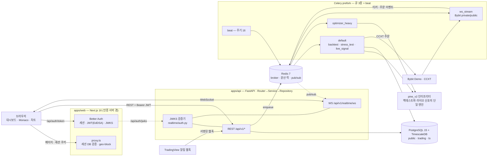
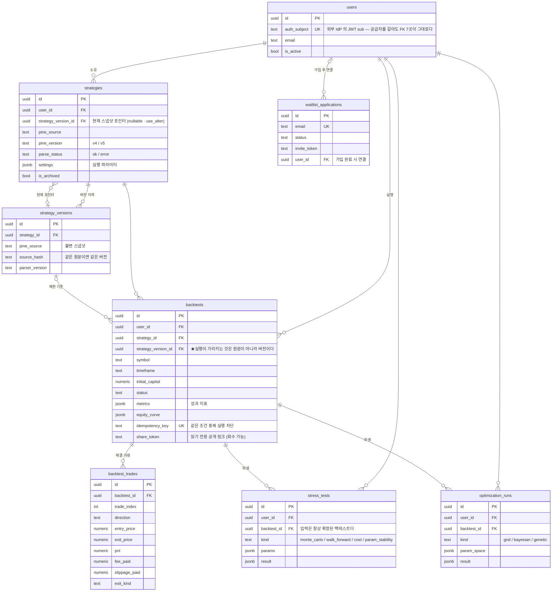
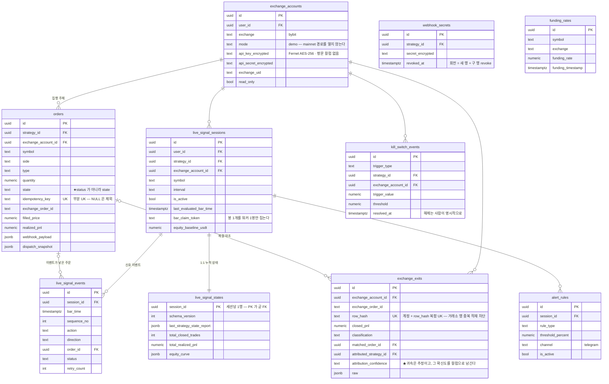

# QuantBridge

> **TradingView Pine Script 전략을 코드 한 줄 고치지 않고 가져와, 백테스트 → 스트레스 테스트 → 최적화 → 데모/라이브 자동매매까지 하나의 파이프라인으로 잇는 퀀트 트레이딩 플랫폼.**

Pine Script 를 파이썬으로 **트랜스파일하지 않는다.** AST 를 봉(bar) 단위로 해석하는 자체 인터프리터(`pine_v2`)가 백테스트와 라이브 자동매매를 **같은 코드로** 실행한다. 미지원 함수가 하나라도 섞이면 부분 실행 대신 전체를 차단해서, 그럴듯하지만 틀린 백테스트를 애초에 만들지 않는다.

<!-- TODO: 히어로 스크린샷 촬영 후 삽입 — docs/assets/screenshots/hero-dashboard.png -->

| 항목       | 값                                                                     |
| ---------- | ---------------------------------------------------------------------- |
| 개발       | 2026-04 ~ 현재 · 1인 개발 · 커밋 1,384                                 |
| 백엔드     | Python 234파일 · 56.0k LOC · src 패키지 14 (3-Layer 도메인 7) · 마이그레이션 45 |
| API        | REST 오퍼레이션 67 (path 57) + WebSocket 1 — 계약은 `contracts/openapi` |
| DB         | PostgreSQL 15 · 스키마 3벌(`public`·`trading`·`ts`) · 테이블 24        |
| Pine 엔진  | 24모듈 8.8k LOC · `ta.*` 23종 · `array.*` 15종                         |
| 비동기     | Celery 태스크 28 · beat 스케줄 16 · 큐 3                               |
| 프론트엔드 | 라우트 26 · feature 도메인 12 · 앱은 2개 (별도 admin 앱 없음)          |
| 테스트     | pytest 555파일 · vitest 292파일 · Playwright 31 spec                   |
| 설계 기록  | ADR 42건 (`docs/adr/`)                                                 |

---

## 목차

1. [주요 기능](#주요-기능)
2. [시스템 아키텍처](#시스템-아키텍처)
3. [DB 구조](#db-구조)
4. [레포 구조](#레포-구조)
5. [기술 스택](#기술-스택)
6. [설계 의사결정](#설계-의사결정)
7. [시작하기](#시작하기)
8. [문서](#문서)

---

## 주요 기능

### 전략 (Strategy)

- **Pine v4/v5 소스 등록** — 붙여넣으면 즉시 파싱하고 문법 오류를 진단으로 되돌려 준다
- **Monaco 에디터** — Pine 전용 Monarch 문법 하이라이팅과 다크/라이트 테마를 직접 정의했다. `⌘/Ctrl + Enter` 로 재파싱
- **커버리지 판정** — 실행 _전에_ 미지원 builtin 을 전수 탐지해 실행 가능 여부를 all-or-nothing 으로 확정한다 (부분 실행 금지 — [ADR-003](./docs/adr/003-pine-runtime-safety-and-parser-scope.md))
- **파라미터 조정 · Webhook 시크릿** — 전략별 실행 설정 슬라이더, TradingView 알림용 시크릿 발급·회전

### 백테스트 (Backtest)

- **봉 단위 시뮬레이션** — `pine_v2` 인터프리터가 전략 로직을 그대로 실행하고, 체결·수수료·슬리피지를 시뮬레이터가 정한다
- **9개 섹션 리포트** — 성과 요약 / 벤치마크 대비 / 상세 지표 / 체결 거래 / 거래·수익 분포 / 수익 구조 / 상승폭·낙폭 에피소드 / 가정 / 다음 단계
- **시각화** — 에쿼티·드로다운 차트(거래 마커 오버레이), 월별 수익 히트맵, 수익 워터폴, P&L 분포
- **공유 · 재실행** — 읽기 전용 공개 링크 발급(회수 가능), 같은 조건 재실행

<!-- TODO: 백테스트 리포트 스크린샷 — docs/assets/screenshots/backtest-report.png -->

### 스트레스 테스트 (Stress Test)

- **몬테카를로** — 거래 순서를 재배열해 자산 곡선의 분포와 최악 구간을 낸다
- **워크포워드** — 구간을 밀어 가며 in-sample/out-of-sample 성과를 분리한다
- **비용 가정 민감도** — 수수료 × 슬리피지 9-cell 격자로 손익분기 지점을 찾는다
- **파라미터 안정성** — 최적값 주변이 절벽인지 고원인지 히트맵으로 본다

### 최적화 (Optimizer)

- **Grid / Bayesian / Genetic** 3종 탐색 (Bayesian 은 scikit-optimize)
- **결과 해석** — 2D 히트맵, 반복·세대별 이력 차트, best-params 표
- **과최적화 방어** — OOS 검증 패널과 파라미터 안정성 섹션을 결과 화면에 함께 붙였다

<!-- TODO: 옵티마이저 히트맵 스크린샷 — docs/assets/screenshots/optimizer.png -->

### 트레이딩 (Trading)

- **거래소 연결** — Bybit 데모 계정 등록. API Key 는 AES-256(Fernet) 으로 암호화해 저장하고 평문 컬럼을 두지 않는다
- **두 갈래 자동 집행** — TradingView 웹훅 수신, 그리고 60초 주기로 `pine_v2` 가 직접 신호를 평가하는 라이브 세션
- **주문 원장** — 필터·CSV 내보내기·취소·상세 드로어. 30분 넘게 멈춘 주문은 스캐너가 자동으로 거래소와 대조해 정리한다
- **Kill Switch** — 손실·이상 감지 시 집행을 끊고 배너로 올린다. 해제는 사람이 명시적으로
- **실시간** — Bybit private/public WebSocket 스트림을 워커가 상주 구독하고, Redis pub/sub 을 거쳐 브라우저 WebSocket 으로 밀어 준다

<!-- TODO: 트레이딩 코크핏 스크린샷 — docs/assets/screenshots/trading-cockpit.png -->

---

## 시스템 아키텍처

돌아가는 프로세스는 **8종**(표 7행 — `db`·`redis` 는 한 행)이고, 그 중 **5종이 `apps/api` 코드를 공유**한다.
★그런데 그 5종 중 **compose 가 띄우는 것은 4종뿐이다** — API 프로세스는 compose 밖에 있다.

| 프로세스 | 무엇 | 어떻게 뜨나 |
| --- | --- | --- |
| `frontend` | Next.js 16 — 화면 + **인증 서버 본체**(Better Auth) | `docker-compose.frontend.yml` (+ `cloudflared` 터널) |
| `apps/api` (uvicorn) | FastAPI — REST 67 오퍼레이션 + WebSocket 1 | ★**compose 아님** — systemd user 유닛 `quantbridge-api.service`(`127.0.0.1:8100`, 앞단은 리버스 프록시). 로컬은 `mise run be` |
| `backend-worker` | Celery 기본 큐(이름은 `celery` — `-Q` 없이 뜬다) — 백테스트 · 스트레스 · 라이브 신호 · 주문 집행 | compose · prefork ×2 |
| `backend-optimizer-heavy` | Celery `optimizer_heavy` 큐 — 최적화 전용 | compose · prefork ×1 |
| `backend-ws-stream` | Celery `ws_stream` 큐 — Bybit private/public WS 상주 구독 | compose · prefork ×3 |
| `backend-beat` | Celery beat — 주기 작업 16 | compose · 단일 인스턴스 |
| `db` · `redis` | TimescaleDB `2.14.2-pg15` · Redis 7 (AOF, `noeviction`) | compose |

큐를 셋으로 나눈 이유는 하나다 — **최적화 한 건이 라이브 신호 평가를 굶기지 않게** 하려면
같은 워커 풀에 둘 수 없다. `ws_stream` 은 상주 구독이라 태스크가 아예 끝나지 않으므로 더 그렇다.
API 프로세스를 compose 밖에 둔 것은 남아 있는 비대칭이다 — 배포·재시작 절차가 워커와 갈린다
(유닛 인스톨러는 [`tools/scripts/api-service.sh`](tools/scripts/api-service.sh)).

배포 호스트는 **Oracle Cloud VM 1대**(2 OCPU, 다른 프로젝트와 공유)다. 인터넷에서 들어오는 길은
**Cloudflare 터널 하나**뿐이고 호스트 방화벽은 22 외 전부 REJECT 다 —
브라우저 → Cloudflare(Access OTP) → `cloudflared`(host 네트워크) → `127.0.0.1:3200`(FE 컨테이너) 또는
`127.0.0.1:8100`(호스트 uvicorn). 서버에 Node 가 없어 **FE 이미지는 맥에서 빌드해 `docker save | ssh … docker load`** 로
옮기고, API 가 JWKS 를 받는 경로는 같은 호스트 안 `127.0.0.1:3200/api/auth/jwks` 헤어핀이다.
정본: [`docs/operations/frontend-deploy.md`](./docs/operations/frontend-deploy.md) · [`backend-deploy.md`](./docs/operations/backend-deploy.md).



★**브라우저는 FastAPI 를 직접 부른다.** `proxy.ts` 는 **페이지 라우트**의 세션·geo 게이트일
뿐이고, 데이터 호출은 `NEXT_PUBLIC_API_URL` 로 바로 나간다(`apps/web/src/lib/api-base.ts`).
Next 를 BFF 로 두지 않았기 때문에 백엔드가 인증을 **스스로** 검증해야 하고, 그래서 검증기가
`realtime/auth.py` 한 곳에 모여 HTTP·WebSocket 이 그것을 공유한다.

### 인터랙티브 다이어그램

Archify 로 만든 자립형 HTML 두 장. 클론 후 브라우저로 열면 되고(외부 의존 없음),
검색 · 관계 추적 · 가이드 뷰 · PNG/SVG 내보내기가 안에 들어 있다. 스펙(JSON)이 옆에 함께
커밋돼 있어서 구조가 바뀌면 그 JSON 만 고쳐 다시 렌더한다.

| 다이어그램 | 무엇을 보여주나 |
| --- | --- |
| [`system-architecture.html`](./docs/architecture/diagrams/system-architecture.html) | 컨테이너 경계 · 인증 경계 · 비동기 실행 · 실시간 경로 (가이드 뷰 3종) |
| [`strategy-to-trading-dataflow.html`](./docs/architecture/diagrams/strategy-to-trading-dataflow.html) | 입력 → 파스 → 실행 → 테이블 → 소비. 어느 단계가 **어느 테이블**을 쓰는지 |

정본: [`docs/architecture/system-architecture.md`](./docs/architecture/system-architecture.md) · [`data-flow.md`](./docs/architecture/data-flow.md)

---

## DB 구조

PostgreSQL 15 **한 대**를 스키마 3벌(`public` · `trading` · `ts`)로 나눈다. TimescaleDB 확장은 `ts` 만 쓴다.
테이블 24개 중 5개는 `public` 안에 있지만 **우리 코드가 건드리지 않는다**(맨 아래 행).

| 스키마 | 무엇이 사는가 | 테이블 | 왜 나눴나 |
| --- | --- | --- | --- |
| `public` | 사용자 · 전략 · 백테스트 · 파생 분석 · waitlist | 8 | 앱 도메인 본체 |
| `trading` | 거래소 계정 · 주문 원장 · 라이브 세션 · 킬스위치 | 10 | **실집행 데이터.** 권한·백업·감사 경계를 코드 규약이 아니라 스키마로 그었다 |
| `ts` | `ohlcv` — hypertable, chunk 7일 | 1 | 시계열은 행 수 규모가 다르다. 일반 테이블과 섞으면 인덱스·백업·VACUUM 전략이 함께 망가진다 |
| `public` 안 · **소유자만 다름** | `auth_user` · `auth_session` · `auth_account` · `auth_verification` · `auth_jwks` | 5 | 스키마를 더 만들지 않았다 — 갈리는 것은 위치가 아니라 소유자다. 쓰는 쪽은 Next 앱이다. DDL 정본만 alembic 이 쥐고 **우리 백엔드 코드는 읽지도 쓰지도 않는다** ([ADR-034](./docs/adr/034-auth-self-host-better-auth.md)) |

스키마 생성 위치는 두 곳이다 — `ts` 는 컨테이너 최초 기동 SQL(`infra/db/init/01-timescaledb.sql`)과
마이그레이션 양쪽에, `trading` 은 마이그레이션에만 있다(`CREATE SCHEMA` 는 autogenerate 가 생략한다).

### 전략 · 분석 (`public`)



### 트레이딩 (`trading`)



`strategies` · `users` 는 `public` 에 있고 `trading.*` 가 스키마를 넘어 참조한다 —
`ForeignKey("strategies.id")` 처럼 스키마 없는 이름은 `public`, `ForeignKey("trading.orders.id")` 는
같은 스키마다. 위 두 ERD 가 그 경계로 갈린다.

### 시계열 (`ts`)

```
ts.ohlcv  —  PK (time, symbol, timeframe)   +  ix_ohlcv_symbol_tf_time_desc(symbol, timeframe, time)
             hypertable · chunk_time_interval = 7 days
             open / high / low / close / volume : NUMERIC(18, 8)
```

복합 PK 에 `time` 이 **반드시** 들어가야 한다 — TimescaleDB 는 모든 UNIQUE 제약이 partition
key 를 포함하도록 요구한다. 보조 인덱스를 ASC 로만 둔 이유는 Postgres 가 reverse scan 을 하기
때문이고, 그래서 "최신 N봉" 조회에 DESC 인덱스를 따로 만들지 않았다.

### 지켜지는 규약 4개

- **금융 숫자는 `Decimal`, float 금지.** 가격·수량·수익률·레버리지 전부. float 합산 오차는 성과 지표에서 조용히 누적된다
- **DB 세션은 Repository 만 쥔다.** Service 는 트랜잭션 경계만 담당하고, **mutation 메서드마다 `repo.commit()` 을 강제하는 spy 회귀 테스트**가 의무다 — commit 누락은 통합 테스트가 read-your-writes 로 통과시켜 버린다
- **`ondelete` 는 의미로 고른다.** 사용자 삭제는 `CASCADE`, 실행 결과가 가리키는 전략·백테스트는 `RESTRICT`(과거 실행이 무근거가 되지 않게), 느슨한 참조는 `SET NULL`
- **마이그레이션은 alembic 하나가 정본.** Better Auth 스키마도 `@better-auth/cli generate` 로 뽑아 revision 으로 옮겼다 — CLI 가 DB 를 직접 치게 두지 않는다

---

## 레포 구조

### 앱은 둘이다 — `apps/api` 와 `apps/web`. **별도 admin 앱은 없다.**

관리 화면은 `apps/web` 안의 라우트 하나(`/admin/waitlist`)이고, 권한은 프런트가 아니라
백엔드가 판정한다 — `WAITLIST_ADMIN_EMAILS` 화이트리스트에 JWT 의 이메일이 없으면 403 이다
(`apps/api/src/waitlist/dependencies.py`). 관리자 역할 테이블도, 관리자 전용 배포도, 관리자
전용 도메인도 없다. 실사용자가 0명이고 관리 대상이 waitlist 승인 하나뿐이라 그 이상을 만들지 않았다.

```
quant-bridge/
├── apps/
│   ├── api/                    # FastAPI + Celery → apps/api/README.md
│   └── web/                    # Next.js 16 (인증 서버 겸) → apps/web/README.md
├── contracts/openapi/          # 커밋된 OpenAPI 계약 — CI 가 drift 를 차단 게이트로 잰다
├── docs/
│   ├── status.md               #   지금 실행할 일 — 살아 있는 `다음 행동 =` 1개
│   ├── PRD.md · backlog*.md    #   범위 / 열린 결함
│   ├── adr/                    #   왜 그렇게 정했나 (42건)
│   ├── lessons.md              #   무엇이 반증됐나
│   └── architecture/ api/ domain/ development/ operations/ design/   # 구현 계약 6축
├── infra/
│   ├── compose/                #   docker-compose {기본 · frontend · isolated · soak}.yml
│   └── db/init/                #   컨테이너 최초 기동 SQL (timescaledb 확장 + ts 스키마)
├── tools/scripts/              # 운영 런타임(soak-* · db-backup · disk-guard) · 가드 · ledger-vitals · hooks
├── evals/harness/ phases/      # 개발 하네스 eval · 회차 정의 (산출물은 gitignore 된 runs/)
├── AGENTS.md CONTEXT.md        # 개발 원칙 / 도메인 용어·관계 SSOT
├── DESIGN.md                   # 디자인 토큰 SSOT
└── mise.toml                   # 도구 버전 + 개발 명령 SSOT
```

### `apps/api` — 도메인마다 3-Layer

```
apps/api/
├── src/
│   ├── main.py                 # FastAPI 조립 — 미들웨어 + 라우터 11개 등록 (health + `/api/v1` 10)
│   ├── core/config.py          # pydantic-settings 단일 Settings (SecretStr)
│   ├── common/                 # 횡단 — database · redis_client · redlock · rate_limit · metrics · alert · security_headers
│   │
│   ├── strategy/               # 전략
│   │   ├── pine_v2/            #   ★인터프리터 SSOT (24모듈) — parser_adapter · coverage · interpreter · stdlib · sizing
│   │   ├── narrative/          #   LLM 브리핑 — provider 순서는 코드가 아니라 LLM_PROVIDER_ORDER 가 정한다
│   │   └── convert/            #   자연어 → Pine 생성 (같은 complete_json 계약)
│   ├── backtest/               # engine/ 시뮬레이터 · dispatcher · config_mapper · serializers
│   ├── stress_test/            # 몬테카를로 · 워크포워드 · 비용 민감도 · 파라미터 안정성
│   ├── optimizer/              # Grid · Bayesian(scikit-optimize) · Genetic
│   ├── trading/                # 실집행 — providers · websocket/ · services/ · repositories/ · kill_switch · outcome_parity
│   ├── market_data/            # OHLCV · funding 수집 (providers/)
│   ├── auth/                   # users 테이블 + JWT 주체 매핑 (+ Better Auth 5테이블 DDL 선언)
│   ├── realtime/               # WebSocket 엔드포인트 + ★JWKS 검증기 (HTTP 와 공유)
│   ├── waitlist/               # 신청 · 초대 토큰 · admin 승인
│   └── tasks/                  # Celery — celery_app · _worker_loop · beat 16 · 큐 3
├── alembic/versions/           # 마이그레이션 45
└── tests/                      # pytest 555파일
```

도메인 패키지의 표준은 **7파일** — `router` · `service` · `repository` · `schemas` · `models` ·
`dependencies` · `exceptions`. 넘어가는 파일(`dispatcher.py` · `serializers.py` · `engine/`)은
`apps/api/AGENTS.md` 의 **예외 표**에 등재된 것만이다. `common/` · `core/` · `tasks/` 는 도메인이
아니라 지원 패키지라 이 표준을 안 따른다.

### `apps/web` — FSD Lite

```
apps/web/
├── src/
│   ├── app/                    # App Router — URL · 레이아웃 · 메타데이터만
│   │   ├── (auth)/             #   sign-in · sign-up
│   │   ├── (dashboard)/        #   dashboard · strategies · backtests · optimizer · trading · orders · onboarding · admin/waitlist
│   │   ├── api/auth/[...all]/  #   ★Better Auth 핸들러 — 이 앱이 인증 서버 본체다
│   │   └── share/ invite/ waitlist/ pricing/ terms/ privacy/ disclaimer/ maintenance/ not-available/
│   ├── features/<domain>/      # ★화면 컴포넌트의 기본 자리 (ADR-035)
│   │                           #   api.ts · hooks.ts · schemas.ts · query-keys.ts · labels.ts · components/
│   ├── components/             # 도메인 없는 공용 — ui/(shadcn) · charts/ · monaco/ · tape/ · layout/ · providers/ · legal/
│   ├── lib/                    # auth · auth-client · api-client · geo · route-matcher · chart-tokens · fonts
│   ├── store/ hooks/ styles/
│   └── proxy.ts                # ★Next.js 16 미들웨어(구 middleware.ts) — 세션 DB 검증 + geo-block
└── e2e/                        # Playwright 31 spec (authed 포함)
```

feature 도메인 12 — `strategy` · `backtest` · `optimizer` · `trading` · `live-sessions` ·
`alert-rules` · `realtime` · `dashboard` · `onboarding` · `waitlist` · `auth` · `marketing`.

★**`app/**/_components/` 는 기본 자리가 아니다.** 화면 컴포넌트는 `features/<domain>/components/`
에 두고 `app/` 은 조립만 한다([ADR-035](./docs/adr/035-fe-component-ownership.md)). 라우트를
옮길 때 컴포넌트가 딸려가지 않게 하려는 것이다.


---

## 기술 스택

### Frontend (`apps/web`)

| 영역        | 기술                                                               |
| ----------- | ------------------------------------------------------------------ |
| 프레임워크  | Next.js `16.2` (App Router) · React `19` · TypeScript `5.6` Strict |
| 스타일링    | Tailwind CSS `v4` · shadcn/ui `v4` (Base UI) · Pretendard          |
| 상태        | TanStack React Query `5.59` (서버) · Zustand `5` (클라이언트)      |
| 폼 · 검증   | React Hook Form `7.72` · Zod `v4`                                  |
| 인증        | Better Auth `1.6` — 이 앱이 인증 서버 본체다                       |
| 에디터·차트 | Monaco Editor · Lightweight Charts `4.2` · Recharts `3.8`          |
| 테스트      | Vitest `2.1` · Testing Library · Playwright `1.59`                 |

### Backend (`apps/api`)

| 영역          | 기술                                                            |
| ------------- | --------------------------------------------------------------- |
| 프레임워크    | FastAPI `0.115+` (100% async) · Python `3.12`                   |
| ORM · 검증    | SQLModel · SQLAlchemy `2.0` (asyncpg) · Pydantic `v2`           |
| 데이터베이스  | PostgreSQL 15 + TimescaleDB `2.14` (OHLCV hypertable) · Alembic |
| 비동기 작업   | Celery `5.4` + Redis (prefork · 큐 3종)                         |
| Pine 파싱     | pynescript `0.3.0` (AST 파싱만) + 자체 인터프리터               |
| 수치 계산     | pandas · NumPy · scikit-optimize (Bayesian)                     |
| 거래소        | CCXT `4+` (Bybit demo/live)                                     |
| 인증 · 보안   | PyJWT (EdDSA/JWKS 검증) · cryptography (Fernet AES-256)         |
| 테스트 · 품질 | pytest `8.3` · Ruff · mypy                                      |

도구 버전(node · python · pnpm · uv)의 SSOT 는 루트 [`mise.toml`](mise.toml) 하나다 ([ADR-036](./docs/adr/036-tool-version-ssot-mise.md)).

---

## 설계 의사결정

### 1. Pine Script 를 트랜스파일하지 않고 인터프리터로 실행한다

**판단** — Pine 소스를 파이썬 코드로 변환해 `exec()` 하는 흔한 방식을 버리고, AST 를 봉 단위로 순회하는 인터프리터를 직접 만들었다 ([ADR-003](./docs/adr/003-pine-runtime-safety-and-parser-scope.md) · [ADR-011](./docs/adr/011-pine-execution-strategy-v4.md)).

**이유** — 두 가지다. (1) 사용자가 붙여넣은 문자열이 서버에서 임의 코드로 실행되는 경로를 원천 차단한다. (2) 백테스트와 라이브 자동매매가 **문자 그대로 같은 엔진**을 쓴다. 변환기를 두면 "백테스트에서는 되는데 실거래에서는 다르게 도는" 격차가 반드시 생기고, 그 격차는 돈으로 계산된다.

**대가** — Pine 표준 라이브러리를 직접 구현해야 한다. 현재 `ta.*` 23종 · `array.*` 15종 · math/string/input 계열을 `stdlib.py` 가 pandas/NumPy 로 계산한다. 라이선스 경계도 설계 제약이 됐다 — 파서(pynescript)는 LGPL 이라 PyPI 의존성으로만 쓰고, `import` 지점을 파일 하나(`parser_adapter.py`)로 격리했다.

### 2. 미지원 함수가 하나라도 있으면 전체를 차단한다

**판단** — 지원하지 않는 Pine 함수가 포함된 전략은 부분 실행하지 않고 실행 자체를 거부한다. 판정은 실행 전 `coverage.py` 가 전수 탐지로 끝낸다.

**이유** — 부분 실행의 결과물은 "실패"처럼 보이지 않는다. 숫자가 나오고 차트가 그려진다. 사용자는 그 수익률을 믿고 돈을 넣는다. **틀린 답을 조용히 주는 것보다 답을 주지 않는 편이 낫다**는 판단이고, 이 원칙이 도메인 규칙으로 고정돼 있다.

**보완** — 결과가 TradingView 와 달라질 수 있는 함수(`request.security`, `heikinashi` 등)는 `degraded` 로 따로 분류해, 사용자가 명시적으로 동의해야만 백테스트를 제출할 수 있게 했다.

### 3. 금융 숫자는 Decimal, DB 세션은 Repository 만 쥔다

**판단** — 가격·수량·수익률·레버리지는 전부 `Decimal`, float 금지. `AsyncSession` 은 Repository 계층만 보유하고 Service 는 트랜잭션 경계만 담당한다.

**이유** — 둘 다 같은 종류의 재발 사고를 규칙으로 막은 것이다. float 합산 오차는 백테스트 성과 지표에서 조용히 누적되고, 트랜잭션 commit 누락은 통합 테스트가 read-your-writes 로 통과시켜 버려 잡히지 않는다. 그래서 **mutation 메서드마다 `repo.commit()` 호출을 강제하는 spy 회귀 테스트**를 의무로 두고 있다.

### 4. 인증을 self-host 로 전환했다 (Clerk → Better Auth)

**판단** — SaaS 인증을 걷어내고 Next.js 앱 자체를 인증 서버로 만들었다. FastAPI 는 시크릿을 쥐지 않고 JWKS 공개키로 EdDSA 서명만 검증한다 ([ADR-034](./docs/adr/034-auth-self-host-better-auth.md)).

**이유** — 벤더 종속과 비용도 있지만, 결정적인 것은 **검증 경로를 우리가 볼 수 있느냐**였다. 전환 과정에서 기존 인증 테스트가 SDK 를 mock 하느라 서명·만료·`iss`·`aud` 를 한 번도 검증한 적이 없다는 사실이 드러났다. 지금은 검증기가 한 곳(`realtime/auth.py`)이고 HTTP·WebSocket 이 그것을 공유한다.

**결과** — 의존성 순감(제거 10 vs 추가 1), CI 에 필요한 인증 secret 0개.

---

## 시작하기

### 1. 사전 요구사항

★**node / python / pnpm / uv 를 손으로 깔지 마라.** 버전의 SSOT 는 루트 [`mise.toml`](mise.toml) 하나이고, `mise install` 이 그 값대로 설치한다.

```bash
# macOS 기준
brew install mise docker git
mise install          # mise.toml 의 node / python / pnpm / uv 설치
mise ls               # 지금 도는 값 + 출처 config 를 함께 출력 — 확인은 이걸로
```

셸에 붙이기 (한 번만):

```bash
echo 'eval "$(mise activate zsh)"' >> ~/.zshrc && exec zsh
```

> `mise run` 태스크와 git 훅은 shim 을 PATH 앞에 스스로 세우므로 위 활성화 없이도 핀을 따른다.
> 활성화는 **터미널에서 직접** `pnpm`·`uv` 를 칠 때를 위한 것이다.

### 2. 클론 + 환경 변수

`.env.example` 은 **서비스별로 분리**돼 있다 (각 loader 관행에 맞춤).

```bash
git clone <repo-url> quant-bridge
cd quant-bridge

cp .env.example .env                          # 루트 — docker compose 가 자동 로드 (.env.local 아님)
cp apps/api/.env.example apps/api/.env.local  # 백엔드 — pydantic-settings
cp apps/web/.env.example apps/web/.env.local  # 프론트엔드 — Next.js
```

필수 실값 교체 (각 파일 `[필수 …]` 마킹된 키):

- `apps/api/.env.local` + `.env` — `TRADING_ENCRYPTION_KEYS` ([생성 방법](#3-trading_encryption_keys-생성)) · `BETTER_AUTH_URL`
- `apps/web/.env.local` — `BETTER_AUTH_SECRET` (`openssl rand -base64 32`) · `BETTER_AUTH_URL` · `BETTER_AUTH_DATABASE_URL`

> **왜 3파일인가?** docker compose 는 루트 `.env` 만, pydantic-settings 는 `apps/api/.env.local`, Next.js 는 `apps/web/.env.local` 을 읽는다. 하나로 몰면 "이 변수가 어디서 쓰이나"를 추론해야 하고 loader 간 약속이 어긋난다.

### 3. `TRADING_ENCRYPTION_KEYS` 생성

거래소 API Key 를 AES-256 으로 암호화하는 Fernet 키. **최초 1회만 생성**하고, 바꾸면 기존에 저장된 API Key 를 복호화할 수 없다.

```bash
cd apps/api
KEY=$(uv run python -c "from cryptography.fernet import Fernet; print(Fernet.generate_key().decode())")
echo "TRADING_ENCRYPTION_KEYS=$KEY" >> .env.local      # 로컬 uvicorn/celery
echo "TRADING_ENCRYPTION_KEYS=$KEY" >> ../../.env      # docker compose 컨테이너
cd ../..
```

두 파일의 값이 **반드시 같아야** 워커와 API 가 같은 키로 복호화한다.

### 4. 실행

```bash
mise run dev          # 인프라 + 백엔드 + 프론트엔드 한 번에 (Ctrl+C 로 종료)
```

나눠서 띄우려면 (각 별도 터미널):

```bash
mise run up           # Postgres + Redis + Celery worker (docker compose)
mise run migrate      # DB 스키마 적용
mise run be           # FastAPI  → http://localhost:8000
mise run fe           # Next.js  → http://localhost:3000
mise run help         # 전체 태스크 목록 · 격리 포트 모드 안내
```

<details>
<summary>mise 없이 직접 띄우려면</summary>

```bash
docker compose --project-directory . -f infra/compose/docker-compose.yml up -d db redis

cd apps/api
uv sync
uv run alembic upgrade head
uv run uvicorn src.main:app --no-server-header --reload --host 0.0.0.0 --port 8000
uv run celery -A src.tasks worker --loglevel=info --concurrency=4 --pool=prefork

cd ../web && pnpm install && pnpm dev
```

> `--no-server-header` 는 선택이 아니다 — 이 플래그가 없으면 uvicorn 이 `Server: uvicorn`
> 헤더를 ASGI 바깥에서 붙여 버려 미들웨어로는 지울 수 없다. 레포 안의 모든 기동 자리가
> 이 플래그를 갖는지 `apps/api/tests/test_uvicorn_server_header.py` 가 검사한다.

</details>

### 5. 동작 확인

```bash
curl http://localhost:8000/health    # {"status":"ok"}
open http://localhost:8000/docs      # Swagger UI (개발 환경에서만 노출)
open http://localhost:3000           # 홈 → 로그인
mise run test                        # 백엔드 pytest + 프론트엔드 vitest
```

상세 셋업·환경변수·트러블슈팅은 [`docs/development/local-setup.md`](./docs/development/local-setup.md) 참조.

---

## 문서

| 위치                                                                                    | 용도                                                           |
| --------------------------------------------------------------------------------------- | -------------------------------------------------------------- |
| [`CONTEXT.md`](CONTEXT.md)                                                              | 도메인 용어·관계의 SSOT (Strategy / Backtest / Trading 정의)   |
| [`AGENTS.md`](AGENTS.md)                                                                | 개발 원칙 · 스택 규칙 · 문서 체계 (LLM 에이전트 + 개발자 공용) |
| [`DESIGN.md`](DESIGN.md)                                                                | 디자인 시스템 — 색상·타이포·간격 토큰 SSOT                     |
| [`docs/README.md`](./docs/README.md)                                                    | 문서 지도 — 어느 질문을 어느 문서가 답하는가                   |
| [`docs/status.md`](./docs/status.md)                                                    | 지금 진행 중인 작업 (현행 sprint 상태의 SSOT)                  |
| [`docs/adr/`](./docs/adr/)                                                              | ADR 42건 — 왜 그렇게 결정했는가                                |
| [`docs/architecture/diagrams/`](./docs/architecture/diagrams/)                          | 인터랙티브 아키텍처 · 데이터 흐름 HTML (+ 재생성용 Archify JSON) |
| [`apps/api/AGENTS.md`](apps/api/AGENTS.md) · [`apps/web/AGENTS.md`](apps/web/AGENTS.md) | 스택별 강제 규칙 (FastAPI 3-Layer · React Hooks 안전 등)       |

---

## License

Proprietary — All rights reserved. 전문은 [`LICENSE`](LICENSE).
제3자 의존성의 라이선스 고지는 [`NOTICE`](NOTICE) 에 있다.
