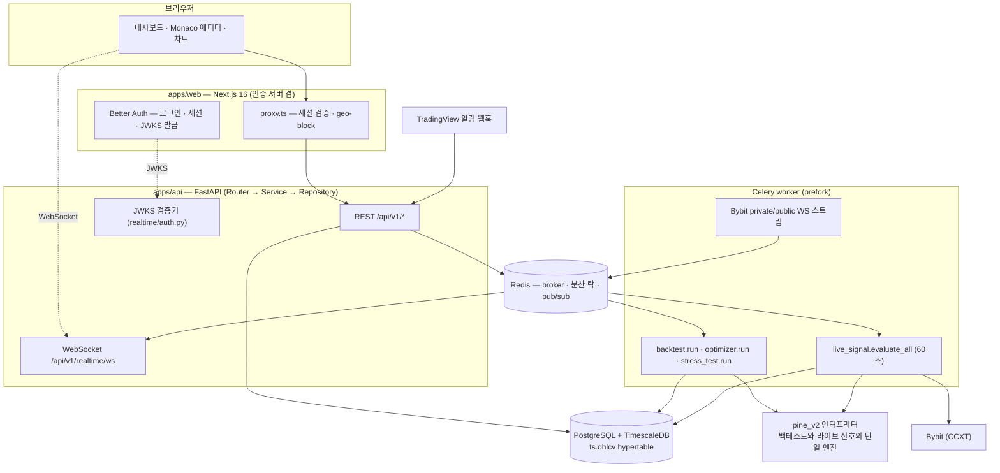

# QuantBridge

> **TradingView Pine Script 전략을 코드 한 줄 고치지 않고 가져와, 백테스트 → 스트레스 테스트 → 최적화 → 데모/라이브 자동매매까지 하나의 파이프라인으로 잇는 퀀트 트레이딩 플랫폼.**

Pine Script 를 파이썬으로 **트랜스파일하지 않는다.** AST 를 봉(bar) 단위로 해석하는 자체 인터프리터(`pine_v2`)가 백테스트와 라이브 자동매매를 **같은 코드로** 실행한다. 미지원 함수가 하나라도 섞이면 부분 실행 대신 전체를 차단해서, 그럴듯하지만 틀린 백테스트를 애초에 만들지 않는다.

<!-- TODO: 히어로 스크린샷 촬영 후 삽입 — docs/assets/screenshots/hero-dashboard.png -->

| 항목       | 값                                                                  |
| ---------- | ------------------------------------------------------------------- |
| 개발       | 2026-04 ~ 현재 · 1인 개발 · 커밋 1,076                              |
| 백엔드     | Python 219파일 · 53.7k LOC · 도메인 7 · 테이블 20 · 마이그레이션 45 |
| Pine 엔진  | 22모듈 8.3k LOC · `ta.*` 23종 · `array.*` 16종                      |
| 비동기     | Celery 태스크 27 · beat 스케줄 15 · 큐 3                            |
| 프론트엔드 | 라우트 26 · feature 도메인 12                                       |
| 테스트     | pytest 4,026 케이스 · vitest 227파일 · Playwright 31 spec           |
| 설계 기록  | ADR 37건 (`docs/decisions/`)                                        |

---

## 목차

1. [주요 기능](#주요-기능)
2. [시스템 아키텍처](#시스템-아키텍처)
3. [기술 스택](#기술-스택)
4. [설계 의사결정](#설계-의사결정)
5. [시작하기](#시작하기)
6. [프로젝트 구조](#프로젝트-구조)
7. [문서](#문서)

---

## 주요 기능

### 전략 (Strategy)

- **Pine v4/v5 소스 등록** — 붙여넣으면 즉시 파싱하고 문법 오류를 진단으로 되돌려 준다
- **Monaco 에디터** — Pine 전용 Monarch 문법 하이라이팅과 다크/라이트 테마를 직접 정의했다. `⌘/Ctrl + Enter` 로 재파싱
- **커버리지 판정** — 실행 _전에_ 미지원 builtin 을 전수 탐지해 실행 가능 여부를 all-or-nothing 으로 확정한다 (부분 실행 금지 — [ADR-003](docs/decisions/003-pine-runtime-safety-and-parser-scope.md))
- **파라미터 조정 · Webhook 시크릿** — 전략별 실행 설정 슬라이더, TradingView 알림용 시크릿 발급·회전

### 백테스트 (Backtest)

- **봉 단위 시뮬레이션** — `pine_v2` 인터프리터가 전략 로직을 그대로 실행하고, 체결·수수료·슬리피지를 시뮬레이터가 정한다
- **9개 섹션 리포트** — 성과 요약 / 벤치마크 대비 / 상세 지표 / 체결 거래 / 거래·수익 분포 / 수익 구조 / 상승폭·낙폭 에피소드 / 가정 / 다음 단계
- **시각화** — 에쿼티·드로다운 차트(거래 마커 오버레이), 월별 수익 히트맵, 수익 워터폴, P&L 분포
- **공유 · 재실행** — 읽기 전용 공개 링크 발급(회수 가능), 같은 조건 재실행

<!-- TODO: 백테스트 리포트 스크린샷 — docs/assets/screenshots/backtest-report.png -->

### 스트레스 테스트 (Stress Test)

- **몬테카를로** — 거래 순서를 재배열해 자산 곡선의 분포와 최악 구간을 낸다
- **워크포워드** — 구간을 밀어 가며 in-sample/out-of-sample 성과를 분리한다
- **비용 가정 민감도** — 수수료 × 슬리피지 9-cell 격자로 손익분기 지점을 찾는다
- **파라미터 안정성** — 최적값 주변이 절벽인지 고원인지 히트맵으로 본다

### 최적화 (Optimizer)

- **Grid / Bayesian / Genetic** 3종 탐색 (Bayesian 은 scikit-optimize)
- **결과 해석** — 2D 히트맵, 반복·세대별 이력 차트, best-params 표
- **과최적화 방어** — OOS 검증 패널과 파라미터 안정성 섹션을 결과 화면에 함께 붙였다

<!-- TODO: 옵티마이저 히트맵 스크린샷 — docs/assets/screenshots/optimizer.png -->

### 트레이딩 (Trading)

- **거래소 연결** — Bybit 데모 계정 등록. API Key 는 AES-256(Fernet) 으로 암호화해 저장하고 평문 컬럼을 두지 않는다
- **두 갈래 자동 집행** — TradingView 웹훅 수신, 그리고 60초 주기로 `pine_v2` 가 직접 신호를 평가하는 라이브 세션
- **주문 원장** — 필터·CSV 내보내기·취소·상세 드로어. 30분 넘게 멈춘 주문은 스캐너가 자동으로 거래소와 대조해 정리한다
- **Kill Switch** — 손실·이상 감지 시 집행을 끊고 배너로 올린다. 해제는 사람이 명시적으로
- **실시간** — Bybit private/public WebSocket 스트림을 워커가 상주 구독하고, Redis pub/sub 을 거쳐 브라우저 WebSocket 으로 밀어 준다

<!-- TODO: 트레이딩 코크핏 스크린샷 — docs/assets/screenshots/trading-cockpit.png -->

---

## 시스템 아키텍처



정본: [`docs/reference/architecture/system-architecture.md`](docs/reference/architecture/system-architecture.md) · [`data-flow.md`](docs/reference/architecture/data-flow.md)

---

## 기술 스택

### Frontend (`apps/web`)

| 영역        | 기술                                                               |
| ----------- | ------------------------------------------------------------------ |
| 프레임워크  | Next.js `16.2` (App Router) · React `19` · TypeScript `5.6` Strict |
| 스타일링    | Tailwind CSS `v4` · shadcn/ui `v4` (Base UI) · Pretendard          |
| 상태        | TanStack React Query `5.59` (서버) · Zustand `5` (클라이언트)      |
| 폼 · 검증   | React Hook Form `7.72` · Zod `v4`                                  |
| 인증        | Better Auth `1.6` — 이 앱이 인증 서버 본체다                       |
| 에디터·차트 | Monaco Editor · Lightweight Charts `4.2` · Recharts `3.8`          |
| 테스트      | Vitest `2.1` · Testing Library · Playwright `1.59`                 |

### Backend (`apps/api`)

| 영역          | 기술                                                            |
| ------------- | --------------------------------------------------------------- |
| 프레임워크    | FastAPI `0.115+` (100% async) · Python `3.12`                   |
| ORM · 검증    | SQLModel · SQLAlchemy `2.0` (asyncpg) · Pydantic `v2`           |
| 데이터베이스  | PostgreSQL 15 + TimescaleDB `2.14` (OHLCV hypertable) · Alembic |
| 비동기 작업   | Celery `5.4` + Redis (prefork · 큐 3종)                         |
| Pine 파싱     | pynescript `0.3.0` (AST 파싱만) + 자체 인터프리터               |
| 수치 계산     | pandas · NumPy · scikit-optimize (Bayesian)                     |
| 거래소        | CCXT `4+` (Bybit demo/live)                                     |
| 인증 · 보안   | PyJWT (EdDSA/JWKS 검증) · cryptography (Fernet AES-256)         |
| 테스트 · 품질 | pytest `8.3` · Ruff · mypy                                      |

도구 버전(node · python · pnpm · uv)의 SSOT 는 루트 [`mise.toml`](mise.toml) 하나다 ([ADR-036](docs/decisions/036-tool-version-ssot-mise.md)).

---

## 설계 의사결정

### 1. Pine Script 를 트랜스파일하지 않고 인터프리터로 실행한다

**판단** — Pine 소스를 파이썬 코드로 변환해 `exec()` 하는 흔한 방식을 버리고, AST 를 봉 단위로 순회하는 인터프리터를 직접 만들었다 ([ADR-003](docs/decisions/003-pine-runtime-safety-and-parser-scope.md) · [ADR-011](docs/decisions/011-pine-execution-strategy-v4.md)).

**이유** — 두 가지다. (1) 사용자가 붙여넣은 문자열이 서버에서 임의 코드로 실행되는 경로를 원천 차단한다. (2) 백테스트와 라이브 자동매매가 **문자 그대로 같은 엔진**을 쓴다. 변환기를 두면 "백테스트에서는 되는데 실거래에서는 다르게 도는" 격차가 반드시 생기고, 그 격차는 돈으로 계산된다.

**대가** — Pine 표준 라이브러리를 직접 구현해야 한다. 현재 `ta.*` 23종 · `array.*` 16종 · math/string/input 계열을 `stdlib.py` 가 pandas/NumPy 로 계산한다. 라이선스 경계도 설계 제약이 됐다 — 파서(pynescript)는 LGPL 이라 PyPI 의존성으로만 쓰고, `import` 지점을 파일 하나(`parser_adapter.py`)로 격리했다.

### 2. 미지원 함수가 하나라도 있으면 전체를 차단한다

**판단** — 지원하지 않는 Pine 함수가 포함된 전략은 부분 실행하지 않고 실행 자체를 거부한다. 판정은 실행 전 `coverage.py` 가 전수 탐지로 끝낸다.

**이유** — 부분 실행의 결과물은 "실패"처럼 보이지 않는다. 숫자가 나오고 차트가 그려진다. 사용자는 그 수익률을 믿고 돈을 넣는다. **틀린 답을 조용히 주는 것보다 답을 주지 않는 편이 낫다**는 판단이고, 이 원칙이 도메인 규칙으로 고정돼 있다.

**보완** — 결과가 TradingView 와 달라질 수 있는 함수(`request.security`, `heikinashi` 등)는 `degraded` 로 따로 분류해, 사용자가 명시적으로 동의해야만 백테스트를 제출할 수 있게 했다.

### 3. 금융 숫자는 Decimal, DB 세션은 Repository 만 쥔다

**판단** — 가격·수량·수익률·레버리지는 전부 `Decimal`, float 금지. `AsyncSession` 은 Repository 계층만 보유하고 Service 는 트랜잭션 경계만 담당한다.

**이유** — 둘 다 같은 종류의 재발 사고를 규칙으로 막은 것이다. float 합산 오차는 백테스트 성과 지표에서 조용히 누적되고, 트랜잭션 commit 누락은 통합 테스트가 read-your-writes 로 통과시켜 버려 잡히지 않는다. 그래서 **mutation 메서드마다 `repo.commit()` 호출을 강제하는 spy 회귀 테스트**를 의무로 두고 있다.

### 4. 인증을 self-host 로 전환했다 (Clerk → Better Auth)

**판단** — SaaS 인증을 걷어내고 Next.js 앱 자체를 인증 서버로 만들었다. FastAPI 는 시크릿을 쥐지 않고 JWKS 공개키로 EdDSA 서명만 검증한다 ([ADR-034](docs/decisions/034-auth-self-host-better-auth.md)).

**이유** — 벤더 종속과 비용도 있지만, 결정적인 것은 **검증 경로를 우리가 볼 수 있느냐**였다. 전환 과정에서 기존 인증 테스트가 SDK 를 mock 하느라 서명·만료·`iss`·`aud` 를 한 번도 검증한 적이 없다는 사실이 드러났다. 지금은 검증기가 한 곳(`realtime/auth.py`)이고 HTTP·WebSocket 이 그것을 공유한다.

**결과** — 의존성 순감(제거 10 vs 추가 1), CI 에 필요한 인증 secret 0개.

---

## 시작하기

### 1. 사전 요구사항

★**node / python / pnpm / uv 를 손으로 깔지 마라.** 버전의 SSOT 는 루트 [`mise.toml`](mise.toml) 하나이고, `mise install` 이 그 값대로 설치한다.

```bash
# macOS 기준
brew install mise docker git
mise install          # mise.toml 의 node / python / pnpm / uv 설치
mise ls               # 지금 도는 값 + 출처 config 를 함께 출력 — 확인은 이걸로
```

셸에 붙이기 (한 번만):

```bash
echo 'eval "$(mise activate zsh)"' >> ~/.zshrc && exec zsh
```

> `mise run` 태스크와 git 훅은 shim 을 PATH 앞에 스스로 세우므로 위 활성화 없이도 핀을 따른다.
> 활성화는 **터미널에서 직접** `pnpm`·`uv` 를 칠 때를 위한 것이다.

### 2. 클론 + 환경 변수

`.env.example` 은 **서비스별로 분리**돼 있다 (각 loader 관행에 맞춤).

```bash
git clone <repo-url> quant-bridge
cd quant-bridge

cp .env.example .env                          # 루트 — docker compose 가 자동 로드 (.env.local 아님)
cp apps/api/.env.example apps/api/.env.local  # 백엔드 — pydantic-settings
cp apps/web/.env.example apps/web/.env.local  # 프론트엔드 — Next.js
```

필수 실값 교체 (각 파일 `[필수 …]` 마킹된 키):

- `apps/api/.env.local` + `.env` — `TRADING_ENCRYPTION_KEYS` ([생성 방법](#3-trading_encryption_keys-생성)) · `BETTER_AUTH_URL`
- `apps/web/.env.local` — `BETTER_AUTH_SECRET` (`openssl rand -base64 32`) · `BETTER_AUTH_URL` · `BETTER_AUTH_DATABASE_URL`

> **왜 3파일인가?** docker compose 는 루트 `.env` 만, pydantic-settings 는 `apps/api/.env.local`, Next.js 는 `apps/web/.env.local` 을 읽는다. 하나로 몰면 "이 변수가 어디서 쓰이나"를 추론해야 하고 loader 간 약속이 어긋난다.

### 3. `TRADING_ENCRYPTION_KEYS` 생성

거래소 API Key 를 AES-256 으로 암호화하는 Fernet 키. **최초 1회만 생성**하고, 바꾸면 기존에 저장된 API Key 를 복호화할 수 없다.

```bash
cd apps/api
KEY=$(uv run python -c "from cryptography.fernet import Fernet; print(Fernet.generate_key().decode())")
echo "TRADING_ENCRYPTION_KEYS=$KEY" >> .env.local      # 로컬 uvicorn/celery
echo "TRADING_ENCRYPTION_KEYS=$KEY" >> ../../.env      # docker compose 컨테이너
cd ../..
```

두 파일의 값이 **반드시 같아야** 워커와 API 가 같은 키로 복호화한다.

### 4. 실행

```bash
mise run dev          # 인프라 + 백엔드 + 프론트엔드 한 번에 (Ctrl+C 로 종료)
```

나눠서 띄우려면 (각 별도 터미널):

```bash
mise run up           # Postgres + Redis + Celery worker (docker compose)
mise run migrate      # DB 스키마 적용
mise run be           # FastAPI  → http://localhost:8000
mise run fe           # Next.js  → http://localhost:3000
mise run help         # 전체 태스크 목록 · 격리 포트 모드 안내
```

<details>
<summary>mise 없이 직접 띄우려면</summary>

```bash
docker compose --project-directory . -f infra/compose/docker-compose.yml up -d db redis

cd apps/api
uv sync
uv run alembic upgrade head
uv run uvicorn src.main:app --no-server-header --reload --host 0.0.0.0 --port 8000
uv run celery -A src.tasks worker --loglevel=info --concurrency=4 --pool=prefork

cd ../web && pnpm install && pnpm dev
```

> `--no-server-header` 는 선택이 아니다 — 이 플래그가 없으면 uvicorn 이 `Server: uvicorn`
> 헤더를 ASGI 바깥에서 붙여 버려 미들웨어로는 지울 수 없다. 레포 안의 모든 기동 자리가
> 이 플래그를 갖는지 `apps/api/tests/test_uvicorn_server_header.py` 가 검사한다.

</details>

### 5. 동작 확인

```bash
curl http://localhost:8000/health    # {"status":"ok"}
open http://localhost:8000/docs      # Swagger UI (개발 환경에서만 노출)
open http://localhost:3000           # 홈 → 로그인
mise run test                        # 백엔드 pytest + 프론트엔드 vitest
```

상세 셋업·환경변수·트러블슈팅은 [`docs/reference/operations/local-setup.md`](docs/reference/operations/local-setup.md) 참조.

---

## 프로젝트 구조

```
quant-bridge/
├── apps/
│   ├── api/               # FastAPI + Celery 백엔드 → apps/api/README.md
│   │   ├── src/           #   도메인별 3-Layer + pine_v2 인터프리터
│   │   ├── tests/         #   pytest 488파일
│   │   └── alembic/       #   마이그레이션 45개
│   └── web/               # Next.js 16 프론트엔드 (인증 서버 겸) → apps/web/README.md
│       ├── src/           #   FSD Lite (app · components · features · lib)
│       └── e2e/           #   Playwright 31 spec
├── contracts/openapi/     # 커밋된 OpenAPI 계약 (drift 검사 대상)
├── docs/                  # 상태 · 정본(reference) · 결정(decisions) · 교훈(lessons)
├── infra/                 # docker compose 4종 · DB 초기화 SQL
├── tools/scripts/         # 운영 런타임 · 가드 · 스모크 스크립트
├── evals/harness/         # 개발 하네스 eval
└── mise.toml              # 도구 버전 + 개발 명령 SSOT
```

---

## 문서

| 위치                                                                                    | 용도                                                           |
| --------------------------------------------------------------------------------------- | -------------------------------------------------------------- |
| [`CONTEXT.md`](CONTEXT.md)                                                              | 도메인 용어·관계의 SSOT (Strategy / Backtest / Trading 정의)   |
| [`AGENTS.md`](AGENTS.md)                                                                | 개발 원칙 · 스택 규칙 · 문서 체계 (LLM 에이전트 + 개발자 공용) |
| [`DESIGN.md`](DESIGN.md)                                                                | 디자인 시스템 — 색상·타이포·간격 토큰 SSOT                     |
| [`docs/README.md`](docs/README.md)                                                      | 문서 지도 — 어느 질문을 어느 문서가 답하는가                   |
| [`docs/status.md`](docs/status.md)                                                      | 지금 진행 중인 작업 (현행 sprint 상태의 SSOT)                  |
| [`docs/decisions/`](docs/decisions/)                                                    | ADR 37건 — 왜 그렇게 결정했는가                                |
| [`apps/api/AGENTS.md`](apps/api/AGENTS.md) · [`apps/web/AGENTS.md`](apps/web/AGENTS.md) | 스택별 강제 규칙 (FastAPI 3-Layer · React Hooks 안전 등)       |

---

## License

Private (개인 프로젝트).
