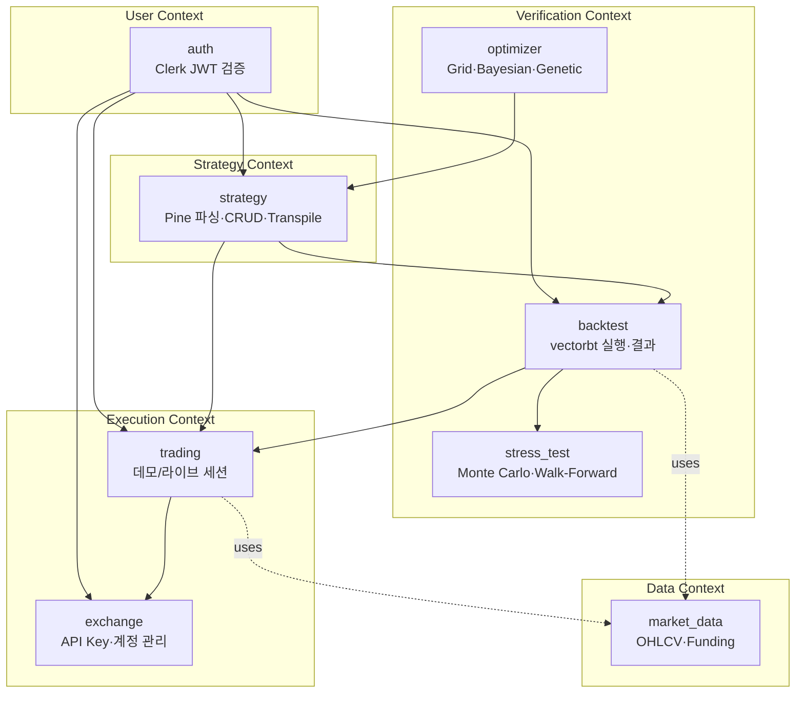

# QuantBridge — 도메인 개요

> **목적:** 8개 도메인 경계, 책임, 상호작용을 명세.
> **SSOT:** 코드는 [`backend/src/<domain>/`](../../backend/src/), 스키마는 [`04_architecture/erd.md`](../04_architecture/erd.md), API 계약은 [`03_api/endpoints.md`](../03_api/endpoints.md).

## 1. Bounded Contexts



- **User Context** — 인증/인가 책임. 모든 다른 도메인은 user_id 컨텍스트에 종속.
- **Strategy Context** — Pine Script 코드의 진실. 다른 도메인은 strategy_id로 참조.
- **Verification Context** — Strategy 결과를 평가. 결과는 DB 영구 저장.
- **Execution Context** — Strategy를 실 시장에서 실행. Verification 결과를 참조 가능 (`reference_backtest_id`).
- **Data Context** — OHLCV/Funding의 시계열 진실 (TimescaleDB hypertable).

## 2. 도메인 책임 매트릭스

| 도메인 | 한 줄 책임 | 코드 위치 | 주요 엔티티 | 주요 API 섹션 | 구현 sprint |
|--------|-------------|-----------|-------------|----------------|--------------|
| `auth` | Clerk 세션 검증 + User 동기화 | `backend/src/auth/` | User | §인증 | 3 ✅ |
| `strategy` | Pine 파싱·CRUD·Python 트랜스파일 | `backend/src/strategy/` | Strategy | §전략 | 1, 3 ✅ |
| `backtest` | vectorbt 비동기 실행 + 결과 저장 | `backend/src/backtest/` | Backtest, BacktestTrade | §백테스트 | 2, 4 ✅ |
| `market_data` | OHLCV 수집 + TimescaleDB 적재 | `backend/src/market_data/` | OHLCV, FundingRate | §시장 데이터 | 5 (예정) |
| `stress_test` | Monte Carlo / Walk-Forward 분석 | `backend/src/stress_test/` | StressTest | §스트레스 테스트 | 6+ |
| `optimizer` | 파라미터 탐색 (Grid/Bayes/Genetic) | `backend/src/optimizer/` | Optimization | §최적화 | 6+ |
| `trading` | 데모/라이브 세션 + Risk Mgmt + Kill Switch | `backend/src/trading/` | TradingSession, LiveTrade | §트레이딩 | 7+ |
| `exchange` | 거래소 계정 + AES-256 API Key | `backend/src/exchange/` | ExchangeAccount | §거래소 계정 | 7+ |

## 3. 3-Layer 구조 (모든 도메인 공통)

`.ai/stacks/fastapi/backend.md` §3 규칙:

```
[domain]/
├── router.py        # HTTP 전용 (10줄 이하 핸들러)
├── service.py       # 비즈니스 로직 — AsyncSession 보유 금지
├── repository.py    # AsyncSession 유일 보유자, DB 접근 전담
├── schemas.py       # Pydantic V2 입출력 DTO
├── models.py        # SQLModel 테이블 정의
├── dependencies.py  # Depends() 조립
└── exceptions.py    # 도메인 예외 (AppException.code 보유)
```

**불변 규칙:**
- Router → Service → Repository 단방향
- 트랜잭션 경계는 Service에 (`repo.commit()` 호출은 service만)
- 크로스 도메인 트랜잭션은 동일 session 주입 (예: Sprint 4 §4.8 `StrategyService.delete()` IntegrityError → `StrategyHasBacktests` 변환)

## 4. 크로스 도메인 규칙

### 4.1 FK 정책

| 부모 | 자식 | ON DELETE | 이유 |
|------|------|-----------|------|
| `users` | `strategies`, `backtests`, `exchange_accounts`, `trading_sessions`, `stress_tests`, `live_trades` | CASCADE | 사용자 탈퇴 시 연관 데이터 일괄 삭제 |
| `strategies` | `backtests`, `trading_sessions` | RESTRICT | 백테스트/세션이 참조 중이면 전략 삭제 금지 → 409 응답 |
| `backtests` | `backtest_trades`, `stress_tests` | CASCADE | 백테스트 삭제 시 trades 동시 정리 |
| `exchange_accounts` | `trading_sessions` | RESTRICT | 활성 세션이 참조 중이면 계정 삭제 금지 |
| `trading_sessions` | `live_trades` | CASCADE | 세션 종료 시 거래 기록 유지 (별도 정책) ⚠️ 향후 재검토 |

### 4.2 인증 경계

- 모든 보호된 엔드포인트는 `Depends(get_current_user)` 통과
- Service 레이어는 `user_id`를 인자로 받아 권한 검증 (DB 행 소유자 일치)
- Router는 사용자 컨텍스트 주입만 담당, 권한 로직은 Service 책임

### 4.3 비동기 실행 경계

> CLAUDE.md 핵심 규칙: 백테스트/최적화는 반드시 Celery 비동기.

- Backtest: `BacktestService.submit()` → `TaskDispatcher` (Celery) → worker에서 `_execute()` → engine
- (예정) Stress Test, Optimizer도 동일 dispatcher 재사용
- API 핸들러 직접 실행 금지

### 4.4 상태 머신 책임

- 전이 책임은 **Service가 보유** (Repository는 조건부 UPDATE만 제공)
- Backtest의 3-guard cancel은 `BacktestService.cancel()` + worker `_execute()`에 분산
- 상세 전이는 [`state-machines.md`](./state-machines.md) 참조

### 4.5 데이터 경계 — Decimal vs float

- DB 컬럼: `DECIMAL(20, 8)` 통일 (PRD §데이터베이스 스키마 준수)
- 엔진 내부: vectorbt가 float64로 처리. 외부 경계 (DTO/저장) 진입 시 `Decimal(str(...))` 변환
- 합산: **Decimal-first** (Sprint 4 D8 교훈: `Decimal(str(a)) + Decimal(str(b))`, 절대 `Decimal(str(a + b))` 금지)

### 4.6 시간 경계 — UTC

- 모든 timestamp는 UTC
- Sprint 5 S3-05 이전: `datetime.utcnow()` (naive UTC) + `strftime("%Y-%m-%dT%H:%M:%SZ")` (Z 접미사 수동)
- Sprint 5 S3-05 이후 (예정): `DateTime(timezone=True)` + `datetime.now(UTC)` + `.isoformat()`

## 5. 도메인 간 데이터 흐름 (요약)

> 상세 시퀀스는 [`04_architecture/data-flow.md`](../04_architecture/data-flow.md) 참조.

### Strategy → Backtest
1. 사용자가 `Strategy` 생성 (Pine 코드 등록 + 파싱 결과 저장)
2. `POST /backtests` 시 `strategy_id` 참조 → engine이 transpile된 Python 코드 실행
3. Backtest 결과 저장, Strategy는 불변

### Backtest → Stress Test (Sprint 6+)
1. 완료된 Backtest의 trades를 입력으로 Monte Carlo / Walk-Forward
2. 결과는 `StressTest.results` JSONB 저장

### Strategy → Trading Session (Sprint 7+)
1. 검증 통과한 Strategy로 `TradingSession` 시작
2. Engine이 실시간 데이터 수신 → entry/exit 신호 → CCXT 주문
3. Risk Manager가 한도 체크 (Kill Switch / 일일 손실 / 포지션 사이즈)

### Market Data → Backtest/Trading
1. CCXT가 OHLCV/Funding 수집 → TimescaleDB hypertable
2. Backtest는 `OHLCVProvider` Protocol로 추상화 (FixtureProvider → TimescaleProvider 전환, Sprint 5)
3. Trading은 실시간 WebSocket + Zustand 캐시 (별도 경로)

## 6. 도메인 추가 정책 (확장 가이드)

새 도메인 추가 시 (예: `notifications/`, `analytics/`):

1. `backend/src/<domain>/` 7개 파일 (router/service/repository/schemas/models/dependencies/exceptions) 생성
2. `main.py`에 router 등록
3. `endpoints.md`에 §섹션 추가
4. 본 문서 §2 매트릭스에 행 추가
5. ERD에 엔티티 추가 + Alembic migration
6. 의존 도메인 화살표를 §1 다이어그램에 반영

## 7. 미완 도메인 (스캐폴딩만 존재)

코드 디렉토리는 있으나 router/service 미구현 (스캐폴딩 후 sprint 대기):

- `market_data/` — Sprint 5
- `stress_test/` — Sprint 6+
- `optimizer/` — Sprint 6+
- `trading/` — Sprint 7+
- `exchange/` — Sprint 7+

`models.py`는 일부 정의되어 있을 수 있음 — 실제 활성 시점에 ERD와 정합성 재검증.

## 8. 참고

- ADR-002 병렬 스캐폴딩: [`dev-log/002-parallel-scaffold-strategy.md`](../dev-log/002-parallel-scaffold-strategy.md)
- Backend rules: `.ai/stacks/fastapi/backend.md`
- Sprint 4 cross-domain 패턴: `docs/superpowers/specs/2026-04-15-sprint4-backtest-api-design.md` §4.8

---

## 변경 이력

- **2026-04-16** — 초안 작성 (Sprint 5 Stage A)
