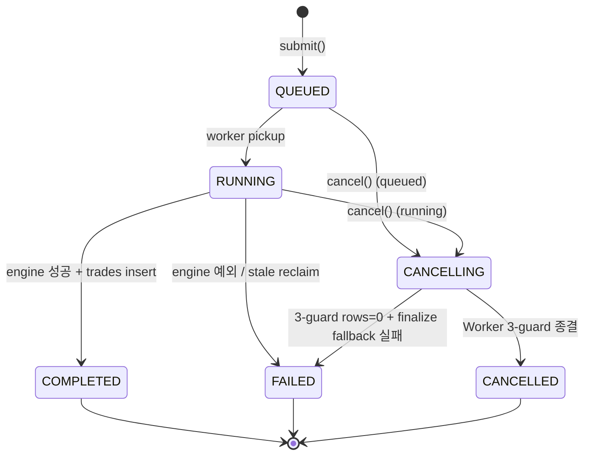
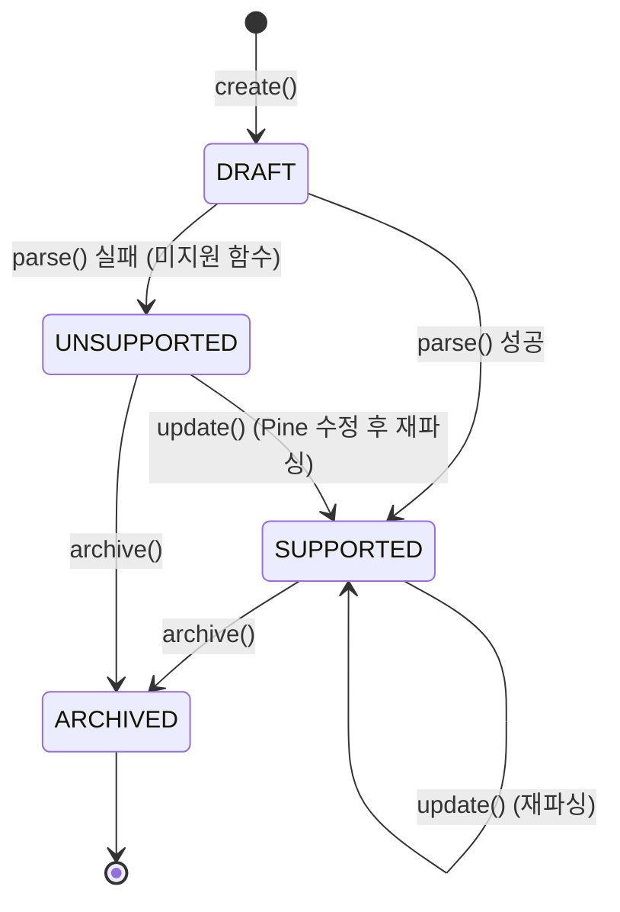
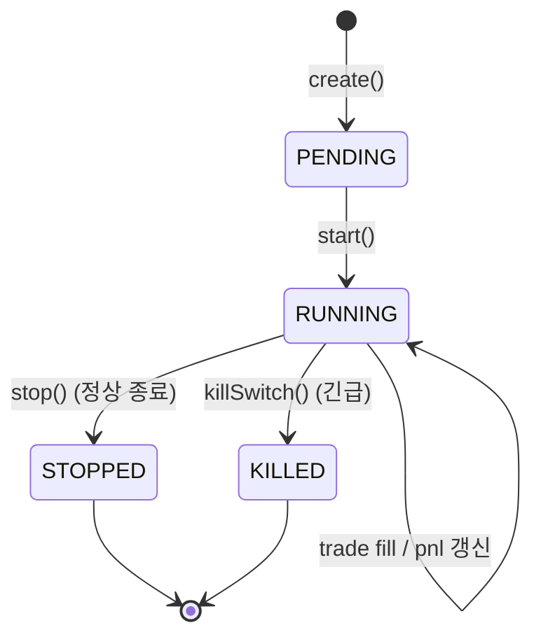
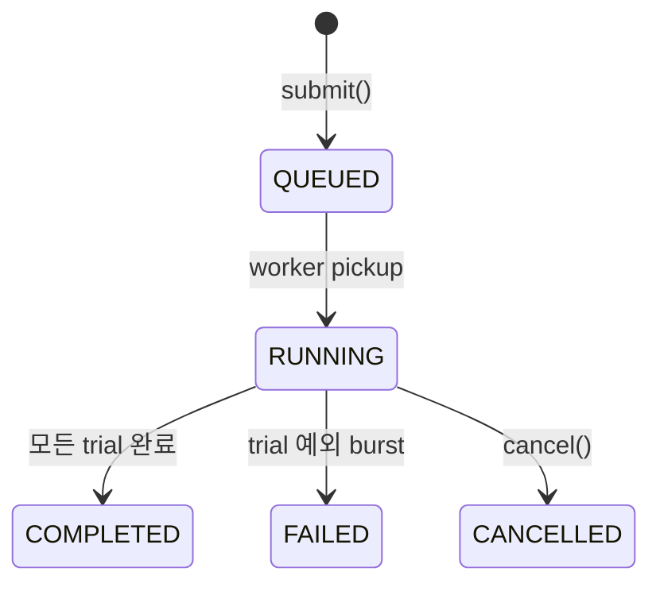

# QuantBridge — 상태 머신

> **목적:** 도메인 엔티티의 상태 전이도 + 가드 조건.
> **SSOT:** 전이 로직은 각 도메인 `service.py`. 여기서는 의도/계약을 명세.

---

## 1. Backtest

### 전이도



### 상태 정의 (SQLModel `BacktestStatus`)

| 상태 | 의미 | 진입 조건 | 종결 조건 |
|------|------|-----------|------------|
| `QUEUED` | Celery 큐 등록됨, 워커 pickup 대기 | `submit()` 직후 | 워커 pickup → RUNNING 또는 cancel → CANCELLING |
| `RUNNING` | 워커가 실행 중 | 워커 `_execute()` 진입 시 조건부 UPDATE | engine 완료/예외 또는 cancel |
| `CANCELLING` | 사용자 cancel 요청 — transient | `BacktestService.cancel()` 호출 | 워커 3-guard에서 CANCELLED 또는 fallback 실패 시 FAILED |
| `COMPLETED` | engine 성공 + metrics + trades 모두 저장 | engine result + trade insert 단일 트랜잭션 | terminal |
| `FAILED` | engine 예외, stale reclaim, fallback 실패 | 예외 catch 또는 reclaim hook | terminal |
| `CANCELLED` | 사용자 cancel 종결 | 3-guard 또는 finalize_cancelled fallback | terminal |

### 전이 가드 (Service 책임)

| from | to | 가드 |
|------|----|------|
| QUEUED → RUNNING | worker pickup | 조건부 UPDATE `WHERE status='queued'` (다른 워커 동시 pickup 방지) |
| RUNNING → COMPLETED | engine 성공 | 조건부 UPDATE `WHERE status='running'` + trade bulk insert (단일 트랜잭션) |
| RUNNING → FAILED | engine 예외 | 조건부 UPDATE; rows=0이면 이미 cancel 처리됨 → 무시 |
| (any) → CANCELLING | cancel 요청 | 현 상태가 terminal이면 거부 (409) |
| CANCELLING → CANCELLED | worker 3-guard | (1) pickup 전 (2) pre-engine (3) post-engine 3 위치에서 체크 + 조건부 UPDATE |
| CANCELLING → FAILED | rows=0 + fallback 실패 | `finalize_cancelled` rows=0 시 logger.error + FAILED 처리 |

### 3-Guard Cancel 패턴 (Sprint 4 §5.1)

워커 `_execute()` 흐름:

```
Guard #1: pickup 직전
  → cancellation_requested_at NOT NULL이면 즉시 finalize_cancelled() 후 return

Guard #2: pre-engine (engine 호출 직전)
  → cancellation_requested_at NOT NULL이면 finalize_cancelled() 후 return

[engine 실행]

Guard #3: post-engine (결과 저장 직전)
  → cancellation_requested_at NOT NULL이면 결과 폐기 + finalize_cancelled() 후 return
```

**원칙:**
- `assert bt is not None` 금지 (python -O로 제거됨) → `if bt is None: logger.error + return`
- 조건부 UPDATE rows=0 → 반드시 `finalize_cancelled` fallback 호출
- 완료 write와 trade insert는 단일 트랜잭션 (atomicity)

### Stale Reclaim

| 조건 | 처리 |
|------|------|
| `status=RUNNING` + `started_at < now - threshold` | startup hook 또는 beat task가 FAILED로 전환 + `error_reason="stale_reclaimed"` |
| `status=CANCELLING` + `started_at < now - threshold` | 동일 처리. `started_at NULL`(QUEUED→CANCELLING) 시 `created_at` fallback (Sprint 4 D9) |

- 현재: startup-only (Sprint 4)
- Sprint 5 예정: beat task 주기적 cleanup

### 코드 위치

- 전이 검증/디스패치: `backend/src/backtest/service.py` (`BacktestService`)
- 워커 실행: `backend/src/tasks/backtest.py` (`run_backtest_task`, `_execute`)
- 조건부 UPDATE: `backend/src/backtest/repository.py`
- Reclaim: `backend/src/tasks/backtest.py` `reclaim_stale_running` + `@worker_ready` hook in `celery_app.py`

---

## 2. Strategy

### 전이도



### 상태 정의

> Strategy는 명시적 status 컬럼이 단일이지 않음 — `parse_status` (PENDING/SUPPORTED/UNSUPPORTED) + `is_archived` (bool) 조합.

| 논리 상태 | parse_status | is_archived |
|-----------|--------------|-------------|
| DRAFT | PENDING | false |
| SUPPORTED | SUPPORTED | false |
| UNSUPPORTED | UNSUPPORTED | false |
| ARCHIVED | (any) | true |

### 가드

- `is_archived=true` → 백테스트 새로 제출 금지 (Sprint 5+ FE 검증 예정)
- `parse_status=UNSUPPORTED` → 백테스트 제출 시 service에서 거부
- DELETE 시 backtests가 참조 중이면 409 (FK RESTRICT + IntegrityError → `StrategyHasBacktests`)
- ARCHIVE는 hard delete 우회 — FE에서 사용자 가이드 예정 (Sprint 5+ UX)

### 코드 위치

- `backend/src/strategy/service.py` (`StrategyService`)
- 파서: `backend/src/strategy/parser/`
- 인터프리터: `backend/src/strategy/interpreter/`

---

## 3. TradingSession *(미구현, Sprint 7+ 계획)*

### 전이도 (계획)



### 상태 정의 (계획)

| 상태 | 의미 |
|------|------|
| PENDING | 세션 생성, 시작 전 |
| RUNNING | 라이브 시그널 수신·주문 실행 중 |
| STOPPED | 사용자 정상 종료, 모든 포지션 청산 |
| KILLED | Kill Switch 발동 — 즉시 모든 포지션 강제 청산 |

### 가드 (계획)

- `mode=LIVE` 진입 시 추가 확인 step (≤2 클릭, REQ-TRD-02)
- Risk Manager가 일일 손실 한도 / 포지션 사이즈 가드 (REQ-TRD-03/04/05)
- Kill Switch 발동 조건: 일일 손실 임계 초과, API 에러 burst, 사용자 수동 호출

---

## 4. Optimization *(미구현, Sprint 6+ 계획)*

### 전이도 (계획)



> Backtest와 동일 패턴 재사용 (TaskDispatcher + 3-guard).

---

## 5. StressTest *(미구현, Sprint 6+ 계획)*

> Optimization과 동일 패턴. Backtest 상태 머신 그대로 차용 예정.

---

## 6. 공통 원칙

### 조건부 UPDATE
모든 상태 전이는 `WHERE status='<expected>'` 조건부 UPDATE로 race condition 방지.

### Transient State
`CANCELLING`은 transient — terminal 상태로의 전이를 위한 중간 단계.

### Reclaim Pattern
워커 crash로 stale된 RUNNING/CANCELLING은 startup hook + beat task로 자동 회수.

### Atomicity
완료 write + 자식 데이터 insert (예: backtest_trades)는 단일 트랜잭션.

### Logging
상태 전이 실패 (rows=0) 시 logger.error로 가시성 확보. silently swallow 금지 (단 `@worker_ready` hook은 의도된 best-effort 예외).

---

## 변경 이력

- **2026-04-16** — 초안 작성 (Sprint 5 Stage A)
