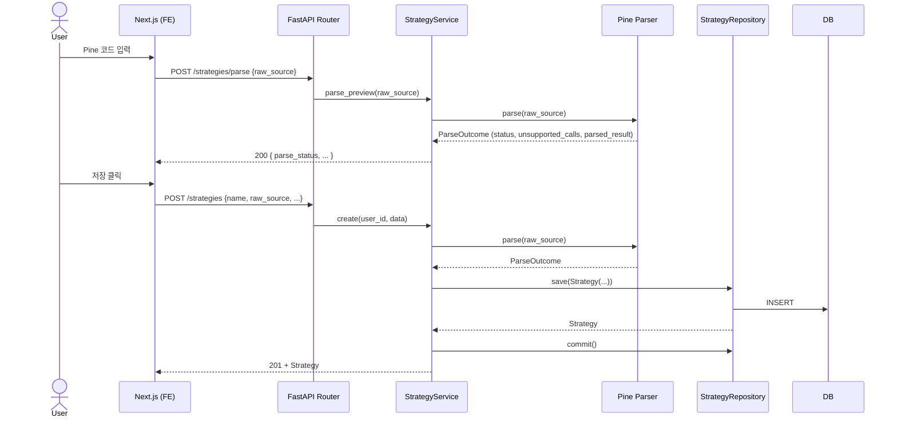
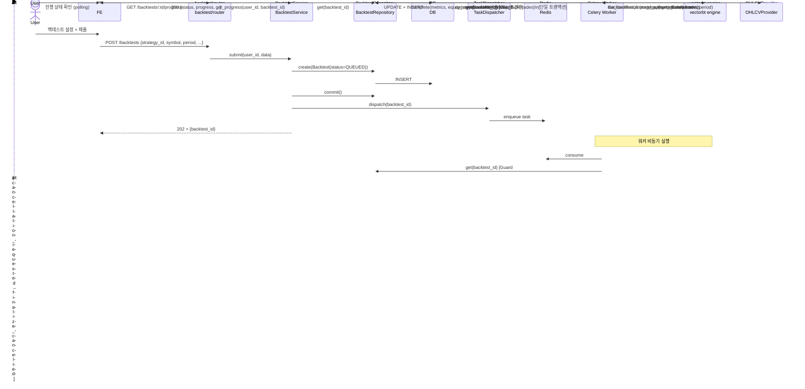
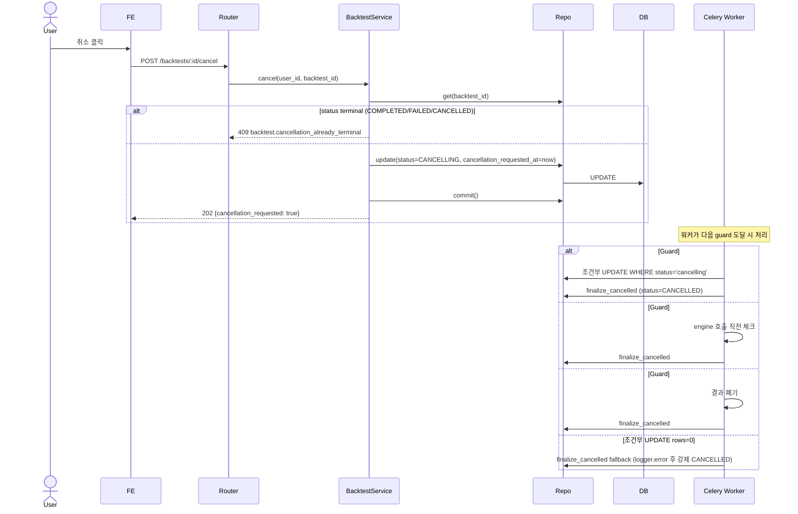
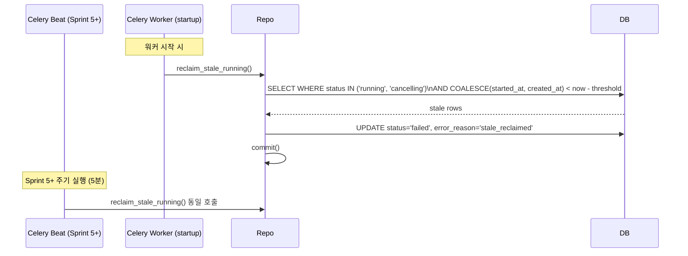
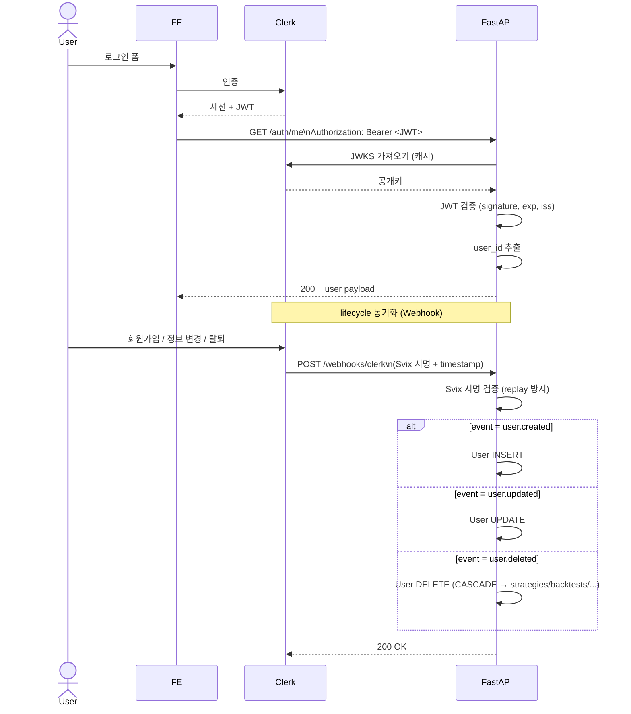
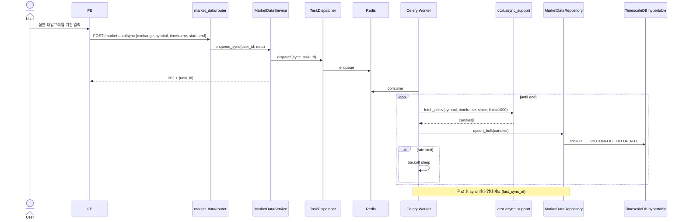

# QuantBridge — 데이터 흐름

> **목적:** 도메인별 주요 시퀀스 다이어그램.
> **상위 문서:** [`system-architecture.md`](./system-architecture.md), 도메인 경계는 [`02_domain/domain-overview.md`](../02_domain/domain-overview.md).

---

## 1. Strategy CRUD (Sprint 3)

### 주요 가드

- 미지원 함수 1개 이상 → `parse_status=UNSUPPORTED` 저장 (저장 자체는 허용, 백테스트 시 거부)
- `name` 중복 시 unique 제약 위반 → 409

---

## 2. Backtest 비동기 실행 (Sprint 4)

### 주요 가드/규칙

- 워커는 `_execute()` 진입 시 `if bt is None: logger.error + return` (assert 금지)
- 조건부 UPDATE rows=0 → `finalize_cancelled` fallback 호출
- 완료 + trades insert는 단일 트랜잭션 (atomicity)
- prefork-safe: SQLAlchemy engine은 lazy init (모듈 import 시점 호출 금지)

---

## 3. Cancel Race (3-Guard Pattern)

> Sprint 4 §5.1 패턴. transient `CANCELLING` + 3 guard 위치 + fallback finalize.

---

## 4. Stale Reclaim (Worker Crash 복구)

### 규칙 (Sprint 4 D9)

- `running` + `cancelling` 양쪽 모두 reclaim 대상
- `cancelling` 케이스: `started_at NULL` (QUEUED→CANCELLING) → `created_at` fallback
- 현재: startup hook only. Sprint 5에서 beat 추가.
- 멀티 워커 split-brain 방어 (Sprint 5+ #13): `inspect().active()` 또는 Redis lock

---

## 5. Clerk Auth + Webhook (Sprint 3)

---

## 6. CCXT OHLCV 동기화 (Sprint 5 예정)

> [가정] 동기화 메타 테이블 / 중복 처리 정책은 Sprint 5 spec에서 확정.

---

## 7. 상태 폴링 vs WebSocket (현재/계획)

### 현재 (Sprint 4)

- 백테스트 진행: `GET /backtests/:id/progress` 폴링 (예: 1~2초 간격)
- 단순, 캐시 친화적, 부담 낮음

### Sprint 7+ 예정

- WebSocket 채널: `/ws/sessions/:id` (트레이딩 세션 PnL/체결 push)
- Zustand 캐시 (React Query와 분리, CLAUDE.md 규칙)

---

## 8. 페이지네이션 패턴

| API | 패턴 | 비고 |
|-----|------|------|
| `GET /strategies` | `page` + `limit` (Sprint 3 drift) | Sprint 5에서 `limit + offset` 통일 예정 |
| `GET /backtests` | `limit` + `offset` (Sprint 4 표준) | `common/pagination.py` |
| `GET /backtests/:id/trades` | `limit` + `offset` | 동일 |

> Sprint 5 이관 항목 #10: Strategy router pagination drift 통일.

---

## 9. 에러 응답 패턴 (참조)

상세는 [`system-architecture.md`](./system-architecture.md) §5. 모든 도메인 예외는 `code` 필드 포함 JSON.

---

## 변경 이력

- **2026-04-16** — 초안 작성 (Sprint 5 Stage A)
