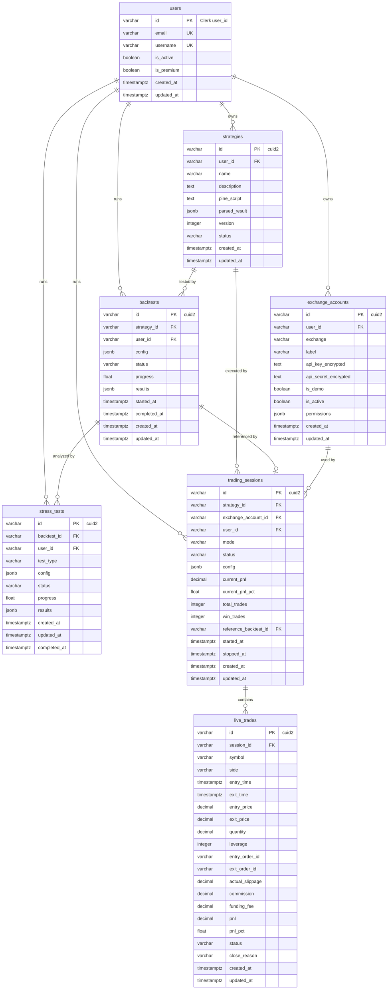

# QuantBridge — ERD (Entity Relationship Diagram)

> **기준:** PRD 스키마 + .ai/ spec 반영 (Clerk Auth, cuid2 ID, createdAt/updatedAt)
> **DB:** PostgreSQL 15+ (메인) + TimescaleDB (시계열) + Redis (캐시)

---

## 엔티티 관계도



---

## PRD 대비 변경사항

| 항목 | PRD 원안 | 변경 후 | 이유 |
|------|---------|---------|------|
| `users.id` | `UUID DEFAULT gen_random_uuid()` | `VARCHAR(255)` Clerk user_id | Clerk 인증 연동 |
| `users.hashed_password` | 존재 | **삭제** | Clerk가 인증 담당 |
| `users.username` | `NOT NULL` | `NULLABLE` | Clerk 동기화 시 없을 수 있음 |
| 모든 엔티티 ID | `UUID` | `VARCHAR` (cuid2) | .ai/ spec: auto-increment 금지 |
| 모든 테이블 | `created_at`만 | `created_at` + `updated_at` | .ai/ spec 필수 |
| 금융 수치 | `FLOAT` 혼용 | `DECIMAL(20, 8)` 통일 | 정밀도 보장 (float 금지) |

---

## TimescaleDB 테이블 (시계열)

### ohlcv (hypertable)
```sql
CREATE TABLE ohlcv (
    time TIMESTAMPTZ NOT NULL,
    exchange VARCHAR(50) NOT NULL,
    symbol VARCHAR(50) NOT NULL,
    timeframe VARCHAR(10) NOT NULL,
    open DECIMAL(20, 8) NOT NULL,
    high DECIMAL(20, 8) NOT NULL,
    low DECIMAL(20, 8) NOT NULL,
    close DECIMAL(20, 8) NOT NULL,
    volume DECIMAL(20, 8) NOT NULL,
    PRIMARY KEY (time, exchange, symbol, timeframe)
);
SELECT create_hypertable('ohlcv', 'time');
CREATE INDEX idx_ohlcv_lookup ON ohlcv (exchange, symbol, timeframe, time DESC);
```

### funding_rates (hypertable)
```sql
CREATE TABLE funding_rates (
    time TIMESTAMPTZ NOT NULL,
    exchange VARCHAR(50) NOT NULL,
    symbol VARCHAR(50) NOT NULL,
    funding_rate DECIMAL(20, 10) NOT NULL,
    PRIMARY KEY (time, exchange, symbol)
);
SELECT create_hypertable('funding_rates', 'time');
```

> TimescaleDB 테이블은 Alembic 마이그레이션과 별도로 `scripts/init_db.py`에서 초기화.

---

## JSONB 데이터 구조

상세한 JSONB 필드 구조는 `QUANTBRIDGE_PRD.md`의 데이터베이스 스키마 섹션 참조.

| 테이블 | 필드 | 주요 내용 |
|--------|------|----------|
| `strategies` | `parsed_result` | 파라미터, 인디케이터, 진입/청산 조건, Python 코드 |
| `backtests` | `config` | 심볼, 타임프레임, 기간, 자본금, 레버리지, 수수료 |
| `backtests` | `results` | 수익률, 샤프비율, MDD, 거래내역, 에퀴티커브 |
| `stress_tests` | `config` | MC 시뮬레이션 수, WF 기간 설정, 파라미터 범위 |
| `stress_tests` | `results` | 신뢰구간 밴드, 파산확률, OOS/IS 비율 |
| `trading_sessions` | `config` | 심볼, 레버리지, 리스크 설정, Kill Switch |
| `exchange_accounts` | `permissions` | `["read", "trade"]` 등 |
