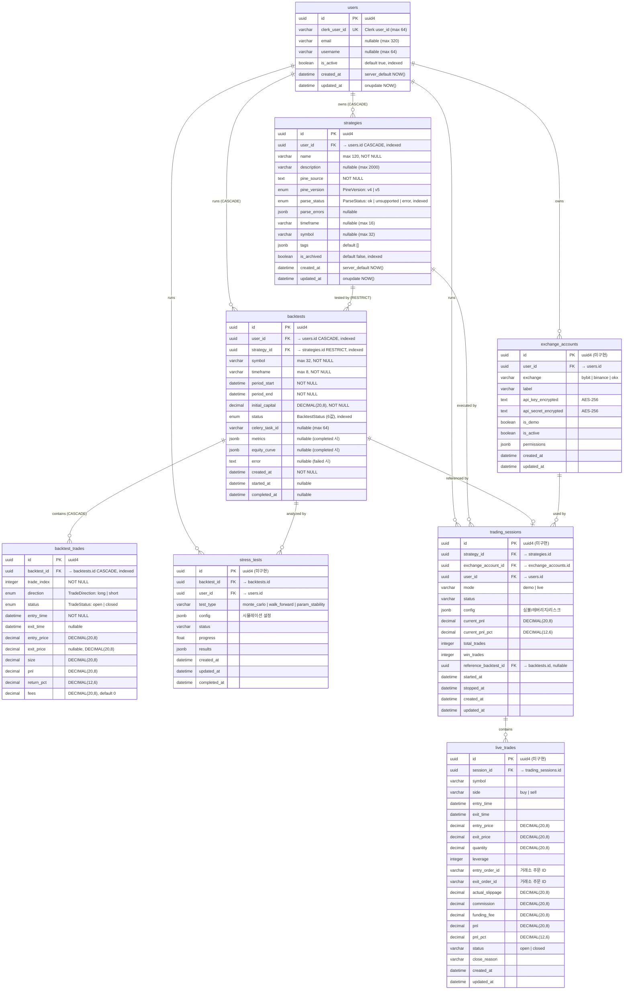

# QuantBridge — ERD (Entity Relationship Diagram)

> **기준:** Sprint 4 완료 시점 SQLModel 실제 코드 기반 (2026-04-16).
> **SSOT:** 각 도메인 `backend/src/<domain>/models.py`. 본 문서와 코드 충돌 시 코드 우선.
> **DB:** PostgreSQL 15+ (메인) + TimescaleDB 확장 (시계열) + Redis (캐시/Celery)

---

## 엔티티 관계도



---

## Enum 정의 (구현됨)

| Enum | 값 | 코드 위치 |
|------|----|-----------|
| `BacktestStatus` | `queued` · `running` · `cancelling` (transient) · `completed` · `failed` · `cancelled` | `backtest/models.py` |
| `ParseStatus` | `ok` · `unsupported` · `error` | `strategy/models.py` |
| `PineVersion` | `v4` · `v5` | `strategy/models.py` |
| `TradeDirection` | `long` · `short` | `backtest/models.py` |
| `TradeStatus` | `open` · `closed` | `backtest/models.py` |

---

## FK 정책 (구현됨)

| 부모 → 자식 | ondelete | 이유 |
|-------------|----------|------|
| `users` → `strategies` | CASCADE | 사용자 탈퇴 시 전략 일괄 삭제 |
| `users` → `backtests` | CASCADE | 동일 |
| `strategies` → `backtests` | **RESTRICT** | 백테스트가 참조 중이면 전략 삭제 금지 → 409 |
| `backtests` → `backtest_trades` | CASCADE | 백테스트 삭제 시 trades 동시 삭제 + ORM cascade all,delete-orphan |

미구현 도메인의 FK 정책은 구현 sprint에서 확정 (PRD 기준 계획만 존재).

---

## 인덱스 (구현됨)

| 테이블 | 인덱스 | 컬럼 |
|--------|--------|------|
| `users` | PK | `id` |
| `users` | UNIQUE | `clerk_user_id` |
| `users` | index | `is_active` |
| `strategies` | PK | `id` |
| `strategies` | index | `user_id` |
| `strategies` | index | `parse_status` |
| `strategies` | index | `is_archived` |
| `strategies` | composite | `(user_id, is_archived, updated_at)` — `ix_strategies_owner_active_updated` |
| `backtests` | PK | `id` |
| `backtests` | index | `user_id` |
| `backtests` | index | `strategy_id` |
| `backtests` | index | `status` — `ix_backtests_status` |
| `backtests` | composite | `(user_id, created_at)` — `ix_backtests_user_created` |
| `backtest_trades` | PK | `id` |
| `backtest_trades` | index | `backtest_id` |
| `backtest_trades` | composite | `(backtest_id, trade_index)` — `ix_backtest_trades_backtest_idx` |

---

## 구현 상태

| 테이블 | SQLModel | Alembic Migration | Sprint |
|--------|----------|--------------------|----|
| `users` | ✅ `auth/models.py` | ✅ | 3 |
| `strategies` | ✅ `strategy/models.py` | ✅ | 3 |
| `backtests` | ✅ `backtest/models.py` | ✅ | 4 |
| `backtest_trades` | ✅ `backtest/models.py` | ✅ | 4 |
| `stress_tests` | ❌ 빈 파일 | ❌ | Sprint 6+ |
| `exchange_accounts` | ❌ 빈 파일 | ❌ | Sprint 7+ |
| `trading_sessions` | ❌ 빈 파일 | ❌ | Sprint 7+ |
| `live_trades` | ❌ 빈 파일 | ❌ | Sprint 7+ |
| `ohlcv` (hypertable) | ❌ 빈 파일 | ❌ | Sprint 5 |
| `funding_rates` (hypertable) | ❌ 빈 파일 | ❌ | Sprint 6+ |

> 미구현 도메인의 스키마는 PRD 설계 기준. 구현 sprint에서 SQLModel과 재정합 필수.

---

## JSONB 데이터 구조 (구현됨)

| 테이블 | 필드 | 내용 | 직렬화 규칙 |
|--------|------|------|-------------|
| `strategies` | `parse_errors` | 미지원 함수 목록 `[{"call": "request.security", ...}]` | — |
| `strategies` | `tags` | 분류 태그 `["trend", "momentum"]` | — |
| `backtests` | `metrics` | `{total_return: "0.12", sharpe: "1.5", max_drawdown: "0.08", num_trades: 42, ...}` | Decimal → str, `num_trades`는 int (cardinality 필드) |
| `backtests` | `equity_curve` | `[{"t": "2024-01-01T00:00:00Z", "v": "10120.50"}, ...]` | Decimal → str, datetime → ISO 8601 Z |

> 직렬화: `backtest/serializers.py` (`metrics_to_jsonb`, `equity_curve_to_jsonb`).

---

## PRD 대비 실제 변경사항

| 항목 | PRD/Phase 0 ERD | 실제 구현 (Sprint 4) | 이유 |
|------|-----------------|---------------------|------|
| `users.id` | `VARCHAR(255)` Clerk user_id를 PK로 | `UUID` PK + `clerk_user_id` 별도 컬럼 | 내부 PK와 외부 ID 분리 (더 나은 설계) |
| `users.hashed_password` | 존재 | **삭제** | Clerk가 인증 담당 |
| `users.is_premium` | 존재 | **삭제** | Sprint 3 미구현, 추후 추가 가능 |
| `users.email/username` | UNIQUE | nullable, UNIQUE 미설정 | Clerk 동기화 시 없을 수 있음 |
| 모든 엔티티 ID | `VARCHAR` (cuid2) | **`UUID`** (uuid4) | 구현 시 UUID로 통일 |
| `strategies.pine_script` | 존재 | `pine_source` | 컬럼명 변경 |
| `strategies.parsed_result` (JSONB) | 존재 | **삭제** (parse_errors + parse_status로 대체) | 파서 결과 구조 변경 |
| `strategies.version` (int) | 존재 | **삭제** | 불필요 판단 |
| `strategies.status` | `varchar` | `parse_status` enum (ok/unsupported/error) | 명확한 enum + 이름 변경 |
| `backtests.config` (JSONB) | 단일 JSONB | 개별 컬럼 5개로 정규화 | 타입 안전성 + 쿼리 가능 |
| `backtests.results` (JSONB) | 단일 JSONB | `metrics` + `equity_curve` 2개 JSONB로 분리 | 용도 분리 |
| `backtests.progress` | float | **삭제** | 불필요 판단 (status로 충분) |
| `backtests.updated_at` | 존재 | **삭제** | created_at + started_at + completed_at로 충분 |
| `backtest_trades` | **없음** | Sprint 4에서 추가 (12 컬럼) | 개별 거래 기록 필요 |
| 금융 수치 | `FLOAT` 혼용 | `DECIMAL(20, 8)` 통일 | 정밀도 보장 (float 금지) |
| 수익률/비율 | 미정 | `DECIMAL(12, 6)` | 10,000% 여유 |

---

## TimescaleDB 테이블 (시계열, Sprint 5 도입)

### ohlcv (hypertable)
```sql
CREATE TABLE ohlcv (
    time TIMESTAMPTZ NOT NULL,
    exchange VARCHAR(50) NOT NULL,
    symbol VARCHAR(50) NOT NULL,
    timeframe VARCHAR(10) NOT NULL,
    open DECIMAL(20, 8) NOT NULL,
    high DECIMAL(20, 8) NOT NULL,
    low DECIMAL(20, 8) NOT NULL,
    close DECIMAL(20, 8) NOT NULL,
    volume DECIMAL(20, 8) NOT NULL,
    PRIMARY KEY (time, exchange, symbol, timeframe)
);
SELECT create_hypertable('ohlcv', 'time');
CREATE INDEX idx_ohlcv_lookup ON ohlcv (exchange, symbol, timeframe, time DESC);
```

### funding_rates (hypertable)
```sql
CREATE TABLE funding_rates (
    time TIMESTAMPTZ NOT NULL,
    exchange VARCHAR(50) NOT NULL,
    symbol VARCHAR(50) NOT NULL,
    funding_rate DECIMAL(20, 10) NOT NULL,
    PRIMARY KEY (time, exchange, symbol)
);
SELECT create_hypertable('funding_rates', 'time');
```

> TimescaleDB 테이블은 Alembic 마이그레이션과 별도로 초기화 (Sprint 5 결정).

---

## Datetime 정책

- Sprint 5 S3-05 이전 (현재): naive UTC (`datetime.now(UTC).replace(tzinfo=None)`) + ISO 8601 Z 수동 포맷
- Sprint 5 S3-05 이후 (예정): `DateTime(timezone=True)` (TIMESTAMPTZ) + `datetime.now(UTC)` + `.isoformat()`
- 상세: `docs/TODO.md` §S3-05

---

## 변경 이력

- **2026-04-13** — Phase 0 초안 (PRD 기반)
- **2026-04-16** — Sprint 4 완료 기준 전면 갱신 (Sprint 5 Stage A)
  - ID 체계 cuid2 → UUID 반영
  - users.id 구조 변경 (UUID PK + clerk_user_id 분리) 반영
  - strategies 컬럼 대폭 변경 반영
  - backtests config/results 정규화 반영
  - backtest_trades 테이블 추가
  - Enum/FK/Index 상세 추가
  - PRD 대비 변경사항 표 갱신
