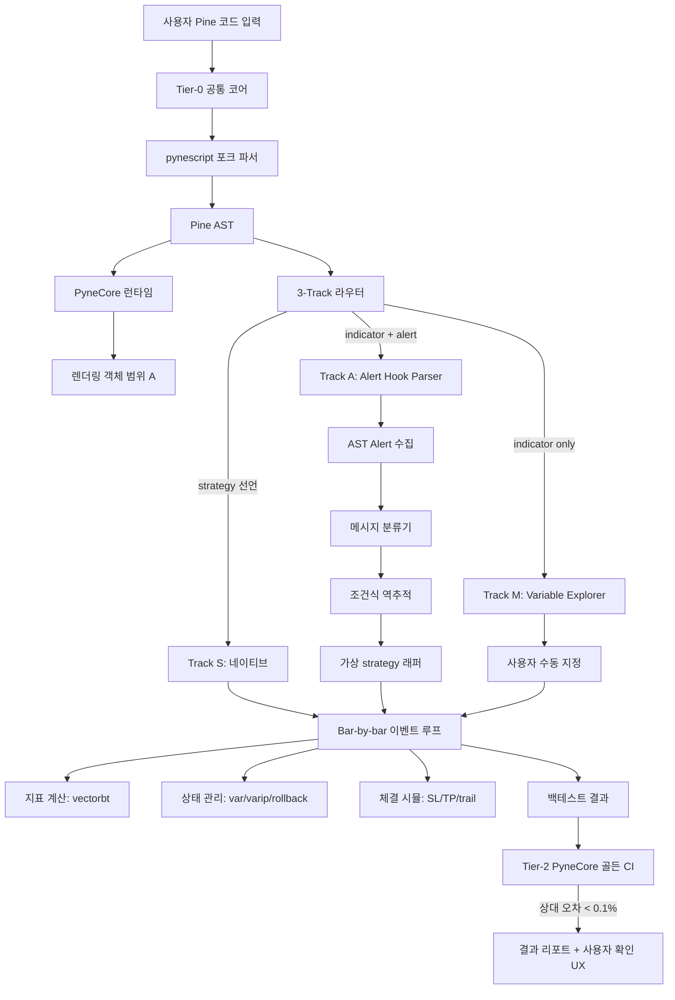

# Pine Script Execution Architecture — v4 (Alert Hook + 3-Track)

> **SSOT (2026-05-04 cleanup):** 본 문서가 **Pine 실행 엔진 아키텍처의 단일 진실 원천**. 관련 ADR: [`dev-log/011-pine-execution-strategy-v4.md`](../dev-log/011-pine-execution-strategy-v4.md) (결정 근거), 세션 archive: [`superpowers/specs/2026-04-17-pine-execution-v4-design.md`](../superpowers/specs/2026-04-17-pine-execution-v4-design.md) (50+ 턴 학술 archive).
>
> **상태:** 설계 확정 (2026-04-17), Phase -1 실측 진행 중
> **ADR:** [`dev-log/011-pine-execution-strategy-v4.md`](../dev-log/011-pine-execution-strategy-v4.md)
> **세션 근거:** [`superpowers/specs/2026-04-17-pine-execution-v4-design.md`](../superpowers/specs/2026-04-17-pine-execution-v4-design.md)
> **관련 ADR:** ADR-003(exec 금지), ADR-004(AST 인터프리터 선택)

본 문서는 QuantBridge의 Pine Script 실행 엔진 아키텍처를 **구현 수준 상세도**로 명세한다. 전략 결정의 근거는 ADR-011에, 세션 전체 탐구 과정은 Session Spec에 있다.

---

## 1. 설계 원칙 (Core Principles)

### 🎯 P1: Execution-First

**"Pine을 의미 분석 없이 그냥 끝까지 실행하라. 렌더링만 스킵하라."**

DrFX Diamond Algo 실측 결과: 전체 650줄 중 매매 의사결정 코드는 ~30라인 (**4.6%**). 나머지 95%는 드로잉·대시보드·세션 표시. 따라서:

- Pine 스크립트 전체를 그대로 AST → 인터프리터에 투입
- 렌더링 객체(`box.new`, `label.new`, `line.new`, `table.new`)는 **좌표 저장 + getter만**(범위 A)
- `plot()`, `bgcolor()`, `barcolor()`, `fill()`, `plotshape()`은 NOP
- 매매 신호(`strategy.entry`/`exit` + `alert()`)만 신호 추출 레이어로 전달

### 🎯 P2: Alert Hook Routing

**"TradingView `alert()`/`alertcondition()`은 개발자가 자발적으로 선언한 매매 신호 라벨이다. 추측하지 말고 파싱하라."**

Pine 개발자들은 TV에서 전략을 공유할 때 거의 항상 `alert()`를 사용한다. 이미 **자발적 신호 선언**이다:

```pine
if longCondition
    alert("LONG entry at " + str.tostring(close), ...)
```

AST에서 alert 호출을 수집하고 메시지 분류기로 의미를 추출하면 **결정론적으로** entry/exit 매핑 가능. Semantic Extraction의 "추측 기반" 약점 회피.

### 🎯 P3: 3-Track Coverage

**"모든 Pine을 하나의 파이프라인으로 처리하지 말고, 입력을 분류해 경로를 달리하라."**

| Track | 판별 기준                  |   자동화율    | 비율 (추정) | 엔진                            |
| :---: | -------------------------- | :-----------: | :---------: | ------------------------------- |
| **S** | `strategy()` 선언 있음     |     100%      |   20~30%    | Tier-3 네이티브 실행            |
| **A** | `indicator()` + `alert()`  |    80~90%     |   40~50%    | **Tier-1 Alert Hook Parser** ⭐ |
| **M** | `indicator()` + alert 없음 | 40~50% (수동) |   20~30%    | Tier-4 Variable Explorer        |

합산 **약 75% 준-자동 + 25% 수동 개입** → 상품 수준 커버리지.

---

## 2. Tier 0~5 구조

### 🏗️ Tier-0: 공통 코어 + 렌더링 객체 런타임

**추천도:** ⭐⭐⭐⭐⭐ (전제 인프라)
**Sprint 편성:** 8a (3주)

**구성 요소:**

#### 2.0.1 pynescript 파서 포크 (1~2주)

- [elbakramer/pynescript](https://github.com/elbakramer/pynescript) (LGPL-3.0, 88★, ANTLR4 기반) 포크
- QB 기존 `backend/src/strategy/pine/parser.py` 대체
- Pine v5/v6 AST 완전 커버 (배열 리터럴, switch, method-call, Matrix/Map/UDT, const/input/simple/series 4단계 타입 수식어)
- 라이선스 관리: LGPL 파일 단위 copyleft → 포크 파일만 LGPL 유지, 나머지 QB 코드 오염 방지

#### 2.0.2 PyneCore `transformers/` 모듈 참조 이식 (1주) — 2026-04-18 amendment

- [PyneSys/pynecore](https://github.com/PyneSys/pynecore) (Apache 2.0, 121★, v6.4.2)의 **`src/pynecore/transformers/` 디렉토리** 참조 대상
- 주 이식 타겟 파일: `persistent.py` (var/varip), `series.py` (`[n]` history), `security.py` (MTF), `nabool.py` (na 3-value logic)
- **중요 (Phase -1 발견):** PyneCore의 Pine→Python 변환기(`pyne compile`)는 PyneSys 상용 API 의존 → 오픈소스 독립 사용 불가. **런타임 transformers만** Apache 2.0이며 이식 대상
- **이식 전략:** 코드 직접 copy가 아닌 **로직 참조** 후 QB AST 구조에 맞춰 재구현. Apache 2.0이므로 NOTICE 파일 의무 준수 + 원본 헤더 보존

#### 2.0.3 Bar-by-bar 이벤트 루프 백테스터 (1주)

**핵심 분리:** vectorbt는 지표 계산 전용, 전략 실행은 자체 이벤트 루프.

```
기존 구조:
  Pine AST → SignalResult(entries, exits, sl, tp) → vectorbt.Portfolio.from_signals

신규 구조:
  Pine AST → 이벤트 루프 엔진
              ↳ 지표 계산: vectorbt/Numba (빠름)
              ↳ 상태 관리: var/varip/rollback (bar 단위)
              ↳ 전략 실행: strategy.entry/exit/close 직접 해석
              ↳ 체결 시뮬: SL/TP/trailing/분할익절/피라미딩
```

**근거:** Pine imperative 모델은 trailing stop, 분할 익절, 상태 의존 exit, 피라미딩을 벡터화로 표현 불가. DrFX 실측 REVERSE 사용률 0% 결과는 "체결 우선 → 반대 신호 후순위" 구조가 맞음을 시사.

#### 2.0.4a Pre-flight Coverage Analyzer (Sprint Y1 추가, 2026-04-23)

**추가 위치:** Tier-0 의 사용자 facing trust 확장. Coverage Analyzer 가 backtest 실행 **전** 에 미지원 함수/속성 을 명시 → whack-a-mole 종식.

**모듈:** [`backend/src/strategy/pine_v2/coverage.py`](../../backend/src/strategy/pine_v2/coverage.py)

#### 2.0.4b SSOT — Pine v2 supported set 영구 규칙 (Sprint Y1 + Sprint 29 갱신)

`backend/src/strategy/pine_v2/coverage.py` 의 4 collection + `interpreter.py` 의 4 collection 이 SSOT:

| Collection                       | size (2026-05-04)              | 위치                 |
| -------------------------------- | ------------------------------ | -------------------- |
| `SUPPORTED_FUNCTIONS`            | 112 (Slice C 후 +21)           | `coverage.py:213`    |
| `SUPPORTED_ATTRIBUTES`           | 39                             | `coverage.py:323`    |
| `_ENUM_PREFIXES` (prefix lookup) | 13                             | `coverage.py:307`    |
| `_KNOWN_UNSUPPORTED_FUNCTIONS`   | 7                              | `coverage.py:151`    |
| `STDLIB_NAMES`                   | 19 (ta.\* + na/nz)             | `interpreter.py:55`  |
| `_V4_ALIASES`                    | 16 (V4 short → V5 ta._/math._) | `interpreter.py:83`  |
| `_RENDERING_FACTORIES`           | 16 (drawing 메서드)            | `interpreter.py:196` |
| `_ATTR_CONSTANTS`                | 44 (enum + const value)        | `interpreter.py:105` |

**SSOT parity audit (Sprint 29 Slice C 신설, `tests/strategy/pine_v2/test_ssot_invariants.py`):**

1. `STDLIB_NAMES ⊆ SUPPORTED_FUNCTIONS` (ta.\*/na/nz 호환)
2. `set(_RENDERING_FACTORIES.keys()) ⊆ SUPPORTED_FUNCTIONS` (drawing 호환)
3. `_V4_ALIASES.values() ⊆ SUPPORTED_FUNCTIONS` (V4 alias target 호환, ta._/math._ 양쪽)
4. `_ATTR_CONSTANTS prefixes ⊆ _ENUM_PREFIXES ∪ _CONST_VALUE_PREFIXES` (enum 또는 const value)

drift 발생 시 CI 차단. supported list 추가 시 모든 collection 동시 갱신 의무.

> **참고:** Sprint 28 까지 표기됐던 fictional `SUPPORTED_ENUM_CONSTANTS` 는 실제 코드 부재.
> 실측 구조는 `_ENUM_PREFIXES` (prefix lookup) + interpreter `_ATTR_CONSTANTS` (constant value 매핑) 분리.
> Sprint 29 v1→v2 pivot 시 발견 (codex high reasoning + Opus fresh ctx 2-검토).

**호출 지점:**

- `parse_preview` (Strategy 등록/수정 시) → 응답에 `coverage.unsupported_builtins` 포함
- `POST /api/v1/backtests` → re-check 후 `is_runnable=false` 시 **422 StrategyNotRunnable** reject

**Trust Layer 2 축 관계:**

- 축 1 (사용자 facing): Y1 Coverage Analyzer
- 축 2 (엔지니어 facing): Path β 3-Layer Parity CI + Sprint 29 invariant audit

두 축이 같은 SSOT 를 공유. 자세한 아키텍처는 [`trust-layer-architecture.md`](./trust-layer-architecture.md) 참조.

#### 2.0.4 렌더링 객체 런타임 — 범위 A (엄수)

| 객체                                           |                   범위 A (채택)                   |    범위 B (기각)     |
| ---------------------------------------------- | :-----------------------------------------------: | :------------------: |
| `box.new()`                                    | 좌표 저장 + `box.get_top()`/`get_bottom()` getter | + Canvas 박스 렌더링 |
| `line.new()`                                   |       좌표 저장 + `line.get_price()` getter       |   + 차트 선 그리기   |
| `label.new()`                                  |               메모리 스텁 (좌표만)                |   + 텍스트 렌더링    |
| `table.new()`                                  |                NOP (대시보드 무관)                |     + 테이블 UI      |
| `plot()`, `bgcolor()`, `fill()`, `plotshape()` |                        NOP                        |     + 차트 플롯      |

**범위 A 선택 이유:** LuxAlgo SMC류 스크립트가 `line.get_y1()` 좌표 재참조로 entry 조건 판단. NOP 처리 시 매매 로직 붕괴. 단, 차트 렌더링은 QB 프론트엔드(Next.js)가 담당하므로 백엔드 엔진에선 불필요.

### 🏗️ Tier-1: Alert Hook Parser + 3-Track 라우터

**추천도:** ⭐⭐⭐⭐⭐ (차별화 핵심)
**Sprint 편성:** 8b (3주)

#### 2.1.1 AST Alert 호출 수집

```python
# 의사코드: backend/src/strategy/pine/alert_hook.py

class AlertHookExtractor(NodeVisitor):
    def __init__(self):
        self.alerts = []  # [(node, condition_chain, message)]

    def visit_FnCall(self, node):
        if node.name in ("alert", "alertcondition"):
            condition = self._trace_condition(node)
            message = self._extract_message(node)
            freq = self._extract_freq(node)  # freq_once_per_bar, freq_once_per_bar_close 등
            self.alerts.append(AlertCall(
                line=node.source_span.line,
                condition=condition,    # 감싸는 if의 condition 변수
                message=message,        # 문자열 리터럴 또는 str.tostring 호출
                freq=freq,
                node=node,
            ))
        self.generic_visit(node)
```

#### 2.1.2 메시지 분류기 (Classifier)

**우선순위 3단계:**

1. **JSON 파싱** — `alert('{"action":"buy","size":1}')` 같은 구조화 메시지
2. **키워드 매칭** — "BUY"/"LONG"/"매수"/"진입" → long_entry; "SELL"/"SHORT"/"매도"/"청산" → short_entry or exit
3. **Fallback** — 분류 실패 시 사용자 1질문 UX로 이관

```python
CLASSIFICATION_RULES = {
    "long_entry":  ["long", "buy", "매수", "매수 진입", "long entry", "bull"],
    "short_entry": ["short", "sell", "매도", "매도 진입", "short entry", "bear"],
    "long_exit":   ["close long", "exit long", "롱 청산"],
    "short_exit":  ["close short", "exit short", "숏 청산"],
    "information": ["break", "돌파", "trendline", "session"],  # 매매 신호 아님
}
```

#### 2.1.3 조건식 역추적 (Condition Trace)

`alert("LONG", ...)` 호출을 감싸는 `if longCondition`의 `longCondition` 변수가 어떻게 정의됐는지 AST에서 역추적:

```pine
bull = ta.crossover(close, supertrend) and close >= sma9
...
if bull
    alert("LONG entry", ...)   // bull 변수를 역추적해 "ta.crossover(close, supertrend) AND close >= sma9" 추출
```

→ 가상 strategy 래퍼에서 entry_long 조건으로 사용.

#### 2.1.4 가상 strategy() 래퍼 자동 생성

```python
# 자동 생성 결과 (의사코드)
virtual_strategy = {
    "name": "DrFX Diamond Algo (auto-extracted)",
    "entries": {
        "long": {
            "condition": "ta.crossover(close, supertrend) AND close >= sma9",
            "source": "alert at L668 'Buy Alert'",
            "confidence": 0.92,
        },
        "short": {
            "condition": "ta.crossunder(close, supertrend) AND close <= sma9",
            "source": "alert at L671 'Sell Alert'",
            "confidence": 0.92,
        },
    },
    "risk": {
        "sl": {"type": "atr", "mult": 1.0, "len": 14, "source": "atrStop formula"},
        "tps": [
            {"rr": 1, "size": 0.33, "source": "tp1Rl_y"},
            {"rr": 2, "size": 0.33, "source": "tp2RL_y"},
            {"rr": 3, "size": 0.34, "source": "tp3RL_y"},
        ],
    },
    "excluded": [
        "alert at L607 'break down trendline' — classified as information (user confirm)",
        "alert at L610 'break upper trendline' — classified as information (user confirm)",
    ],
}
```

#### 2.1.5 사용자 확인 1질문 UX

Sprint 7b에서 만든 파싱 결과 탭(`TabParse`)에 **"추출된 매매 로직"** 섹션 추가:

```
┌─────────────────────────────────────────────────┐
│ 🤖 자동 추출된 매매 로직                          │
│                                                 │
│ ✅ LONG entry → ta.crossover(close, supertrend) │
│                 AND close >= sma9               │
│                 (L668 "Buy Alert")              │
│                                                 │
│ ✅ SHORT entry → ta.crossunder(close, ...)     │
│                                                 │
│ ⚠️  L607 "break down trendline" — 정보성?      │
│    [예 — 매매 신호 아님] [아니오 — SHORT]       │
│                                                 │
│ [이대로 백테스트] [수정]                        │
└─────────────────────────────────────────────────┘
```

**핵심 가치:** 투명성 → Trust Layer 강화 + 사용자 피드백 자동 수집 → 메시지 분류 라이브러리 학습.

#### 2.1.6 3-Track 라우터 (분류기)

```python
def classify_track(ast: PineProgram) -> Track:
    has_strategy = any(isinstance(n, FnCall) and n.name == "strategy"
                      for n in ast.walk())
    alert_calls = collect_alerts(ast)

    if has_strategy:
        return Track.S  # 네이티브 실행
    elif len(alert_calls) > 0:
        return Track.A  # Alert Hook Parser
    else:
        return Track.M  # Variable Explorer (수동)
```

#### 2.1.6a 실제 구현 — `parse_and_run_v2` S/A/M dispatcher (Sprint 8c, 2026-04-19)

**위치:** `backend/src/strategy/pine_v2/compat.py` 의 `parse_and_run_v2(source, ohlcv, config)`.

**동작:**

1. `ast_classifier.classify_script(source)` → `{S | A | M}`
2. Track S → 기존 `run_backtest_v2_strategy` (네이티브 strategy() 실행)
3. Track A → `VirtualStrategyWrapper` (Sprint 8b) 경유 → alert/indicator 를 가상 strategy 로 감싸 실행
4. Track M → 현재 **unsupported** 응답 (Tier-4 Variable Explorer 미구현 — Path γ+ 이후)

**외부 계약:** `V2RunResult` 에 `strategy_state`, `var_series` 포함. Path β P-3 Execution Golden 이 이 필드로 metrics digest 비교.

**주의:** Track 판별은 내부에서만 분기 — 호출자 (service/adapter) API 는 변경 없이 3-Track 확장 수용. Sprint 8c 회고 [ADR-014](../dev-log/014-sprint-8b-8c-pine-v2-expansion.md) §2.2 참조.

### 🏗️ Tier-2: PyneCore 골든 오라클 + Day 1 CI

**추천도:** ⭐⭐⭐⭐⭐ (Trust 생명선)
**Sprint 편성:** 8a-pre(구축) + 8c(완성)

**KPI 단계별:**

| 단계 | 목표 상대 오차 |    적용 Sprint    |
| ---- | :------------: | :---------------: |
| MVP  |     < 0.1%     | Sprint 8a 완료 시 |
| v1.0 |    < 0.01%     | Sprint 8c 완료 시 |
| v2.0 |    < 0.001%    |    Sprint 8d+     |

**왜 자체 구현체 회귀 CI인가 (2026-04-18 Phase -1 amendment):**

- TV는 공식 지표값 export API 부재 → 자동화 불가
- 헤드리스 브라우저는 TV ToS 회색지대
- **PyneCore CLI(`pyne compile`)는 PyneSys 상용 API 의존** — 독립 오라클 불가 (Phase -1 발견)
- 대체 비교 기준점: **QB Tier-0 구현체 vs (a) pynescript AST 구조, (b) PyneCore `transformers/` Apache 2.0 참조 이식본** → 상대 오차 <0.1% MVP KPI 유지
- TV 수동 간헐 검증은 분기 1회 (샘플 10개) — 유지하되 과대 기대 금지

**CI 구조:**

```yaml
# .github/workflows/pine-golden.yml (예상)
- name: PyneCore golden test
  run: |
    for script in test_corpus/*.pine; do
      qb_result=$(python -m qb.backtest $script --out json)
      pynecore_result=$(pynecore run $script --out json)
      python scripts/compare.py $qb_result $pynecore_result --tolerance 0.001
    done
```

### 🏗️ Tier-3: strategy() 네이티브 실행 경로

**추천도:** ⭐⭐⭐⭐ (Track S 엔진)
**Sprint 편성:** 8b (3주, Tier-1과 병행)

**구현 범위:**

- `strategy.entry(id, direction, qty, ...)` — 포지션 진입
- `strategy.exit(id, from_entry, limit, stop, trail_points, trail_offset, ...)` — 청산
- `strategy.close(id)`, `strategy.close_all()`, `strategy.cancel()` — 명시적 청산
- `strategy.position_size`, `strategy.position_avg_price` — 포지션 상태 조회
- 선언부 옵션: `initial_capital`, `default_qty_type`, `commission_type`, `commission_value`, `pyramiding`
- **분할 익절:** `strategy.exit(..., limit=, qty_percent=)` 여러 번 호출 지원
- **Trailing stop:** `trail_points`(이익 시 SL 상향) + `trail_offset`(초기 여유) — RTB/LuxAlgo 필수

**구현 우선순위:**

1. entry/exit/close 기본 (2일)
2. 분할 익절 (1일)
3. **Trailing stop** (3~5일, 가장 까다로움)
4. 피라미딩 (2일)

### 🏗️ Tier-4: Variable Explorer (Track M Fallback)

**추천도:** ⭐⭐⭐ (H1 Stealth엔 우선순위 낮음)
**Sprint 편성:** 8c (2주, 부분)

indicator() + alert 없는 스크립트 (Track M, 20~30%)의 수동 지정 UX:

1. **변수 탐색기** — 스크립트 내 모든 Bool/Series 변수 목록 노출
2. **Bool 시계열 시각화** — 각 변수의 True/False 패턴을 작은 타임라인으로
3. **매수/매도/청산 수동 매핑** — 사용자가 드래그 & 드롭으로 지정
4. **청산 규칙 템플릿** — ATR 기반 / R:R 기반 / 반대 신호 / 커스텀 중 선택
5. **검증 후 가상 strategy 래퍼 생성**

### 🏗️ Tier-5: LLM 하이브리드 + MTF + 지속 개선

**추천도:** ⭐⭐⭐ (장기)
**Sprint 편성:** 8d (2주) + 이후 점진

**구성 요소:**

#### 2.5.1 LLM 하이브리드 (Amazon Oxidizer 패턴, 73% 동등성)

**엄격한 역할 제한 — LLM은 실행 경로 진입 금지:**

| LLM 역할                       |              허용               |       금지        |
| ------------------------------ | :-----------------------------: | :---------------: |
| 파서 에러 자연어 수정 제안     |               ✅                |                   |
| 비표준 Pine → 지원 Pine 재작성 |       ✅ (사용자 승인 후)       |                   |
| 미지원 stdlib 함수 초안 생성   | ✅ (골든 테스트 통과 시만 승격) |                   |
| Python/JS 코드 직접 exec       |                                 | ❌ (ADR-003 위반) |
| 백테스트 결과 생성             |                                 |        ❌         |

#### 2.5.2 MTF (`request.security` / `security_lower_tf`)

- 상위 TF → `request.security(syminfo.tickerid, "1D", close)` 형태 최다
- 하위 TF → `request.security_lower_tf` (v5+)
- 구현: OHLCV fetcher 확장 + AST에서 request.security 자동 추출 + 병렬 TF 실행

#### 2.5.3 렌더링 객체 완전 구현 (범위 B) — 조건부

QB가 차트 UI 제공 필요성이 생기면 (H2+) 렌더링 실제 구현. 현재는 범위 A 엄수.

---

## 3. 데이터 흐름 다이어그램



---

## 4. 기존 QB 코드 재사용 & 확장

### 4.1 `backend/src/strategy/pine/` 확장 방향

| 파일             | 현재 상태                    | Sprint 8a 변경                          |
| ---------------- | ---------------------------- | --------------------------------------- |
| `__init__.py`    | `parse_and_run()` public API | Tier-1 3-Track 라우터 추가              |
| `lexer.py`       | v4/v5 기본                   | 배열 리터럴 토큰 추가                   |
| `parser.py`      | AST 기본                     | pynescript 포크로 대체                  |
| `interpreter.py` | 기본 visitor                 | bar-by-bar 이벤트 루프로 재구조화       |
| `stdlib.py`      | ~20개 함수                   | 50~100개 확장 (TA-Lib/vectorbt 매핑)    |
| `ast_nodes.py`   | 11개 노드                    | Matrix/Map/UDT/ArrayLit/SwitchExpr 추가 |
| `types.py`       | ParseOutcome/SignalResult    | VirtualStrategy 타입 추가               |
| `errors.py`      | PineError 계열               | UnsupportedPine UX 메시지 개선          |

### 4.2 `backend/src/backtest/engine/` 분리

현재 vectorbt 기반 `SignalResult` → bar-by-bar 이벤트 루프 엔진 전환:

```
backend/src/backtest/engine/
├── __init__.py
├── event_loop.py      # 신규 — Pine imperative 시뮬레이터
├── indicators.py      # vectorbt 래퍼 (지표 계산용으로 격리)
├── portfolio.py       # 포지션/체결/SL/TP/trail 관리
└── metrics.py         # 기존 유지
```

### 4.3 Frontend 확장

- `frontend/src/app/(dashboard)/strategies/[id]/edit/_components/tab-parse.tsx` — Sprint 7b에서 만든 4-섹션 구조에 **"추출된 매매 로직" 섹션 추가** (Tier-1 UX)
- `frontend/src/features/strategy/schemas.ts` — `VirtualStrategyResponse` 타입 추가
- `frontend/src/features/strategy/api.ts` — `/api/v1/strategies/:id/extract` 엔드포인트 추가

---

## 5. 구현 순서 & 마일스톤

### Phase -1 (Sprint 8a-pre, 2주) — N-way 비교 매트릭스로 확장 (2026-04-18 amendment)

**목표:** 본 아키텍처의 가정 실증. 원안의 2-way(LLM vs PyneCore vs TV 3-way)에서 **N-way 매트릭스**로 확장하여 LLM 모델 편향 + 단일 엔진 해석 모호성 동시 차단.

**상세 실행 계획:** [`docs/superpowers/plans/2026-04-18-phase-minus-1-measurement-plan.md`](../superpowers/plans/2026-04-18-phase-minus-1-measurement-plan.md)

#### 실측 후보 (Day 1-3 주후보 8 + 조건부 3)

|    #     | 후보                               |  라이선스  | 역할                                | Day |
| :------: | ---------------------------------- | :--------: | ----------------------------------- | :-: |
|    E1    | PyneCore v6.4.2                    | Apache 2.0 | **주 오라클**                       | 1-3 |
|    E2    | pynescript v0.3.0                  |    LGPL    | 파서 커버리지                       |  1  |
|    E3    | 현재 QB 파서                       |    내부    | **ADR-004 AST 인터프리터 baseline** |  1  |
|    E4    | Claude Opus 4.7 변환본             | Anthropic  | 기존 `/tmp/drfx_test` 재실행        | 1-2 |
|    E5    | Claude Sonnet 4.6 변환본           | Anthropic  | Claude Code 내부 생성               |  2  |
|    E6    | GPT-5 변환본                       |   OpenAI   | 키 조건부                           |  2  |
|    E7    | Gemini 2.5 Pro 변환본              |   Google   | 키 조건부                           |  2  |
|    E8    | TV 수동 스폿체크                   |     -      | ground truth (1구간)                |  3  |
| (조건부) | PineTS / PinePyConvert / 상용 SaaS |    다양    | Day 4+ 재평가                       |  -  |

#### 스크립트 매트릭스 (5종, LuxAlgo 실행은 Day 4+ 이연)

|   #    | Track |    난이도     | 스크립트              |         비교 깊이         |
| :----: | :---: | :-----------: | --------------------- | :-----------------------: |
|   S1   |   S   |    🟢 쉬움    | RTB EMA crossover     |      얕음 (E1 + E3)       |
|   S2   |   S   |    🟠 중간    | (사용자 제공)         |      얕음 (E1 + E3)       |
|   I1   |  A/M  |    🟢 쉬움    | (사용자 제공)         |      얕음 (E1 + E3)       |
|   I2   |  A/M  |    🟠 중간    | (사용자 제공)         |      얕음 (E1 + E3)       |
| **I3** | **A** | **🔴 어려움** | **DrFX Diamond Algo** | **심층 (E1~E7 × 8 지표)** |

#### 일수별 작업 (Day 4+ 원안 유지)

|   일수   | 작업                                                               | 산출물                    |
| :------: | ------------------------------------------------------------------ | ------------------------- |
|  Day 1   | 환경 + 5종 파서 커버리지(E2/E3) + I3 PyneCore(E1) + OHLCV 고정 CSV | E1~E4 실행 결과           |
|  Day 2   | I3 DrFX LLM 매트릭스(E4~E7) + trail_points/qty_percent probe       | N-way 심층 diff           |
|  Day 3   | S1/S2/I1/I2 얕은 실행 + TV 스폿체크 + 가정 3개 판정                | continue/amend/abort 권고 |
| Day 4-5  | TV 공개 스크립트 15~20개 alert 패턴 프로파일링                     | Track S/A/M 실제 비율     |
| Day 6-7  | Phase -1 findings + ADR-011 amendment (필요 시)                    | amendment PR              |
| Day 8-10 | Tier-0 공통 코어 착수                                              | pynescript 포크 초기      |

**확장 근거:** 단일 LLM 모델(Opus)로 생성된 변환본 버그 3개(SL 기준점/float `==`/look-ahead)의 재현성은 다른 모델에서 달라질 수 있어 편향 위험. N-way 매트릭스로 모델 공통 버그 / 모델 고유 버그 분리 가능. Track S/A 다양성도 RTB 1종 → strategy 2종 + indicator 3종으로 확보.

### Phase 1 (Sprint 8a, 3주)

Tier-0 공통 코어 완성 — DrFX/LuxAlgo 런타임 오류 없이 완주 + PyneCore 대비 10% 이내 상대 오차

### Phase 2 (Sprint 8b, 3주)

Tier-1 Alert Hook Parser + Tier-3 strategy() 네이티브 병행

### Phase 3 (Sprint 8c, 2주)

Tier-2 검증 CI 완성 + Tier-4 Variable Explorer MVP

### Phase 4 (Sprint 8d, 2주)

Tier-5 LLM 하이브리드 + 베타 오픈

---

## 6. 성공 판정 기준

### H1 Stealth 완료 (Sprint 8d 종료 시)

- [ ] DrFX 실측: PyneCore 대비 상대 오차 <0.1%
- [ ] LuxAlgo Trendlines 파싱 통과 (Track A 자동 추출)
- [ ] RTB류 Track S 100% 자동 처리
- [ ] 본인 dogfood 루프: TV에서 Pine 복사 → QB 백테스트 **30초 내**
- [ ] `strategy.exit trail_points` 지원
- [ ] PyneCore 골든 CI green

### H2 Build-in-Public 진입 조건

- [ ] TV 스크립트 10개 중 7개 Track A 자동 처리
- [ ] LLM 하이브리드 stdlib 확장 라이브러리 50+ 함수
- [ ] 외부 유저 5명 인터뷰 완료 (니즈 검증)
- [ ] Variable Explorer UX 완성도

---

## 7. 운영 정책 (법적 + 품질)

### 7.1 라이선스 정책

| 외부 자산                   | 라이선스   |            QB 활용 가능성            |
| --------------------------- | ---------- | :----------------------------------: |
| PyneCore                    | Apache 2.0 | ✅ 직접 참조·부분 이식 (NOTICE 의무) |
| pynescript                  | LGPL-3.0   |  ✅ 포크 (파일 단위 copyleft 격리)   |
| PineTS                      | AGPL-3.0   |  ❌ **원천 차단** (SaaS 조항 발동)   |
| PyneSys SaaS                | 상용       |          ❌ Vendor lock-in           |
| Opus-Aether pine-transpiler | AGPL-3.0   |               ❌ AGPL                |
| OpenPineScript              | GPL-3.0    |      ⚠️ v2만 지원, 실용성 없음       |

### 7.2 Pine 버전 정책

- **v6, v5 지원** (최신)
- **v4** — 자동 업그레이드 안내 후 v5 변환 (PyneSys와 동일 정책)
- **v3 이하** — 미지원, 사용자 수동 재작성 요구

### 7.3 ToS 방어 조항 (QB 서비스 약관)

- "Invite-only 폐쇄 Pine 스크립트의 복호화본 업로드 금지"
- "QuantBridge는 TradingView와 무관한 독립 서비스"
- "사용자 업로드 스크립트의 라이선스 책임은 업로더"
- "변환 결과물의 제3자 재배포 시 원본 라이선스 상속 통지"

---

## 8. 리스크 매트릭스

| 리스크                             | 심각도 | 확률 | 완화책                                                                    |
| ---------------------------------- | :----: | :--: | ------------------------------------------------------------------------- |
| TV 메시지 포맷 분류기 정확도 < 70% | 🟠 Med | 40%  | Phase -1 프로파일링 후 정책 조정 + 사용자 1질문 UX로 방어                 |
| Track A 실제 비율 < 30%            | 🟠 Med | 25%  | Phase -1 실측. Track M 우선순위 상향 검토                                 |
| vectorbt 분리 리팩토링 범위 확대   | 🟡 Low | 20%  | Sprint 8a scope 관리. 기존 vectorbt 호출을 지표 계산 전용 어댑터로 캡슐화 |
| LGPL/Apache 라이선스 혼용 실수     | 🟡 Low | 10%  | 파일 헤더 NOTICE 자동 점검 CI 추가                                        |
| Phase -1 실측이 ADR-011 뒤집음     | 🟡 Low | 15%  | ADR amendment 경로 준비. 8b~8d 일정 유연화                                |

---

## 9. 관련 문서 & 외부 참조

### 내부

- [ADR-011 Pine Execution Strategy v4](../dev-log/011-pine-execution-strategy-v4.md) — 결정 기록
- [ADR-003 Pine 런타임 안전성](../dev-log/003-pine-runtime-safety-and-parser-scope.md) — exec 금지 원칙
- [ADR-004 Pine 파서 접근법](../dev-log/004-pine-parser-approach-selection.md) — AST 인터프리터 선택
- [Session Spec v4 Design](../superpowers/specs/2026-04-17-pine-execution-v4-design.md) — 세션 전체 아카이브

### 외부

- [TradingView Pine Execution Model](https://www.tradingview.com/pine-script-docs/language/execution-model/)
- [PyneCore GitHub](https://github.com/PyneSys/pynecore) (Apache 2.0)
- [pynescript GitHub](https://github.com/elbakramer/pynescript) (LGPL)
- [Amazon Oxidizer PLDI'25](https://arxiv.org/abs/2412.08035) — Rule+LLM 73%

---

## 10. 용어집 (Glossary)

| 용어                             | 정의                                                                                                        |
| -------------------------------- | ----------------------------------------------------------------------------------------------------------- |
| **Execution-First**              | Pine을 의미 분석 없이 그대로 실행하고, 매매 로직만 추출하는 원칙                                            |
| **Alert Hook Parser**            | `alert()`/`alertcondition()`을 파싱하여 매매 신호로 변환하는 Tier-1 엔진                                    |
| **3-Track**                      | Track S(strategy) / A(indicator+alert) / M(indicator only) 분류                                             |
| **가상 strategy 래퍼**           | indicator() 스크립트에서 추출한 매매 로직을 strategy() 형태로 자동 변환한 구조                              |
| **범위 A/B**                     | 렌더링 객체 구현 범위 — A(좌표 getter만) vs B(실제 렌더링 포함)                                             |
| **Bar-by-bar 이벤트 루프**       | 각 bar마다 순차 실행하는 백테스터 (vectorbt 벡터 연산과 대비)                                               |
| **PyneCore 골든**                | 검증 오라클로 삼는 PyneCore 실행 결과                                                                       |
| **Tier-0~5**                     | 구현 우선순위 계층 (0=전제, 1=차별화, 2=검증, 3=네이티브, 4=Fallback, 5=장기)                               |
| **Pre-flight Coverage Analyzer** | Pine 소스 실행 _전_ 에 미지원 함수/속성 을 식별하는 Tier-0 확장 (Sprint Y1, `pine_v2/coverage.py`)          |
| **3-Layer Parity**               | Trust Layer CI 의 P-1 AST Shape + P-2 Coverage SSOT Sync + P-3 Execution Golden 묶음 (Path β)               |
| **parse_and_run_v2**             | Sprint 8c 에서 도입된 S/A/M dispatcher. Track 판별 후 strategy()/VirtualStrategyWrapper/unsupported 로 분기 |

---

## 11. 변경 이력

| 날짜           | 변경                                                                                                                                                     |
| -------------- | -------------------------------------------------------------------------------------------------------------------------------------------------------- |
| 2026-04-17     | 초안 작성 (ADR-011 상위 아키텍처)                                                                                                                        |
| 2026-04-18     | Phase -1 실측 부록 추가 (PyneCore 라이선스/API 이슈 반영)                                                                                                |
| **2026-04-23** | **§2.0.4a Pre-flight Coverage Analyzer (Sprint Y1) 추가 + §2.1.6a parse_and_run_v2 S/A/M dispatcher (Sprint 8c) 추가 + 용어집 확장 (Path β Stage 0 C3)** |
