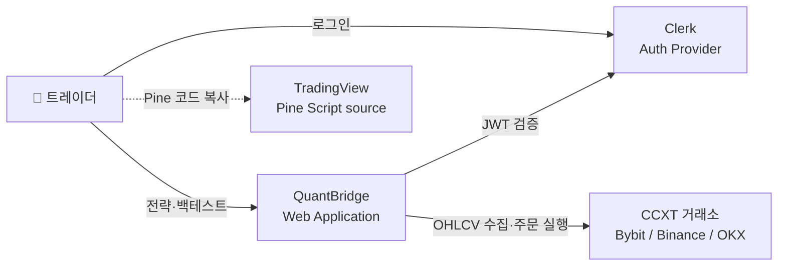
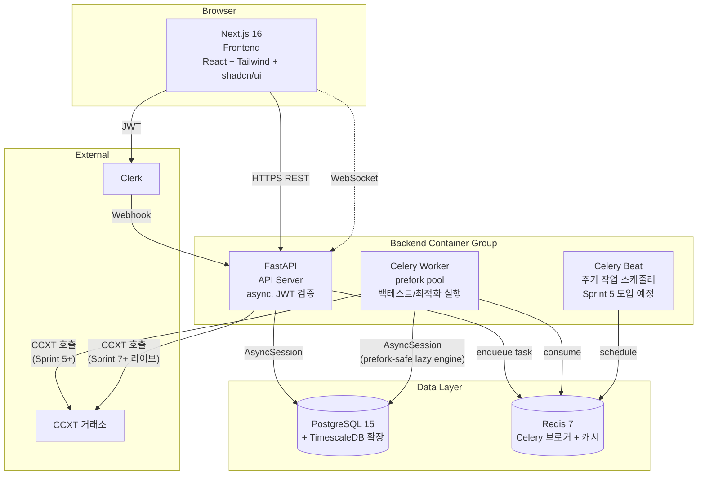
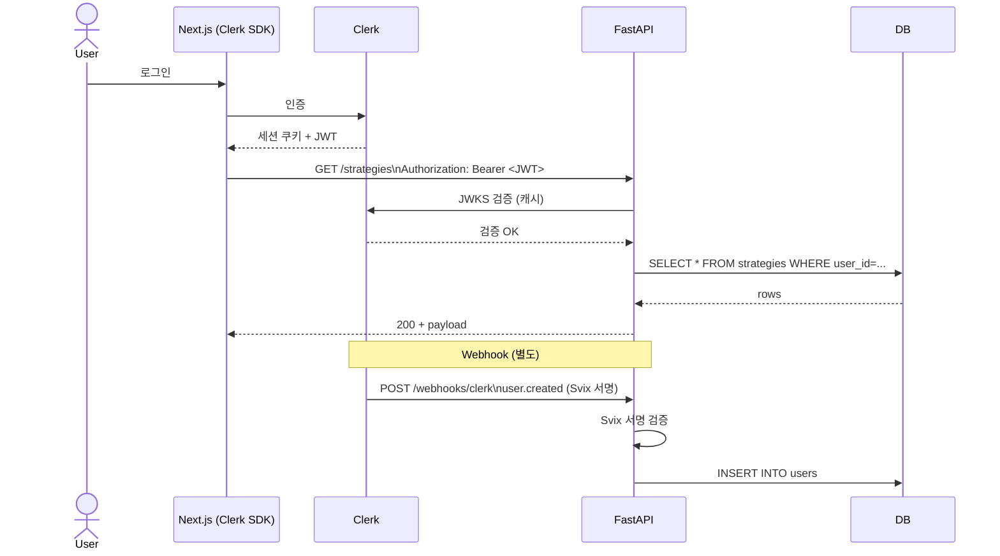
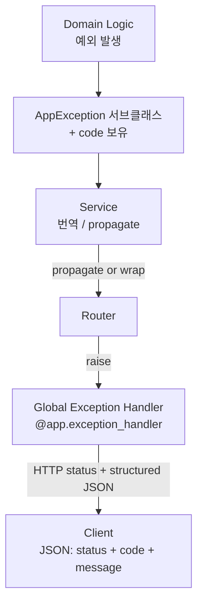

# QuantBridge — 시스템 아키텍처

> **목적:** C4 Level 1~2 (System Context + Container) 다이어그램 + 인증/인가 경계.
> **SSOT:** 컴포넌트 코드는 `frontend/`, `backend/`. 인프라는 `docker-compose.yml`, `.github/workflows/ci.yml`.
> 데이터 흐름 시퀀스는 [`data-flow.md`](./data-flow.md), 도메인 경계는 [`02_domain/domain-overview.md`](../02_domain/domain-overview.md).

---

## 1. C4 Level 1 — System Context



### 외부 의존성

| 시스템 | 역할 | 의존 도메인 |
|--------|------|-------------|
| Clerk | 사용자 인증 (세션, JWT, Webhook) | auth |
| TradingView | Pine Script 코드 원본 (사용자 수동 복사) | strategy (input only) |
| CCXT 거래소 (Binance/Bybit/OKX) | OHLCV 수집, 주문 실행 | market_data, trading |

---

## 2. C4 Level 2 — Container Diagram



### 컨테이너 책임

| 컨테이너 | 책임 | 이미지/런타임 | 포트 |
|----------|------|----------------|------|
| Frontend | Next.js 16 SSR/CSR, Clerk SDK, React Query, Zustand | `node:22` | 3000 |
| API | FastAPI async, JWT 검증, Webhook 수신, 백테스트 dispatch | `python:3.11-slim` + `uv` | 8000 |
| Worker | Celery prefork, vectorbt 실행, OHLCV 수집 | API와 동일 이미지 | — |
| Beat | Celery beat scheduler (stale reclaim, market_data sync) | API와 동일 이미지 | — |
| DB | PostgreSQL 15 + TimescaleDB 확장 | `timescale/timescaledb:latest-pg15` | 5432 |
| Redis | Celery 브로커 + 결과 백엔드 + 캐시 | `redis:7-alpine` | 6379 |

> Frontend는 현재 dev 환경에서 `pnpm dev` 직접 실행 (compose 미포함). Worker/Beat는 Sprint 5에서 compose 통합 예정.

---

## 3. 인증/인가 경계



### 인증 규칙

- 모든 보호된 엔드포인트: `Depends(get_current_user)` → JWT 검증 → user 컨텍스트 주입
- Webhook: Svix 서명 + timestamp 검증 (replay 방지)
- 인가: Service 레이어가 `user_id` 인자로 행 소유자 일치 검증

### 인가 경계

| 위치 | 책임 |
|------|------|
| Router | JWT 검증 (Depends) + user_id 추출 |
| Service | 행 소유자 검증 (`user_id` 일치) + 비즈니스 가드 |
| Repository | 권한 무관, DB 접근만 |

---

## 4. 비동기 작업 흐름 (백테스트 예시)

```mermaid
flowchart LR
    Client[Client]
    Router[backtest/router]
    Service[BacktestService]
    Disp[TaskDispatcher]
    Redis[(Redis Queue)]
    Worker[Celery Worker]
    Engine[vectorbt engine]
    Repo[BacktestRepository]
    DB[(PostgreSQL)]

    Client -->|POST /backtests| Router
    Router --> Service
    Service -->|create QUEUED| Repo
    Repo --> DB
    Service --> Disp
    Disp -->|enqueue| Redis
    Service -->|202 + backtest_id| Client

    Worker -->|consume| Redis
    Worker -->|guard #1| Repo
    Worker -->|RUNNING| Repo
    Worker --> Engine
    Engine -->|metrics + trades| Worker
    Worker -->|guard #3| Repo
    Worker -->|COMPLETED + insert trades\n단일 트랜잭션| Repo
    Repo --> DB

    Client -->|GET /backtests/:id/progress\n(polling)| Router
```

### 디스패처 추상화

`TaskDispatcher` Protocol (`backend/src/common/task_dispatcher.py`):
- `CeleryDispatcher` — 프로덕션
- `NoopDispatcher` — 테스트 (큐 없이 즉시 실행 안 함)
- `FakeDispatcher` — 단위 테스트용 spy

Sprint 5+ Optimizer / Stress Test도 동일 dispatcher 재사용.

---

## 5. 에러 전파 경로



### 에러 코드 구조 (Sprint 3 §4.4)

```json
{
  "code": "strategy.has_backtests",
  "message": "Strategy has dependent backtests; archive instead.",
  "details": {}
}
```

| 도메인 코드 prefix | 예시 |
|---------------------|------|
| `auth.*` | `auth.invalid_token`, `auth.unauthenticated` |
| `strategy.*` | `strategy.not_found`, `strategy.has_backtests`, `strategy.unsupported_pine` |
| `backtest.*` | `backtest.not_found`, `backtest.invalid_state_transition`, `backtest.cancellation_already_terminal` |
| `market_data.*` | (Sprint 5 도입) |

### IntegrityError 번역 (Sprint 4 D5)

- asyncpg `ForeignKeyViolationError` → `isinstance(exc.orig, _AsyncpgFKViolation)` 매칭
- SQLAlchemy 래핑 고려 (`exc.orig` + `exc.orig.__cause__` 양쪽 체크)
- 도메인 예외로 변환 (예: `StrategyHasBacktests`)
- 그 외 IntegrityError는 propagate

---

## 6. 트랜잭션 경계

| 경계 | 위치 | 패턴 |
|------|------|------|
| 단일 도메인 | Service 한 메서드 내 | `repo.<ops>` 후 `repo.commit()` 한 번 |
| 크로스 도메인 (예: Strategy delete with backtest 조회) | Service 동일 session 주입 | `dependencies.py`에서 같은 session으로 두 repo 조립 |
| 백테스트 완료 + trades insert | Worker `_execute()` | `complete()` + `insert_trades_bulk()` 단일 트랜잭션 (atomicity 주석 명시) |

---

## 7. 캐싱 전략 (현재/계획)

| 대상 | 위치 | TTL | 상태 |
|------|------|-----|------|
| Clerk JWKS | API 메모리 | Clerk SDK 기본 | ✅ |
| OHLCV 핫 데이터 | Redis | 미결정 | ⏳ Sprint 5+ |
| 백테스트 결과 | DB only (캐시 없음) | — | ✅ |
| 전략 list | DB only | — | ✅ |
| 실시간 가격 | Zustand (FE) | 세션 | ⏳ Sprint 7+ WebSocket |

---

## 8. Observability (계획)

> 상세는 [`07_infra/observability-plan.md`](../07_infra/observability-plan.md).

- 로그: 현재 stdlib `logging` (structured 미적용)
- 메트릭: 미적용
- 트레이싱: 미적용
- 알림: 미적용

Sprint 7+에서 OpenTelemetry + Prometheus + Grafana 검토.

---

## 9. 배포 토폴로지 (계획)

> 상세는 [`07_infra/deployment-plan.md`](../07_infra/deployment-plan.md).

현재: `docker compose up -d` (dev only). 프로덕션 배포 옵션 미정.

---

## 변경 이력

- **2026-04-16** — 초안 작성 (Sprint 5 Stage A)
