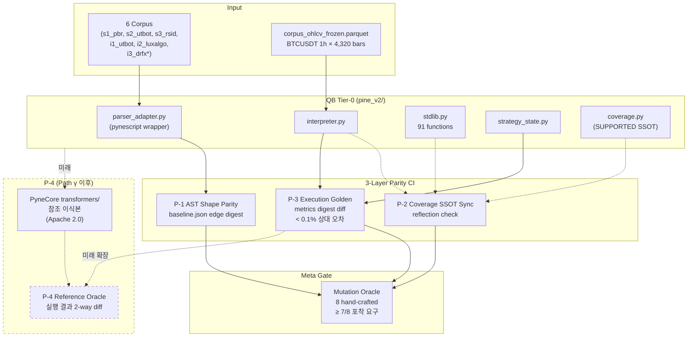

# Trust Layer Architecture — 3-Layer Parity (P-1/2/3) + Future P-4

> **상태:** Path β Stage 0 초안 (2026-04-23). Stage 2 구현 완료 시 확정
> **ADR:** [`dev-log/013-trust-layer-ci-design.md`](../dev-log/013-trust-layer-ci-design.md)
> **상위:** [`pine-execution-architecture.md` §2 Tier-2](./pine-execution-architecture.md#🏗️-tier-2-pynecore-골든-오라클--day-1-ci) (본 문서는 Tier-2 의 실용화 상세)
> **관련 ADR:** [ADR-011 Pine v4](../dev-log/011-pine-execution-strategy-v4.md), [ADR-012 Sprint 8a](../dev-log/012-sprint-8a-tier0-final-report.md), [ADR-016 Sprint Y1](../dev-log/016-sprint-y1-coverage-analyzer.md)

---

## 1. 배경 — Trust Layer 의 2 축

QuantBridge 의 Trust Layer 는 **두 축** 을 가진다:

```
          ┌─────────────────────────────────┐
          │   Trust Layer                   │
          ├─────────────────────────────────┤
          │                                 │
          │   축 1: 사용자 facing           │
          │   "이 전략이 실행 가능한가?"    │
          │   → Sprint Y1 Coverage Analyzer │
          │   → 422 Reject + UI 경고        │
          │                                 │
          │   축 2: 엔지니어 facing         │  ← 본 문서 담당 (Path β)
          │   "내 코드 변경이 regression    │
          │    을 일으키지 않는가?"         │
          │   → 3-Layer Parity CI          │
          │                                 │
          └─────────────────────────────────┘
```

**축 1 은 완료** (PR #61, Y1 Coverage Analyzer). **축 2 가 Path β 의 대상**. 두 축이 합쳐져야 Trust Layer 완성.

---

## 2. ADR-011 원래 Tier-2 정의와의 간극

ADR-011 §4 Tier-2 의 원래 목표:

> "**QB Tier-0 구현체 vs (a) pynescript AST 구조, (b) PyneCore `transformers/` Apache 2.0 참조 이식본** → 상대 오차 <0.1%"

Phase -1 실측 (2026-04-18, PR #18~19) 이후 발견:

- PyneCore CLI (`pyne compile`) 는 PyneSys 상용 API 의존 → 독립 오라클 불가
- PyneCore `transformers/` 모듈만 Apache 2.0 이식 가능 (persistent.py, series.py, security.py, nabool.py)
- 하지만 이식 작업 자체가 **3~4주 규모** — Path β (1주) 범위 초과

**실용적 재정의** (Path β):

| ADR-011 원안                                                   | Path β 재정의                                        | Path γ 이후                                        |
| -------------------------------------------------------------- | ---------------------------------------------------- | -------------------------------------------------- |
| Tier-2 = "QB vs pynescript AST + PyneCore transformers 이식본" | **3-Layer Parity (P-1/2/3)** + Mutation Oracle       | + **P-4** (PyneCore transformers 이식본 실행 결과) |
| 상대 오차 <0.1%                                                | P-3 에서 실측                                        | 동일                                               |
| 비교 기준점 1개                                                | 기준점 3개 (AST shape, SSOT reflection, self-golden) | 기준점 4개 (+ PyneCore 이식본)                     |

**핵심 아이디어**: "외부 오라클이 즉시 사용 불가하면, **내부 자기 일관성 + 메타 검증 (Mutation Oracle)** 으로 대체. 외부 오라클 (P-4) 은 이식 완료 후 추가."

---

## 3. 3-Layer Parity 구조

### 3.1 관계도



`*` i3_drfx 는 Y1 Coverage 에서 `is_runnable=false` → baseline 에 `"note": "Skipped"` 로 기록만.

### 3.2 각 Layer 의 역할

|           Layer            | 잡는 것                                                              | 못 잡는 것                                                     |            Path β 비용             |
| :------------------------: | -------------------------------------------------------------------- | -------------------------------------------------------------- | :--------------------------------: |
|     **P-1** AST Shape      | pynescript 업그레이드 시 AST drift, `.pine` 파일 오타 commit         | 실행 결과 편차                                                 |        低 (기존 test 확장)         |
|   **P-2** Coverage SSOT    | `coverage.py` ↔ `stdlib/interpreter` 동기화 누락                     | Semantic 오차                                                  |      低 (신규 리플렉션 test)       |
|  **P-3** Execution Golden  | stdlib/interpreter/strategy_state 의 **숫자 편차** (상대 오차 >0.1%) | "모든 corpus 에서 동시에 같은 방향 drift" (이론적 극단 케이스) | 中 (baseline 생성 + 갱신 스크립트) |
| **Mutation Oracle** (보조) | P-1/2/3 의 **감지력** 자체                                           | 본인 (self-reference 한계)                                     |    中 (8개 mutation 수동 작성)     |

### 3.3 Layer 간 독립성

3 Layer 는 **OR 게이트**: 하나라도 실패하면 CI red. Mutation Oracle 은 "3 Layer 가 작동하는지" 의 메타 검증 — Gate-2 의 품질 게이트.

---

## 4. 구현 요소 매핑

### 4.1 파일 구조

```
backend/
├── tests/strategy/pine_v2/
│   ├── test_pynescript_baseline_parity.py   # P-1 (기존 확장)
│   ├── test_coverage_ssot_sync.py           # P-2 (신규)
│   ├── test_execution_golden.py             # P-3 (신규)
│   ├── test_mutation_oracle.py              # Meta (신규, skip by default)
│   └── _tolerance.py                        # Decimal 허용 오차 유틸
├── tests/fixtures/pine_corpus_v2/
│   ├── s1_pbr.pine ~ i3_drfx.pine           # 기존 6 corpus
│   ├── baseline.json                        # 기존 (P-1)
│   ├── baseline_metrics.json                # 신규 (P-3)
│   └── corpus_ohlcv_frozen.parquet          # 신규 (P-3 data)
└── scripts/
    └── regen_trust_layer_baseline.py        # 신규 (--confirm 게이트)
```

### 4.2 CI 통합

```
.github/workflows/ci.yml
  └── backend job (기존)
        ├── ruff check
        ├── mypy src/
        ├── alembic upgrade head
        ├── pytest -v                         # 기존 전체 suite
        └── Trust Layer Parity step           # 신규 (≤3분)
              ├── test_pynescript_baseline_parity.py (P-1)
              ├── test_coverage_ssot_sync.py (P-2)
              └── test_execution_golden.py (P-3)
```

Mutation Oracle 은 기본 skip, nightly workflow 또는 `pytest --run-mutations` 수동.

---

## 5. Data Model

### 5.1 `baseline_metrics.json` 스키마

```jsonc
{
  "schema_version": 1,
  "ohlcv_sha256": "abc...", // corpus_ohlcv_frozen.parquet 해시
  "pine_v2_commit": "08c6388", // 마지막 regen 시점 commit
  "generated_at": "2026-04-24T00:00:00Z",
  "corpora": {
    "<corpus_id>": {
      "metrics": {
        // 항목별 Decimal string
        "total_return": "0.1532",
        "sharpe_ratio": "1.2041",
        "max_drawdown": "0.0832",
        "win_rate": "0.52",
        "num_trades": 47, // 정수는 integer
        "profit_factor": "1.35",
        "sortino_ratio": "1.6221",
        "calmar_ratio": "1.84",
        "avg_win": "0.0151",
        "avg_loss": "-0.0098",
        "long_count": 47,
        "short_count": 0,
      },
      "var_series_digest": "sha256:...",
      "trades_digest": "sha256:...",
      "warnings_digest": "sha256:...",
    },
    "i3_drfx": {
      "note": "Skipped — is_runnable=false per Y1 Coverage Analyzer",
    },
  },
}
```

### 5.2 허용 오차 공식

```python
# backend/tests/strategy/pine_v2/_tolerance.py
from decimal import Decimal

ABS_TOL = Decimal("0.001")
REL_TOL = Decimal("0.001")   # 0.1%

def within_tolerance(actual: Decimal, expected: Decimal) -> bool:
    abs_err = abs(actual - expected)
    if abs_err < ABS_TOL:
        return True
    if expected == 0:
        return False
    rel_err = abs_err / abs(expected)
    return rel_err < REL_TOL
```

`max(절대 0.001, 상대 0.1%)` — 작은 값에서 상대 오차가 과민 반응 방지.

---

## 6. Coverage Analyzer (Y1) 와의 접점

Sprint Y1 의 `coverage.py` 는 Trust Layer 의 **prerequisite + SSOT**:

| 역할 | Y1 Coverage Analyzer                           | 3-Layer Parity                      |
| ---- | ---------------------------------------------- | ----------------------------------- |
| 대상 | Pine 소스 (사용자 입력)                        | QB 구현체 (내부 코드)               |
| 시점 | 백테스트 실행 **전** (pre-flight)              | 매 commit CI                        |
| 출력 | `is_runnable`, `unsupported_builtins`          | green / red                         |
| SSOT | `SUPPORTED_FUNCTIONS` + `SUPPORTED_ATTRIBUTES` | **P-2 가 이 SSOT 의 동기화를 보증** |

**의존 관계**:

- Y1 이 `fixnan` 을 unsupported 로 분류 → 사용자 차단 (422)
- 개발자가 `stdlib.py` 에 `fixnan` 추가 + `coverage.py` 에 추가 누락 → **P-2 가 CI 에서 red**
- 반대로 `coverage.py` 에는 추가됐는데 `stdlib.py` 미구현 → **P-2 가 CI 에서 red**

Y1 과 Trust Layer 는 **SSOT 를 공유** 함으로써 whack-a-mole 패턴 을 양방향에서 차단.

---

## 7. P-4 로드맵 (Path γ 이후)

**목표**: ADR-011 §4 Tier-2 원안 완전 구현 — **PyneCore transformers 이식본** 을 레퍼런스 오라클로 활용.

### 7.1 이식 대상 (Path γ, ~3주)

| PyneCore 모듈                             | QB 대응 파일                                              |         이식 상태          |
| ----------------------------------------- | --------------------------------------------------------- | :------------------------: |
| `src/pynecore/transformers/persistent.py` | `backend/src/strategy/pine_v2/runtime/persistent.py`      | 🟡 의미론만 차용 (ADR-012) |
| `src/pynecore/transformers/series.py`     | `backend/src/strategy/pine_v2/runtime/series.py` (신규)   |         ❌ 미이식          |
| `src/pynecore/transformers/security.py`   | `backend/src/strategy/pine_v2/runtime/security.py` (신규) |   ❌ 미이식 (MTF 미구현)   |
| `src/pynecore/transformers/nabool.py`     | `backend/src/strategy/pine_v2/runtime/nabool.py` (신규)   |         ❌ 미이식          |

**이식 규칙**:

- 코드 직접 copy 금지 — **로직 참조** 후 QB AST 구조에 맞춰 재구현
- Apache 2.0 NOTICE 파일 + 원본 파일 헤더 유지
- `backend/THIRD_PARTY_NOTICES.md` 에 PyneCore 라이선스 전문 보존

### 7.2 P-4 구조

```python
# backend/tests/strategy/pine_v2/test_pynecore_reference_oracle.py (Path γ 이후)

def test_corpus_execution_matches_pynecore_reference(corpus_id):
    """P-4: QB Tier-0 실행 결과 vs PyneCore transformers 이식본 실행 결과."""
    qb_result = run_backtest_v2(corpus, ohlcv)
    ref_result = run_backtest_pynecore_reference(corpus, ohlcv)  # 이식본

    for metric in METRIC_KEYS:
        assert within_tolerance(qb_result[metric], ref_result[metric])
```

**P-4 추가 시 ADR-013 amend** 하여 "P-1/2/3/4 Full Tier-2" 로 승격.

---

## 8. 운영 절차

### 8.1 새 stdlib 함수 추가 시 (예: `ta.supertrend`)

1. `backend/src/strategy/pine_v2/stdlib.py` 에 구현
2. `backend/src/strategy/pine_v2/interpreter.py` 에 dispatch 등록 (이미 되어있으면 skip)
3. `backend/src/strategy/pine_v2/coverage.py` `_TA_FUNCTIONS` 에 `"ta.supertrend"` 추가
4. `pytest test_coverage_ssot_sync.py` → P-2 green 확인
5. 관련 corpus 가 있으면 `python scripts/regen_trust_layer_baseline.py --confirm --corpus <id>` → diff 확인
6. PR 에 baseline 변화 포함

### 8.2 pynescript 버전 업그레이드 시

1. `backend/pyproject.toml` 의 `pynescript==0.3.0` → `==0.4.0` 변경
2. `uv sync --frozen` 실패 시 lockfile 갱신
3. `pytest test_pynescript_baseline_parity.py` → 실패 예상
4. AST 차이를 분석 → 실제 semantic 영향 있는지 판단
5. 없으면 `baseline.json` regen + PR; 있으면 interpreter 대응 후 regen

### 8.3 Baseline regen 정책

| 변경 종류                                |          Baseline regen 의무          |
| ---------------------------------------- | :-----------------------------------: |
| stdlib 의미 변경 (bugfix, 알고리즘 교정) |                ✅ 필수                |
| stdlib 신규 함수 (기존 corpus 미사용)    |               ❌ 불필요               |
| interpreter 새 AST 노드 지원             |                ✅ 필수                |
| coverage.py 만 변경                      |           ❌ (P-2 만 실행)            |
| OHLCV fixture 변경                       | ✅ 필수 + ADR-013 부록에 새 해시 기록 |
| `.pine` corpus 파일 수정                 |                ✅ 필수                |

---

## 9. 메타 원칙

1. **외부 의존 최소화**: Trust Layer 가 외부 SaaS / PyneSys API / TV 브라우저에 의존하면 CI flakiness 폭증. 내부 자기 일관성 우선.
2. **Git 친화**: baseline 은 plain JSON + digest 혼합. `git diff` 가 사람이 읽을 수 있게.
3. **승인 플래그**: regen 스크립트의 `--confirm` 은 "의도된 변경" 의 흔적 남기기.
4. **Decimal-first 고수**: 모든 금융 숫자 비교는 `Decimal(str(x))` — Sprint 4 D8 교훈 연장.
5. **Mutation Oracle 은 메타 게이트**: "CI 가 작동하는지 확인" 은 CI 자체를 못 한다. Hand-crafted mutation 이 최소한의 보증.

---

## 10. 관련 문서

- [ADR-013 Trust Layer CI — 3-Layer Parity 설계](../dev-log/013-trust-layer-ci-design.md) — 결정 기록
- [ADR-011 Pine Execution Strategy v4](../dev-log/011-pine-execution-strategy-v4.md) — Tier 0~5 원안
- [ADR-016 Sprint Y1 Coverage Analyzer](../dev-log/016-sprint-y1-coverage-analyzer.md) (예정) — SSOT 규약
- [Trust Layer Requirements + SLO](../01_requirements/trust-layer-requirements.md) (예정)
- [pine-execution-architecture.md §2.2 Tier-2](./pine-execution-architecture.md) — 상위 참조
