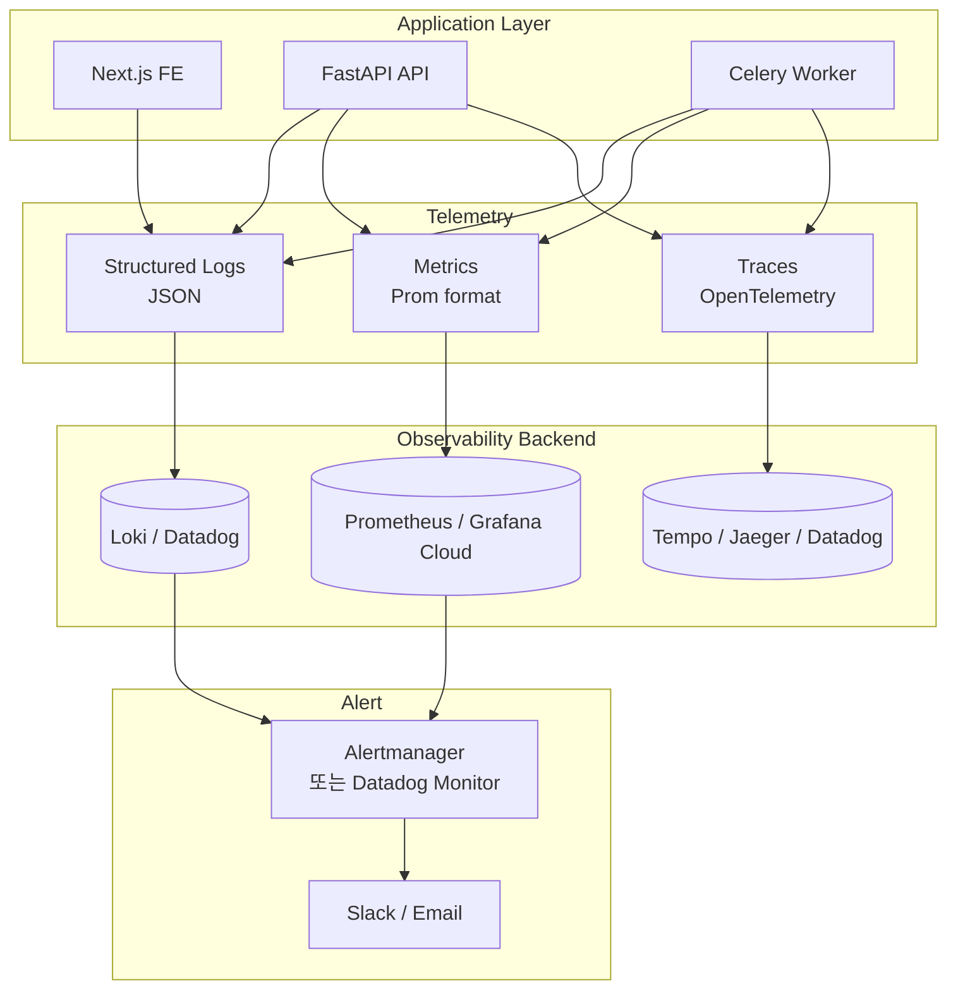

# QuantBridge — Observability 계획 (Draft)

> **상태:** Draft — 도구 결정 미정 `[확인 필요]`.
> **목적:** 로그/메트릭/트레이싱/알림 4 영역 계획 정리.
> 의존: [`./deployment-plan.md`](./deployment-plan.md)

---

## 1. 현재 상태

- 로그: stdlib `logging` (structured 미적용, stdout)
- 메트릭: 미적용
- 트레이싱: 미적용
- 알림: 미적용

---

## 2. 4 영역 계획

---

## 3. 로그 (Logs)

### 현재

- stdlib `logging`, level 환경 변수 없음
- structured 미적용 — text-only

### 계획

- **포맷:** JSON structured (timestamp, level, logger, message, context)
- **컨텍스트:** request_id, user_id, backtest_id 등 자동 주입
- **수집:** stdout → container runtime → Loki 또는 Datadog `[확인 필요]`
- **보존:** 30일 hot, 90일 cold `[가정]`

### 우선 적용 위치

- `BacktestService` 3-guard 전이 로그
- Celery worker `_execute()` 진입/종결
- Webhook 수신/검증 결과
- Repository commit 실패
- **Trading order 실행** (Sprint 8+, mainnet dogfood 필수 가시성):
  - `order_executed` — order_id · strategy_id · symbol · side · notional · leverage (5 필드)
  - `order_rejected` — order_id · reason · requested_qty · requested_price · leverage
  - `kill_switch_gated` — strategy_id · trigger_type · trigger_value · threshold · capital_source (static/dynamic)
  - `fetch_balance_failed` — account_id · error_type · exchange (Bybit/OKX/Binance)
  - `notional_exceeded` — order_id · notional · available · max_notional · leverage

---

## 4. 메트릭 (Metrics)

### 핵심 메트릭 후보

| 메트릭                                           | 타입      | 라벨                                                                   | 용도                       |
| ------------------------------------------------ | --------- | ---------------------------------------------------------------------- | -------------------------- |
| `backtest_submitted_total`                       | counter   | user_id, strategy_id                                                   | 사용량                     |
| `backtest_completed_total`                       | counter   | status (completed/failed/cancelled)                                    | 성공률                     |
| `backtest_duration_seconds`                      | histogram | symbol, timeframe                                                      | 성능                       |
| `celery_queue_length`                            | gauge     | queue                                                                  | 큐 적체                    |
| `celery_task_active`                             | gauge     | worker                                                                 | 워커 부하                  |
| `cancel_request_total`                           | counter   | result (immediate/guarded)                                             | 취소 비율                  |
| `stale_reclaim_total`                            | counter   | reason                                                                 | 워커 안정성                |
| `clerk_jwt_validation_total`                     | counter   | result (ok/fail/code)                                                  | 인증 안정성                |
| `db_query_duration_seconds`                      | histogram | operation                                                              | DB 부하                    |
| **`order_submitted_total`** (Sprint 8+)          | counter   | exchange, symbol, side                                                 | Trading 볼륨               |
| **`order_rejected_total`** (Sprint 8+)           | counter   | reason (leverage_cap/notional/kill_switch/trading_session/idempotency) | 가드 효과                  |
| **`fetch_balance_duration_seconds`** (Sprint 8+) | histogram | exchange                                                               | API 지연                   |
| **`kill_switch_events_total`** (Sprint 8+)       | counter   | trigger_type, capital_source                                           | Kill Switch 발동 빈도      |
| **`notional_rejected_total`** (Sprint 8+)        | counter   | exchange, symbol                                                       | 자본 대비 과도한 주문 차단 |

### 도구 후보

- Prometheus (self-host) + Grafana
- Datadog (managed, 통합)
- Grafana Cloud (managed, OSS 친화)

`[확인 필요]` — 비용/기능 비교 후 결정.

---

## 5. 트레이싱 (Traces)

### 시나리오

- HTTP 요청 → API → Service → Repository → DB
- 백테스트 submit → Celery enqueue → worker pickup → engine 실행 → DB write
- Webhook → 검증 → user 동기화

### 도구 후보

- OpenTelemetry SDK (Python `opentelemetry-instrumentation-fastapi`, `opentelemetry-instrumentation-celery`)
- Backend: Tempo / Jaeger / Datadog APM `[확인 필요]`

### 상관 관계

- trace_id를 로그에 동시 주입 → 한 요청의 모든 로그/메트릭/트레이스 연관

---

## 6. 알림 (Alerts)

### 우선 알림 룰

| 룰                       | 조건                                   | 채널          |
| ------------------------ | -------------------------------------- | ------------- |
| Stale running spike      | `stale_reclaim_total` 1시간 > 5건      | Slack         |
| Backtest fail rate       | `failed / total` > 10% (5분 윈도우)    | Slack         |
| Celery queue backlog     | `celery_queue_length` > 50 (10분 지속) | Slack         |
| API 5xx burst            | 5xx 응답 > 1% (5분)                    | Slack + Email |
| Webhook 검증 실패        | `clerk_webhook_invalid_total` > 0      | Slack (보안)  |
| DB connection saturation | 풀 사용률 > 80%                        | Slack         |

### 도구

- Prometheus Alertmanager + Slack webhook
- 또는 Datadog Monitor (managed)
- On-call: 미정 `[확인 필요]`

---

## 7. 단계적 도입 로드맵

| Sprint | 목표                                                     |
| ------ | -------------------------------------------------------- |
| 5      | structured logging 전환 (JSON, request_id 주입)          |
| 6      | Prometheus 메트릭 4개 핵심 (backtest*\*, celery*\*) 도입 |
| 7      | OpenTelemetry traces (FastAPI + Celery)                  |
| 7      | Alert 5개 룰 활성 (Slack)                                |
| 8+     | 도구 결정 확정 + dashboard 정식 운영                     |

---

## 8. 계측 비용 가이드

- 로그: 1 GB/일 (MAU 1K 기준 [가정]) — Loki/Datadog 비용 직결
- 메트릭: cardinality 폭증 방지 — user_id 라벨은 high cardinality 주의 (집계만 라벨)
- 트레이싱: sampling 1~10% 권장 (full sampling 비용 과다)

---

## 9. SRE 원칙

- **SLO 우선** — 측정 가능한 목표 (예: API p95 < 500ms, 가용성 99.5%) `[확인 필요]`
- **Error Budget** — 99.5% 가용성 → 월 3.6시간 다운타임 허용
- **Postmortem 문화** — 인시던트마다 lessons.md 업데이트

---

## 10. 결정 대기 항목 (`[확인 필요]`)

| 항목                                            | 의존 sprint |
| ----------------------------------------------- | ----------- |
| 로그 backend (Loki vs Datadog vs Grafana Cloud) | Sprint 7+   |
| 메트릭 backend                                  | Sprint 7+   |
| 트레이싱 backend                                | Sprint 7+   |
| Alert 채널 (Slack workspace, email 분배)        | Sprint 7+   |
| On-call 정책                                    | Sprint 8+   |
| SLO 정의                                        | Sprint 7+   |

---

## 11. 참고

- OpenTelemetry: https://opentelemetry.io/
- Prometheus Python: https://github.com/prometheus/client_python
- Loki + Promtail: https://grafana.com/docs/loki/

---

## 변경 이력

- **2026-04-16** — Draft 초안 작성 (Sprint 5 Stage A)
- **2026-04-20** — Trading order structured log 5건 + Sprint 8+ metric 5건 추가 (H1 mainnet dogfood 준비, Step 4)
