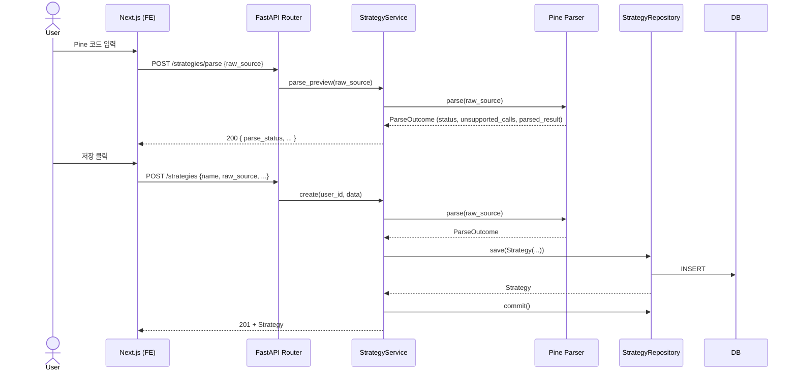
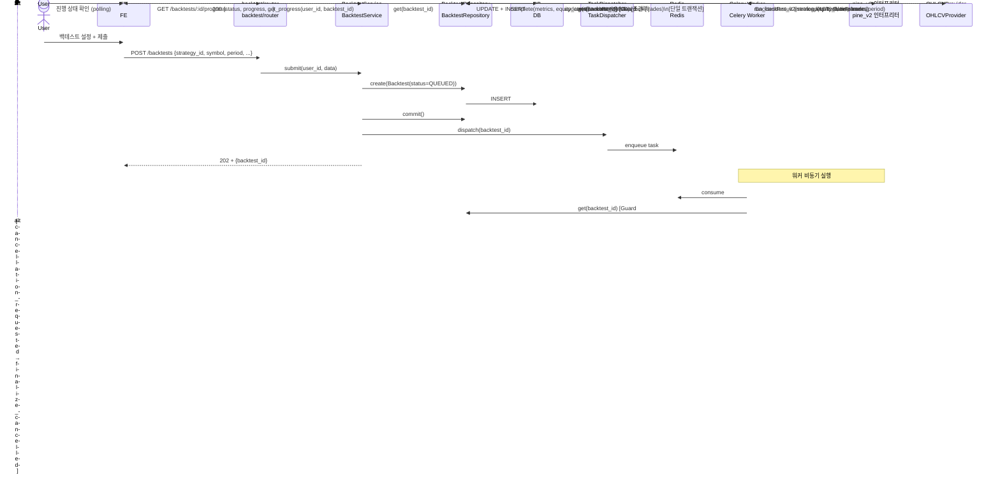
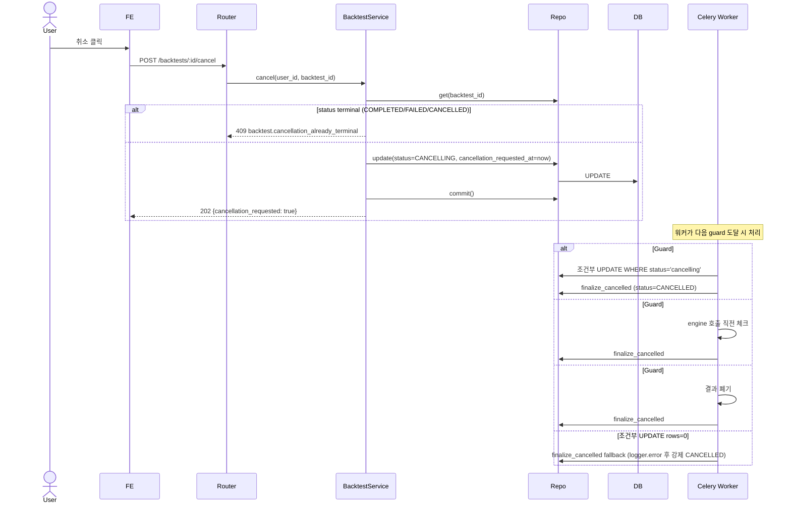
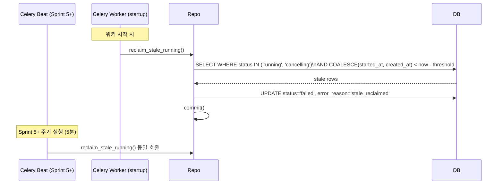
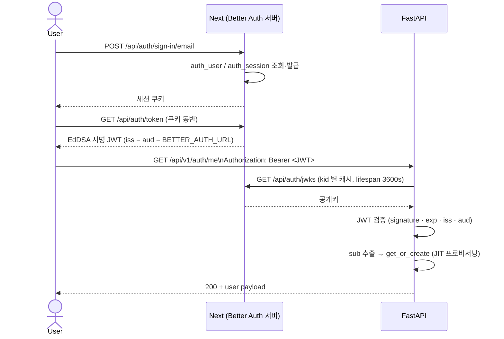
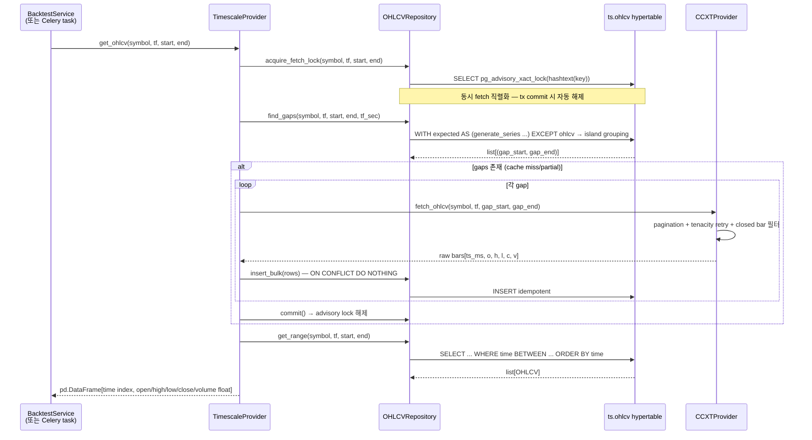
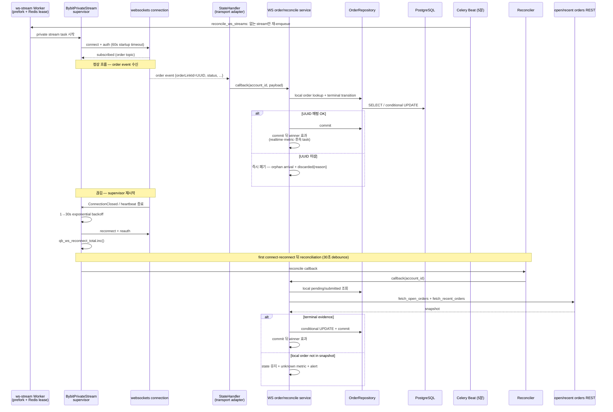
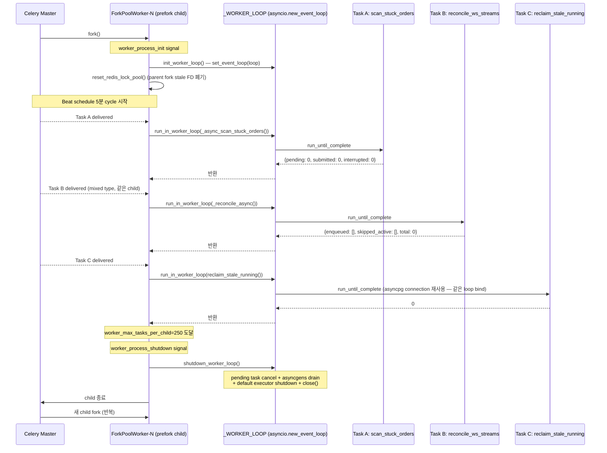

# QuantBridge — 데이터 흐름

> **목적:** 도메인별 주요 시퀀스 다이어그램.
> **상위 문서:** [`system-architecture.md`](./system-architecture.md), 도메인 경계는 [`domain-overview.md`](../domain/domain-overview.md).

---

## 1. Strategy CRUD (Sprint 3)

### 주요 가드

- 미지원 함수 1개 이상 → `parse_status=UNSUPPORTED` 저장 (저장 자체는 허용, 백테스트 시 거부)
- `name` 중복 시 unique 제약 위반 → 409

---

## 2. Backtest 비동기 실행 (Sprint 4)

### 주요 가드/규칙

- 워커는 `_execute()` 진입 시 `if bt is None: logger.error + return` (assert 금지)
- 조건부 UPDATE rows=0 → `finalize_cancelled` fallback 호출
- 완료 + trades insert는 단일 트랜잭션 (atomicity)
- prefork-safe: SQLAlchemy engine은 lazy init (모듈 import 시점 호출 금지)

---

## 3. Cancel Race (3-Guard Pattern)

> Sprint 4 §5.1 패턴. transient `CANCELLING` + 3 guard 위치 + fallback finalize.

---

## 4. Stale Reclaim (Worker Crash 복구)

### 규칙 (Sprint 4 D9)

- `running` + `cancelling` 양쪽 모두 reclaim 대상
- `cancelling` 케이스: `started_at NULL` (QUEUED→CANCELLING) → `created_at` fallback
- startup hook과 Celery Beat가 함께 reclaim한다. Beat 주기는 `tasks/celery_app.py`가 정한다.
- 멀티 워커 split-brain 방어 (Sprint 5+ #13): `inspect().active()` 또는 Redis lock

---

## 5. Auth — self-host Better Auth ([ADR-034](../adr/034-auth-self-host-better-auth.md))

★**Next 앱이 인증 서버 본체다.** 외부 인증 벤더도, lifecycle webhook 도 없다.
★**두 구간의 자격증명이 다르다** — 브라우저↔Next 는 **세션 쿠키**, Next↔FastAPI 는 **Bearer JWT**.
★**백엔드는 비밀을 하나도 쥐지 않는다** — 검증은 JWKS 공개키로만 한다(`realtime/auth.py:1-2`).

**lifecycle 동기화 — webhook 이 아니라 세 경로다.**

| 사건      | 경로                                                                                                                                                   |
| --------- | ------------------------------------------------------------------------------------------------------------------------------------------------------ |
| 가입      | FastAPI 가 첫 인증 요청에서 `sub` 로 **JIT 생성**한다 (`auth/service.py` `get_or_create`, 호출은 `realtime/auth.py`)                                   |
| 정보 변경 | ★**같은 `get_or_create` 가 매 요청에서 동기화한다** — JWT 의 `email`·`username`·`country` 를 DB 행과 비교해 **다를 때만** `update_profile()` 을 부른다 |
| 탈퇴      | `DELETE /api/v1/auth/me` → `auth/service.py:131` `deactivate_account`. 이후 그 `sub` 의 JWT 는 `UserInactiveError` 로 막힌다 (`realtime/auth.py:186`)  |

★**JWKS 호출은 rate limit 안쪽에 둔다.** `PyJWKClient` 는 **미상 `kid` 에 음성 캐시가 없어**
같은 가짜 kid 를 10번 보내면 JWKS 를 **11번** 가져온다 — `Authorization: Bearer <아무거나>` 만으로
1:1 증폭이다(`realtime/auth.py:113-117`).

---

## 6. OHLCV cache flow (Sprint 5 M3 ✅)

> 별도 sync API/UI는 없다. **Backtest가 OHLCV를 요청하는 시점에 cache → CCXT fallback**으로 채우며, `TimescaleProvider`가 on-demand로 처리한다.

### 핵심 결정 (Sprint 5 M3)

- **on-demand cache-first** — Backtest 실행 시점에 필요한 구간만 fetch. 별도 동기화 task 없음.
- **gap 계산은 Postgres가 책임** — `generate_series + EXCEPT + ROW_NUMBER` island grouping (FE/BE 가공 없음).
- **idempotent insert** — `ON CONFLICT DO NOTHING`. UPDATE 안 함 (CCXT 데이터는 immutable past data).
- **동시 fetch race** — `pg_advisory_xact_lock(hashtext(key))`. 같은 (symbol, tf, period) lock 보유 중인 타 트랜잭션은 대기. tx commit 시 해제.
- **closed bar filter** — CCXTProvider가 `last_closed_ts = (now // tf_sec) * tf_sec - tf_sec` 이하만 반환 (진행 중 캔들 제외).
- **provider lifecycle** — HTTP는 FastAPI lifespan singleton, Worker는 prefork-safe lazy + worker_shutdown close ([`system-architecture.md`](./system-architecture.md) §lifecycle 참조).

---

## 7. Polling + Bybit Private WebSocket (Sprint 12 도입 ✅)

### 7.1 백테스트 진행 — 폴링 유지

`GET /backtests/:id/progress` 1~2초 간격 폴링. 단순 + 캐시 친화적 + 부담 낮음. WS 로 마이그 안 함.

### 7.2 Trading 주문 체결 — Bybit Private WebSocket (Sprint 12 Phase C)

### 7.3 핵심 결정 (Sprint 12)

- **supervisor 패턴** — supervisor task 가 child stream task 의 종료를 감지하여 자동 재시작 (1→30s exponential)
- **prefork + Redis lease** — stream task 중복은 분산 lease로 막고 worker child의 영속 loop에서 실행한다.
- **OrderLinkId UUID 매핑** — CCXT 어댑터가 `params={orderLinkId: str(Order.id)}` 전달. `StateHandler`는 DB를 직접 만지지 않고 서비스 callback으로 넘긴다.
- **즉시 orphan 폐기** — 재생 버퍼는 호출자가 없어 삭제했다. 종결 이벤트와 무해한 비종결 이벤트는 `reason` label로 구분해 관측한다.
- **terminal-evidence-only transition** — Reconciliation service는 명확한 terminal snapshot만 반영하고, 모호하거나 없는 행은 상태를 바꾸지 않는다.
- **best-effort Slack alert** — KillSwitch event save 직후 alert task. alert 실패 ≠ KillSwitch 차단

### 7.4 신규 metrics

§7.2 시퀀스 안에 표시. 카탈로그는 [`system-architecture.md`](./system-architecture.md) §8.

### 7.5 제품 경계

- private WebSocket은 **Bybit Demo 계정만** 연결한다. 과거 live/OKX 행은 보존하되 stream 재등록·자격증명 복호화 전에 차단한다.
- 공개 ticker·과거 OHLCV/funding 수집은 사용자 private egress와 별도 경계다.

---

## 8. 페이지네이션 패턴

| API                         | 패턴                                  | 비고                                          |
| --------------------------- | ------------------------------------- | --------------------------------------------- |
| `GET /strategies`           | `limit` + `offset` (Sprint 5 M4 통일) | `page`는 deprecated fallback (Sprint 6+ 제거) |
| `GET /backtests`            | `limit` + `offset` (Sprint 4 표준)    | `common/pagination.py`                        |
| `GET /backtests/:id/trades` | `limit` + `offset`                    | 동일                                          |

> ✅ Sprint 5 M4 T32 완료: 모든 list endpoint `limit/offset` 표준 + `page` legacy fallback.

---

## 8.5 Worker Loop + Multi-Task Lifecycle (Sprint 18 BL-080 ✅)

> 상세 패턴: [`system-architecture.md`](./system-architecture.md) §7.5. 회고: `docs/dev-log/2026-05-02-sprint18-bl080-architectural.md`.

Sprint 18 의 Option C 영속 `_WORKER_LOOP` 채택으로, **동일 worker child 가 mixed task type 을 sequential 처리** 가능 (Sprint 17 까지의 task 별 process isolation 가정 폐기). asyncpg connection 의 transport waiter 가 1st task loop 에 stale binding 되는 문제를 영속 loop 통일로 해소.

### 핵심 invariant

- **모든 prefork child task body 가 같은 `_WORKER_LOOP` 사용** — asyncpg/SQLAlchemy/Redis pool/CCXT client 의 internal loop reference 가 stale 되지 않음.
- **`worker_max_tasks_per_child=250`** (Sprint 18 보수) — child rotation 으로 memory bloat 방어. Sprint 20+ BL-082 1h soak gate 후 1000 검토.
- **per-call `create_worker_engine_and_sm()` + finally `engine.dispose()` 그대로 유지** — connection pool 누수 방어 (loop binding 과 별개).
- **`run_bybit_private_stream` (long-running)** 은 별도 `ws_stream` queue + `--pool=solo` worker 분리 (Sprint 12 패턴 유지). 같은 child 에 short task 안 옴.
- **Sprint 19 BL-085** integration test 가 본 lifecycle 의 회귀 자동화: `init_worker_loop()` → 3 task type x 3 cycle = 9 호출 → 모두 succeeded.

---

## 9. 에러 응답 패턴 (참조)

상세는 [`system-architecture.md`](./system-architecture.md) §5. 모든 도메인 예외는 `code` 필드 포함 JSON.

---

## 변경 이력

- **2026-04-16** — 초안 작성 (Sprint 5 Stage A)
- **2026-05-02** — §8.5 Worker Loop + Multi-Task Lifecycle (Sprint 18 BL-080) 추가. 영속 `_WORKER_LOOP` 패턴 시퀀스 다이어그램.
