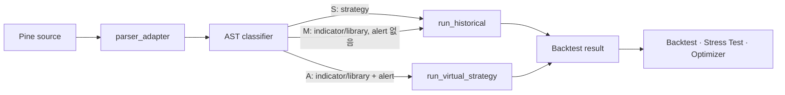

# Pine 실행 아키텍처

> **역할:** 현재 `pine_v2` 실행 계약의 진입점. 실제 구현은 [`apps/api/src/strategy/pine_v2/`](../../apps/api/src/strategy/pine_v2/), 결정 이유는 [`ADR-011`](../adr/011-pine-execution-strategy-v4.md)·[`ADR-014`](../adr/014-sprint-8b-8c-pine-v2-expansion.md), 2026-04 설계 과정은 `archive`(`docs/archive/architecture/2026-04-17-pine-execution-v4-design.md`)에 보존한다.

## 핵심 원칙

- Pine을 Python으로 변환해 `exec()`·`eval()`로 실행하지 않는다. `pine_v2`가 AST를 bar-by-bar로 해석한다.
- 실행 엔진의 정본은 `pine_v2`다. ★2026-08-06 에 vectorbt 의존성은 **제거됐다** — 「지표 계산 보조」라는 서술도 드리프트였고(코드 import 0건), 지표는 `pine_v2/stdlib.py` 가 pandas/numpy 로 직접 계산한다.
- 지원하지 않는 호출이 하나라도 있으면 부분 결과를 만들지 않고 Unsupported로 끝낸다.
- TradingView와 달라질 수 있는 degraded 호출은 백테스트 제출 시 명시 동의 없이는 실행하지 않는다.

## 실행 경로

| Track | 분류                                     | 실행 계약                                     |
| ----- | ---------------------------------------- | --------------------------------------------- |
| **S** | `strategy()` 선언                        | 네이티브 `run_historical` 경로                |
| **A** | `indicator()` 또는 `library` + alert     | `VirtualStrategyWrapper`가 전략 이벤트로 투영 |
| **M** | `indicator()` 또는 `library`, alert 없음 | 지표 pass-through로 `run_historical` 실행     |

분류 규칙의 정본은 `ast_classifier._classify_track`, 외부 진입점은 `compat.parse_and_run_v2`다. Track A는 `next_bar_open`을 그대로 재현하지 못할 때 경고를 남기고 bar-close로 실행한다.

### 파스 캐시 2층 (BL-832)

파싱 진입점은 `parser_adapter.parse_to_ast` **하나**다(n13 이 직접 `pynescript.ast.parse` 를 부르던 3곳을 여기로 모았다). 그 위에 캐시가 2층이다.

| 층 | 범위 | 무엇을 없애나 |
| --- | --- | --- |
| **L1** `lru_cache(maxsize=8)` | 프로세스 안 | 백테스트 1회의 중복 파스 4→1 (Track A 5→1) |
| **L2** 디스크(`PINE_AST_CACHE_DIR`) | 프로세스 **밖** | 프로세스 경계마다 다시 무는 콜드 파스 |

★**왜 디스크까지 가나** — 콜드 파스 1회는 실측상 `s5_ema_trend` 2.69초 · `s3_rsid` 11.47초 · `i3_drfx`(38,954B) **53.38초**이고, celery `worker_max_tasks_per_child` 재활용 · uvicorn 워커 · 테스트 프로세스가 각각 자기 콜드를 문다. L1 만으로는 그 경계를 못 넘는다.

★★**그 초의 정체는 「느린 코드」가 아니다** — `s3_rsid` cProfile 에서 `ParserATNSimulator.closure_` 의 cumtime 이 **35.77/36.96초(96.8%)** 다. ANTLR Python 런타임의 ATN 클로저 계산이고, **파서 층을 손대는 축(SLL 2단계·기동 워밍·문법 모호성 축소)은 이 성분을 못 건드린다**([BL-829] 기각 tombstone = `docs/backlog-deferred.md` 헤더). 줄이는 방법은 **다시 파싱하지 않는 것** 하나다.

- **캐시 키** = `sha256(스키마 버전 ∥ pynescript 버전 ∥ 소스)`. 버전이 바뀌면 미스다 — 업그레이드 후 낡은 AST 가 조용히 살아남으면 안 된다.
- **실패는 캐시되지 않는다.** 캐시 읽기가 어떤 이유로든 실패하면(동시 쓰기·클래스 소멸·손상) 조용히 정상 파스로 떨어진다 — 캐시는 파스를 **못 막는다**.
- **용량 상한**(`PINE_AST_CACHE_MAX_BYTES`, 기본 512MiB) 초과 시 mtime 오래된 것부터 소각한다. 파스 엔드포인트에 소스 길이 상한이 없어([BL-831]) 캐시 표면이 임의 입력으로 채워질 수 있다.
- ★**테스트는 기본 비활성**이다(`tests/conftest.py` autouse). 켜 두면 캐시가 테스트 프로세스 사이에서도 살아남아 파스 계수를 바꾼다 — 실제로 n13 계수 테스트 3건이 그렇게 red 였다.
- 판정은 **초가 아니라 계수·digest 동일성**이다: `test_parse_ast_disk_cache.py`(10건) · `test_parse_call_census.py`(6건).

## 지원 범위와 Trust Layer

`coverage.py`의 지원 집합과 `interpreter.py`의 실제 바인딩은 함께 바뀌어야 한다. 이 둘의 정합과 실행 회귀는 [`trust-layer-architecture.md`](./trust-layer-architecture.md)가 설명하며, 사용자에게 보이는 지원/미지원 목록은 [`supported-indicators.md`](../domain/supported-indicators.md)가 맡는다.

함수 지원을 추가할 때는 다음을 한 변경으로 끝낸다.

1. `stdlib.py` 또는 interpreter에 의미론을 구현한다.
2. `coverage.py`의 지원 집합을 갱신한다.
3. 단위 테스트와 필요 시 corpus fixture를 추가한다.
4. Track·결과 의미가 바뀌면 이 문서와 Trust Layer 회귀 기준을 함께 갱신한다.

## 소비자 경계

Backtest가 `pine_v2` 실행의 단일 소비자 경계다. Optimizer와 Stress Test는 이를 재실행하거나 완료된 Backtest 산출물을 사용한다. 따라서 실행 의미론을 바꾸면 세 도메인의 회귀를 함께 검증한다.

★**실행이 아닌 소비자가 하나 더 있다 — 전략 브리핑**([ADR-040](../adr/040-strategy-brief-outside-trust-layer.md)).
`GET /api/v1/strategies/{id}/brief` 는 `pine_v2` 를 **실행하지 않고** 정적 층 넷만 읽는다 —
`ast_extractor.extract_content`(선언·input·주문호출+줄번호) · `coverage.analyze_coverage`(판정·미지원) ·
`ast_classifier.classify_script`(Track) · `signal_extractor.SignalExtractor`(신호 변수).
⇒ **실행 의미론을 바꿔도 브리핑은 안 깨지지만, 이 네 모듈의 반환 형태를 바꾸면 브리핑이 깨진다.**
★`StrategyCall` 에 `line` 이 붙어 있고 그 값이 화면의 「소스 어디서 나오나」다 —
`tests/fixtures/pine_corpus_v2/ast_content_report.json` 이 그 계약을 strict equality 로 잠근다.

현재 용어·관계의 짧은 정본은 [`CONTEXT.md`](../../CONTEXT.md), 도메인 상태는 [`domain-overview.md`](../domain/domain-overview.md)에 둔다.
