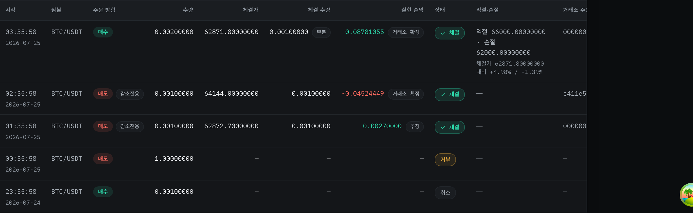
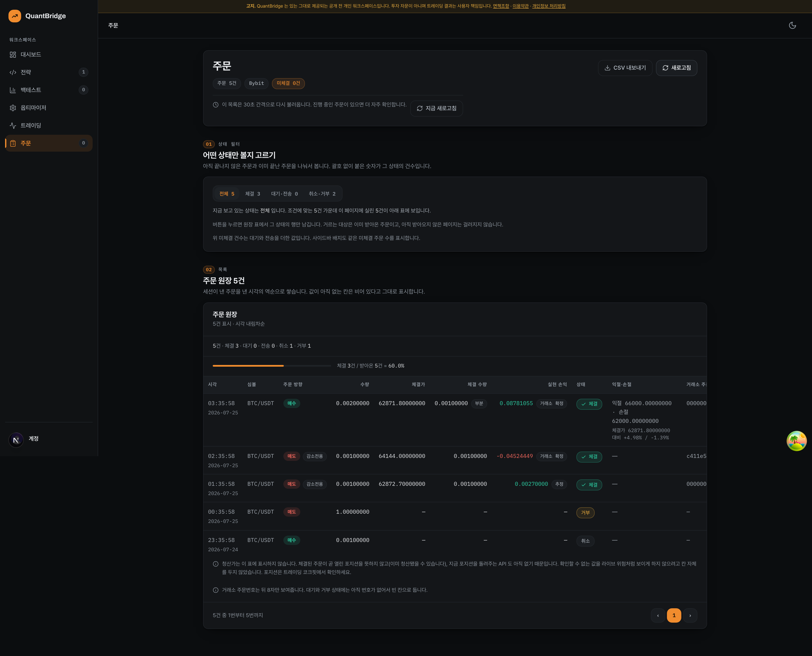

<!-- exit-attribution PR 증빙 스크린샷의 촬영 조건과 한계를 밝히는 문서 -->

# exit-attribution 증빙 스크린샷

## 촬영 조건

- **인증** — 레포의 Clerk `e2e/.auth/storageState.json` 을 주입한 실제 브라우저(Playwright chromium, 1920×1080, DPR 2).
- **대상** — 로컬 `http://localhost:3100/orders`.
- **결과** — 콘솔 error **0**, body 가로 스크롤 **false**.

## ★데이터 출처 (정직 고지)

이 스프린트 도중 **로컬 개발 DB 가 전소**했다(`docs/exit-attribution/context-notes.md` #6). 그래서 스크린샷은 **실거래 데이터가 아니라 촬영용 임시 데모 픽스처**로 찍었고, 촬영 직후 전량 삭제했다(DB 는 다시 비어 있다).

픽스처는 이번 변경이 겨냥한 5가지 상태를 한 화면에 담도록 구성했다.

| 행  | 상태                        | DB `realized_pnl`    | 화면에 보여야 하는 것                   |
| --- | --------------------------- | -------------------- | --------------------------------------- |
| 1   | `filled` (부분체결 + TP/SL) | `0.08781055`         | 값 + **거래소 확정** 배지 + **부분** 칩 |
| 2   | `filled` (synced)           | `-0.04524449`        | 값 + **거래소 확정** 배지               |
| 3   | `filled` (unsynced)         | `0.00270000`         | 값 + **추정** 배지                      |
| 4   | **`rejected`**              | **`-1007.70000000`** | **빈 칸** — 자금이 움직인 적 없다       |
| 5   | **`cancelled`**             | **`-1.00000000`**    | **빈 칸**                               |

4·5 행이 이번 수정의 핵심이다. 이전에는 두 행 모두 pine_v2 추정값이 "추정" 배지와 함께 손실처럼 표시됐다.

---

## 1. 주문 원장 — 체결되지 않은 주문의 추정 손익을 더 이상 노출하지 않는다



4·5 행(거부 `-1007.70000000` · 취소 `-1.00000000`)의 실현 손익이 **빈 칸**이다. 이전에는 두 행 모두 pine_v2 추정값이 "추정" 배지와 함께 손실처럼 표시됐다.

판정은 `displayRealizedPnl` 한 곳으로 모아 **화면·CSV·부호 톤이 공유**한다. 값만 숨기고 부호 톤이 남으면 여전히 손실처럼 읽히므로 톤도 같은 판정을 따른다. 감춘 셀에는 상태별 사유 `title` 을 붙였다.

## 2. CSV 내보내기 — 잃던 정보 3건 복원

같은 화면에서 실제로 내보낸 원본이 [`orders-export-sample.csv`](orders-export-sample.csv) 다.

```csv
"시각","심볼","주문 방향","수량","체결가","체결 수량","실현 손익","손익 출처","상태","익절·손절","거래소 주문번호","오류"
"2026-07-25 03:35:58","BTC/USDT","매수","0.00200000","62871.80000000","0.00100000 부분","0.08781055","거래소 확정","체결","익절 66000.00000000 · 손절 62000.00000000","00000005",""
"2026-07-25 02:35:58","BTC/USDT","매도 (감소전용)","0.00100000","64144.00000000","0.00100000","-0.04524449","거래소 확정","체결","","c411e5ae",""
"2026-07-25 01:35:58","BTC/USDT","매도 (감소전용)","0.00100000","62872.70000000","0.00100000","0.00270000","추정","체결","","00000002",""
"2026-07-25 00:35:58","BTC/USDT","매도","1.00000000","","","","","거부","","","provider_failure: position is zero"
"2026-07-24 23:35:58","BTC/USDT","매수","0.00100000","","","","","취소","","",""
```

- **손익 출처** 열 신설 — 회계·세무에 쓸 때 시뮬값과 정산값을 구분할 수 있다. 화면 12열 SSOT(`ORDER_TABLE_HEADER`)는 건드리지 않고 `ORDER_CSV_EXTRA_HEADER` 에서 왔다.
- **시각의 날짜 복원** — 기존엔 `HH:MM:SS` 만 실려 여러 날짜가 섞이면 CSV 만으로 정렬·대사가 불가능했다.
- **부분체결 마커** — 화면 칩과 같은 문자열.
- 거부·취소 행은 손익·출처 모두 빈 칸. 헤더 12열 == 각 행 12열(테스트로 강제).

## 3. `/orders` 전체 페이지


