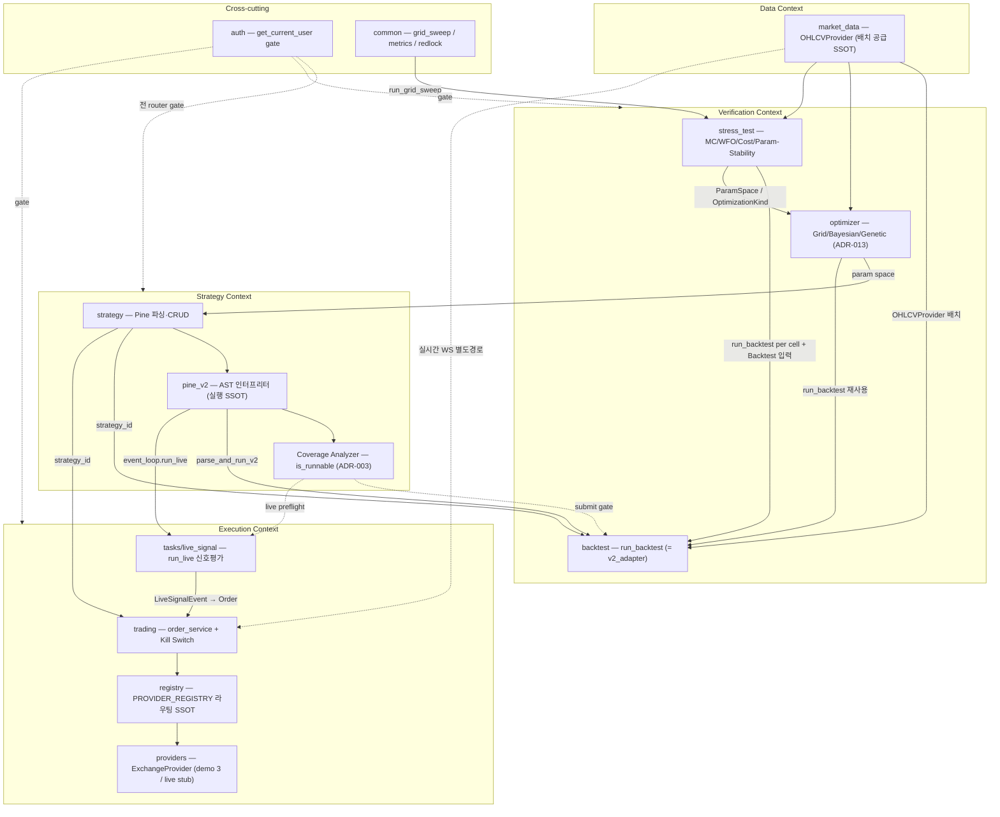

# QuantBridge — Stage 6 Zoom-Out 시스템 맵

> **목적.** verification loop(methodology Stage 0/2/4)의 capstone 인 Stage 6 "zoom-out" — 한 추상 계층 위로 올라가 관련 모듈과 호출자를 도메인 용어(CONTEXT.md SSOT)로 **코드 기반 매핑**한다. 2026-06-30 기준. 본 문서는 MAP 이며 audit 이 아니다 — 리팩터 제안은 하지 않는다(이미 BL-365~391 / ADR-021 로 등재됨). 모든 노드·edge 는 `backend/src/` 실제 코드(import·call site)로 ground 했다.

---

## 1. 도메인 모듈 맵

4 bounded context(Strategy / Verification / Execution / Data) + Cross-cutting. edge 는 실제 import·호출 site 다.

**읽는 법.** 굵은 화살표(`-->`)는 컴파일타임 import + 런타임 호출, 점선(`-.->`)은 gate / 별도 경로다. 핵심 축은 **pine_v2(실행 SSOT)** 와 **backtest run_backtest 엔진** 두 개로, Verification 3 모듈과 Execution live_signal 이 이 둘을 공유 재사용한다.

---

## 2. 모듈 깊이 요약

load-bearing 모듈(god-file / SSOT / dispatcher seam)만 수록한다. depth 표기 = 🟢 deep / 🟡 mixed / 🔴 shallow. 두 deepen dev-log(`2026-06-26-trading-deepen-2.md`, `2026-06-30-backtest-deepen.md`)의 판정과 정합하도록 reconcile 했다.

### 2.1 Strategy Context

| 모듈                        | 역할(도메인 용어)                            | LOC  | depth | 주요 caller                                |
| --------------------------- | -------------------------------------------- | ---- | ----- | ------------------------------------------ |
| `pine_v2/interpreter.py`    | pine_v2 AST 인터프리터 핵심(실행 SSOT)       | 1430 | 🟢    | v2_adapter, event_loop, virtual_strategy   |
| `pine_v2/stdlib.py`         | Pine 내장 함수 런타임(`ta.*` 등)             | 857  | 🟢    | interpreter                                |
| `pine_v2/coverage.py`       | Coverage Analyzer(`is_runnable`, ADR-003)    | 750  | 🟢    | backtest/service.submit, tasks/live_signal |
| `pine_v2/strategy_state.py` | StrategyState / Trade(가상 체결·포지션 상태) | 744  | 🟢    | v2_adapter, event_loop                     |
| `pine_v2/event_loop.py`     | `run_live` 라이브 bar 재생                   | 332  | 🟢    | tasks/live_signal                          |
| `strategy/service.py`       | Strategy CRUD + parse_status set             | 339  | 🟢    | strategy/router                            |

> Trust Layer(ADR-020) 회귀망 + pine_v2-deepen-pilot(2026-05-09, BL-200/201) 감사 완료 도메인 — 대형이지만 deep 으로 유지.

### 2.2 Verification Context

| 모듈                                    | 역할(도메인 용어)                                      | LOC | depth           | 주요 caller                                                |
| --------------------------------------- | ------------------------------------------------------ | --- | --------------- | ---------------------------------------------------------- |
| `backtest/engine/v2_adapter.py`         | `run_backtest_v2` god-file(orchestration+finance math) | 964 | 🟡 (BL-387~391) | backtest/service, **optimizer/engine, stress_test/engine** |
| `backtest/service.py`                   | Backtest submit gate + idempotency + sizing            | 914 | 🟡              | backtest/router                                            |
| `backtest/repository.py`                | PG advisory idempotency(Redis×PG 2-layer, ADR-021)     | 322 | 🟢              | service, optimizer, stress_test                            |
| `backtest/dispatcher.py`                | TaskDispatcher Protocol seam(Celery/Noop/Fake)         | 56  | 🟢              | service / dependencies                                     |
| `optimizer/engine/genetic.py`           | 자체 GA 탐색(`run_backtest` 재사용, ADR-013)           | 559 | 🟢              | optimizer/service                                          |
| `optimizer/engine/bayesian.py`          | scikit-optimize 탐색(`run_backtest` 재사용)            | 450 | 🟢              | optimizer/service                                          |
| `optimizer/engine/grid_search.py`       | Grid 탐색(`run_backtest` 재사용)                       | 287 | 🟢              | optimizer/service                                          |
| `stress_test/engine/walk_forward.py`    | Walk-Forward(매 fold `run_backtest` + 재최적화)        | 348 | 🟢              | stress_test/service                                        |
| `stress_test/engine/param_stability.py` | Param-Stability(`run_grid_sweep` + `run_backtest`)     | 220 | 🟢              | stress_test/service                                        |

### 2.3 Execution Context

| 모듈                                        | 역할(도메인 용어)                                         | LOC  | depth           | 주요 caller                          |
| ------------------------------------------- | --------------------------------------------------------- | ---- | --------------- | ------------------------------------ |
| `tasks/live_signal.py`                      | 라이브 신호 평가(`run_live`) → LiveSignalEvent            | 993  | 🔴 (BL-367)     | Celery beat                          |
| `tasks/trading.py`                          | Order execute/cancel/trailing Celery task                 | 1109 | 🟡              | trading dependencies/router `.delay` |
| `trading/providers.py`                      | ExchangeProvider 구현(demo 3 / BybitLive=stub)            | 1000 | 🟡 (BL-368~370) | registry, order_service              |
| `trading/models.py`                         | Order / LiveSignalSession / KillSwitchEvent + 8 exit 필드 | 584  | 🟡 (BL-370)     | 전 trading                           |
| `trading/services/order_service.py`         | Order 발주·취소 + Kill Switch 게이트 호출                 | 425  | 🟢              | trading/router, tasks                |
| `trading/websocket/bybit_private_stream.py` | fill 감지 supervisor(auth+reconcile)                      | 319  | 🟢              | ws_stream task                       |
| `trading/kill_switch.py`                    | Kill Switch 리스크 게이트(트리거별 scope)                 | 269  | 🟢              | order_service                        |
| `trading/registry.py`                       | PROVIDER_REGISTRY 라우팅 SSOT(3-tuple → Provider)         | 64   | 🟢              | order_service, dependencies          |

> `tasks/live_signal.py` 는 deepen-2(2026-06-26) 시점 776 LOC → 현재 993 LOC 로 증가(라이브 TP/SL Wave 누적). shallow-by-size 판정(BL-367)은 유효하며 악화됨.

### 2.4 Data + Cross-cutting

| 모듈                                 | 역할(도메인 용어)                       | LOC | depth | 주요 caller                               |
| ------------------------------------ | --------------------------------------- | --- | ----- | ----------------------------------------- |
| `market_data/providers/__init__.py`  | OHLCVProvider Protocol(추상 경계)       | 27  | 🟢    | backtest, optimizer, stress_test, trading |
| `market_data/providers/timescale.py` | TimescaleProvider(hypertable 배치 공급) | 117 | 🟢    | 운영 백테스트/최적화/스트레스             |
| `market_data/providers/ccxt.py`      | CCXT OHLCV 수집 + 자동 백필             | 188 | 🟢    | market_data_backfill task                 |
| `auth/dependencies.py`               | `get_current_user` 단일 인증 gate       | —   | 🟢    | 전 도메인 router(Depends)                 |
| `common/grid_sweep.py`               | `run_grid_sweep` 2D sweep SSOT          | 97  | 🟢    | stress_test, optimizer                    |
| `common/metrics.py`                  | Prometheus 계측 헬퍼                    | 323 | 🟢    | 전 도메인                                 |

---

## 3. 컨텍스트 경계 횡단 edge

실제 cross-domain 호출(coupling)을 source-of-truth 와 함께 나열한다.

- **auth → 전 도메인 router(인증 gate).** `auth/dependencies.py` `get_current_user` + `CurrentUser` 를 모든 보호 endpoint 가 `Depends`. SoT = `backtest/router.py:9`, `trading/router.py`, `strategy/router.py`, `optimizer/router.py`.
- **pine_v2 → backtest(실행 SSOT 주입).** `backtest/engine/v2_adapter.py:33` `parse_and_run_v2`, `:36` `StrategyState/Trade`, `:34` `fill_type_for`, `:35` `PineRuntimeError`.
- **pine_v2 → tasks/live_signal(라이브 평가).** `tasks/live_signal.py:365` `event_loop.run_live`, `:48` `coverage.analyze_coverage` — 같은 인터프리터로 라이브 신호 평가 → LiveSignalEvent(outbox) INSERT.
- **★ backtest 엔진 재사용 ← optimizer.** `optimizer/engine/{grid_search,bayesian,genetic}.py` 가 `from src.backtest.engine import run_backtest` + `BacktestConfig` + `BacktestRepository` + `config_mapper.build_engine_config_from_db`. Optimizer 는 param combo 마다 `run_backtest` 재실행.
- **★ backtest 엔진 재사용 ← stress_test.** `stress_test/engine/{walk_forward,param_stability,cost_assumption_sensitivity}` 가 매 cell `run_backtest()` 호출(`walk_forward.py:229`, `param_stability.py:175`, `cost_assumption_sensitivity.py:147`). 단 **Monte Carlo 는 완료 Backtest trades 를 재표집(bootstrap)** 하므로 엔진을 재실행하지 않는다. SoT = `backtest/engine/__init__.py:18` `run_backtest = run_backtest_v2`(= pine_v2 v2_adapter alias, ADR-011 정합 주석 명시).
- **stress_test → optimizer.** `stress_test/service.py:25-26` `OptimizationKind`, `ParamSpace`(Param-Stability sweep). + **stress_test → strategy**(`StrategyRepository`) + **stress_test → common.grid_sweep**(`run_grid_sweep`).
- **market_data OHLCVProvider → backtest / optimizer / stress_test / trading.** `market_data/providers/__init__.py` Protocol → TimescaleProvider(배치) / FixtureProvider(테스트). trading 은 OHLCV 를 실시간 WebSocket 별도 경로로 받음(CONTEXT.md Relationships).
- **trading → tasks(주문 enqueue).** `trading/dependencies.py:127` `execute_order_task.delay`(주문 발주), `trading/router.py:278` `cancel_order_task.delay`(submitted 취소 위임). order_service 자체는 주입된 dispatcher seam 으로 호출(직접 `.delay` 아님).
- **tasks/live_signal → trading(신호→주문).** LiveSignalEvent outbox(`pending → dispatched`) → order_service 가 Order 발주.
- **trading → registry → providers.** `trading/registry.py` PROVIDER_REGISTRY `(ExchangeName, ExchangeMode, has_leverage)` 3-tuple → ExchangeProvider dispatch(예: bybit·demo·leverage=True → BybitFuturesProvider).
- **Kill Switch gate.** `trading/kill_switch.py` + order_service 가 모든 Order 발주 전 평가(트리거별 scope 상이 — CONTEXT.md).
- **per-domain TaskDispatcher Protocol seam.** `backtest/dispatcher.py` · `stress_test/dispatcher.py` · `optimizer/dispatcher.py` 가 각자 `TaskDispatcher` Protocol + `CeleryTaskDispatcher`/`NoopTaskDispatcher`/`FakeTaskDispatcher` 정의. 실제 Celery task fn 은 `tasks/` 에 분리.

---

## 4. Stage 6 발견 — ADR / CONTEXT.md 갱신 필요성

ADR-001~021 전수 확인 결과 **번호 공백 없음**(013=Optimizer grammar / 019=Surface Trust Pillar / 020=Trust Layer CI / 021=backtest idempotency, 이번 세션 추가). 따라서 발견은 _ADR 누락_ 이 아니라 _CONTEXT.md / domain-overview 관계·다이어그램 완전성_ 위주다. 우선순위 순.

1. **[中] Verification 엔진 재사용 coupling 미문서화 (CONTEXT.md Relationships).** optimizer + stress_test 가 backtest 의 `run_backtest`(= `v2_adapter.run_backtest_v2`)를 per-combo / per-cell **재실행**한다(§3 ★ 2건). 그러나 CONTEXT.md Relationships 는 "Optimizer 는 Strategy 파라미터 공간 탐색", "Backtest 는 Stress Test 의 입력"만 기술하고, domain-overview §1 다이어그램도 `Opt → Str` / `BT → ST` 데이터 의존만 표기 — 실제 코드 coupling(엔진 자체 재사용)이 두 문서 모두에서 비가시다. **권고 = CONTEXT.md Relationships 에 "Optimizer / Stress Test 는 backtest `run_backtest`(pine_v2 SSOT)를 재실행한다" 1줄 추가.** ADR 신설 불필요(ADR-011 SSOT 의 자연 귀결). **이번 세션 BL-389(finance-math 추출) / BL-391(reconciliation oracle) / BL-388(metrics 4-SSOT)과 직접 연결** — v2_adapter 의 finance-math 를 추출하면 backtest·optimizer·stress_test **3 소비자 동시 영향**이라는 점이 등재 BL 에 반영돼야 한다.

2. **[中] domain-overview.md §1 다이어그램에 제거된 `exchange` subdomain 잔존 (residual drift).** 같은 문서 §2 표·§7 은 "exchange 제거됨(ADR-018)"인데 §1 mermaid 는 여전히 `Ex[exchange]` 노드 + `Trd-->Ex` + `Auth-->Ex` edge 를 보유해 **자기 모순**이다. CONTEXT.md Flagged ambiguities §3("exchange")는 `entities.md` ENT-009 만 "Phase 2 정정 완료"로 표기 → §1 다이어그램은 미포함(Stage 2 가 놓친 위치, 신규 발견). **권고 = §1 다이어그램에서 exchange 노드/edge 제거**(본 zoom-out 맵 §1 이 정정본 역할). Stage 2 영역과 인접하나 capstone 에서 명시.

3. **[低] TaskDispatcher = 단일 컴포넌트가 아니라 도메인별 Protocol seam (CONTEXT.md 용어).** §3 마지막 항목대로 backtest/stress_test/optimizer 각자 `TaskDispatcher` Protocol + Celery/Noop/Fake 구현을 보유하고 실제 task 는 `tasks/` 에 산다. domain-overview §4.3 은 "TaskDispatcher (Celery)" 단수로 기술해 seam 패턴(Fake 주입 테스트 격리)이 비가시다. **권고 = CONTEXT.md Cross-cutting 에 "TaskDispatcher = 도메인별 Celery enqueue Protocol seam(Fake 로 비동기 격리)" 용어 추가 고려.** 우선순위 낮음(구현 디테일에 가까움).

4. **[정직 보고] 그 외 material ADR / CONTEXT 누락 없음.** 라이브 lifecycle(LiveSignalSession / LiveSignalEvent / Order), Kill Switch 트리거별 scope, Provider 라우팅 3-tuple, Trailing Stop Intent / Bracket·OCO, Degraded Pine, Coverage Analyzer all-or-nothing 등 핵심 관계는 이미 CONTEXT.md(2026-06-30 codex gate 7건 보정 포함)에 반영됐고, ADR-021(idempotency dual-lock)이 이번 세션 backtest 결정 공백을 메웠다. **추가로 만들 ADR 은 없다.**

---

## 5. 요약

QuantBridge 는 **pine_v2 인터프리터(실행 SSOT)** 와 그 위의 **backtest `run_backtest` 엔진**을 두 축으로 하는 hub-and-spoke 구조다 — Verification 3 모듈(backtest/optimizer/stress_test)은 단일 엔진을 재사용하고, Execution 의 live_signal 은 같은 인터프리터로 라이브 신호를 평가한다. 도메인 경계는 대체로 깨끗하다(auth 단일 gate / market_data OHLCVProvider 단일 공급 / per-domain dispatcher seam / registry 라우팅 SSOT). 다만 "엔진 재사용" coupling 과 §1 다이어그램의 잔여 `exchange` 드리프트가 문서에서 비가시 — **코드는 건강하고, 문서가 한 박자 뒤처져 있다.** 깊이 부채는 이미 BL-387~391(backtest) / BL-365~371(trading) + ADR-021 로 등재됐으므로 본 맵은 추가 리팩터를 제안하지 않는다.

---

## 변경 이력

- **2026-06-30** — 초안 작성(verification loop Stage 6 zoom-out capstone). `backend/src/` import·call site 전수 ground + 2 deepen dev-log(trading-2 / backtest) reconcile + CONTEXT.md / domain-overview 대조. 코드 변경 0(docs-only).
