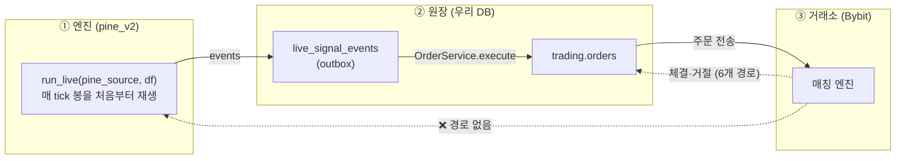

# ADR-023: 엔진 상태 SSOT — 재생이 아니라 영속 상태로, 거래소 현실을 되먹인다

> **상태:** **Proposed** (사용자 판정 대기 — Accepted 아님)
> **일자:** 2026-08-04
> ★**재판정 2026-08-05 — 상태는 Proposed 그대로, 긴급도만 다시 내렸다.** [ADR-025] 가 사망 5/5 를
> **상류에서** 닫았다. **본문을 읽기 전에 파일 끝 §재판정(2026-08-05) 을 먼저 읽어라** — 안 읽으면
> 「단방향 파이프 · 돌아오는 길 0곳」을 **현행**으로 읽게 된다(조건부 진입 체결 한 곳은 이제 돌아온다).
> **출처:** 2026-08-04 engine-state-ssot ([ADR-022] 대안 D 재개봉 + 선행연구 조사)
> **관련:** [`ADR-025`](025-conditional-fill-ownership.md) (조건부 진입 체결 소유권 — 본 ADR 을 **상류에서 축소**한다) ·
> [`ADR-022`](022-engine-position-ssot.md) (C 안 — 본 ADR 이 축소한다) ·
> [`ADR-020`](020-trust-layer-ci-design.md) (Trust Layer — 본 ADR 이 구멍을 지적한다) ·
> [`ADR-011`](011-pine-execution-strategy-v4.md) (pine_v2 = 백테스트 SSOT) ·
> [`ADR-003`](003-pine-runtime-safety-and-parser-scope.md) (Coverage all-or-nothing) · [BL-591]
> **코드:** [`event_loop.py:69`](../../backend/src/strategy/pine_v2/event_loop.py) (`run_historical`) ·
> `event_loop.py:366` (`run_live`) · `event_loop.py:192` (주입점) ·
> [`strategy_state.py:265`](../../backend/src/strategy/pine_v2/strategy_state.py) (필드 정의) ·
> `strategy_state.py:310` (`discard_state_before_epoch`) · `:331` (`seed_positions_from_ledger`) ·
> [`interpreter.py:310`](../../backend/src/strategy/pine_v2/interpreter.py) (상태 주입 seam) ·
> [`live_signal.py:2528`](../../backend/src/tasks/live_signal.py) (`run_live` 호출)

---

## 배경 — 파이프가 단방향이다

`run_live(strategy.pine_source, df, ...)`(`live_signal.py:2528`)는 **전략 코드와 가격 데이터만**
받는 순수 함수다. 매 tick 봉을 처음부터 재생해 포지션을 **추론**하며, 거래소가 무슨 답을 하든
들을 귀가 없다.



**돌아오는 길이 0곳이다.** 체결을 원장에 쓰는 자리는 **6곳**이다 — `live_signal.py:998` ·
`conditional_entry_janitor.py:130` · `trading.py:472` · `trading.py:820` ·
`websocket/reconciliation.py:234` · `websocket/state_handler.py:236`. 그중 **엔진으로 돌아가는
것은 하나도 없다.**

**비대칭의 뿌리 — 시뮬의 체결은 보장이고 거래소의 체결은 아니다.** 엔진의 `check_pending_fills`
는 `low <= stop` 이면 **무조건** 체결로 친다. 거절이라는 개념이 없다. 코드가 직접 적고 있다
(`conditional_entry_planner.py:418`):

> 시뮬은 `low <= stop` 으로 즉시 체결로 보는데 거래소는 long RISE는 `110092`("expect Rising"),
> short FALL은 `110093`("expect Falling")으로 거부한다.

그래서 어긋남이 한쪽으로 쏠린다 — [ADR-022] 가 이미 잰 숫자다: `engine_only` **314** vs
`exchange_only` **21**. **15 대 1** 로 엔진이 현실보다 앞서 달린다(유령을 든다).

> ★★★**이 둘은 「누적 총계」이고 `engine_only` 채널은 이미 닫혔다.** 라이브 노출 시간 기준
> **18.8/h(창 A) → 0.12/h(창 B) = 157배 감소**이며, 창 B 의 기대값 157건 대비 관측 **1건**이다.
> **반드시 §선행 측정 §분해 완료를 먼저 읽어라** — 이 문장을 「지금 병이 그쪽에서 난다」로 읽으면
> **닫힌 채널을 겨냥해 설계하게 된다.** 살아 있는 채널은 `direction` 계열 하나다.
>
> ★★★**그리고 그 `direction` 조차 한 현상이 아니다** — §재분해가 **무해 7 : 치명 4** 로 갈랐고,
> 치명 갈래는 [BL-590] 수리 뒤 **6.12 라이브시간 0건**이다(95% 상계 0.49/h — 「닫혔다」는 아니다).
> **§재분해를 안 읽고 「≈0.5/h 니까 급하다」로 읽으면 다수가 무해인 rate 를 근거로 삼게 된다.**

**이것이 증상 16건을 Resolved 하고도 병이 그대로인 이유다.** 순수 재생이 현실을 못 보는 한
어긋나는 방법의 가짓수에 끝이 없다.

---

## 결정 (Proposed)

**엔진 포지션의 소유자를 전략 밖으로 옮기고, 거래소 현실을 그리로 되먹인다.**

```
포지션 소유자 = 실행/포트폴리오 레이어 (영속 · 거래소 이벤트로 갱신)
        ↓ 매 평가 직전 **권위 있게** 주입
pine_v2 인터프리터가 그 값을 strategy.position_size 로 읽는다
        ↓
백테스트: 같은 주입점을 **시뮬 브로커**가 먹인다 → 코드 경로 동일, 공급자만 다름
```

★**주입점은 이미 있다** — `event_loop.py:192` 의 `seed_positions_from_ledger()`
(`strategy_state.py:331`). 바꿀 것은 **위치가 아니라 권한**이다. [ADR-022] 는 이 함수를 만들어
놓고 첫 줄에서 잠갔다(`strategy_state.py:357`):

```python
if not legs or self.open_trades: return ()   # 「엔진이 완전히 빈 순간에만」
```

본 ADR 은 이 조건을 **「항상, 권위 있게」**로 연다. 대칭 연산 `discard_state_before_epoch()`
(`:310`, 재생이 지어낸 포지션 삭제)도 이미 있다.

---

## 근거 — 우리는 구조적으로 예외다 (선행연구, 2026-08-04 조사)

|                    | 포지션 소유자                                     | 전략의 정체                       |
| ------------------ | ------------------------------------------------- | --------------------------------- |
| **NautilusTrader** | `ExecutionEngine` + `Cache` (이벤트 소싱, 영속)   | 명령 송신 / 이벤트 수신 액터      |
| **Freqtrade**      | `Trade` DB 행                                     | **가격 데이터프레임의 순수 함수** |
| **QuantBridge**    | ★**`StrategyState.open_trades` — 매 tick 재계산** | 가격의 순수 함수                  |

**Freqtrade 가 우리와 구조가 거의 같다** — 전략이 가격 데이터의 순수 함수다. 그런데 라이브 루프의
첫 두 줄이 「Fetch open trades **from persistence**」·「Update trades open order state **from
exchange**」다. 포지션을 전략 밖 DB 에 두고 거래소 현실을 그리로 먹인다. 전략은 **읽기만** 한다
(`Trade.get_trades_proxy(...)`), 그리고 **그 읽기 경로는 라이브 전용**이다(백테스트에선 빈 결과).

### 우리가 「죽이는」 상황이 그쪽에는 이름 붙은 정규 시나리오다

NautilusTrader startup reconciliation 표에서:

> **Position side flip** — Internal position opposite of venue (internal 100 long, venue 50 short)
> → _Generates LIMIT order to close internal and open external position._

이것이 우리 `direction` 발산이다. **우리는 세션을 죽이고, 그쪽은 맞추는 주문을 낸다.** 가격
우선순위까지 정해져 있다: 계산된 조정가 → 시장 mid → 현 평균가 → (최후) MARKET.

### [BL-591] 의 「유도 함수 재설계」에 쓸 알고리즘이 공개돼 있다

우리 `derive_open_position` 은 `trade_id` 로 진입/청산을 짝지으려다 반전에서 깨진다(§실측 참조).
NautilusTrader 는 **짝짓기를 하지 않는다**:

> Detects **zero-crossings** (position qty crosses through FLAT) to identify separate lifecycles.
> Adds **synthetic opening fills** when the earliest lifecycle is incomplete. Replaces a mismatched
> current lifecycle with a synthetic fill reflecting the venue position.

부호 있는 순수량이 0을 지나는 지점이 생애주기 경계다. ⇒ **`trade_id` 재사용과 배수량 반전에
구조적으로 면역이다.** 2026-08-04 소크의 체결 사슬(−0.029 → +0.029 → −0.029 → +0.029)은 반전마다
0을 지난다.

### 우리가 데어가며 배운 것들이 그쪽엔 설정 항목이다

- **Recent order protection**(`open_check_threshold_ms`) — 「최근 이벤트가 창 안이면 조정을
  건너뛴다. 거래소가 아직 처리 중인 경합에서 **거짓 양성**을 막는다」 ⇒ [BL-590] 교훈 그대로
  (가드는 발주 시각에 옳았고 거래소가 2.1초 뒤 자기 시각으로 거절했다).
- **Targeted query safeguard** — terminal 「not found」 적용 전 **단건 조회로 한 번 더** 확인.
- **In-flight timeout 해소표** · 재시도 카운터 loop 별 분리 · 단건 조회 throttle.
- **실패 처리** — 「조정이 실패하면 로그를 남기고 **기동하지 않는다**」. ★우리는 반대다 —
  자유롭게 기동하고 **런타임에 죽는다**.

> ★**용어 주의** — QuantConnect Lean 의 "Reconciliation" 문서는 **다른 뜻**이다(백테스트 대
> 라이브 _성과_ 괴리). 본 ADR 의 reconciliation 과 혼동하지 마라.

---

## 순환 기각 3건 — [ADR-022] 가 전제로 삼은 것이 결함 그 자체였다

**1. 대안 D(「조정 연산 정의」) 기각** — [ADR-022] 원문:

> **D. 조정 연산 정의** — 엔진에 쓸 자리가 없으므로 결국 같은 주입점을 쓴다. **C 의 부분집합.**

「쓸 자리가 없다」는 **결함 그 자체**이지 넘을 수 없는 경계가 아니다. `run_live` 가 상태를 못 받는
것은 자연법칙이 아니라 우리가 그렇게 짠 결과다. **고칠 수 있는 성질을 고정된 경계로 취급했고**,
그래서 남은 선택지가 전부 「이음매에 끼워넣기」 아니면 「세션 죽이기」가 됐다.

**2. 「백테스트와 라이브가 갈라진다」** — NautilusTrader:

> **Only the `LiveExecutionEngine` performs reconciliation, since backtesting controls both sides.**

백테스트는 시뮬 거래소와 엔진이 **같은 것**이라 조정할 대상이 없다. 조정은 **라이브 전용
레이어**이지 엔진의 분기가 아니다. ★**단 이것은 「위험이 작다」가 아니다** — §대가 2 가 더 나쁜
사실을 보인다. 정확한 문장은 **「엔진을 포크할 필요는 없다. 그러나 갈라짐을 잡을 CI 는 지금
0개다」**이다.

**3. 「합성 주문 행이 머니-패스 원장을 오염시킨다」**([ADR-022] 가 「구멍부터 메우는 선행
슬라이스」를 기각한 근거) — NautilusTrader 는 **정확히 그것을 한다.** 다만 **꼬리표를 붙인다**:
`strategy_id=EXTERNAL`, `tag=RECONCILIATION`. 진짜 주문과 절대 섞이지 않는다.
⇒ 우리가 기각한 것은 **기법이 아니라 꼬리표 없는 구현**이었다.

---

## 폭발 반경 실측 (2026-08-04, 읽기 전용 조사)

### 1. Pine 쪽은 작다 — 개편이 가능한 근거

| 항목                                      | 실측                                                                                                                                                            |
| ----------------------------------------- | --------------------------------------------------------------------------------------------------------------------------------------------------------------- |
| 포지션을 읽는 Pine builtin                | **3개** — `strategy.position_size` / `position_avg_price` / `equity`                                                                                            |
| 그 읽기 지점                              | **6곳**, 전부 `interpreter.py:1318-1327` + `:1347-1356` (`_eval_name`/`_eval_attribute` 대칭 중복 2벌)                                                          |
| `strategy.opentrades`·`netprofit` 등      | **미구현** — `coverage.py:329-336` `_STRATEGY_ATTRS` 가 5개뿐이라 그런 스크립트는 **전체 Unsupported** ([ADR-003](003-pine-runtime-safety-and-parser-scope.md)) |
| 직렬화 구조적 장애물                      | **0건** — 콜백·인터프리터 역참조·순환참조 전무. 전부 primitive/dataclass. `ExitOrderKind` 는 `StrEnum`                                                          |
| 상태 주입 seam                            | `interpreter.py:310` (`self.strategy = StrategyState()`)                                                                                                        |
| `run_live` 가 `StrategyState` 를 바꾸는가 | **안 바꾼다 — 읽기만.** `event_loop.py:559-562` 주석 + `tests/strategy/pine_v2/test_run_live.py:239-262` mutation oracle 이 강제                                |
| 진짜 「진실」 필드                        | **7개** — `open_trades` `closed_trades` `pending_orders` `pending_exits` `events` `running_equity` `pending_market_intents` (나머지 10개는 설정 8 · 진단 2)     |

⇒ **「Pine 은 전략이 포지션을 소유한다는 의미론이라 못 뺀다」는 우려는 6곳짜리 seam 이다.**

### 2. ★Trust Layer 는 라이브를 아예 안 잰다 — 개편의 진짜 위험

| 항목                              | 실측                                                                                                                         |
| --------------------------------- | ---------------------------------------------------------------------------------------------------------------------------- |
| Trust Layer 실체                  | 3파일 / **23 테스트 함수** — `test_pynescript_baseline_parity.py` · `test_trust_layer_parity.py` · `test_mutation_oracle.py` |
| 그중 `run_live` 를 부르는 것      | **0건.** 전부 `run_backtest_v2` / `parse_and_run_v2`                                                                         |
| [ADR-020] 에 live parity 요구     | **없음** (문서 전문에 `run_live` 0건)                                                                                        |
| `ci.yml` 의 전용 Trust Layer step | **없음** — `ci.yml:128-131` 은 주석뿐이고 `:139` 전체 pytest 에 섞여 돈다                                                    |

⇒ **라이브 엔진에 상태가 생겨도 CI 는 구조적으로 green 이다.** 「CI 가 갈라짐을 잡아줄 것」은
거짓이다. **개편이 깨뜨릴 첫 대상은 백테스트 골든이 아니라 「라이브가 전략+OHLCV 만으로
재현된다」는 계약이고, 그것을 지키는 CI 는 현재 0개다.**

### 3. [ADR-022] §「골든은 안 깨진다」 검증 결과

- **주장은 참이다** — `ledger_seed_legs`·`position_epoch`·`emit_from_bar_time` 를 아는 `src` 파일은
  **2개**(`event_loop.py`, `live_signal.py`)뿐이고 채우는 곳은 `live_signal.py:2505/2508/2512`.
  `v2_adapter`·`compat`·`track_runner`·`backtest/service`·`optimizer/**`·`stress_test/**` 전부 0건.
- **회귀 테스트는 실재한다** — `backend/tests/strategy/pine_v2/test_ledger_seed_isolation.py`
  (75줄, 테스트 3개). ★단서 둘: **⑴ `origin/main` 에 없다**(PR #539 미머지 → main CI 미집행)
  **⑵ `ledger_seed_legs` 단일 심볼만 지킨다**(`:31`) — `position_epoch`/`emit_from_bar_time` 무방비.
- 「백테스트와 라이브가 같은 엔진」은 **`run_historical` 한 함수에 한정된 진술**이다. `run_live` 는
  `v2_adapter`/`compat`/`track_runner` 를 **하나도** 공유하지 않고 Track 분류도 하지 않는다
  (Track A 는 라이브 경로가 아예 없다).

---

## 대가 — 판정 가능한 형태로 (이 절이 이 ADR 의 존재 이유다)

### R1 ★★★ float 오차 누적 — 아무도 이름 붙이지 않았던 위험

`event_loop.py:595-604` 의 실측: `0.02953691 + 0.02946167 → 0.058998579999999995`.

**지금은 매 tick warmup replay 가 이 오차를 매번 리셋한다.** 상태를 영속화하면 **리셋이 사라져
단조 누적된다.** ⇒ **우리가 없애려는 replay 가 우연히 오차 청소부 역할을 하고 있었다.**

대안 설계(택1 또는 조합, **본 ADR 이 Accepted 되기 전에 정해야 한다**):

| 안                  | 내용                                              | 비용                                    |
| ------------------- | ------------------------------------------------- | --------------------------------------- |
| (a) 주기적 재정규화 | N tick 마다 원장에서 재유도해 스냅샷을 갈아끼운다 | replay 를 완전히 버리지 못한다          |
| (b) Decimal 승격    | 수량·가격을 `Decimal` 로                          | `strategy_state.py` 전면 float — 광범위 |
| (c) 스냅샷 재계산   | 영속 시 원장 기준으로 수량을 재양자화(qty_step)   | 양자화 기준이 거래소 정밀도에 종속      |

★**repo 규약과 충돌한다** — `.ai/stacks/fastapi/backend.md` §2 「Decimal-first, float 금지」 대
`strategy_state.py` 전면 float. 지금은 `ExitOrder` docstring(`:99`)이 명시적 예외를 선언한 상태다.

### R2 `to_report()` 는 round-trip 불가 — 새 영속 표현이 필요하다

`strategy_state.py:1129-1141` 이 내보내는 것은 **9키**뿐이고 `events`·`pending_orders`·
`pending_exits`·`running_equity`·`initial_capital`·`leverage`·`fill_timing`·`sessions_allowed`·
`pyramiding`·`default_qty_*` 는 **전량 유실**된다. `Trade.to_dict()`(`:194-206`)도 `exit_kind`·
`liq_price`·`margin_used` 를 뺀다. ⇒ **현재 DB 의 `last_strategy_state_report`
(`trading/models.py:576`)로는 상태 복원이 불가능하다.**

### R3 `events` 가 outbox 의 유일 소스다

영속화 시 재시작에서 이어지는가 새로 시작하는가가 미정이고, `_next_sequence_no`
(`strategy_state.py:442-444`)가 **매번 전체 스캔 O(n)** 이라 영속 리스트에서 비용·의미 모두 미정.
★**여기를 틀리면 라이브 주문이 아예 안 나가거나 중복 발주된다.**

### R4 Track A 병렬 경로

`virtual_strategy.py:133-160, 203-243` 이 `run_historical` 을 안 타고 `StrategyState` 를 직접
조립·구동한다. **함께 고치지 않으면 조용히 갈라진다.**

### R5 `strategy.position_size` 의 within-bar 즉시성 **[추론]**

`strategy.entry()` 직후 같은 bar 에서 읽는 값이 지금은 즉시 반영된다. 외부 소스로 바꾸면 stale
해질 수 있다 — `strategy_state.py:663-686` docstring 이 경고한 「`position_size == 0` 영구 False」
계열 dogfood 버그가 다른 원인으로 재현될 수 있다.

### R6 NaN 오염 — 직렬화가 이미 lossy 하다

flat 일 때 `position_avg_price` 가 `float("nan")`(`strategy_state.py:601,604`)이고
`_sanitize_for_jsonb`(`live_signal.py:175-198`)가 `None` 으로 죽여 통과시키고 있다.

### R7 재현성 손실

라이브가 「전략 + OHLCV」만으로 재현되지 않는다. [ADR-022] 가 이미 경고한 것의 **강한 버전**이다.

### R8 멱등성 — 없애는가 옮기는가

[ADR-022] 가 「원장 전면 덮어쓰기」를 기각한 근거는 「재생이 스스로 만든 포지션과 원장이 섞여
이중 계상」이었다. **상태 영속화는 재생 자체를 없애므로 이 문제를 없앤다** — 다만 그 자리에
「영속 상태 vs 원장」 정합이라는 **새 문제**가 온다. **[확인 필요]** — 슬라이스 설계에서 명시할 것.

> ★**부수 관찰 — 선례가 있다.** 누적 통계(`total_closed_trades`/`total_realized_pnl`/
> `last_bar_time`)는 **이미 엔진 밖 원장으로 이관됐고 반환값이 미사용**이다
> (`live_signal.py:2838-2841`). 「엔진 밖으로 진실을 옮긴다」는 이 레포에서 처음이 아니다.
>
> ★`discard_state_before_epoch`(`:310`)와 `seed_positions_from_ledger`(`:331`)는 둘 다
> **replay 아키텍처의 부산물**이다. 상태가 영속되면 존재 이유가 사라진다.

---

## P-live parity 층 (본 ADR 이 함께 정의해야 하는 것)

§폭발 반경 2 가 「CI 는 구조적으로 green」임을 확정했으므로, **갈라짐을 잡을 층을 개편과 같이
만든다.** 최소 요구:

1. **`run_live` 를 실제로 부르는 골든** — 현재 Trust Layer 23개 중 0개.
2. **상태 round-trip 불변식** — `serialize(deserialize(s)) == s` (R2 를 집행한다).
3. **격리 화이트리스트 확장** — `test_ledger_seed_isolation.py:31` 의 단일 심볼을
   `position_epoch`·`emit_from_bar_time` 까지 넓힌다(현재 무방비).
4. **`origin/main` 집행** — 위 테스트가 main 에 들어가야 CI 가 계약을 집행한다.

---

## ★선행 측정 — 설계 확정 전 필수 (읽기 전용이라 소크와 공존한다)

### ★★★먼저 — **314 는 과거 누적이고 지금은 휴면 중이다** (2026-08-04 회차 말 실측)

`.soak/snap-*.txt` **32벌 전량**(2026-08-03 09:53Z → 08-04 04:26Z = **18.5시간**) 차분:

| category                  | 시작 | 끝  | 차분   |
| ------------------------- | ---- | --- | ------ |
| `engine_only`             | 314  | 314 | **0**  |
| `exchange_only`           | 21   | 21  | **0**  |
| `size`                    | 28   | 28  | **0**  |
| `engine_only_unexplained` | 1    | 1   | **0**  |
| `probe_failed`            | 2    | 2   | **0**  |
| **`direction_transient`** | 15   | 24  | **+9** |

★**18.5시간 동안 움직인 것은 `direction_transient` 하나뿐이다**(≈0.5/h). 나머지는 전부 **정지**.
⇒ **§배경의 「`engine_only` 314 vs `exchange_only` 21, 15 대 1」은 누적 총계의 비율이지 현재
발생률이 아니다.** 그 문장을 「지금 병이 그쪽에서 나고 있다」로 읽으면 안 된다.

**[가정] 왜 멈췄나 — [BL-589]/[BL-590] 이 그 채널을 닫았을 수 있다.** `engine_only` 는 「엔진이
유령을 든다」이고, 두 수리가 정확히 그 생성 경로를 겨냥했다(계획기가 시장가 전환을 잘못 껐다 /
거절 뒤 복구가 없었다). **[확인 필요]** — 314 의 시각 분포를 원장·로그로 뽑아 수리 시각 전후로
갈라라. 그것이 아래 원인 분해의 **첫 질문**이다.

★**이 사실이 바꾸는 것과 안 바꾸는 것을 합치지 마라.**

- **안 바뀜** — 단방향 파이프는 구조적 사실이고, `direction_transient` 가 계속 나는 것이 그 증거다
  (양쪽 non-flat + 정반대 = C 의 주입 조건인 「엔진 flat」이 **아니다**).
- **바뀜** — 본 ADR 의 **긴급도**. 살아 있는 채널이 `direction` 계열 하나라면, 수리의 대상은
  「유령 포지션 제거」가 아니라 **「반전 시 거래소가 못 따라오는 구간」**이다.
- **바뀜** — 다음 회차의 **측정 방법**. `engine_only` 는 라이브에서 관측할 수 없다(0/18.5h).
  **과거 원장·워커 로그 재생**이 유일한 길이다.

### ★★★분해 완료 (2026-08-04 후속) — **채널은 닫혔다. 157배 감소.**

「314 가 언제 쌓였나」를 원장·로그로 갈랐다. **워커 로그 39.5시간**(08-02 13:21 → 08-04 04:54)에
`engine_only` 문자열이 **0회**다. 그런데 「39.5시간」은 오해를 부른다 — 이 발산은 **세션이 돌 때만**
발화하므로 **라이브 노출 시간**으로 재야 한다.

| 창                                            | 라이브 시간        | `engine_only` 계열   | 발생률     |
| --------------------------------------------- | ------------------ | -------------------- | ---------- |
| **A** counter 출생(07-28 12:19) → 08-01 11:52 | **16.72h**(14세션) | **314**              | **18.8/h** |
| **B** 08-01 11:52 → 2026-08-04 04:54          | **8.35h**(8세션)   | **1**(`unexplained`) | **0.12/h** |

**무변화 가정 시 창 B 의 기대값은 157건인데 관측은 1건이다.** 단일 세션으로도 반증된다 —
`4bf679af`(163분) 하나만으로 기대 51건인데 0건이었다. ★창 A 의 18.8/h 는 [BL-566] 이 독립적으로
잰 41.6/h → 12.9/h 와 같은 자릿수라 **두 계측이 서로를 교차검증한다.**

★**라벨이 옮겨간 것이 아니라 현상이 멈췄다.** `_subclassify_engine_only_divergence`
(`live_signal.py:772`)는 **`None` 을 반환하지 않는다** — 조회 실패면 `engine_only`(raw), 기대 방향의
세션 소유 대기 진입이 있으면 `engine_only_awaiting_trigger`, 없으면 `engine_only_unexplained` 다.
현상이 계속됐다면 `awaiting_trigger` 가 자랐어야 하는데 **그 series 가 `/metrics` 에 아예 없다**
(prometheus multiprocess 는 `.inc()` 한 번이면 series 가 생긴다). ⇒ **미발화 확정.**

**무엇이 닫았나 — `#515` 가 유력하다 [확인 필요].** 경계 08-01 의 커밋 둘:

| 커밋                                                   | 성격                                                                               | 판정                                                                                         |
| ------------------------------------------------------ | ---------------------------------------------------------------------------------- | -------------------------------------------------------------------------------------------- |
| `a6d891b1` **#515** 08-01 01:02 — [BL-560] 뿌리 재확정 | **행위 변경**(`live_signal.py` +277 · `trading.py` +233 · `strategy_state.py` +40) | **유력** — 체결을 그 자리에서 원장에 기록. 그 커밋이 「원장이 낡은 채로 돌았다」고 적고 있다 |
| `51f8e51d` **#516** 08-01 11:52 — [BL-566] 갈래 분화   | **계측만**(`live_signal.py` +104 = 분류기)                                         | ★**인과 불가** — 계측이 행위를 못 바꾼다. 재라벨이었다면 `awaiting_trigger` 가 자랐어야 한다 |

★★**「[확인 필요]」를 「관측 판정 불가」로 닫는다** — 두 커밋 사이(08-01 01:02 ~ 11:52)에 **라이브
세션이 0건**이다(실측). 그 구간에 **노출이 없었으므로 어떤 관측 데이터로도 둘을 가를 수 없다.**
남는 근거는 연역뿐이고 그것이 위 표의 「#516 인과 불가」다. ⇒ **다음 사람은 이 귀속을 데이터로
다시 캐지 마라 — 데이터가 없다.** 굳이 확정하려면 #515 의 diff 를 읽고 기전을 논증하는 수밖에
없는데, **본 ADR 의 결론(표적 = `direction`)은 귀속과 무관하므로 그 비용을 치를 이유가 없다.**

### ★본 ADR 에 대한 함의 — 죽지 않지만 **표적이 바뀐다**

- **안 바뀜** — 단방향 파이프는 구조적 사실이고, `direction_transient` 가 계속 나는 것(+9/18.5h)이
  그 증거다(양쪽 non-flat + 정반대 = C 의 주입 조건인 「엔진 flat」이 **아니다**). 그리고
  **`position_divergence` 사망 2건이 모두 창 B 안의 `direction` 경로**다.
- **바뀜 — 표적.** 수리의 대상은 「유령 포지션 제거」가 **아니라** **「반전 시 거래소가 못 따라오는
  구간」**이다. §배경의 「15 대 1」을 근거로 슬라이스를 짜면 **닫힌 채널을 겨냥하게 된다.**
- **바뀜 — 긴급도.** 살아 있는 채널이 `direction` 계열 하나이고 그 발생률이 ≈0.5/h 다.
  ★**이 줄은 아래 §재분해가 정정한다** — 그 ≈0.5/h 는 **벽시계 rate 이고 다수가 무해**다.

### ★★★재분해 (2026-08-04 3차) — `direction` 은 **한 현상이 아니다**

위 §함의는 「살아 있는 채널 = `direction` 계열」에서 멈췄다. **그 채널을 한 겹 더 갈랐다.**
워커 로그 41시간의 `direction` 관측 **11건 전량**을 원장 체결과 대조한 결과, 이것은 **부호가
반대인 두 현상**이고 「마지막 체결로부터의 경과 시간」으로 **겹침 없이** 갈린다.

| 갈래               | n     | 마지막 체결로부터  | 누가 앞서나                            | 자가치유 | 사망    |
| ------------------ | ----- | ------------------ | -------------------------------------- | -------- | ------- |
| **A** `replay_lag` | **7** | 0.59 – **24.7초**  | **거래소가 앞섬** — 엔진이 못 따라온다 | **7/7**  | 0       |
| **B** `phantom`    | **4** | **909초** – 2336초 | **엔진이 앞섬** — 주문이 거래소에 없다 | **0/4**  | **2/2** |

**경계가 37배 벌어져 있고 겹치는 관측이 하나도 없다**(24.7초 vs 909초). 산술도 정확히 닫힌다 —
11 = `direction_transient` **+9** + 하드 킬 **2** (9 = A 7건 + B 각 쌍의 **첫** 관측 2건).

**A 는 결함이 아니라 구조다.** 조건부(stop) 주문은 **봉 중간에 거래소에서 체결**되고 엔진은
닫힌 봉만 재생하므로(`ccxt.py:145` 가 진행 중 봉을 잘라낸다) 다음 봉 마감까지 그걸 못 본다.
`live_signal.py:2705-2714` 가 이미 이 현상을 적어 두었고 `direction_transient` 는 **바로 이걸
흡수하려고** 있다. 실측 **반전 28건 중 7건(25%)** 에서 정상적으로 난다.

**B 가 사망의 전부다.** 엔진 시뮬이 체결로 친 진입이 거래소에 **아예 없다** — [BL-589] 「계획기가
진입을 드롭」과 [BL-590] 「거래소가 거절했는데 복구가 없었다」가 각각 한 쌍씩이다.

#### ⇒ 이 ADR 의 긴급도 근거가 바뀐다

| 종전 기재                 | 실측 정정                                                                       |
| ------------------------- | ------------------------------------------------------------------------------- |
| 「살아 있는 채널 ≈0.5/h」 | **다수가 무해**다. 치명 갈래만 세면 아래 표다                                   |
| ≈0.5/h (9건/**18.5시간**) | ★**벽시계 rate 다.** 같은 문서가 `engine_only` 는 노출 시간으로 재라고 요구했다 |
| —                         | **노출 기준 1.27/h**(9건/**7.1 라이브시간**) — 다만 그 대다수가 A               |

**치명 갈래(B) 발생률, 노출 시간 기준:**

| 창                           | 라이브 시간 | `phantom` | 발생률     |
| ---------------------------- | ----------- | --------- | ---------- |
| [BL-590] 수리 **전** (3세션) | **2.85h**   | **4**     | **1.40/h** |
| [BL-590] 수리 **후** (2세션) | **6.12h**   | **0**     | **0**      |

무변화 가정 시 기대 **8.6건** 대비 관측 **0건**. ★**그러나 「닫혔다」고 쓰지 않는다** —
0건/6.12h 의 **95% 상계는 0.49/h** 로, 여전히 **2시간에 한 번 죽는** 세계와 양립한다.
상계를 0.25/h 로 낮추려면 **6.1 라이브시간이 더** 필요하다.

#### 판별식 — 타이밍 대리 지표를 인과 판정으로 바꾼다

엔진의 가시 지평은 `horizon = last_bar_time + interval = floor(평가시각, interval)` 이다
(`ccxt.py:145` 가 `last_closed_ts = (now // tf) * tf - tf`, `live_signal.py:2299` 가 그 시가
시각을 `last_bar_time` 으로 쓴다). 세션 소유 최신 체결 `t_fill` 에 대해:

| 조건                | 라벨                                             |
| ------------------- | ------------------------------------------------ |
| `t_fill >= horizon` | `direction_replay_lag` — 엔진이 **아직 못 봤다** |
| `t_fill <  horizon` | `direction_phantom` — 엔진이 **보고도 어긋난다** |
| 세션 소유 체결 없음 | `direction_unattributed`                         |

★**판별식은 한쪽으로만 틀린다.** `Order.filled_at` 은 거래소 체결시각이 아니라 **우리
관측시각**이다(`order_repository.py:53,107,129,212`). 우리 값이 항상 더 늦으므로 판별식은
**`phantom` 을 과소계상하고 `replay_lag` 을 과대계상하지 않는다.** ⇒ **`phantom` 라벨은
신뢰할 수 있다**(거짓 사망을 만들지 않는다). 실측 최소 여유는 **0.652초**라 경계는 실제로 붙는다.

★**세션 귀속은 `idempotency_key` 로 한다** — `trading.orders` 에 `session_id` 가 없고, 계정으로
귀속하면 [BL-592] 의 `exchange_accounts` 2행 중복에 걸려 **3.7배 부풀려진다.**

#### 오라클 — `backend/scripts/classify_direction_divergence.py`

프로덕션 코드를 import 하지 않는 독립 오라클로 11건을 재판정했다. **사망 상관 2/2 ·
`replay_lag` 생존 7/7 · 봉경계식 vs 시간문턱식 불일치 0건.**
★**적합은 검증이 아니다** — 판별식을 이 11건에서 유도했으므로, 독립적인 것은 **사망 상관**
하나뿐이고 나머지는 **전향 예측**으로만 갚는다(`docs/status.md` 사전등록).

#### 사용자 판정 (2026-08-04)

1. **라벨 분해를 먼저 한다 · 본 ADR 은 Proposed 유지**, 긴급도 하향.
2. `direction_phantom` 이 계측으로 확정되면 킬 규칙을 **인과 판정으로 교체** —
   `phantom` 즉시 킬 / `replay_lag` 은 절대 안 킬. (슬라이스 2 사전등록. 근거 = 위
   「판별식은 한쪽으로만 틀린다」)

### (참고) 아래는 분해 **전** 에 적어둔 후보 표다 — 위 실측이 답을 냈다

`engine_only` 314 의 원인 분해 `_classify_position_divergence`(`live_signal.py`)는

「엔진 non-flat + 거래소 flat」이라는 **상태만** 세고 **원인은 세지 않는다.** 후보 셋을 원장·워커
로그로 갈라야 한다:

| 후보                                                        | 지배 시 수리의 모양             |
| ----------------------------------------------------------- | ------------------------------- |
| (a) 주문이 안 나갔거나 거절됐는데 시뮬은 체결로 쳤다        | **거절을 엔진에 되먹임**        |
| (b) 브래킷 TP/SL·청산이 **거래소에서** 닫았고 엔진이 모른다 | **거래소발 청산을 엔진에 반영** |
| (c) 엔진이 열었는데 outbox 가 발행하지 않았다               | **발행 경로 수리**              |

결론(고칠 곳 = 엔진)은 세 경우 모두 같으므로 설계는 진행하되, **이 분해 없이 슬라이스를
확정하지 않는다.** ★이 레포가 반복해 덴 함정이다 — 「재보니 재던 곳에 없었다」.

---

## 개편 시 고쳐야 할 문서 (★**본 ADR 이 Accepted 되기 전에는 손대지 않는다**)

| 우선 | 파일:줄                                                                  | 무엇이 거짓이 되나                                          |
| ---- | ------------------------------------------------------------------------ | ----------------------------------------------------------- |
| P0   | `CONTEXT.md:18`                                                          | ★**계약의 원본** — 「백테스트·**라이브 신호**의 단일 진실」 |
| P0   | `CONTEXT.md:101` · `:112`                                                | Trust Layer 범위 · Optimizer/Stress 3소비자 관계            |
| P0   | `docs/reference/architecture/pine-execution-architecture.md:16-27,45`    | 실행 경로 mermaid 에 **`run_live` 가 아예 없다**            |
| P0   | `docs/reference/architecture/trust-layer-architecture.md:9-14,33-38`     | 3층 표에 live parity 항목 없음                              |
| P1   | `docs/decisions/020-trust-layer-ci-design.md:33,39`                      | P-3 정의가 `BacktestOutcome.metrics` 기준                   |
| P1   | `docs/reference/domain/domain-overview.md:25,43`                         | 「Pine 실행은 pine_v2 가 맡는다」                           |
| P2   | `docs/reference/product/requirements-overview.md:24,28` · `README.md:15` | 방어 범위 한정 명시                                         |
| P2   | `system-architecture.md:82,143` · `data-flow.md:59`                      | pine_v2 단일 박스 — live 분기 미표기                        |

---

## [ADR-022] 와의 관계 — Superseded 가 아니라 **축소**다

[ADR-022] 의 결정(C 안)은 **폐기하지 않는다.** 2026-08-04 실측이 확정한 것은:

- **C 는 예방 전용이고 사망 경로에 구조적으로 닿지 않는다** — ④ = 0(주입 절반) + 유도가 사망
  시점에 이미 판정 불가(veto 절반). 상세는 [ADR-022 §슬라이스 1 실측](022-engine-position-ssot.md).
- **C 의 veto 는 「원장 vs 거래소」 대조인데 사망 경로는 원장==거래소이고 엔진만 거짓말한다** ⇒
  애초에 발화하지 않는다.

본 ADR 은 **C 가 닿지 못하는 방향**(`engine_only` 314)을 대상으로 하며, C 의 유도 함수는
zero-crossing 으로 교체되어 **본 ADR 안에서 재사용된다**(폐기가 아니라 승계).

---

## 대안 (거부됨)

- **현행 유지(재생 + `direction` 킬)** — 증상 16건 Resolved 후에도 병이 그대로다. 다만 [BL-589]/
  [BL-590] 수리 이후 자동 사망이 **0건**이다. ★**2026-08-04 3차 재측정으로 이 항목이 강해졌다** —
  치명 갈래(`phantom`)만 노출 시간으로 재면 수리 전 **1.40/h** → 수리 후 **0건 / 6.12h**(기대
  8.6건)라 「아직 아무 증거도 아니다」에서 **「무변화 가정은 반증됐다」로 올라간다.** 그래도
  **95% 상계 0.49/h** 라 닫혔다고는 못 한다. ⇒ **본 ADR 의 긴급도는 소크 달력 시간이 정한다.**
  ★**현행 유지의 진짜 약점은 사망률이 아니라 판정 방식이다** — 킬이 인과가 아니라 「연속 2회」라는
  **타이밍 대리 지표**이고, 그래서 §재분해의 두 잠재 결함([BL-591] D1/D2)이 남는다.
- **[ADR-022] B 안(거래소 SSOT)** — `live_signal.py:2248` 의 동어반복 제약. [ADR-022] 가 이미
  차단했고 본 ADR 도 되살리지 않는다(포지션 크기만으로는 진입가·`trade_id`·pending 을 복원 못 함).
- **유도 함수만 고치고 C 를 그대로 진행**([BL-591] 슬라이스 1.5 단독) — 판정 불가 19.0% → ~0 이
  되어 계측 품질은 오르지만, ④=0 과 veto 미발화는 그대로라 **사망을 막지 못한다.**
- **`engine_only` 를 킬 대상에 추가** — 314+28 규모로 사망해 소크가 사실상 못 돈다. 분류기 주석이
  이미 경고한다.

---

## ★재판정 (2026-08-05) — [ADR-025] 가 상류에서 축소한 뒤

> **판정: 상태 `Proposed` 유지 · 긴급도 재하향 확정 · R1~R8 은 여전히 미지불.**
> ★**근거는 [ADR-025] 의 구조적 폐쇄이지 그날의 소크 관측이 아니다.** [ADR-025] 의 전향 예측
> (노출 12h)은 `docs/status.md` §사전등록에서 따로 돌고 있고, **본 재판정은 그 결과를 전제하지
> 않는다** — 「`phantom` 이 재발하지 않았으므로」 같은 문장은 이 절 어디에도 없다.

### 무엇이 바뀌었나 — 사망 5/5 의 소유자가 이 ADR 이 아니다

★이 절을 쓸 당시 **[ADR-025] 는 `Proposed`** 였다 — 아래는 그 ADR 의 상태가 아니라
**[ADR-025](025-conditional-fill-ownership.md) 의 머지된 구현(PR #544, 머지 커밋 `c6201490`)이
세운 사실**이다(그래서 「확정」이라는 말을 쓰지 않았다). ★2026-08-06 갱신: [ADR-025] 는 같은 날
12h 전향 예측 전건 충족으로 **Accepted 확정**됐다([ADR-025 §판정]) — 본 절의 근거는 그 판정에
의존하지 않고 그대로 성립한다:

- `position_divergence` 사망 **5건 전부**가 조건부 진입 체결 **한 지점**에서 갈렸다([BL-595]).
  얼린 픽스처로 **수리 전 5/5 발산 · 수리 후 5/5 일치**(비트 단위) — 소크가 아니라 **오프라인
  오라클**이 낸 결론이라 밤 관측과 독립이다.
- 그 한 지점의 권한을 **주문 원장**으로 넘기면 5/5 가 닫힌다 ⇒ 본 ADR 의 R1~R8 을 **지금 감당할
  이유가 없다**([ADR-025] §[ADR-023] 과의 관계).
- 본 ADR §근거의 「조정은 **라이브 전용** 레이어」를 그 구현이 **그대로 따랐다** —
  범위만 조건부 진입 체결로 좁혔다. ⇒ **방향이 부정된 것이 아니라 선분이 잘려 나간 것이다.**

★**§배경의 「돌아오는 길이 0곳이다」는 더 이상 참이 아니다.** 조건부 진입 체결 한 갈래는
`_capture_ledger_shadow`(`live_signal.py:531`) → `run_live_kwargs["ledger_conditional_fills"]`
(`:3349`) → `_build_conditional_fill_authority`(`event_loop.py:378`) 로 **엔진에 되먹여진다.**
나머지 갈래(브래킷 TP/SL · 거래소발 청산 · 시장가 진입)는 그대로 **0곳**이다 —
**본 ADR 이 남아 있는 이유가 정확히 그 나머지다.**

### 무엇이 안 바뀌었나

- **R1~R8 전건 미지불.** float 누적 · `to_report()` round-trip 불가 · outbox 시퀀스 · Track A
  병렬 경로 · within-bar 즉시성 · NaN · 재현성 · 멱등. [ADR-025] 가 건드린 것은 **R7(재현성)
  하나뿐**이고 그것도 「조건부 진입 체결 하나로 한정해 받는다」다([ADR-025] §R1). 나머지 일곱은
  **본 ADR 이 Accepted 되기 전에 여전히 답해야 한다.**
- **§P-live parity 층 4요구도 미이행** — `run_live` 를 실제로 부르는 골든 · 상태 round-trip
  불변식 · 격리 화이트리스트 확장 · `origin/main` 집행. ★[ADR-025] 가 라이브 전용 인자를
  `TrackRunner` 문에서 **거부**하게 만든 것(§codex ③)은 3번의 **부분** 이행이다.
- **§개편 시 고쳐야 할 문서 8건은 손대지 않는다** — 「Accepted 전 동결」이 그대로 유효하다.

### 긴급도 — 재하향 확정

2026-08-04 사용자 판정(§재분해 「사용자 판정」)의 「긴급도 하향」이 유지되고 근거가 하나 더 붙었다:
**이 ADR 이 겨냥하던 관측 가능한 사망 경로가 상류에서 닫혔다.** 남은 근거는 구조적 논거(위
「나머지 갈래는 0곳」)와 [BL-591] D1/D2 이며, **D1/D2 는 둘 다 프로덕션 미관측**이다.

⇒ **[BL-591] 을 P1 → P2 로 강등했다**(2026-08-05, `docs/backlog.md` §BL-591). P1 근거였던
「P0 [BL-003] 의 실질 게이트」가 성립하지 않는다 — 그 게이트를 실제로 막고 있던 것은 [BL-595]
였고, [BL-591] 자신의 레버는 슬라이스 A(관측 전용 · 킬 결과 불변) · 슬라이스 B(판별력 0 — 그
정책으로 살아났을 세션이 **0개**) · 슬라이스 2([ADR-022] 사전등록 V1 발동)로 **각자 죽었다.**

★★**정직하게 — 강등은 「닫혔다」가 아니다.** [ADR-025] §남는 것이 명시한다: 킬 가드의 2-tick 창
문제는 **원장 조회가 실패한 tick(그 ADR 의 R2 fail-open)에서 되살아난다** ⇒ D1/D2 축은 완전히
죽지 않았다. 그리고 **거짓 사망 1건이면 [BL-003] 의 누적 창이 0 으로 리셋된다**([ADR-024] C3).
발생률은 카운터 `ledger_unreadable_fallback` 이 잰다 — **관측되면 그때 다시 올린다.**

### 재개 조건 — 문구도 효력도 그대로다

> **`phantom` 이 1건이라도 재발하면 즉시 착수하고 [ADR-023] 긴급도를 되올린다.**
> ([ADR-024](024-soak-stability-gate.md) §codex 적대 리뷰)

★**강등이 이 조건을 약화시키지 않는다.** 강등이 바꾼 것은 **아무 일도 없을 때의 순번**뿐이고,
발화 시 행동은 종전과 같다. 판정 도구도 그대로다 —
`backend/scripts/classify_direction_divergence.py` · `scripts/soak-gate.sh`.

### 상태를 Accepted / Rejected 로 올리는 것은 **사용자 몫이다**

본 재판정은 상태 줄을 건드리지 않았다(`Proposed` 그대로). 판정에 필요한 다음 입력은 [ADR-025]
의 전향 예측 결과이고, **그 결과는 본 재판정의 근거가 아니다** — 「상류 폐쇄가 구조적으로
성립하는가」와 「12h 창에서 무엇이 관측됐는가」는 다른 질문이다. 둘을 합쳐 적지 마라.

---

## ★2차 발화 기록 (2026-08-07) — 재개 조건이 발화했다. 그러나 표적은 이 축이 아니었다

> ★**이 절은 상태 줄도 긴급도 표기도 건드리지 않는다.** 재평가 판단은 사용자 몫이고, 여기에는
> **무엇이 관측됐고 부검이 무엇으로 판정했는지**만 적는다.

### 발화 — 그런데 기록이 0건이었다

§재판정(2026-08-05) 의 재개 조건은 「`phantom` 이 1건이라도 재발하면 즉시 착수하고 [ADR-023]
긴급도를 되올린다」다. **그 조건은 2026-08-07 에 발화했다.**

| 시각(UTC)         | 사건                                            | 세션       |
| ----------------- | ----------------------------------------------- | ---------- |
| `15:09:49.391`    | `phantom`                                       | `39484a2c` |
| `15:10:49.561`    | `phantom`                                       | `39484a2c` |
| `15:10:49.561534` | `auto_death` `position_divergence` (수명 5.52h) | `39484a2c` |

분류기 판 `2026-08-05-recovery-ratchet` · `classifier_ok: true`. 게이트는 `FAIL` 로 떨어졌고
C1 **5.31h → 0.0000h** · C2 **5.24h → 0.0000h** 로 리셋됐다. [BL-633] 으로 등재돼 있다.

★**그런데 본 ADR 에는 아무 기록도 없었다.** 발화 조건을 문서에 적어 두는 것과 발화를 기록하는
것은 다른 일이고, 뒤엣것이 빠지면 다음 사람은 이 파일만 읽고 **「재개 조건은 아직 발화하지
않았다」**로 읽는다. 이 절이 그 구멍을 메운다.

### ★★부검 판정 (2026-08-08) — 근인은 엔진 상태 SSOT 축이 **아니었다**

근인은 **이중 호스트 오염**이다. 같은 Bybit demo 계정에 **두 번째 호스트(맥 로컬)** 가 같은
전략·심볼·주기로 붙어 포지션을 얹고 있었고, 서버 엔진은 그 남의 포지션을 자기 것으로 대조했다.
증거 3벌 — 전부 실측:

| 검사              | 결과                                                                                                                                                                                                               |
| ----------------- | ------------------------------------------------------------------------------------------------------------------------------------------------------------------------------------------------------------------ |
| **계정 결합**     | 서버 세션 `39484a2c` 와 로컬 세션 `fcf1dcbe` 의 `exchange_account_id`·`symbol`·`interval`·`strategy_id` **4축 전부 동일**. 두 **독립 DB** 의 `trading.exchange_exits` 고유 `exchange_order_id` 집합 **27/27 일치** |
| **소유권 6/6**    | 서버 `exchange_exits` 중 `matched_order_id IS NULL` 인 6건의 `order_link_id` 가 전부 **로컬** `trading.orders.id` 에 실재한다(내부 id 가 그대로 `order_link_id` 로 들어가는 규약)                                  |
| **산술 닫힘 3/3** | `14:17:49 +0.087 = +0.029 + (+0.058)` · `14:49:49 −0.145 = −0.029 + (−0.116)` · `15:09:49 +0.029 = −0.029 + (+0.058)`. 서버 엔진은 세션당 고정 sizing 이라 `0.087`·`0.145` 를 **발주할 수 없다**                   |

⇒ **재개 조건은 발화했으나, 그 발화가 겨냥한 것은 본 ADR 의 축이 아니었다.** 본 ADR 의 축은
「엔진이 재생으로 포지션을 **추론**해서 거래소 현실과 어긋난다」이고, 이번 창에서 어긋난 것은
**거래소 상태에 제3자가 섞였다**는 사실이다. 엔진은 자기 원장·자기 주문에 대해서는 어긋나지
않았다.

★**그리고 이것이 본 ADR 을 강화하지도 않는다.** 「단방향 파이프라 오염을 구분할 수단이
없었다」는 참이지만, **거래소 현실을 되먹여도 그 값에는 남의 포지션이 섞여 들어온다.**
본 ADR 이 제안하는 되먹임은 오염을 **구분하지 못한다** — 배타성 가드는 DB 가 아니라 거래소 쪽
상태를 보는 별도 축이고, 본 ADR 범위 밖이다.

★★★**「그러므로 `phantom` 은 반증됐다」로 읽지 마라.** 정확한 문장은 **「이 표본은 본 ADR 의
재개 조건이 겨냥한 현상을 판정하는 데 쓸 수 없다」**이고, 그 이상도 이하도 아니다.
**오염 없는 창에서 `phantom` 이 재발하는지는 아직 안 물었다.** 답을 아는 것이 아니라
**질문이 열려 있다.**
