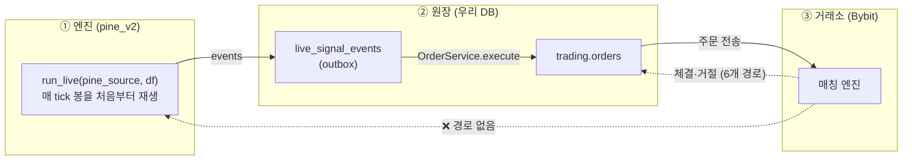

# ADR-023: 엔진 상태 SSOT — 재생이 아니라 영속 상태로, 거래소 현실을 되먹인다

> **상태:** **Proposed** (사용자 판정 대기 — Accepted 아님)
> **일자:** 2026-08-04
> **출처:** 2026-08-04 engine-state-ssot ([ADR-022] 대안 D 재개봉 + 선행연구 조사)
> **관련:** [`ADR-022`](022-engine-position-ssot.md) (C 안 — 본 ADR 이 축소한다) ·
> [`ADR-020`](020-trust-layer-ci-design.md) (Trust Layer — 본 ADR 이 구멍을 지적한다) ·
> [`ADR-011`](011-pine-execution-strategy-v4.md) (pine_v2 = 백테스트 SSOT) ·
> [`ADR-003`](003-pine-runtime-safety-and-parser-scope.md) (Coverage all-or-nothing) · [BL-591]
> **코드:** [`event_loop.py:69`](../../backend/src/strategy/pine_v2/event_loop.py) (`run_historical`) ·
> `event_loop.py:366` (`run_live`) · `event_loop.py:192` (주입점) ·
> [`strategy_state.py:265`](../../backend/src/strategy/pine_v2/strategy_state.py) (필드 정의) ·
> `strategy_state.py:310` (`discard_state_before_epoch`) · `:331` (`seed_positions_from_ledger`) ·
> [`interpreter.py:310`](../../backend/src/strategy/pine_v2/interpreter.py) (상태 주입 seam) ·
> [`live_signal.py:2528`](../../backend/src/tasks/live_signal.py) (`run_live` 호출)

---

## 배경 — 파이프가 단방향이다

`run_live(strategy.pine_source, df, ...)`(`live_signal.py:2528`)는 **전략 코드와 가격 데이터만**
받는 순수 함수다. 매 tick 봉을 처음부터 재생해 포지션을 **추론**하며, 거래소가 무슨 답을 하든
들을 귀가 없다.



**돌아오는 길이 0곳이다.** 체결을 원장에 쓰는 자리는 **6곳**이다 — `live_signal.py:998` ·
`conditional_entry_janitor.py:130` · `trading.py:472` · `trading.py:820` ·
`websocket/reconciliation.py:234` · `websocket/state_handler.py:236`. 그중 **엔진으로 돌아가는
것은 하나도 없다.**

**비대칭의 뿌리 — 시뮬의 체결은 보장이고 거래소의 체결은 아니다.** 엔진의 `check_pending_fills`
는 `low <= stop` 이면 **무조건** 체결로 친다. 거절이라는 개념이 없다. 코드가 직접 적고 있다
(`conditional_entry_planner.py:418`):

> 시뮬은 `low <= stop` 으로 즉시 체결로 보는데 거래소는 long RISE는 `110092`("expect Rising"),
> short FALL은 `110093`("expect Falling")으로 거부한다.

그래서 어긋남이 한쪽으로 쏠린다 — [ADR-022] 가 이미 잰 숫자다: `engine_only` **314** vs
`exchange_only` **21**. **15 대 1** 로 엔진이 현실보다 앞서 달린다(유령을 든다).

**이것이 증상 16건을 Resolved 하고도 병이 그대로인 이유다.** 순수 재생이 현실을 못 보는 한
어긋나는 방법의 가짓수에 끝이 없다.

---

## 결정 (Proposed)

**엔진 포지션의 소유자를 전략 밖으로 옮기고, 거래소 현실을 그리로 되먹인다.**

```
포지션 소유자 = 실행/포트폴리오 레이어 (영속 · 거래소 이벤트로 갱신)
        ↓ 매 평가 직전 **권위 있게** 주입
pine_v2 인터프리터가 그 값을 strategy.position_size 로 읽는다
        ↓
백테스트: 같은 주입점을 **시뮬 브로커**가 먹인다 → 코드 경로 동일, 공급자만 다름
```

★**주입점은 이미 있다** — `event_loop.py:192` 의 `seed_positions_from_ledger()`
(`strategy_state.py:331`). 바꿀 것은 **위치가 아니라 권한**이다. [ADR-022] 는 이 함수를 만들어
놓고 첫 줄에서 잠갔다(`strategy_state.py:357`):

```python
if not legs or self.open_trades: return ()   # 「엔진이 완전히 빈 순간에만」
```

본 ADR 은 이 조건을 **「항상, 권위 있게」**로 연다. 대칭 연산 `discard_state_before_epoch()`
(`:310`, 재생이 지어낸 포지션 삭제)도 이미 있다.

---

## 근거 — 우리는 구조적으로 예외다 (선행연구, 2026-08-04 조사)

|                    | 포지션 소유자                                     | 전략의 정체                       |
| ------------------ | ------------------------------------------------- | --------------------------------- |
| **NautilusTrader** | `ExecutionEngine` + `Cache` (이벤트 소싱, 영속)   | 명령 송신 / 이벤트 수신 액터      |
| **Freqtrade**      | `Trade` DB 행                                     | **가격 데이터프레임의 순수 함수** |
| **QuantBridge**    | ★**`StrategyState.open_trades` — 매 tick 재계산** | 가격의 순수 함수                  |

**Freqtrade 가 우리와 구조가 거의 같다** — 전략이 가격 데이터의 순수 함수다. 그런데 라이브 루프의
첫 두 줄이 「Fetch open trades **from persistence**」·「Update trades open order state **from
exchange**」다. 포지션을 전략 밖 DB 에 두고 거래소 현실을 그리로 먹인다. 전략은 **읽기만** 한다
(`Trade.get_trades_proxy(...)`), 그리고 **그 읽기 경로는 라이브 전용**이다(백테스트에선 빈 결과).

### 우리가 「죽이는」 상황이 그쪽에는 이름 붙은 정규 시나리오다

NautilusTrader startup reconciliation 표에서:

> **Position side flip** — Internal position opposite of venue (internal 100 long, venue 50 short)
> → _Generates LIMIT order to close internal and open external position._

이것이 우리 `direction` 발산이다. **우리는 세션을 죽이고, 그쪽은 맞추는 주문을 낸다.** 가격
우선순위까지 정해져 있다: 계산된 조정가 → 시장 mid → 현 평균가 → (최후) MARKET.

### [BL-591] 의 「유도 함수 재설계」에 쓸 알고리즘이 공개돼 있다

우리 `derive_open_position` 은 `trade_id` 로 진입/청산을 짝지으려다 반전에서 깨진다(§실측 참조).
NautilusTrader 는 **짝짓기를 하지 않는다**:

> Detects **zero-crossings** (position qty crosses through FLAT) to identify separate lifecycles.
> Adds **synthetic opening fills** when the earliest lifecycle is incomplete. Replaces a mismatched
> current lifecycle with a synthetic fill reflecting the venue position.

부호 있는 순수량이 0을 지나는 지점이 생애주기 경계다. ⇒ **`trade_id` 재사용과 배수량 반전에
구조적으로 면역이다.** 2026-08-04 소크의 체결 사슬(−0.029 → +0.029 → −0.029 → +0.029)은 반전마다
0을 지난다.

### 우리가 데어가며 배운 것들이 그쪽엔 설정 항목이다

- **Recent order protection**(`open_check_threshold_ms`) — 「최근 이벤트가 창 안이면 조정을
  건너뛴다. 거래소가 아직 처리 중인 경합에서 **거짓 양성**을 막는다」 ⇒ [BL-590] 교훈 그대로
  (가드는 발주 시각에 옳았고 거래소가 2.1초 뒤 자기 시각으로 거절했다).
- **Targeted query safeguard** — terminal 「not found」 적용 전 **단건 조회로 한 번 더** 확인.
- **In-flight timeout 해소표** · 재시도 카운터 loop 별 분리 · 단건 조회 throttle.
- **실패 처리** — 「조정이 실패하면 로그를 남기고 **기동하지 않는다**」. ★우리는 반대다 —
  자유롭게 기동하고 **런타임에 죽는다**.

> ★**용어 주의** — QuantConnect Lean 의 "Reconciliation" 문서는 **다른 뜻**이다(백테스트 대
> 라이브 _성과_ 괴리). 본 ADR 의 reconciliation 과 혼동하지 마라.

---

## 순환 기각 3건 — [ADR-022] 가 전제로 삼은 것이 결함 그 자체였다

**1. 대안 D(「조정 연산 정의」) 기각** — [ADR-022] 원문:

> **D. 조정 연산 정의** — 엔진에 쓸 자리가 없으므로 결국 같은 주입점을 쓴다. **C 의 부분집합.**

「쓸 자리가 없다」는 **결함 그 자체**이지 넘을 수 없는 경계가 아니다. `run_live` 가 상태를 못 받는
것은 자연법칙이 아니라 우리가 그렇게 짠 결과다. **고칠 수 있는 성질을 고정된 경계로 취급했고**,
그래서 남은 선택지가 전부 「이음매에 끼워넣기」 아니면 「세션 죽이기」가 됐다.

**2. 「백테스트와 라이브가 갈라진다」** — NautilusTrader:

> **Only the `LiveExecutionEngine` performs reconciliation, since backtesting controls both sides.**

백테스트는 시뮬 거래소와 엔진이 **같은 것**이라 조정할 대상이 없다. 조정은 **라이브 전용
레이어**이지 엔진의 분기가 아니다. ★**단 이것은 「위험이 작다」가 아니다** — §대가 2 가 더 나쁜
사실을 보인다. 정확한 문장은 **「엔진을 포크할 필요는 없다. 그러나 갈라짐을 잡을 CI 는 지금
0개다」**이다.

**3. 「합성 주문 행이 머니-패스 원장을 오염시킨다」**([ADR-022] 가 「구멍부터 메우는 선행
슬라이스」를 기각한 근거) — NautilusTrader 는 **정확히 그것을 한다.** 다만 **꼬리표를 붙인다**:
`strategy_id=EXTERNAL`, `tag=RECONCILIATION`. 진짜 주문과 절대 섞이지 않는다.
⇒ 우리가 기각한 것은 **기법이 아니라 꼬리표 없는 구현**이었다.

---

## 폭발 반경 실측 (2026-08-04, 읽기 전용 조사)

### 1. Pine 쪽은 작다 — 개편이 가능한 근거

| 항목                                      | 실측                                                                                                                                                            |
| ----------------------------------------- | --------------------------------------------------------------------------------------------------------------------------------------------------------------- |
| 포지션을 읽는 Pine builtin                | **3개** — `strategy.position_size` / `position_avg_price` / `equity`                                                                                            |
| 그 읽기 지점                              | **6곳**, 전부 `interpreter.py:1318-1327` + `:1347-1356` (`_eval_name`/`_eval_attribute` 대칭 중복 2벌)                                                          |
| `strategy.opentrades`·`netprofit` 등      | **미구현** — `coverage.py:329-336` `_STRATEGY_ATTRS` 가 5개뿐이라 그런 스크립트는 **전체 Unsupported** ([ADR-003](003-pine-runtime-safety-and-parser-scope.md)) |
| 직렬화 구조적 장애물                      | **0건** — 콜백·인터프리터 역참조·순환참조 전무. 전부 primitive/dataclass. `ExitOrderKind` 는 `StrEnum`                                                          |
| 상태 주입 seam                            | `interpreter.py:310` (`self.strategy = StrategyState()`)                                                                                                        |
| `run_live` 가 `StrategyState` 를 바꾸는가 | **안 바꾼다 — 읽기만.** `event_loop.py:559-562` 주석 + `tests/strategy/pine_v2/test_run_live.py:239-262` mutation oracle 이 강제                                |
| 진짜 「진실」 필드                        | **7개** — `open_trades` `closed_trades` `pending_orders` `pending_exits` `events` `running_equity` `pending_market_intents` (나머지 10개는 설정 8 · 진단 2)     |

⇒ **「Pine 은 전략이 포지션을 소유한다는 의미론이라 못 뺀다」는 우려는 6곳짜리 seam 이다.**

### 2. ★Trust Layer 는 라이브를 아예 안 잰다 — 개편의 진짜 위험

| 항목                              | 실측                                                                                                                         |
| --------------------------------- | ---------------------------------------------------------------------------------------------------------------------------- |
| Trust Layer 실체                  | 3파일 / **23 테스트 함수** — `test_pynescript_baseline_parity.py` · `test_trust_layer_parity.py` · `test_mutation_oracle.py` |
| 그중 `run_live` 를 부르는 것      | **0건.** 전부 `run_backtest_v2` / `parse_and_run_v2`                                                                         |
| [ADR-020] 에 live parity 요구     | **없음** (문서 전문에 `run_live` 0건)                                                                                        |
| `ci.yml` 의 전용 Trust Layer step | **없음** — `ci.yml:128-131` 은 주석뿐이고 `:139` 전체 pytest 에 섞여 돈다                                                    |

⇒ **라이브 엔진에 상태가 생겨도 CI 는 구조적으로 green 이다.** 「CI 가 갈라짐을 잡아줄 것」은
거짓이다. **개편이 깨뜨릴 첫 대상은 백테스트 골든이 아니라 「라이브가 전략+OHLCV 만으로
재현된다」는 계약이고, 그것을 지키는 CI 는 현재 0개다.**

### 3. [ADR-022] §「골든은 안 깨진다」 검증 결과

- **주장은 참이다** — `ledger_seed_legs`·`position_epoch`·`emit_from_bar_time` 를 아는 `src` 파일은
  **2개**(`event_loop.py`, `live_signal.py`)뿐이고 채우는 곳은 `live_signal.py:2505/2508/2512`.
  `v2_adapter`·`compat`·`track_runner`·`backtest/service`·`optimizer/**`·`stress_test/**` 전부 0건.
- **회귀 테스트는 실재한다** — `backend/tests/strategy/pine_v2/test_ledger_seed_isolation.py`
  (75줄, 테스트 3개). ★단서 둘: **⑴ `origin/main` 에 없다**(PR #539 미머지 → main CI 미집행)
  **⑵ `ledger_seed_legs` 단일 심볼만 지킨다**(`:31`) — `position_epoch`/`emit_from_bar_time` 무방비.
- 「백테스트와 라이브가 같은 엔진」은 **`run_historical` 한 함수에 한정된 진술**이다. `run_live` 는
  `v2_adapter`/`compat`/`track_runner` 를 **하나도** 공유하지 않고 Track 분류도 하지 않는다
  (Track A 는 라이브 경로가 아예 없다).

---

## 대가 — 판정 가능한 형태로 (이 절이 이 ADR 의 존재 이유다)

### R1 ★★★ float 오차 누적 — 아무도 이름 붙이지 않았던 위험

`event_loop.py:595-604` 의 실측: `0.02953691 + 0.02946167 → 0.058998579999999995`.

**지금은 매 tick warmup replay 가 이 오차를 매번 리셋한다.** 상태를 영속화하면 **리셋이 사라져
단조 누적된다.** ⇒ **우리가 없애려는 replay 가 우연히 오차 청소부 역할을 하고 있었다.**

대안 설계(택1 또는 조합, **본 ADR 이 Accepted 되기 전에 정해야 한다**):

| 안                  | 내용                                              | 비용                                    |
| ------------------- | ------------------------------------------------- | --------------------------------------- |
| (a) 주기적 재정규화 | N tick 마다 원장에서 재유도해 스냅샷을 갈아끼운다 | replay 를 완전히 버리지 못한다          |
| (b) Decimal 승격    | 수량·가격을 `Decimal` 로                          | `strategy_state.py` 전면 float — 광범위 |
| (c) 스냅샷 재계산   | 영속 시 원장 기준으로 수량을 재양자화(qty_step)   | 양자화 기준이 거래소 정밀도에 종속      |

★**repo 규약과 충돌한다** — `.ai/stacks/fastapi/backend.md` §2 「Decimal-first, float 금지」 대
`strategy_state.py` 전면 float. 지금은 `ExitOrder` docstring(`:99`)이 명시적 예외를 선언한 상태다.

### R2 `to_report()` 는 round-trip 불가 — 새 영속 표현이 필요하다

`strategy_state.py:1129-1141` 이 내보내는 것은 **9키**뿐이고 `events`·`pending_orders`·
`pending_exits`·`running_equity`·`initial_capital`·`leverage`·`fill_timing`·`sessions_allowed`·
`pyramiding`·`default_qty_*` 는 **전량 유실**된다. `Trade.to_dict()`(`:194-206`)도 `exit_kind`·
`liq_price`·`margin_used` 를 뺀다. ⇒ **현재 DB 의 `last_strategy_state_report`
(`trading/models.py:576`)로는 상태 복원이 불가능하다.**

### R3 `events` 가 outbox 의 유일 소스다

영속화 시 재시작에서 이어지는가 새로 시작하는가가 미정이고, `_next_sequence_no`
(`strategy_state.py:442-444`)가 **매번 전체 스캔 O(n)** 이라 영속 리스트에서 비용·의미 모두 미정.
★**여기를 틀리면 라이브 주문이 아예 안 나가거나 중복 발주된다.**

### R4 Track A 병렬 경로

`virtual_strategy.py:133-160, 203-243` 이 `run_historical` 을 안 타고 `StrategyState` 를 직접
조립·구동한다. **함께 고치지 않으면 조용히 갈라진다.**

### R5 `strategy.position_size` 의 within-bar 즉시성 **[추론]**

`strategy.entry()` 직후 같은 bar 에서 읽는 값이 지금은 즉시 반영된다. 외부 소스로 바꾸면 stale
해질 수 있다 — `strategy_state.py:663-686` docstring 이 경고한 「`position_size == 0` 영구 False」
계열 dogfood 버그가 다른 원인으로 재현될 수 있다.

### R6 NaN 오염 — 직렬화가 이미 lossy 하다

flat 일 때 `position_avg_price` 가 `float("nan")`(`strategy_state.py:601,604`)이고
`_sanitize_for_jsonb`(`live_signal.py:175-198`)가 `None` 으로 죽여 통과시키고 있다.

### R7 재현성 손실

라이브가 「전략 + OHLCV」만으로 재현되지 않는다. [ADR-022] 가 이미 경고한 것의 **강한 버전**이다.

### R8 멱등성 — 없애는가 옮기는가

[ADR-022] 가 「원장 전면 덮어쓰기」를 기각한 근거는 「재생이 스스로 만든 포지션과 원장이 섞여
이중 계상」이었다. **상태 영속화는 재생 자체를 없애므로 이 문제를 없앤다** — 다만 그 자리에
「영속 상태 vs 원장」 정합이라는 **새 문제**가 온다. **[확인 필요]** — 슬라이스 설계에서 명시할 것.

> ★**부수 관찰 — 선례가 있다.** 누적 통계(`total_closed_trades`/`total_realized_pnl`/
> `last_bar_time`)는 **이미 엔진 밖 원장으로 이관됐고 반환값이 미사용**이다
> (`live_signal.py:2838-2841`). 「엔진 밖으로 진실을 옮긴다」는 이 레포에서 처음이 아니다.
>
> ★`discard_state_before_epoch`(`:310`)와 `seed_positions_from_ledger`(`:331`)는 둘 다
> **replay 아키텍처의 부산물**이다. 상태가 영속되면 존재 이유가 사라진다.

---

## P-live parity 층 (본 ADR 이 함께 정의해야 하는 것)

§폭발 반경 2 가 「CI 는 구조적으로 green」임을 확정했으므로, **갈라짐을 잡을 층을 개편과 같이
만든다.** 최소 요구:

1. **`run_live` 를 실제로 부르는 골든** — 현재 Trust Layer 23개 중 0개.
2. **상태 round-trip 불변식** — `serialize(deserialize(s)) == s` (R2 를 집행한다).
3. **격리 화이트리스트 확장** — `test_ledger_seed_isolation.py:31` 의 단일 심볼을
   `position_epoch`·`emit_from_bar_time` 까지 넓힌다(현재 무방비).
4. **`origin/main` 집행** — 위 테스트가 main 에 들어가야 CI 가 계약을 집행한다.

---

## ★선행 측정 — 설계 확정 전 필수 (읽기 전용이라 소크와 공존한다)

**`engine_only` 314 의 원인 분해.** `_classify_position_divergence`(`live_signal.py`)는
「엔진 non-flat + 거래소 flat」이라는 **상태만** 세고 **원인은 세지 않는다.** 후보 셋을 원장·워커
로그로 갈라야 한다:

| 후보                                                        | 지배 시 수리의 모양             |
| ----------------------------------------------------------- | ------------------------------- |
| (a) 주문이 안 나갔거나 거절됐는데 시뮬은 체결로 쳤다        | **거절을 엔진에 되먹임**        |
| (b) 브래킷 TP/SL·청산이 **거래소에서** 닫았고 엔진이 모른다 | **거래소발 청산을 엔진에 반영** |
| (c) 엔진이 열었는데 outbox 가 발행하지 않았다               | **발행 경로 수리**              |

결론(고칠 곳 = 엔진)은 세 경우 모두 같으므로 설계는 진행하되, **이 분해 없이 슬라이스를
확정하지 않는다.** ★이 레포가 반복해 덴 함정이다 — 「재보니 재던 곳에 없었다」.

---

## 개편 시 고쳐야 할 문서 (★**본 ADR 이 Accepted 되기 전에는 손대지 않는다**)

| 우선 | 파일:줄                                                                  | 무엇이 거짓이 되나                                          |
| ---- | ------------------------------------------------------------------------ | ----------------------------------------------------------- |
| P0   | `CONTEXT.md:18`                                                          | ★**계약의 원본** — 「백테스트·**라이브 신호**의 단일 진실」 |
| P0   | `CONTEXT.md:101` · `:112`                                                | Trust Layer 범위 · Optimizer/Stress 3소비자 관계            |
| P0   | `docs/reference/architecture/pine-execution-architecture.md:16-27,45`    | 실행 경로 mermaid 에 **`run_live` 가 아예 없다**            |
| P0   | `docs/reference/architecture/trust-layer-architecture.md:9-14,33-38`     | 3층 표에 live parity 항목 없음                              |
| P1   | `docs/decisions/020-trust-layer-ci-design.md:33,39`                      | P-3 정의가 `BacktestOutcome.metrics` 기준                   |
| P1   | `docs/reference/domain/domain-overview.md:25,43`                         | 「Pine 실행은 pine_v2 가 맡는다」                           |
| P2   | `docs/reference/product/requirements-overview.md:24,28` · `README.md:15` | 방어 범위 한정 명시                                         |
| P2   | `system-architecture.md:82,143` · `data-flow.md:59`                      | pine_v2 단일 박스 — live 분기 미표기                        |

---

## [ADR-022] 와의 관계 — Superseded 가 아니라 **축소**다

[ADR-022] 의 결정(C 안)은 **폐기하지 않는다.** 2026-08-04 실측이 확정한 것은:

- **C 는 예방 전용이고 사망 경로에 구조적으로 닿지 않는다** — ④ = 0(주입 절반) + 유도가 사망
  시점에 이미 판정 불가(veto 절반). 상세는 [ADR-022 §슬라이스 1 실측](022-engine-position-ssot.md).
- **C 의 veto 는 「원장 vs 거래소」 대조인데 사망 경로는 원장==거래소이고 엔진만 거짓말한다** ⇒
  애초에 발화하지 않는다.

본 ADR 은 **C 가 닿지 못하는 방향**(`engine_only` 314)을 대상으로 하며, C 의 유도 함수는
zero-crossing 으로 교체되어 **본 ADR 안에서 재사용된다**(폐기가 아니라 승계).

---

## 대안 (거부됨)

- **현행 유지(재생 + `direction` 킬)** — 증상 16건 Resolved 후에도 병이 그대로다. 다만 [BL-589]/
  [BL-590] 수리 이후 자동 사망이 **0건 / 225분**이고 수리 전 기저율(3건/738분) 기대값이 **0.91건**
  이라 **아직 아무 증거도 아니다**(P(0|무변화)≈40%). ⇒ **본 ADR 의 긴급도는 소크 달력 시간이
  정한다.** 며칠 무사고면 우선순위를 낮춰라.
- **[ADR-022] B 안(거래소 SSOT)** — `live_signal.py:2248` 의 동어반복 제약. [ADR-022] 가 이미
  차단했고 본 ADR 도 되살리지 않는다(포지션 크기만으로는 진입가·`trade_id`·pending 을 복원 못 함).
- **유도 함수만 고치고 C 를 그대로 진행**([BL-591] 슬라이스 1.5 단독) — 판정 불가 19.0% → ~0 이
  되어 계측 품질은 오르지만, ④=0 과 veto 미발화는 그대로라 **사망을 막지 못한다.**
- **`engine_only` 를 킬 대상에 추가** — 314+28 규모로 사망해 소크가 사실상 못 돈다. 분류기 주석이
  이미 경고한다.
