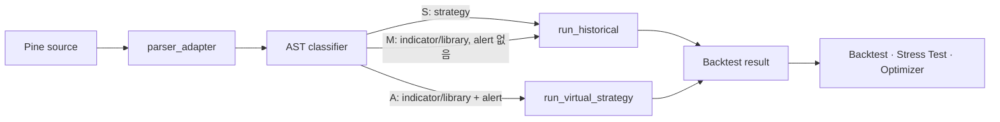

# Pine 실행 아키텍처

> **역할:** 현재 `pine_v2` 실행 계약의 진입점. 실제 구현은 [`backend/src/strategy/pine_v2/`](../../../backend/src/strategy/pine_v2/), 결정 이유는 [`ADR-011`](../../decisions/011-pine-execution-strategy-v4.md)·[`ADR-014`](../../decisions/014-sprint-8b-8c-pine-v2-expansion.md), 2026-04 설계 과정은 [`archive`](../../archive/architecture/2026-04-17-pine-execution-v4-design.md)에 보존한다.

## 핵심 원칙

- Pine을 Python으로 변환해 `exec()`·`eval()`로 실행하지 않는다. `pine_v2`가 AST를 bar-by-bar로 해석한다.
- 실행 엔진의 정본은 `pine_v2`다. ★2026-08-06 에 vectorbt 의존성은 **제거됐다** — 「지표 계산 보조」라는 서술도 드리프트였고(코드 import 0건), 지표는 `pine_v2/stdlib.py` 가 pandas/numpy 로 직접 계산한다.
- 지원하지 않는 호출이 하나라도 있으면 부분 결과를 만들지 않고 Unsupported로 끝낸다.
- TradingView와 달라질 수 있는 degraded 호출은 백테스트 제출 시 명시 동의 없이는 실행하지 않는다.

## 실행 경로

| Track | 분류                                     | 실행 계약                                     |
| ----- | ---------------------------------------- | --------------------------------------------- |
| **S** | `strategy()` 선언                        | 네이티브 `run_historical` 경로                |
| **A** | `indicator()` 또는 `library` + alert     | `VirtualStrategyWrapper`가 전략 이벤트로 투영 |
| **M** | `indicator()` 또는 `library`, alert 없음 | 지표 pass-through로 `run_historical` 실행     |

분류 규칙의 정본은 `ast_classifier._classify_track`, 외부 진입점은 `compat.parse_and_run_v2`다. Track A는 `next_bar_open`을 그대로 재현하지 못할 때 경고를 남기고 bar-close로 실행한다.

## 지원 범위와 Trust Layer

`coverage.py`의 지원 집합과 `interpreter.py`의 실제 바인딩은 함께 바뀌어야 한다. 이 둘의 정합과 실행 회귀는 [`trust-layer-architecture.md`](./trust-layer-architecture.md)가 설명하며, 사용자에게 보이는 지원/미지원 목록은 [`supported-indicators.md`](../domain/supported-indicators.md)가 맡는다.

함수 지원을 추가할 때는 다음을 한 변경으로 끝낸다.

1. `stdlib.py` 또는 interpreter에 의미론을 구현한다.
2. `coverage.py`의 지원 집합을 갱신한다.
3. 단위 테스트와 필요 시 corpus fixture를 추가한다.
4. Track·결과 의미가 바뀌면 이 문서와 Trust Layer 회귀 기준을 함께 갱신한다.

## 소비자 경계

Backtest가 `pine_v2` 실행의 단일 소비자 경계다. Optimizer와 Stress Test는 이를 재실행하거나 완료된 Backtest 산출물을 사용한다. 따라서 실행 의미론을 바꾸면 세 도메인의 회귀를 함께 검증한다.

현재 용어·관계의 짧은 정본은 [`CONTEXT.md`](../../../CONTEXT.md), 도메인 상태는 [`domain-overview.md`](../domain/domain-overview.md)에 둔다.
