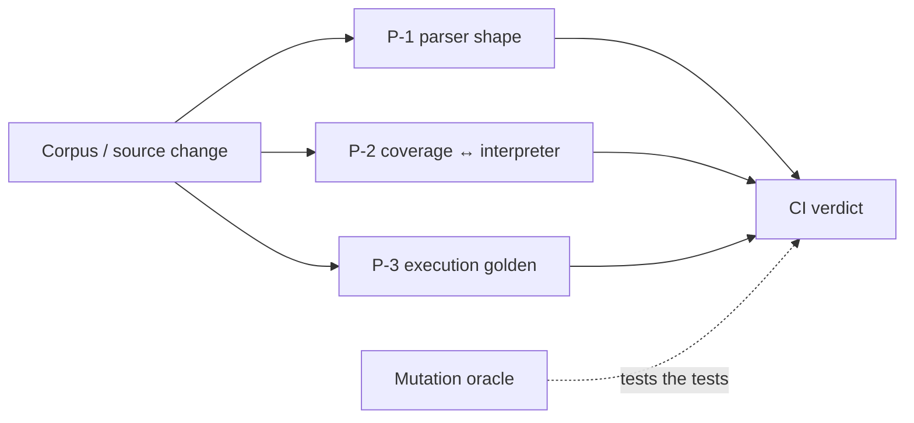

# Trust Layer 아키텍처

> **역할:** Pine 실행 결과가 조용히 달라지는 회귀를 막는 현재 검증 계약의 진입점. 구현과 테스트가 정본이며, 결정 근거는 [`ADR-020`](../../decisions/020-trust-layer-ci-design.md), 2026-04 설계 초안은 [`archive`](../../archive/architecture/2026-04-23-trust-layer-architecture-design.md)에 보존한다.

## 보장하는 것

Trust Layer는 “더 많은 Pine을 실행한다”는 약속이 아니라, 지원 범위와 실행 결과의 변화를 감지하고 정직하게 드러내는 안전망이다.

| 층 | 검증 대상 | 구현 근거 |
| --- | --- | --- |
| **P-1 AST Shape Parity** | parser가 frozen corpus의 AST 구조를 예기치 않게 바꾸지 않는가 | `test_pynescript_baseline_parity.py` |
| **P-2 Coverage SSOT Sync** | 사용자에게 지원한다고 한 함수가 실제 interpreter에 존재하는가 | `test_trust_layer_parity.py` |
| **P-3 Execution Golden** | 실행 결과·거래·경고가 기준선에서 드리프트하지 않는가 | `test_trust_layer_parity.py`와 frozen corpus |
| **Mutation Oracle** | 위 검사가 의도적으로 주입한 의미론 오류를 실제로 잡는가 | `test_mutation_oracle.py` (`--run-mutations`) |

## 동작 경계

- `coverage.py`가 미지원 호출을 먼저 표시하고, Backtest는 runnable/degraded 정책을 집행한다.
- 기준선 또는 corpus를 바꾸는 작업은 의도와 근거를 함께 검토한다. 테스트를 맞추기 위해 기준선만 갱신하지 않는다.
- Mutation Oracle은 일반 빠른 테스트와 분리된 명시 실행 경로다. 측정 불가 mutation은 통과로 세지 않는다.

## 변경 시 확인할 것

1. parser·AST·stdlib·coverage 중 무엇이 바뀌는지 적는다.
2. P-1/P-2/P-3 중 영향을 받는 층의 테스트를 실행한다.
3. 사용자에게 노출되는 지원 목록이 변하면 [`supported-indicators.md`](../domain/supported-indicators.md)도 갱신한다.
4. 회귀 기준 자체를 바꾸면 ADR 또는 dev-log에 근거를 남긴다.

Pine 실행의 전체 경로는 [`pine-execution-architecture.md`](./pine-execution-architecture.md), 현재 제품 약속은 [`requirements-overview.md`](../product/requirements-overview.md)를 따른다.
