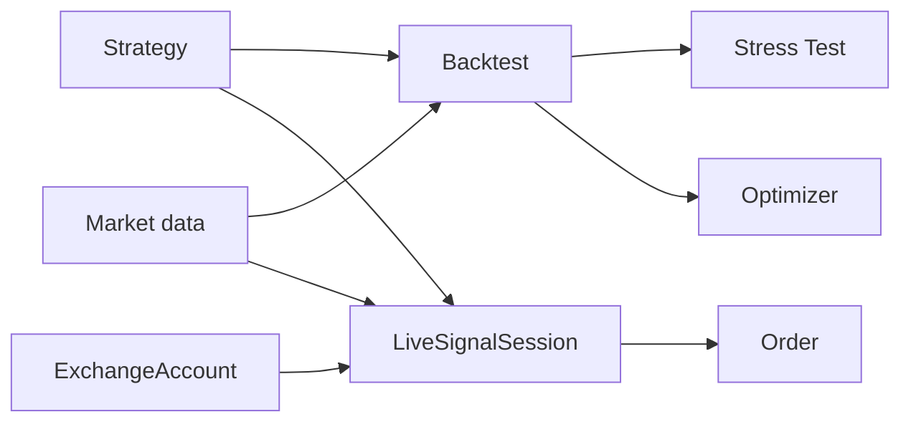

# QuantBridge 도메인 개요

> **역할:** 도메인 경계와 책임의 짧은 지도. 구현은 `apps/api/src/<domain>/`, DB 관계는 [`erd.md`](./erd.md), 상태 전이는 [`state-machines.md`](./state-machines.md), API 경계는 [`endpoints.md`](../interfaces/endpoints.md)가 정본이다.

## 경계

| 도메인        | 책임                                                 | 주요 영속 모델                            |
| ------------- | ---------------------------------------------------- | ----------------------------------------- |
| `auth`        | JWT 검증(JWKS)과 사용자 원장·탈퇴                    | User                                      |
| `strategy`    | Pine 등록·파싱·지원 범위·`pine_v2` 실행 준비         | Strategy                                  |
| `backtest`    | 비동기 실행과 결과·거래 보관                         | Backtest, BacktestTrade                   |
| `market_data` | OHLCV·Funding 수집과 TimescaleDB 보관                | OHLCV, FundingRate                        |
| `stress_test` | Monte Carlo·Walk-Forward·민감도 분석                 | StressTest                                |
| `optimizer`   | Grid·Bayesian·Genetic 탐색                           | OptimizationRun                           |
| `trading`     | Demo 계정·주문·리스크·Kill Switch·LiveSignal session | ExchangeAccount, Order, LiveSignalSession |
| `realtime`    | 브라우저 WebSocket fan-out                           | 영속 모델 없음                            |
| `waitlist`    | Beta 전 대기자 접수                                  | WaitlistApplication                       |

`exchange`는 별도 도메인이 아니다. 거래소 계정과 provider dispatch는 `trading`이 소유한다.

## 공통 규칙

- 의존성 방향은 Router → Service → Repository다. DB 접근은 Repository만 담당한다.
- Backtest·Stress Test·Optimizer는 Celery 비동기로 실행한다.
- 금융값은 경계에서 `Decimal`을 사용하며, Pine 실행은 `pine_v2` 인터프리터가 맡는다.
- Pine 미지원 항목은 부분 실행하지 않는다. 지원 집합은 [`supported-indicators.md`](./supported-indicators.md)의 코드 정본을 따른다.
- 사용자·전략·계정·세션의 FK와 delete 정책을 이 문서에 중복하지 않는다. 정확한 관계는 [`erd.md`](./erd.md)를 확인한다.

## 핵심 연결

- Backtest는 `pine_v2` 실행 결과를 보관한다.
- Stress Test·Optimizer는 Backtest 계약을 재사용한다.
- LiveSignalSession과 Order가 자동매매 lifecycle을 표현한다. 과거 `trading_sessions`·`live_trades` 모델은 구현된 테이블이 아니며 재사용하지 않는다.

## 새 도메인을 추가할 때

1. `apps/api/src/<domain>/`의 코드 경계를 먼저 정한다.
2. router 등록, schema, repository, migration과 테스트를 함께 추가한다.
3. API 기준 경로가 새로 생기면 [`endpoints.md`](../interfaces/endpoints.md)를 갱신한다.
4. 영속 관계나 상태가 새로 생기면 ERD·상태 머신을 같은 변경에서 갱신한다.
