# QuantBridge — ERD (Entity Relationship Diagram)

> **기준:** Sprint 62 shipped 스키마 — 16 테이블 전수 (2026-05-29 reconcile).
> **SSOT:** 각 도메인 `backend/src/<domain>/models.py` + `backend/alembic/versions/`. 본 문서와 코드 충돌 시 코드 우선.
> **DB:** PostgreSQL 15+ (메인, `public` 스키마) + `trading` 스키마 (거래) + `ts` 스키마 (TimescaleDB hypertable) + Redis (캐시/Celery)
>
> **2026-05-29 reconcile 완료:** 다이어그램 전체 재작성 — 16 shipped 테이블 (`users`·`strategies`·`backtests`·`backtest_trades`·`stress_tests`·`optimization_runs`·`exchange_accounts`·`orders`·`kill_switch_events`·`webhook_secrets`·`funding_rates`·`live_signal_sessions`·`live_signal_states`·`live_signal_events`·`waitlist_applications`·`ts.ohlcv`). 구 다이어그램의 phantom `trading_sessions`·`live_trades` (구현된 적 없음 — 실제는 `orders` + `live_signal_*`) 제거. 컬럼/FK/인덱스는 `models.py` 기준 검증.

---

## 엔티티 관계도

```mermaid
erDiagram
    %% ── public schema 핵심 ──
    users ||--o{ strategies : "owns (CASCADE)"
    users ||--o{ backtests : "runs (CASCADE)"
    users ||--o{ stress_tests : "runs (CASCADE)"
    users ||--o{ optimization_runs : "runs (CASCADE)"
    users |o--o{ waitlist_applications : "claimed by (SET NULL)"
    strategies ||--o{ backtests : "tested by (RESTRICT)"
    backtests ||--o{ backtest_trades : "contains (CASCADE)"
    backtests ||--o{ stress_tests : "analyzed by (RESTRICT)"
    backtests ||--o{ optimization_runs : "optimized by (RESTRICT)"

    %% ── trading schema (cross-schema FK → public) ──
    users ||--o{ exchange_accounts : "owns (CASCADE)"
    users ||--o{ live_signal_sessions : "runs (CASCADE)"
    strategies ||--o{ orders : "issues (RESTRICT)"
    strategies ||--o{ webhook_secrets : "secured by (CASCADE)"
    strategies ||--o{ live_signal_sessions : "executed by (RESTRICT)"
    strategies |o--o{ kill_switch_events : "trips cumulative (CASCADE)"
    exchange_accounts ||--o{ orders : "executes on (RESTRICT)"
    exchange_accounts ||--o{ live_signal_sessions : "uses (RESTRICT)"
    exchange_accounts |o--o{ kill_switch_events : "trips daily/api (CASCADE)"
    live_signal_sessions ||--|| live_signal_states : "caches 1:1 (CASCADE)"
    live_signal_sessions ||--o{ live_signal_events : "emits outbox (CASCADE)"
    orders |o--o{ live_signal_events : "fulfills (SET NULL)"

    %% ohlcv (ts schema) · funding_rates (trading schema) = 독립 시계열, FK 없음

    users {
        uuid id PK "uuid4 (Clerk user 매핑 = clerk_user_id)"
        varchar clerk_user_id UK "Clerk user_id (max 64), indexed"
        varchar email "nullable (max 320)"
        varchar username "nullable (max 64)"
        varchar country_code "nullable (max 2), Sprint 25"
        boolean is_active "default true, indexed"
        datetime created_at "server_default NOW()"
        datetime updated_at "onupdate NOW()"
    }

    strategies {
        uuid id PK "uuid4"
        uuid user_id FK "→ users.id CASCADE, indexed"
        varchar name "max 120, NOT NULL"
        varchar description "nullable (max 2000)"
        text pine_source "NOT NULL"
        enum pine_version "PineVersion: v4 | v5"
        enum parse_status "ParseStatus: ok | unsupported | error, indexed"
        jsonb parse_errors "nullable"
        varchar timeframe "nullable (max 16)"
        varchar symbol "nullable (max 32)"
        jsonb tags "default []"
        jsonb trading_sessions "default [], 세션 게이트 asia|london|ny (Sprint 7d)"
        jsonb settings "nullable, Live Signal trading params (Sprint 26)"
        boolean is_archived "default false, indexed"
        datetime created_at "server_default NOW()"
        datetime updated_at "onupdate NOW()"
    }

    backtests {
        uuid id PK "uuid4"
        uuid user_id FK "→ users.id CASCADE, indexed"
        uuid strategy_id FK "→ strategies.id RESTRICT, indexed"
        varchar symbol "max 32, NOT NULL"
        varchar timeframe "max 8, NOT NULL"
        datetime period_start "NOT NULL"
        datetime period_end "NOT NULL"
        decimal initial_capital "DECIMAL(20,8), NOT NULL"
        enum status "BacktestStatus (6값), indexed"
        varchar celery_task_id "nullable (max 64)"
        jsonb metrics "nullable (completed 시)"
        jsonb equity_curve "nullable (completed 시)"
        text error "nullable (failed 시)"
        jsonb config "nullable, BacktestConfig 5가정 (Sprint 31)"
        varchar idempotency_key "nullable (max 128), unique"
        bytea idempotency_payload_hash "nullable, SHA-256"
        varchar share_token "nullable (max 64), unique+indexed (Sprint 41)"
        datetime share_revoked_at "nullable (NULL=active share)"
        datetime created_at "NOT NULL"
        datetime started_at "nullable"
        datetime completed_at "nullable"
    }

    backtest_trades {
        uuid id PK "uuid4"
        uuid backtest_id FK "→ backtests.id CASCADE, indexed"
        integer trade_index "NOT NULL"
        enum direction "TradeDirection: long | short"
        enum status "TradeStatus: open | closed"
        datetime entry_time "NOT NULL"
        datetime exit_time "nullable"
        decimal entry_price "DECIMAL(20,8)"
        decimal exit_price "nullable, DECIMAL(20,8)"
        decimal size "DECIMAL(20,8)"
        decimal pnl "DECIMAL(20,8)"
        decimal return_pct "DECIMAL(12,6)"
        decimal fees "DECIMAL(20,8), default 0"
    }

    stress_tests {
        uuid id PK "uuid4"
        uuid user_id FK "→ users.id CASCADE, indexed"
        uuid backtest_id FK "→ backtests.id RESTRICT, indexed"
        enum kind "StressTestKind: monte_carlo | walk_forward | cost_assumption_sensitivity | param_stability"
        enum status "queued | running | completed | failed, indexed"
        jsonb params "입력 (kind별 상이), NOT NULL"
        jsonb result "nullable (completed 시)"
        text error "nullable (failed 시)"
        varchar celery_task_id "nullable (max 64)"
        datetime created_at "NOT NULL"
        datetime started_at "nullable"
        datetime completed_at "nullable"
    }

    exchange_accounts {
        uuid id PK "uuid4 — trading schema"
        uuid user_id FK "→ users.id CASCADE, indexed"
        enum exchange "ExchangeName: bybit | binance | okx"
        enum mode "ExchangeMode: demo | live"
        bytea api_key_encrypted "AES-256 Fernet, NOT NULL"
        bytea api_secret_encrypted "AES-256 Fernet, NOT NULL"
        bytea passphrase_encrypted "nullable (OKX 전용)"
        varchar label "nullable (max 120)"
        datetime created_at "server_default NOW()"
        datetime updated_at "onupdate NOW()"
    }

    orders {
        uuid id PK "uuid4 — trading schema"
        uuid strategy_id FK "→ strategies.id RESTRICT, indexed"
        uuid exchange_account_id FK "→ trading.exchange_accounts.id RESTRICT, (acct,state) indexed"
        varchar symbol "max 32, NOT NULL"
        enum side "OrderSide: buy | sell"
        enum type "OrderType: market | limit"
        decimal quantity "NUMERIC(18,8), NOT NULL"
        decimal price "nullable (limit 전용)"
        enum state "OrderState: pending | submitted | filled | rejected | cancelled, indexed"
        jsonb webhook_payload "nullable"
        varchar idempotency_key "nullable (max 200), partial unique"
        bytea idempotency_payload_hash "nullable, SHA-256"
        varchar exchange_order_id "nullable (max 120)"
        decimal filled_price "nullable"
        decimal filled_quantity "nullable (partial fill)"
        decimal realized_pnl "nullable — kill-switch 손실 평가 입력 (MP-1)"
        varchar error_message "nullable (max 2000)"
        integer leverage "nullable (Bybit Futures)"
        varchar margin_mode "nullable (max 16)"
        jsonb dispatch_snapshot "nullable: exchange/mode/has_leverage (Sprint 23)"
        datetime submitted_at "nullable"
        datetime filled_at "nullable (terminal ts)"
        datetime created_at "server_default NOW()"
        datetime updated_at "onupdate NOW()"
    }

    kill_switch_events {
        uuid id PK "uuid4 — trading schema"
        enum trigger_type "cumulative_loss | daily_loss | api_error"
        uuid strategy_id FK "→ strategies.id CASCADE, nullable (cumulative_loss scope)"
        uuid exchange_account_id FK "→ trading.exchange_accounts.id CASCADE, nullable (daily/api scope)"
        decimal trigger_value "NUMERIC(18,8), NOT NULL"
        decimal threshold "NUMERIC(18,8), NOT NULL"
        datetime triggered_at "server_default NOW()"
        datetime resolved_at "nullable (NULL=active gate)"
        varchar resolution_note "nullable (max 500)"
    }
    %% kill_switch_events: CHECK ck_..._trigger_scope = strategy_id XOR exchange_account_id (trigger_type별 배타)

    webhook_secrets {
        uuid id PK "uuid4 — trading schema"
        uuid strategy_id FK "→ strategies.id CASCADE, (strategy,revoked) indexed"
        bytea secret_encrypted "MultiFernet AES-256, NOT NULL"
        datetime created_at "server_default NOW()"
        datetime revoked_at "nullable (NULL=active)"
    }

    funding_rates {
        uuid id PK "uuid4 — trading schema"
        varchar symbol "max 32, NOT NULL"
        enum exchange "ExchangeName: bybit | binance | okx"
        decimal funding_rate "NUMERIC(18,8), NOT NULL"
        datetime funding_timestamp "NOT NULL"
        datetime fetched_at "server_default NOW()"
    }
    %% funding_rates: UNIQUE(exchange, symbol, funding_timestamp). FK 없음 (독립 시계열)

    live_signal_sessions {
        uuid id PK "uuid4 — trading schema"
        uuid user_id FK "→ users.id CASCADE, (user,active) indexed"
        uuid strategy_id FK "→ strategies.id RESTRICT"
        uuid exchange_account_id FK "→ trading.exchange_accounts.id RESTRICT"
        varchar symbol "max 32, NOT NULL"
        varchar interval "1m|5m|15m|1h (String(8))"
        boolean is_active "default true; user당 active <=5 (partial unique)"
        datetime last_evaluated_bar_time "nullable (CAS race-safe)"
        uuid bar_claim_token "nullable (advisory claim)"
        datetime created_at "server_default NOW()"
        datetime updated_at "onupdate NOW()"
        datetime deactivated_at "nullable"
    }

    live_signal_states {
        uuid session_id PK,FK "→ trading.live_signal_sessions.id CASCADE (1:1)"
        integer schema_version "default 1"
        jsonb last_strategy_state_report "default 빈 객체"
        jsonb last_open_trades_snapshot "default 빈 객체"
        integer total_closed_trades "default 0"
        decimal total_realized_pnl "NUMERIC(18,8), default 0"
        jsonb equity_curve "nullable, 누적 PnL 시계열 (default 빈 배열)"
        datetime updated_at "onupdate NOW()"
    }

    live_signal_events {
        uuid id PK "uuid4 — trading schema (transactional outbox)"
        uuid session_id FK "→ trading.live_signal_sessions.id CASCADE, (session,bar) indexed"
        datetime bar_time "NOT NULL"
        integer sequence_no "NOT NULL"
        varchar action "entry | close (max 16)"
        varchar direction "long | short (max 8)"
        varchar trade_id "max 64, NOT NULL"
        decimal qty "NUMERIC(18,8), NOT NULL"
        varchar comment "max 200, default 빈 문자열"
        decimal realized_pnl "nullable — close 청산 PnL (MP-1)"
        varchar status "pending | dispatched | failed (String(16)), partial pending indexed"
        uuid order_id FK "→ trading.orders.id SET NULL, nullable"
        varchar error_message "nullable (max 2000)"
        integer retry_count "default 0"
        datetime created_at "server_default NOW()"
        datetime dispatched_at "nullable"
    }
    %% live_signal_events: UNIQUE(session_id, bar_time, sequence_no, action, trade_id) = idempotency

    optimization_runs {
        uuid id PK "uuid4 — public schema"
        uuid user_id FK "→ users.id CASCADE, indexed"
        uuid backtest_id FK "→ backtests.id RESTRICT, indexed"
        enum kind "OptimizationKind: grid_search | bayesian | genetic"
        enum status "queued | running | completed | failed, indexed"
        jsonb param_space "discriminated union (Integer|Decimal|Categorical), NOT NULL"
        jsonb result "nullable (completed 시)"
        text error_message "nullable (failed 시)"
        varchar celery_task_id "nullable (max 64)"
        datetime created_at "NOT NULL"
        datetime started_at "nullable"
        datetime completed_at "nullable"
    }

    waitlist_applications {
        uuid id PK "uuid4 — public schema"
        varchar email "unique, indexed (max 320)"
        varchar tv_subscription "max 20, NOT NULL"
        varchar exchange_capital "max 20, NOT NULL"
        varchar pine_experience "max 20, NOT NULL"
        varchar existing_tool "nullable (max 120)"
        varchar pain_point "max 1000, NOT NULL"
        enum status "pending | invited | joined | rejected, indexed"
        varchar invite_token "nullable (max 512), HMAC"
        datetime invite_sent_at "nullable"
        datetime invited_at "nullable"
        datetime joined_at "nullable"
        uuid user_id FK "→ users.id SET NULL, nullable"
        datetime created_at "server_default NOW()"
    }

    ohlcv {
        datetime time PK "TimescaleDB hypertable partition key — ts schema"
        varchar symbol PK "max 32"
        varchar timeframe PK "max 8"
        varchar exchange "max 32, NOT NULL"
        decimal open "NUMERIC(18,8)"
        decimal high "NUMERIC(18,8)"
        decimal low "NUMERIC(18,8)"
        decimal close "NUMERIC(18,8)"
        decimal volume "NUMERIC(18,8)"
    }
```



---

## Enum 정의 (구현됨)

| Enum             | 값                                                                                     | 코드 위치            |
| ---------------- | -------------------------------------------------------------------------------------- | -------------------- |
| `BacktestStatus` | `queued` · `running` · `cancelling` (transient) · `completed` · `failed` · `cancelled` | `backtest/models.py` |
| `ParseStatus`    | `ok` · `unsupported` · `error`                                                         | `strategy/models.py` |
| `PineVersion`    | `v4` · `v5`                                                                            | `strategy/models.py` |
| `TradeDirection` | `long` · `short`                                                                       | `backtest/models.py` |
| `TradeStatus`    | `open` · `closed`                                                                      | `backtest/models.py` |

---

## FK 정책 (구현됨)

| 부모 → 자식                                   | ondelete     | 이유                                                              |
| --------------------------------------------- | ------------ | ----------------------------------------------------------------- |
| `users` → `strategies`                        | CASCADE      | 사용자 탈퇴 시 전략 일괄 삭제                                     |
| `users` → `backtests`                         | CASCADE      | 동일                                                              |
| `users` → `stress_tests`                      | CASCADE      | 동일                                                              |
| `users` → `optimization_runs`                 | CASCADE      | 동일                                                              |
| `users` → `exchange_accounts`                 | CASCADE      | 사용자 탈퇴 시 거래소 계정 삭제                                   |
| `users` → `live_signal_sessions`              | CASCADE      | 사용자 탈퇴 시 실행 세션 삭제                                     |
| `users` → `waitlist_applications`             | **SET NULL** | 가입 후 탈퇴해도 신청 이력 보존                                   |
| `strategies` → `backtests`                    | **RESTRICT** | 백테스트가 참조 중이면 전략 삭제 금지 → 409                       |
| `strategies` → `orders`                       | **RESTRICT** | 주문 이력 참조 중 전략 삭제 금지                                  |
| `strategies` → `webhook_secrets`              | CASCADE      | 전략 삭제 시 웹훅 시크릿 폐기                                     |
| `strategies` → `live_signal_sessions`         | **RESTRICT** | 실행 중 세션 참조 시 전략 삭제 금지                               |
| `strategies` → `kill_switch_events`           | CASCADE      | 전략 삭제 시 cumulative_loss 이벤트 삭제                          |
| `backtests` → `backtest_trades`               | CASCADE      | 백테스트 삭제 시 trades 동시 삭제 + ORM cascade all,delete-orphan |
| `backtests` → `stress_tests`                  | **RESTRICT** | 스트레스 결과 영속 위해 원본 백테스트 삭제 금지                   |
| `backtests` → `optimization_runs`             | **RESTRICT** | 최적화 결과 영속 위해 동일                                        |
| `exchange_accounts` → `orders`                | **RESTRICT** | 주문 이력 참조 중 계정 삭제 금지                                  |
| `exchange_accounts` → `live_signal_sessions`  | **RESTRICT** | 실행 중 세션 참조 시 동일                                         |
| `exchange_accounts` → `kill_switch_events`    | CASCADE      | 계정 삭제 시 daily_loss/api_error 이벤트 삭제                     |
| `live_signal_sessions` → `live_signal_states` | CASCADE      | 세션 삭제 시 상태 캐시 삭제 (1:1)                                 |
| `live_signal_sessions` → `live_signal_events` | CASCADE      | 세션 삭제 시 outbox 이벤트 삭제                                   |
| `orders` → `live_signal_events`               | **SET NULL** | 주문 삭제돼도 이벤트 감사 로그 보존                               |

- `trading` 스키마 테이블(`orders`/`kill_switch_events`/`live_signal_*` 등)은 `public` 스키마(`strategies`/`users`)를 **cross-schema FK** 로 참조 (예: `orders.strategy_id → strategies.id`).
- `ts.ohlcv` · `trading.funding_rates` 는 FK 없는 **독립 시계열** 테이블.
- `kill_switch_events` 는 CHECK 제약 `ck_kill_switch_events_trigger_scope` 으로 `strategy_id` XOR `exchange_account_id` 강제 (trigger_type 별 배타).

---

## 인덱스 (구현됨)

| 테이블                               | 인덱스            | 컬럼                                                                            |
| ------------------------------------ | ----------------- | ------------------------------------------------------------------------------- |
| `users`                              | PK                | `id`                                                                            |
| `users`                              | UNIQUE            | `clerk_user_id`                                                                 |
| `users`                              | index             | `is_active`                                                                     |
| `strategies`                         | PK                | `id`                                                                            |
| `strategies`                         | index             | `user_id`                                                                       |
| `strategies`                         | index             | `parse_status`                                                                  |
| `strategies`                         | index             | `is_archived`                                                                   |
| `strategies`                         | composite         | `(user_id, is_archived, updated_at)` — `ix_strategies_owner_active_updated`     |
| `backtests`                          | PK                | `id`                                                                            |
| `backtests`                          | index             | `user_id`                                                                       |
| `backtests`                          | index             | `strategy_id`                                                                   |
| `backtests`                          | index             | `status` — `ix_backtests_status`                                                |
| `backtests`                          | composite         | `(user_id, created_at)` — `ix_backtests_user_created`                           |
| `backtest_trades`                    | PK                | `id`                                                                            |
| `backtest_trades`                    | index             | `backtest_id`                                                                   |
| `backtest_trades`                    | composite         | `(backtest_id, trade_index)` — `ix_backtest_trades_backtest_idx`                |
| `backtests`                          | partial UNIQUE    | `idempotency_key` WHERE NOT NULL · `share_token` UNIQUE                         |
| `stress_tests` / `optimization_runs` | composite + index | `(user_id, created_at)` + `status`                                              |
| `exchange_accounts`                  | index             | `user_id`                                                                       |
| `orders`                             | composite         | `(exchange_account_id, state)` · `strategy_id` · `state`                        |
| `orders`                             | partial UNIQUE    | `idempotency_key` WHERE NOT NULL — `uq_orders_idempotency_key`                  |
| `kill_switch_events`                 | partial           | active gate — `strategy_id` / `exchange_account_id` WHERE `resolved_at IS NULL` |
| `webhook_secrets`                    | composite         | `(strategy_id, revoked_at)`                                                     |
| `live_signal_sessions`               | partial UNIQUE    | `(user_id, strategy_id, exchange_account_id, symbol)` WHERE `is_active`         |
| `live_signal_sessions`               | partial           | `(is_active, last_evaluated_bar_time)` WHERE `is_active` — due 조회             |
| `live_signal_events`                 | UNIQUE            | `(session_id, bar_time, sequence_no, action, trade_id)` — outbox 멱등성         |
| `live_signal_events`                 | partial           | `status` WHERE `status='pending'` — dispatch 큐 조회                            |
| `waitlist_applications`              | UNIQUE            | `email` · index `status` · index `created_at`                                   |
| `funding_rates`                      | UNIQUE            | `(exchange, symbol, funding_timestamp)` · index `(exchange, symbol)`            |
| `ts.ohlcv`                           | PK                | `(time, symbol, timeframe)` · index `(symbol, timeframe, time)` (hypertable)    |

---

## 구현 상태

| 테이블                                                               | SQLModel                        | Alembic Migration | Sprint                                                |
| -------------------------------------------------------------------- | ------------------------------- | ----------------- | ----------------------------------------------------- |
| `users`                                                              | ✅ `auth/models.py`             | ✅                | 3                                                     |
| `strategies`                                                         | ✅ `strategy/models.py`         | ✅                | 3                                                     |
| `backtests`                                                          | ✅ `backtest/models.py`         | ✅                | 4                                                     |
| `backtest_trades`                                                    | ✅ `backtest/models.py`         | ✅                | 4                                                     |
| `stress_tests`                                                       | ✅ `stress_test/models.py`      | ✅                | 50-52                                                 |
| `optimization_runs`                                                  | ✅ `optimizer/models.py`        | ✅                | 54-57                                                 |
| `exchange_accounts`                                                  | ✅ `trading/models.py`          | ✅                | 6                                                     |
| `orders`                                                             | ✅ `trading/models.py`          | ✅                | 6                                                     |
| `kill_switch_events`                                                 | ✅ `trading/models.py`          | ✅                | 6+                                                    |
| `webhook_secrets`                                                    | ✅ `trading/models.py`          | ✅                | 6                                                     |
| `live_signal_sessions` / `live_signal_states` / `live_signal_events` | ✅ `trading/models.py`          | ✅                | 26                                                    |
| `funding_rates` (hypertable)                                         | ✅ `trading/models.py`          | ✅                | 6+                                                    |
| `ts.ohlcv` (hypertable)                                              | ✅ `market_data/models.py`      | ✅ M2             | 5                                                     |
| `trading_sessions` / `live_trades`                                   | ❌ **phantom (구현된 적 없음)** | ❌                | 구 설계 문서 잔재 — 실제는 `orders` + `live_signal_*` |

> shipped 테이블의 정확한 컬럼/FK 는 코드 `models.py` + alembic SSOT. 위 다이어그램은 2026-05-29 reconcile 에서 16 shipped 테이블로 **재작성 완료** — phantom `trading_sessions`/`live_trades` 는 제거되고 `orders`/`live_signal_*`/`kill_switch_events`/`optimization_runs` 로 교체됨.

---

## JSONB 데이터 구조 (구현됨)

| 테이블       | 필드           | 내용                                                                               | 직렬화 규칙                                          |
| ------------ | -------------- | ---------------------------------------------------------------------------------- | ---------------------------------------------------- |
| `strategies` | `parse_errors` | 미지원 함수 목록 `[{"call": "request.security", ...}]`                             | —                                                    |
| `strategies` | `tags`         | 분류 태그 `["trend", "momentum"]`                                                  | —                                                    |
| `backtests`  | `metrics`      | `{total_return: "0.12", sharpe: "1.5", max_drawdown: "0.08", num_trades: 42, ...}` | Decimal → str, `num_trades`는 int (cardinality 필드) |
| `backtests`  | `equity_curve` | `[{"t": "2024-01-01T00:00:00Z", "v": "10120.50"}, ...]`                            | Decimal → str, datetime → ISO 8601 Z                 |

> 직렬화: `backtest/serializers.py` (`metrics_to_jsonb`, `equity_curve_to_jsonb`).

---

## PRD 대비 실제 변경사항

| 항목                               | PRD/Phase 0 ERD                     | 실제 구현 (Sprint 4)                          | 이유                                          |
| ---------------------------------- | ----------------------------------- | --------------------------------------------- | --------------------------------------------- |
| `users.id`                         | `VARCHAR(255)` Clerk user_id를 PK로 | `UUID` PK + `clerk_user_id` 별도 컬럼         | 내부 PK와 외부 ID 분리 (더 나은 설계)         |
| `users.hashed_password`            | 존재                                | **삭제**                                      | Clerk가 인증 담당                             |
| `users.is_premium`                 | 존재                                | **삭제**                                      | Sprint 3 미구현, 추후 추가 가능               |
| `users.email/username`             | UNIQUE                              | nullable, UNIQUE 미설정                       | Clerk 동기화 시 없을 수 있음                  |
| 모든 엔티티 ID                     | `VARCHAR` (cuid2)                   | **`UUID`** (uuid4)                            | 구현 시 UUID로 통일                           |
| `strategies.pine_script`           | 존재                                | `pine_source`                                 | 컬럼명 변경                                   |
| `strategies.parsed_result` (JSONB) | 존재                                | **삭제** (parse_errors + parse_status로 대체) | 파서 결과 구조 변경                           |
| `strategies.version` (int)         | 존재                                | **삭제**                                      | 불필요 판단                                   |
| `strategies.status`                | `varchar`                           | `parse_status` enum (ok/unsupported/error)    | 명확한 enum + 이름 변경                       |
| `backtests.config` (JSONB)         | 단일 JSONB                          | 개별 컬럼 5개로 정규화                        | 타입 안전성 + 쿼리 가능                       |
| `backtests.results` (JSONB)        | 단일 JSONB                          | `metrics` + `equity_curve` 2개 JSONB로 분리   | 용도 분리                                     |
| `backtests.progress`               | float                               | **삭제**                                      | 불필요 판단 (status로 충분)                   |
| `backtests.updated_at`             | 존재                                | **삭제**                                      | created_at + started_at + completed_at로 충분 |
| `backtest_trades`                  | **없음**                            | Sprint 4에서 추가 (12 컬럼)                   | 개별 거래 기록 필요                           |
| 금융 수치                          | `FLOAT` 혼용                        | `DECIMAL(20, 8)` 통일                         | 정밀도 보장 (float 금지)                      |
| 수익률/비율                        | 미정                                | `DECIMAL(12, 6)`                              | 10,000% 여유                                  |

---

## TimescaleDB 테이블 (시계열)

### ts.ohlcv (hypertable, ✅ Sprint 5 M2 활성)

```sql
-- 마이그레이션 파일: backend/alembic/versions/20260416_1458_create_ohlcv_hypertable.py
CREATE EXTENSION IF NOT EXISTS timescaledb;
CREATE SCHEMA IF NOT EXISTS ts;

CREATE TABLE ts.ohlcv (
    time TIMESTAMPTZ NOT NULL,                  -- AwareDateTime (ADR-005)
    symbol VARCHAR(32) NOT NULL,                -- CCXT unified format ("BTC/USDT")
    timeframe VARCHAR(8) NOT NULL,              -- Literal["1m","5m","15m","1h","4h","1d"]
    exchange VARCHAR(32) NOT NULL,              -- "bybit", "binance", ...
    open NUMERIC(18, 8) NOT NULL,               -- Decimal-first 정책 (float 금지)
    high NUMERIC(18, 8) NOT NULL,
    low NUMERIC(18, 8) NOT NULL,
    close NUMERIC(18, 8) NOT NULL,
    volume NUMERIC(18, 8) NOT NULL,
    PRIMARY KEY (time, symbol, timeframe)       -- partition key(time) 포함 필수
);
SELECT create_hypertable(
    'ts.ohlcv', 'time',
    chunk_time_interval => INTERVAL '7 days',
    if_not_exists => TRUE
);
-- 보조 인덱스: 최신 캔들 조회 reverse scan (Postgres ASC 인덱스 양방향 가능)
CREATE INDEX ix_ohlcv_symbol_tf_time_desc ON ts.ohlcv (symbol, timeframe, time);
```

**운영 정책:**

- Repository: `OHLCVRepository` (`backend/src/market_data/repository.py`)
  - `insert_bulk` — `ON CONFLICT (time, symbol, timeframe) DO NOTHING` (idempotent)
  - `find_gaps` — `generate_series` + `EXCEPT` + ROW_NUMBER island grouping
  - `acquire_fetch_lock` — `pg_advisory_xact_lock(hashtext(symbol:tf:start:end))` (동시 fetch race 방지)
- Provider: `TimescaleProvider` cache → CCXT fallback fetch + advisory lock + insert (자세한 flow는 [`data-flow.md`](../architecture/data-flow.md) §OHLCV cache)

> ohlcv 마이그레이션 자체가 `CREATE EXTENSION` + `CREATE SCHEMA`까지 책임 — `docker/db/init/01-timescaledb.sql`이 누락된 환경(test/fresh)에서도 단독 동작 보장.

### trading.funding_rates (✅ Sprint 6+ 구현 — 일반 테이블, hypertable 아님)

선물 포지션 PnL 보정용 funding rate 기록 (Bybit/OKX USDT Perpetual 8시간 정산). 시계열 데이터이나 hypertable 이 아닌 `trading` 스키마 일반 테이블이다.

```sql
-- 마이그레이션: backend/alembic/versions/20260421_0001_add_funding_rates_table.py
CREATE TABLE trading.funding_rates (
    id UUID PRIMARY KEY,
    symbol VARCHAR(32) NOT NULL,
    exchange exchangename NOT NULL,             -- enum: bybit | binance | okx
    funding_rate NUMERIC(18, 8) NOT NULL,       -- Decimal-first (float 금지)
    funding_timestamp TIMESTAMPTZ NOT NULL,     -- 거래소 정산 시각
    fetched_at TIMESTAMPTZ NOT NULL DEFAULT NOW(),
    CONSTRAINT uq_funding_rates_exchange_symbol_ts UNIQUE (exchange, symbol, funding_timestamp)
);
CREATE INDEX ix_funding_rates_exchange_symbol ON trading.funding_rates (exchange, symbol);
```

---

## Datetime 정책

- **현재 (ADR-005 적용):** 모든 datetime 컬럼은 `AwareDateTime` (TIMESTAMPTZ) — tz-aware UTC. `datetime.now(UTC)` + `.isoformat()`. `created_at`/`updated_at` 은 `server_default NOW()` + `onupdate`.
- 구 naive UTC (`datetime.now(UTC).replace(tzinfo=None)`) 패턴은 마이그레이션 `20260416_1343_convert_datetime_to_timestamptz.py` 에서 전면 폐기됨.
- 상세: ADR-005 (`docs/dev-log/INDEX.md`)

---

## 변경 이력

- **2026-04-13** — Phase 0 초안 (PRD 기반)
- **2026-04-16** — Sprint 4 완료 기준 전면 갱신 (Sprint 5 Stage A)
  - ID 체계 cuid2 → UUID 반영
  - users.id 구조 변경 (UUID PK + clerk_user_id 분리) 반영
  - strategies 컬럼 대폭 변경 반영
  - backtests config/results 정규화 반영
  - backtest_trades 테이블 추가
  - Enum/FK/Index 상세 추가
  - PRD 대비 변경사항 표 갱신
- **2026-05-29** — Phase B reconcile (감사 후속): ERD 다이어그램 전면 재작성 — 16 shipped 테이블 전수 (Sprint 4 스냅샷 → Sprint 62 코드 기준). phantom `trading_sessions`/`live_trades` 제거, `orders`/`kill_switch_events`/`live_signal_*`/`optimization_runs`/`waitlist_applications`/`funding_rates` 추가. FK 정책(21건)·인덱스·구현 상태·funding_rates·Datetime 정책 `models.py` 기준 갱신
