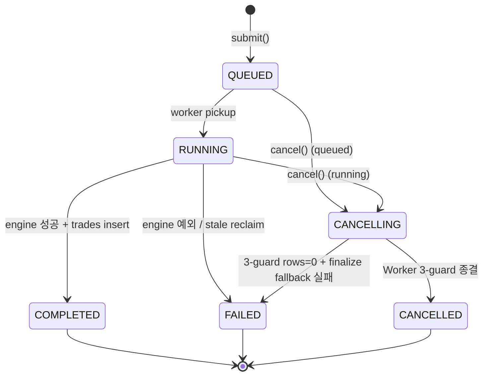
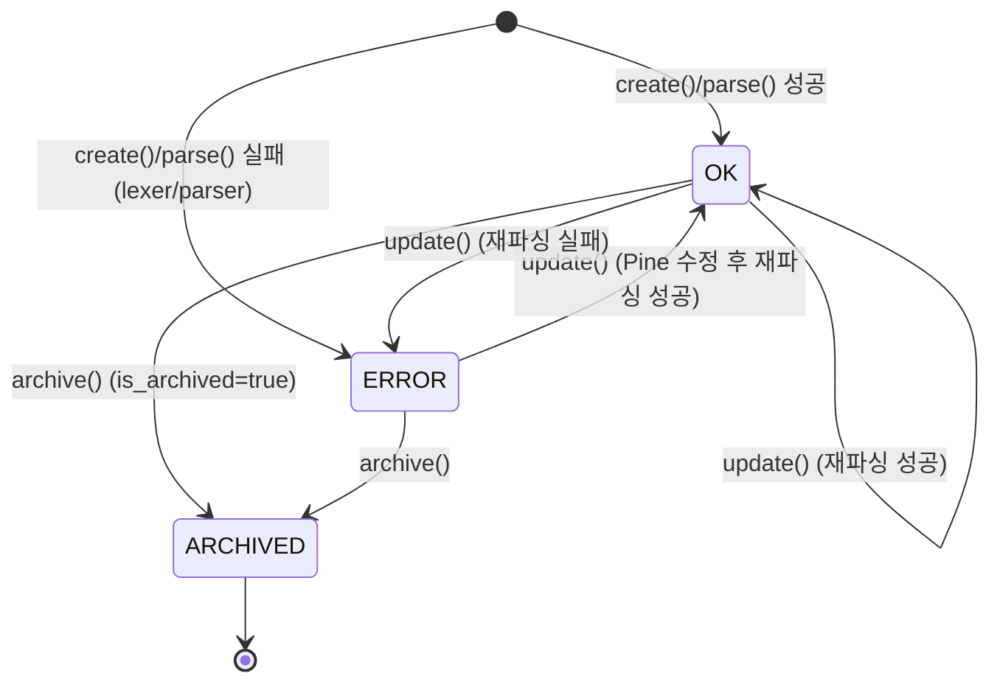
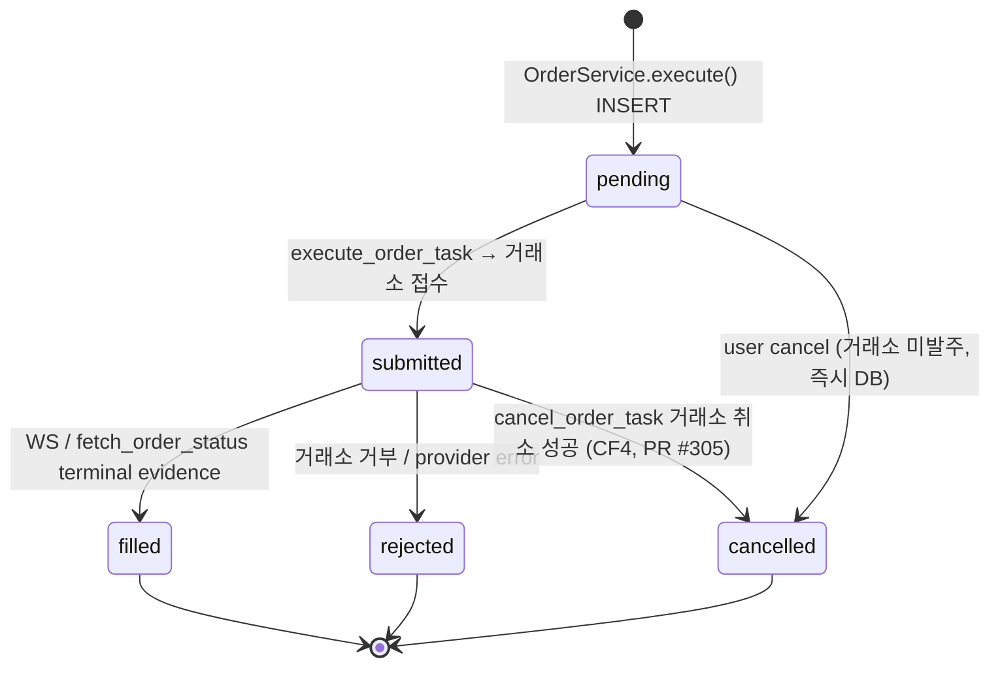
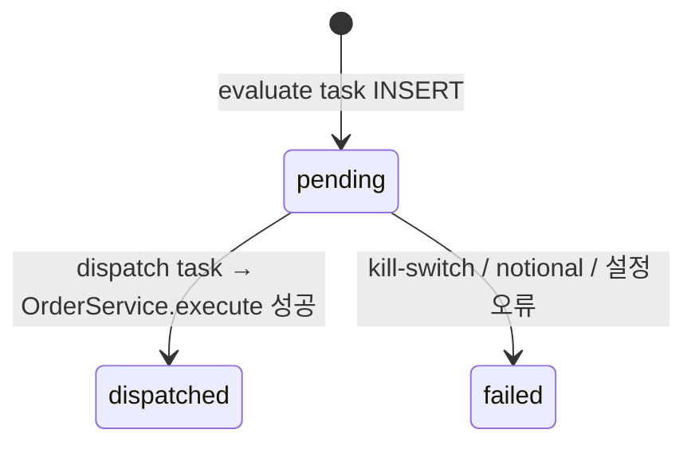
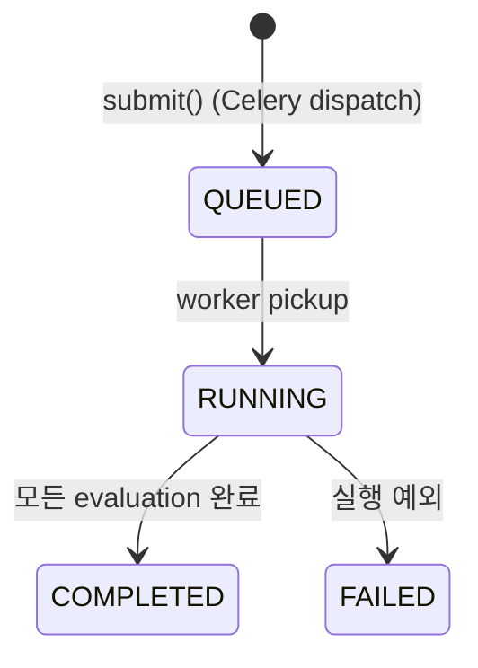
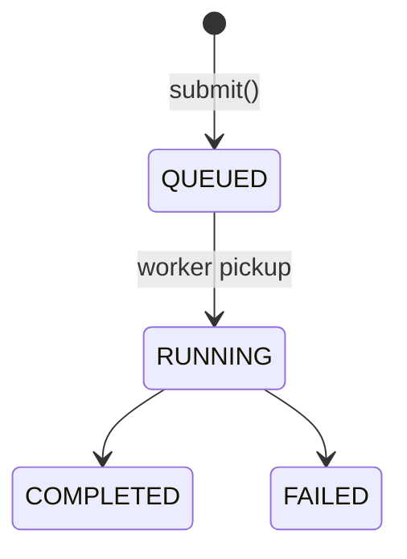

# QuantBridge — 상태 머신

> **목적:** 도메인 엔티티의 상태 전이도 + 가드 조건.
> **SSOT:** 전이 로직은 각 도메인 `service.py`. 여기서는 의도/계약을 명세.

---

## 1. Backtest

### 전이도



### 상태 정의 (SQLModel `BacktestStatus`)

| 상태         | 의미                                      | 진입 조건                                  | 종결 조건                                               |
| ------------ | ----------------------------------------- | ------------------------------------------ | ------------------------------------------------------- |
| `QUEUED`     | Celery 큐 등록됨, 워커 pickup 대기        | `submit()` 직후                            | 워커 pickup → RUNNING 또는 cancel → CANCELLING          |
| `RUNNING`    | 워커가 실행 중                            | 워커 `_execute()` 진입 시 조건부 UPDATE    | engine 완료/예외 또는 cancel                            |
| `CANCELLING` | 사용자 cancel 요청 — transient            | `BacktestService.cancel()` 호출            | 워커 3-guard에서 CANCELLED 또는 fallback 실패 시 FAILED |
| `COMPLETED`  | engine 성공 + metrics + trades 모두 저장  | engine result + trade insert 단일 트랜잭션 | terminal                                                |
| `FAILED`     | engine 예외, stale reclaim, fallback 실패 | 예외 catch 또는 reclaim hook               | terminal                                                |
| `CANCELLED`  | 사용자 cancel 종결                        | 3-guard 또는 finalize_cancelled fallback   | terminal                                                |

### 전이 가드 (Service 책임)

| from                   | to                     | 가드                                                                         |
| ---------------------- | ---------------------- | ---------------------------------------------------------------------------- |
| QUEUED → RUNNING       | worker pickup          | 조건부 UPDATE `WHERE status='queued'` (다른 워커 동시 pickup 방지)           |
| RUNNING → COMPLETED    | engine 성공            | 조건부 UPDATE `WHERE status='running'` + trade bulk insert (단일 트랜잭션)   |
| RUNNING → FAILED       | engine 예외            | 조건부 UPDATE; rows=0이면 이미 cancel 처리됨 → 무시                          |
| (any) → CANCELLING     | cancel 요청            | 현 상태가 terminal이면 거부 (409)                                            |
| CANCELLING → CANCELLED | worker 3-guard         | (1) pickup 전 (2) pre-engine (3) post-engine 3 위치에서 체크 + 조건부 UPDATE |
| CANCELLING → FAILED    | rows=0 + fallback 실패 | `finalize_cancelled` rows=0 시 logger.error + FAILED 처리                    |

### 3-Guard Cancel 패턴 (Sprint 4 §5.1)

워커 `_execute()` 흐름:

```
Guard #1: pickup 직전
  → cancellation_requested_at NOT NULL이면 즉시 finalize_cancelled() 후 return

Guard #2: pre-engine (engine 호출 직전)
  → cancellation_requested_at NOT NULL이면 finalize_cancelled() 후 return

[engine 실행]

Guard #3: post-engine (결과 저장 직전)
  → cancellation_requested_at NOT NULL이면 결과 폐기 + finalize_cancelled() 후 return
```

**원칙:**

- `assert bt is not None` 금지 (python -O로 제거됨) → `if bt is None: logger.error + return`
- 조건부 UPDATE rows=0 → 반드시 `finalize_cancelled` fallback 호출
- 완료 write와 trade insert는 단일 트랜잭션 (atomicity)

### Stale Reclaim

| 조건                                                 | 처리                                                                                   |
| ---------------------------------------------------- | -------------------------------------------------------------------------------------- |
| `status=RUNNING` + `started_at < now - threshold`    | startup hook 또는 beat task가 FAILED로 전환 + `error_reason="stale_reclaimed"`         |
| `status=CANCELLING` + `started_at < now - threshold` | 동일 처리. `started_at NULL`(QUEUED→CANCELLING) 시 `created_at` fallback (Sprint 4 D9) |

- startup hook과 Celery Beat가 stale reclaim을 함께 수행한다. Beat 주기는 `tasks/celery_app.py`가 정한다.

### 코드 위치

- 전이 검증/디스패치: `apps/api/src/backtest/service.py` (`BacktestService`)
- 워커 실행: `apps/api/src/tasks/backtest.py` (`run_backtest_task`, `_execute`)
- 조건부 UPDATE: `apps/api/src/backtest/repository.py`
- Reclaim: `apps/api/src/tasks/backtest.py` `reclaim_stale_running` + `@worker_ready` hook in `celery_app.py`

---

## 2. Strategy

### 전이도



### 상태 정의

> Strategy 는 단일 status 컬럼이 없다 — `parse_status` (StrEnum: `ok` / `unsupported` / `error`) + `is_archived` (bool) 조합. create()/update() 시 `_parse` 가 즉시 실행되어 parse_status 를 terminal 값으로 set (영속 PENDING 상태 없음). **파서는 `ok` 또는 `error` 만 set 한다** (`service.py:114,130`); `unsupported` 는 enum 예약값으로 현재 코드에서 미사용 — 미지원 함수는 parse_status 가 아니라 **backtest 제출 시 coverage analyzer** 가 판정한다 (`is_runnable = parse_status==ok AND coverage.is_runnable`, `service.py:176`; ADR-003 all-or-nothing).

| 논리 상태                            | parse_status | is_archived |
| ------------------------------------ | ------------ | ----------- |
| OK (백테스트 가능 후보)              | `ok`         | false       |
| ERROR (파싱 실패, parse_errors 기록) | `error`      | false       |
| ARCHIVED                             | (any)        | true        |

### 가드

- `is_archived=true` → 백테스트 새로 제출 금지 (Sprint 5+ FE 검증 예정)
- `parse_status=UNSUPPORTED` → 백테스트 제출 시 service에서 거부
- DELETE 시 backtests가 참조 중이면 409 (FK RESTRICT + IntegrityError → `StrategyHasBacktests`)
- ARCHIVE는 hard delete 우회 — FE에서 사용자 가이드 예정 (Sprint 5+ UX)

### 코드 위치

- `apps/api/src/strategy/service.py` (`StrategyService`)
- 파서 + 인터프리터 (SSOT): `apps/api/src/strategy/pine_v2/` (`parser_adapter` / `interpreter` / `coverage` / `stdlib`)

---

## 3. Trading — Order / LiveSignalSession / LiveSignalEvent (Sprint 6 / 7d / 26 구현됨)

> 단일 "TradingSession" 테이블은 존재하지 않는다. 실제 trading lifecycle 은 3개 모델로 구성된다.

### 3.1 Order 상태 머신 (`trading/models.py:Order`, `OrderState`)



- 모든 전이는 조건부 UPDATE (`WHERE state=...`) — race winner-only.
- **CF4 (PR #305)**: submitted(거래소 live) 주문은 `cancel_order_task` 가 `provider.cancel_order` 성공 시에만 cancelled (fail-closed → orphan position 방지). pending 은 `transition_pending_to_cancelled` 로 즉시 DB cancel.
- 게이트(pending 진입 전): leverage cap / notional(CF5 initial-margin) / kill-switch / trading_sessions / TRD-4 ownership → reject.
- stale submitted 회수: `fetch_order_status_task` watchdog + `orphan_scanner`.

### 3.2 LiveSignalSession — 자동매매 세션 (`trading/models.py:LiveSignalSession`)

- 상태 = `is_active` (bool). `register()` → active, `deactivate()` → inactive. partial unique index (is_active=true 만 unique → deactivate 후 재INSERT 가능).
- 가드: Bybit Demo 한정 (`AccountModeNotAllowed`, BL-003 mainnet runbook 완료 전), user 당 active ≤ 5 (`LiveSessionQuotaExceeded`), strategy/account 소유권 검증.
- ★**읽기 전용 키 거부** (`ReadOnlyAccountNotAllowed`, 422 `read_only_account_not_allowed` —
  2026-08-15 surface-truth U1). 종전에는 read-only 키로 세션을 **열 수는 있는데 닫을 수 없었다**
  (청산이 `close_service` 에서 422 `read_only_key`). `read_only is True` 만 막는다 — `None` 은
  「모른다」(구 계정)이고 잠그면 기존 사용자가 전부 막힌다.
- ★**계정 배타성** (`account_not_exclusive`, 409) · **중복 세션**(`session_already_active`, 409) ·
  잔고 기준선 실패 · 데모 안정화 기간(`DemoAccountNotYetStable`) · `provider_error` fail-closed(502).

**종료 사유 — 정본은 `trading/models.py:SessionDeactivationReason` 이고 값 집합은 원장 CHECK
(`ck_live_signal_sessions_deactivated_reason`)가 못박는다([BL-571]).** 사유를 추가하려면
**enum + 마이그레이션 + FE 라벨(`features/live-sessions/labels.ts`) 3곳**을 함께 고쳐야 한다.

| 사유                                                                                            | 계기                                                                                                                                                                                                   |
| ----------------------------------------------------------------------------------------------- | ------------------------------------------------------------------------------------------------------------------------------------------------------------------------------------------------------ |
| `coverage_unrunnable` · `degraded_unconsented` · `equity_baseline_missing` · `equity_exhausted` | preflight (평가 진입 전 차단)                                                                                                                                                                          |
| `run_live_error` · `runtime_divergence`                                                         | runtime (Pine 재생 중 발산)                                                                                                                                                                            |
| `gap_resync_position_mismatch` · `position_divergence`                                          | 포지션 정합 실패                                                                                                                                                                                       |
| `user_stopped`                                                                                  | 사람이 Stop 을 눌렀다                                                                                                                                                                                  |
| `account_deleted`                                                                               | ★탈퇴(`DELETE /api/v1/auth/me` → `auth/service.py` `deactivate_account`)가 소유자의 세션을 **전량** 내린다. 2026-08-15 S3 가 만든 경로이고, ADR-034 로 입구만 구 Clerk 웹훅에서 이 엔드포인트로 옮겼다 |

★**중단은 미체결 조건부 진입을 자동 취소한다** — `deactivate` + commit 뒤
`sweep_conditional_entries_task.apply_async` 가 예약되고 실제 취소는 그 task 의
`provider.cancel_order` 다. **즉시가 아니다**(예약과 실행 사이에 창이 있다). 2026-08-15 전까지
화면은 정반대(「미체결 주문은 유지됩니다」)를 말하고 있었다.

★**탈퇴는 세션만 내리는 것이 아니다** — 같은 트랜잭션에서 소유자의 웹훅 시크릿을 **grace 0 으로
전량 revoke** 하고, 주문 경로에는 `is_owner_active` 심층 방어가 선다(2026-08-15 S3).
`ExchangeAccount` 행은 **지우지 않는다**(2026-08-11 사용자 결정 + FK `ondelete=RESTRICT`).

### 3.3 LiveSignalEvent — transactional outbox (`trading/models.py:LiveSignalEvent`, `LiveSignalEventStatus`)



### Kill Switch (별도 게이트, 세션 상태 아님)

`KillSwitchEvent` (active = `resolved_at IS NULL`). `ensure_not_gated` 가 주문 전 평가 + 신규 breach event 기록. **MP-1+ASYNC-1 (PR #305)**: 손실 평가기(CumulativeLoss/DailyLoss)가 `Order.realized_pnl` 기반으로 실제 작동(이전 inert) + event INSERT 가 OrderService savepoint 밖 commit (롤백 유실 방지).

---

## 4. Optimization — Grid / Bayesian / Genetic (Sprint 54-57 구현됨, ADR-013)

> ★**ADR-013 은 `docs/decisions/` 에 파일이 없다**(결번). 실체는 삭제된 dev-log 이고 git 에 살아 있다 —
> `git show 94da86b1^:docs/dev-log/2026-05-12-sprint54-bayesian-genetic-grammar-adr.md` ([BL-504]).

### 전이도 (`optimizer/models.py:OptimizationStatus`)



- `OptimizationKind` = `grid_search` / `bayesian` / `genetic`. `OptimizationStatus` = `queued` / `running` / `completed` / `failed` — **cancel 상태 없음** (계획상 CANCELLED 는 미구현).
- stale RUNNING은 `optimizer.reclaim_stale` Celery task가 FAILED로 회수한다. cancel 상태가 없으므로 reclaim 대상은 RUNNING뿐이다.

---

## 5. StressTest — Monte Carlo / Walk-Forward / Cost-Assumption / Param-Stability (Sprint 50-52 구현됨)

### 전이도 (`stress_test/models.py:StressTestStatus`)



- `StressTestKind` = `monte_carlo` / `walk_forward` / `cost_assumption_sensitivity` / `param_stability`. Status = `queued` / `running` / `completed` / `failed`.
- stale RUNNING은 `stress_test.reclaim_stale` Celery task가 FAILED로 회수한다. submit idempotency의 상세 계약은 service·repository가 정본이다.

---

## 6. 공통 원칙

### 조건부 UPDATE

모든 상태 전이는 `WHERE status='<expected>'` 조건부 UPDATE로 race condition 방지.

### Transient State

`CANCELLING`은 transient — terminal 상태로의 전이를 위한 중간 단계.

### Reclaim Pattern

워커 crash로 stale된 작업은 Celery Beat가 Backtest·Optimizer·Stress Test별 reclaim task로 회수한다. Backtest만 CANCELLING 상태를 추가로 다룬다.

### Atomicity

완료 write + 자식 데이터 insert (예: backtest_trades)는 단일 트랜잭션.

### Logging

상태 전이 실패 (rows=0) 시 logger.error로 가시성 확보. silently swallow 금지 (단 `@worker_ready` hook은 의도된 best-effort 예외).

---

## 변경 이력

- **2026-04-16** — 초안 작성 (Sprint 5 Stage A)
- **2026-05-29** — 감사 reconciliation (Phase B): Strategy parse_status 실제 enum(ok/unsupported/error)으로 교정 + 파서 ok/error-only 명시. §3 TradingSession(미구현 phantom FSM) → 실제 shipped Order/LiveSignalSession/LiveSignalEvent 상태 머신으로 교체. §4 Optimization / §5 StressTest "미구현" → shipped(Sprint 50-57) + 실제 status enum(cancel 상태 없음). Reclaim Pattern = Backtest-only 명시 (CF3/ASYNC-2 open).
