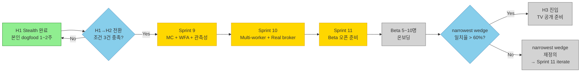

# Plan: H2 Kickoff — 지인 Beta + Trust/Scale 우선 작업

> **Session:** H1 Stealth 클로징 5-Step 풀패키지 Step 5 (2026-04-20)
> **Branch:** `docs/h2-gate-plan`
> **Methodology:** `/office-hours` Q4 (narrowest wedge) 중심 brainstorm 결과 정리.
> **전제:** H1 → H2 전환 조건 (roadmap.md §Checkpoint)이 **모두 충족된 후** 이 plan으로 진입.
> **Memory hook:** `feedback_office_hours_q1_vs_q4` 규칙 — Q1(demand) skip, Q4(narrowest wedge)로 바로.

---

## 1. 목적 & 범위

**목적:** Horizon H2 (1.5~4m)의 Sprint 9~11 scope을 사전에 정렬해, H1 dogfood 완료 직후 주저 없이 착수할 수 있는 plan을 확보.

**범위 (in-scope):**

- Q4 narrowest wedge 재확인 (2026-04-20 현재 데이터 기준)
- Sprint 9/10/11 분해 초안
- Beta 5~10명 획득 경로 설계
- 6 개 H2 결정 포인트 정렬 (별점 추천)

**범위 밖 (이번 plan에서 결정 금지):**

- H2 가격 정책 확정 (Monetize는 H2 말 ~ H3)
- 실제 ToS/Disclaimer 법률 문구 (법무 자문 필요)
- AI 전략 생성 실험 (H3 범위)
- H1 dogfood 결과에 따라 바뀔 가정은 `[H1 dogfood 후 재검토]` 라벨

---

## 2. Narrowest Wedge 재확인 (Q4 결과)

### 현재 정의 (`roadmap.md` §개요 Primary persona)

> 파트타임 크립토 트레이더 (Python 가능) · TV 유료 구독 · 자본 $1K~$50K · Pine 작성 가능

### Q4 Drill-down (2026-04-20 기준)

**"현재 가장 구체적인 1명은 누구인가?"**

| 요소               | 값                                                                                   |
| ------------------ | ------------------------------------------------------------------------------------ |
| 직업               | 타 산업 소프트웨어 엔지니어 + 사이드로 크립토 트레이딩                               |
| 거주               | 한국 (타임존 아시아/서울)                                                            |
| TV 사용            | Pro+ 구독 (월 $30), Alert 설정 경험 있음                                             |
| Pine 수준          | v4/v5 읽고 수정 가능, scratch 작성 가능                                              |
| 자본               | $3K~$10K Bybit Futures                                                               |
| Pain               | 알림 수신 → 수동 주문 지연 5~30초. 수면/업무 중 놓침. 3commas는 UI 복잡 + 구독 $59/m |
| Trigger            | 최근 1주 내 Pine alert을 놓쳐서 큰 손실 또는 큰 수익 기회 상실 경험                  |
| Willingness to pay | $10~$30/m (TV Pro+ 이미 내고 있는 수준)                                              |

### 확정 narrowest wedge (H2 Beta 대상)

> **TV Pro+ 구독 중이며 Bybit Futures $3K~$10K를 본인 Pine 전략으로 운용하고 있는 파트타임 트레이더. 3commas/Cryptohopper/Alertatron를 써봤거나 비교 검토한 경험이 있음.**

이 정의 하나에 Beta 5~10명이 **모두** 해당해야 함. 미해당 사용자는 "타깃 아님" 태그로 보류.

---

## 3. 6 결정 포인트 (별점 추천)

### D-1. Sprint 9 우선순위 — Monte Carlo vs 파라미터 최적화

|   추천도   | 옵션                                   | 설명                                                                                              |
| :--------: | -------------------------------------- | ------------------------------------------------------------------------------------------------- |
| ⭐⭐⭐⭐⭐ | **A. Monte Carlo + Walk-Forward 먼저** | narrowest wedge 사용자가 백테스트 **신뢰**에 가장 큰 가치. 최적화는 후행. Trust 우선 원칙과 일치. |
|   ⭐⭐⭐   | B. Bayesian 파라미터 최적화 먼저       | 기술적으로 흥미롭지만 Beta 사용자 pain이 약함.                                                    |
|    ⭐⭐    | C. 동시 병렬                           | 1 인 개발로 context switch 비용 큼. 권장 X.                                                       |

**결정 (자동):** A. H2 Sprint 9 = Monte Carlo + Walk-Forward.

### D-2. Beta 5~10명 획득 경로

|   추천도   | 경로                                             |                  규모                  |          전환율 가정           |
| :--------: | ------------------------------------------------ | :------------------------------------: | :----------------------------: |
| ⭐⭐⭐⭐⭐ | **A. 본인 Twitter/X #buildinpublic 팔로어 + DM** | 팔로어 200~500 (build in public 6m 후) |         2~5% → 5~25명          |
|  ⭐⭐⭐⭐  | B. 한국 Pine Script / 퀀트 블로그·디스코드       |          주요 커뮤니티 2~3개           |        0.5~1% → 10~30명        |
|   ⭐⭐⭐   | C. Reddit r/PineScript + r/algotrading           |           각 50k / 180k 멤버           | 0.05% → 25~130명 (노이즈 많음) |
|    ⭐⭐    | D. Cold DM (TV 공개 트레이더)                    |                   0                    |       스팸 금지, 비권장        |

**결정 (자동):** **A + B 혼합.** Twitter/X를 **주 채널**로 하되, 한국 Pine 블로그·디스코드는 **긴 꼬리 광고** 용. C는 H3 공개 준비 단계로 연기.

### D-3. Freemium 티어 경계

|  추천도  | 옵션                  | 무료                       | 유료                                     |
| :------: | --------------------- | -------------------------- | ---------------------------------------- |
| ⭐⭐⭐⭐ | **A. 거래소 수 기반** | 단일 거래소 (Bybit or OKX) | 멀티 거래소 + 고급 분석(MC/WFA/Bayesian) |
|  ⭐⭐⭐  | B. 백테스트 기간      | 1년 이내                   | 전체 기간 + 최적화                       |
|  ⭐⭐⭐  | C. 전략 수            | 3개                        | 무제한 + 최적화                          |
|   ⭐⭐   | D. 가격 단일 티어     | —                          | $19/m or $29/m flat                      |

**결정 (임시):** A. 거래소 수가 가장 명확한 가치 증분. H2 Beta 중 유료 전환 의향 확인 후 H3에서 확정.
**[H2 Beta 후 재검토]**

### D-4. 관측성 도구 선택

|   추천도   | 옵션                                      |     비용 (MAU 100 가정)     | 트레이드오프                             |
| :--------: | ----------------------------------------- | :-------------------------: | ---------------------------------------- |
| ⭐⭐⭐⭐⭐ | **A. Prometheus + Grafana Cloud Free**    | $0 (10k metrics, 50GB logs) | OSS 친화, 셋업 시간 2~3h. Beta 규모 충분 |
|   ⭐⭐⭐   | B. Datadog Starter                        |     $15/host/m = $45/m      | Managed 편의, H3 이후 규모 커질 때       |
|    ⭐⭐    | C. Self-host full stack (Loki+Prom+Tempo) |         $0 + 서버비         | 운영 부담 큼. 1인 개발 불리              |

**결정 (자동):** A. H2 중 Grafana Cloud Free로 시작. H3 MRR 검증 후 Datadog 이전 검토.

### D-5. 법무·Disclaimer 전략

|   추천도   | 옵션                                                                   |    비용     | 시점                                 |
| :--------: | ---------------------------------------------------------------------- | :---------: | ------------------------------------ |
| ⭐⭐⭐⭐⭐ | **A. 한국 변호사 스타트업 패키지 + 영문 ToS/Disclaimer 템플릿 커스텀** | $500~$1,500 | H2 **말** (Beta 오픈 직전)           |
|   ⭐⭐⭐   | B. 오픈소스 template 기반 + AI 검토                                    |   $0~$50    | 임시 법적 효력 낮음. Beta까지만 허용 |
|    ⭐⭐    | C. 해외 온라인 법무 서비스 (LegalZoom 유사)                            |  $300~$800  | 한국 특금법/약관규제법 커버 부족     |

**결정 (임시):** **B로 시작 (H2 Beta 전 임시) → A로 교체 (H2 말)**. 법무 자문은 H2 Sprint 12~13 범위.

### D-6. US·EU 지리적 차단 구현

|   추천도   | 옵션                                                                      | 구현 난이도 |        확실성        |
| :--------: | ------------------------------------------------------------------------- | :---------: | :------------------: |
| ⭐⭐⭐⭐⭐ | **A. Cloudflare WAF Geo-block + Clerk signup restriction + landing 명시** | 낮음 (1~2h) |    높음 (3 계층)     |
|   ⭐⭐⭐   | B. Clerk만                                                                |    낮음     | 중간 (VPN 우회 가능) |
|    ⭐⭐    | C. IP 블랙리스트만                                                        |    중간     |         낮음         |

**결정 (자동):** A. 3 계층 방어. Beta 오픈 전 필수.

---

## 4. Sprint 9~11 분해 초안

### Sprint 9 — Monte Carlo + Walk-Forward + 관측성 (3~4주)

**목표:** 백테스트 결과에 대한 **신뢰도 표시**를 추가하여 narrowest wedge 사용자의 핵심 pain (백테스트 overfitting) 해결.

#### Tasks

- [ ] **9-1** Monte Carlo 리샘플링 엔진 (bootstrap 1000회) — 수익률 분포 + 95% CI
- [ ] **9-2** Walk-Forward Analysis — train/test window 이동, out-of-sample 성과
- [ ] **9-3** Frontend UI — 백테스트 결과 탭에 MC/WFA 섹션 추가 (recharts)
- [ ] **9-4** 관측성 Phase 1 — Prometheus metric 5종 실제 계측 (PR #39 §observability-plan.md)
- [ ] **9-5** Grafana Cloud Free 대시보드 설정 + alert 1개 (order_rejected_rate > 10%)
- [ ] **9-6** Idempotency-Key 지원 (`POST /backtests`) — Beta 전 필수

#### Acceptance Criteria

- [ ] 백테스트 1개에 MC 분포 + WFA curve 표시
- [ ] 본인이 Sprint 9 완료 후 실제로 "이 전략 신뢰도 X%" 판단에 사용했는지 주관 평가
- [ ] Prometheus alert이 실제 이벤트에 발동 (테스트 데이터로라도)

### Sprint 10 — Multi-worker 안정성 + Real broker 테스트 (2~3주)

**목표:** Beta 사용자가 붙기 시작하는 시점의 infrastructure hardening.

#### Tasks

- [ ] **10-1** Multi-worker split-brain Redis lock (현재 PG advisory만)
- [ ] **10-2** Real broker 테스트 인프라 (pytest-celery + Bybit testnet fixture)
- [ ] **10-3** TimescaleDB compression/retention policy (30일 hot, 90일 cold)
- [ ] **10-4** CCXT 호출 계측 상세화 (per-exchange latency/error rate)
- [ ] **10-5** Rate limiting middleware (per-user, per-endpoint)

#### Acceptance Criteria

- [ ] 2개 worker 동시 실행에서도 중복 주문 0건 (테스트)
- [ ] 테스트 suite에서 실제 Bybit testnet 주문 1건 검증 (E2E 1건)
- [ ] 하루 OHLCV 데이터 수집 후 1주 전 데이터 자동 compression 확인

### Sprint 11 — Beta 오픈 준비 + US·EU 차단 + 법무 임시 (2주)

**목표:** 지인 Beta 5~10명 온보딩 개시.

#### Tasks

- [ ] **11-1** US·EU geo-block 3계층 (Cloudflare WAF + Clerk + landing)
- [ ] **11-2** Disclaimer + ToS 임시 템플릿 작성 (D-5 B안)
- [ ] **11-3** Waitlist 페이지 + Beta 초대 이메일 자동화
- [ ] **11-4** Onboarding flow — 계정 등록 → 첫 전략 → 첫 백테스트 5분 target
- [ ] **11-5** Beta 사용자 인터뷰 스케줄 (주 1회, 30분, 최소 3회/사용자)

#### Acceptance Criteria

- [ ] 본인 외 실 사용자 3명이 계정 생성 완료
- [ ] 그 중 2명이 1주 이상 연속 사용 (백테스트 or 트레이딩)
- [ ] 인터뷰 3회에서 narrowest wedge 정의 PASS 확인 (미해당이면 scope 재정의)

---

## 5. Beta 5~10명 획득 경로 상세

### 타임라인 (H2 Sprint 11 기준)

```
H2 Week 1~4  (Sprint 9)      Build in public 주 1회 포스트. Twitter 팔로어 증가 관찰.
H2 Week 5~7  (Sprint 10)     "Beta 지원서" 랜딩 페이지 오픈. Waitlist 수집.
H2 Week 8~9  (Sprint 11)     Waitlist 중 narrowest wedge 일치자만 초대 (1:1 DM).
H2 Week 10~12                Beta 5~10명 실사용. 주 1회 인터뷰.
```

### Twitter/X 컨텐츠 계획 (Sprint 9부터)

- **주 1회 포스트** (한국어 메인 + 영어 요약):
  - Week 1: "Monte Carlo로 Pine 전략 신뢰도 체크하기" (technical deep dive)
  - Week 2: "Walk-Forward Analysis가 왜 중요한가" (pain point framing)
  - Week 3: "QuantBridge로 Bybit 백테스트 10초에 돌리는 법" (feature demo GIF)
  - Week 4: Beta 지원서 오픈 announcement
- **타겟 해시태그:** `#PineScript` `#TradingView` `#Bybit` `#Quant` `#buildinpublic`

### Beta 지원서 양식 (narrowest wedge 필터링)

필수 항목 (5개):

1. TV 구독 레벨 (Pro+ 필수)
2. Bybit 또는 OKX 계좌 보유 여부 + 운용 자본 규모 ($1K+)
3. Pine Script 작성 경험 (v4/v5 둘 중 하나 scratch 작성 가능)
4. 현재 사용 중인 자동매매 도구 (3commas/Cryptohopper/자체 코드 등)
5. 가장 큰 pain (free text, 3줄)

Non-qualifier 즉시 거절 (정중히):

- 한국 은행/증권 계좌로 퀀트 하려는 사람 (타깃 아님)
- Pine 경험 없음 (지원 불가)
- 자본 $0 (testnet만 원하는 경우 H3로 redirect)

---

## 6. 의존성 다이어그램



---

## 7. 리스크 & 완화 (H2 신규)

| 리스크                           | 완화                                                                         | 트리거 지표                 |
| -------------------------------- | ---------------------------------------------------------------------------- | --------------------------- |
| Beta 5명 미확보 (Week 12)        | D-2 경로 B(한국 커뮤니티) + C(Reddit) 병행 확대. 본인 dogfood 1개월 더 연장. | Waitlist < 10건 (Week 8)    |
| narrowest wedge 미일치 Beta 다수 | 즉시 refund(금전적 아님, 초대 취소) + 인터뷰에서 miss reason 수집            | narrowest wedge 일치 < 60%  |
| Monte Carlo 성능 문제 (10초+)    | Numba 또는 Cython AOT. 1000회 → 500회 감소 옵션                              | 1년 1H 백테스트 MC > 30초   |
| 법무 임시 템플릿(B) 리스크 노출  | H2 Sprint 12~13에 반드시 A(변호사)로 교체. Beta는 "법무 임시" 고지 필수      | Beta 오픈 후 3개월 내       |
| Grafana Cloud Free 한도 초과     | Datadog Starter로 전환. 월 $45 부담                                          | metric > 9,500 / log > 45GB |

---

## 8. H2 → H3 전환 정량 게이트 (roadmap.md §Checkpoint 재확인)

- [ ] 지인 Beta 5명 중 **3명 이상 1주 연속 사용** (현재 정의 유지)
- [ ] Monte Carlo / Walk-Forward 본인 사용 1회 이상 (현재 정의 유지)
- [ ] Freemium 티어 경계 결정 (구현 전) (D-3 후 재확인)
- [ ] **[신규]** 본인 주관 평가: "이 시스템을 친한 지인 5명 넘어 **낯선 Twitter 팔로어 3명**에게 권할 수 있다" PASS
- [ ] **[신규]** 유료 전환 의향 (price ladder $10/$20/$30) 중 **$20 이상 YES가 30% 이상**

---

## 9. 다음 세션 (H1 dogfood 완료 직후)

이 plan을 input으로 재진입할 세션:

1. **Sprint 9 kickoff** — `/superpowers:writing-plans` + 본 문서 §4 Sprint 9 task 분해
2. **Design review** — Monte Carlo UI mockup (gstack `/design-shotgun` 또는 `/plan-design-review`)
3. **H1 dogfood retrospective** — `docs/reports/2026-05-XX-h1-dogfood-retrospective.html` (세션 기록)

---

## 10. Out-of-scope for H2 (명시적 거부)

- AI 전략 생성/번역 (H3 실험 태그, Pine 보안과 충돌 검증 선행 필요)
- 한국 원화 결제 / 사업자 등록 (H3 Monetize)
- 옵션/선물 외 파생상품 (vision.md 비범위)
- 모바일 네이티브 앱 (반응형 웹만)
- 회계/세무 리포트 (외부 도구 연동 권장)

---

## 변경 이력

- **2026-04-20** — 초안 작성 (H1 Stealth 클로징 5-Step 풀패키지 Step 5). 6 결정 포인트 + Sprint 9~11 분해 + Beta 획득 경로.
