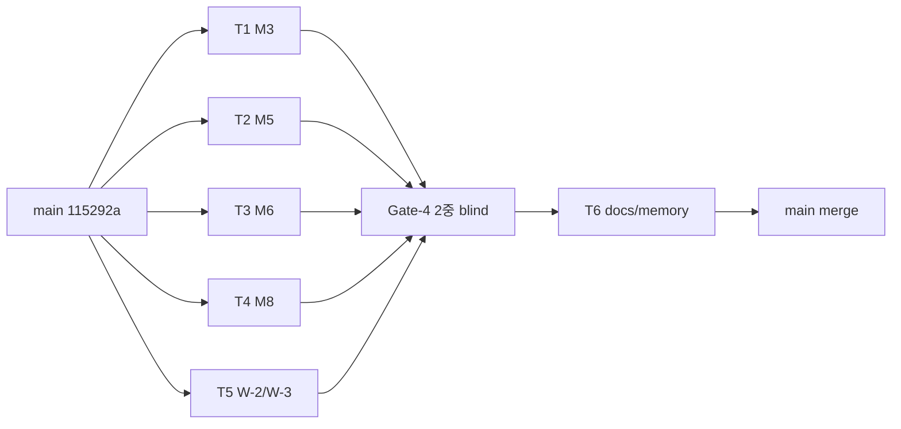

# Path β Stage 2c 2차 — SDD 실행 플랜 (Docs-First)

> **상태:** Phase A (Docs) 작성 완료 · Phase B (구현) ExitPlanMode 승인 대기
> **일자:** 2026-04-23
> **상위 ADR:** [`dev-log/013-trust-layer-ci-design.md §10.4`](../../dev-log/013-trust-layer-ci-design.md#104-stage-2c-2차-구현-설계-2026-04-23-pre-entry)
> **아키텍처:** [`04_architecture/trust-layer-architecture.md §3.1.2`](../../04_architecture/trust-layer-architecture.md#312-mutation-oracle-커버리지-stage-2c-1차-실측--2차-설계-2026-04-23)
> **Plan 세션 파일:** `~/.claude/plans/path-lucky-squid.md`

---

## 1. 배경 · Scope

Path β Trust Layer CI 의 마지막 마일스톤. 현재 main(`115292a`) 상태:

- Stage 0/1/2/2c 1차 4 PR (#62/#64/#65/#66) 머지 완료
- Mutation Oracle **4/8 감지** (M1/M2/M4/M7)
- 이연: M3/M5/M6/M8 (Stage 2c 1차 파일에 skeleton · skip marker 존재)
- Gate-3 W-2 (M2 명칭) + W-3 (M4 N/A 구분) 미정리
- backend 985 pass / 17 skip / 0 fail

**목표:** SLO TL-E-5 (Mutation 감지 ≥ 7/8) green → **Path β 완료 선언**.
**Deadline:** 2026-05-31 (H1 종료 전).
**브랜치:** `feat/path-beta-stage2c-2nd` ← main(`115292a`), PR base=main 직접 (stacked 회피).

---

## 2. Phase A · Docs-First (이번 세션 완료)

사용자 원칙 **"문서가 없으면 기능도 없다"** + **Plan Before Code** 정합. 구현 착수 전 다음 문서 sync:

| #   | 파일                                                    | 변경                                                             | 상태 |
| --- | ------------------------------------------------------- | ---------------------------------------------------------------- | ---- |
| 1   | `docs/dev-log/013-trust-layer-ci-design.md`             | §10.4 Stage 2c 2차 구현 설계 서브섹션 신설 + §11 pre-entry 행    | ✅   |
| 2   | `docs/04_architecture/trust-layer-architecture.md`      | §3.1.2 Mutation Oracle 커버리지 신설 (mutation × 레이어 매핑 표) | ✅   |
| 3   | `docs/TODO.md`                                          | Stage 2c 1차 완료 체크 + 2차 In Progress (T1~T6) 추가            | ✅   |
| 4   | `docs/superpowers/plans/2026-04-23-stage2c-2nd-plan.md` | 본 파일 신규 (SDD 실행 플랜 공식화)                              | ✅   |

---

## 3. Phase B · SDD 구현 계획 (ExitPlanMode 승인 후)

### 3.1 Task 분해 (6 atomic commits)

T1~T5 는 모두 `backend/tests/strategy/pine_v2/test_mutation_oracle.py` 한 파일의 **서로 다른 함수** 만 touch. 함수 단위 scope 가 분리되어 자율 SDD 워커 5 병렬 안전.

#### T1 — M3: StrategyState.entry 반환 None cascade

- **Hook:** `patch.object(StrategyState, "entry", mutated_entry)`
- **시뮬:** 원본 호출 후 `open_trades.pop(trade_id, None); return None` → entry 자체가 **no-op**
- **감지:** `num_trades` drop (s1/s2/s3/i1 4 corpus 모두 drift)
- **위치:** 신규 `test_m3_strategy_entry_return_is_detected`
- **회귀:** 낮음 (`with` 블록 scope)

#### T2 — M5: fill_price ABS_TOL drift

- **Hook:** `patch.object(StrategyState, "entry", lambda ...: original(... fill_price=fill_price + 0.005 ...))`
- **감지:** 0.005 > ABS_TOL(0.001) × 5 → `trades_digest` entry_price 필드 변경 (i1_utbot 461 trades 안정)
- **위치:** 기존 `test_m5_entry_price_drift_is_detected` (L240-247) skip 제거 후 구현
- **회귀:** 낮음

#### T3 — M6: PnL Decimal precision leak

- **Hook:** `patch.object(StrategyState, "close", mutated_close)` — 반환 `trade.pnl` 에 `Decimal(str(pnl)) * Decimal("1.0001")` 0.01% drift
- **감지:** 461 trades 누적 → `metrics.total_return` drift > ABS_TOL, 보조로 `trades_digest` pnl 필드
- **위치:** 신규 `test_m6_pnl_decimal_float_leak_is_detected`
- **튜닝:** 1.0001 이 ABS_TOL 통과면 0.05% 로 상향
- **회귀:** 낮음 (close 만 wrap)

#### T4 — M8: VirtualStrategyWrapper alert hook duplicate

- **Hook:** `patch.object(VirtualStrategyWrapper, "process_bar", mutated_process_bar)` — 원본 → `_prev[*] = False` 리셋 → 원본 재호출
- **감지:** i1_utbot `num_trades` 461 → 462+ (Track A only). i2_luxalgo (0 trades) 는 무관 → `_drift_any_corpus` any-of 매치로 i1 단일 감지 충분
- **위치:** 신규 `test_m8_alert_hook_duplicate_is_detected`
- **회귀:** 낮음 (Track A 만 영향)

#### T5 — W-2 / W-3 warranty cleanup

- **W-2:** `test_m2_rsi_divzero_guard_is_detected` → `test_m2_rsi_noise_drift_is_detected` rename + docstring "divzero guard 제거의 직접 시뮬은 NaN 위험 — 0.5% drift proxy" 명시
- **W-3:** M4 함수에 `@pytest.mark.xfail(reason="N/A: 일부 corpus 에서 ta.crossover 미사용", strict=False)` 추가 + L229-231 의 `if not drifted: pytest.skip(...)` 분기 제거. drift 있으면 XPASS, 없으면 XFAIL — 양쪽 green, "미감지" vs "N/A" 의미론 구분
- **회귀:** 매우 낮음 (테스트 파일 메타데이터만)

#### T6 — 회고 / 문서 sync (직렬, T1-T5 수집 필수)

- `docs/dev-log/013-trust-layer-ci-design.md` §11 Amendment 표:
  `2026-04-XX | Stage 2c 2차 완료 | M3/M5/M6/M8 4 mutation 감지 + W-2/W-3 클로즈 | TL-E-5 GREEN`
- `docs/TODO.md` Stage 2c 2차 행 → `✅ 완료`
- memory `project_path_beta_stage2c_2nd_complete.md` 신규: monkeypatch scope, Track 분기, xfail vs skip, Decimal drift amplifier 패턴
- (선택) Gate-4 결과 JSON `docs/gates/gate-4-stage2c-2nd.json`

### 3.2 의존성 그래프



### 3.3 Commit 단위 (atomic · revertable)

```
c1 test(mutation): M3 StrategyState.entry no-op cascade
c2 test(mutation): M5 fill_price ABS_TOL drift → trades digest
c3 test(mutation): M6 PnL Decimal precision leak amplifier
c4 test(mutation): M8 VirtualStrategyWrapper duplicate hook fire
c5 test(mutation): W-2 M2 proxy rename + W-3 M4 xfail marker
c6 docs(path-beta): stage 2c 2nd — ADR-013 §11 + TODO + memory
```

### 3.4 회귀 가드

```bash
# Task 단위 smoke
cd backend && uv run pytest tests/strategy/pine_v2/test_mutation_oracle.py::<fn> --run-mutations -xvs

# Mutation suite 전체 (기대: 7 PASS + 1 XFAIL)
cd backend && uv run pytest tests/strategy/pine_v2/ --run-mutations -v

# Full regression (기대: 985 pass / skip 17± / fail 0)
cd backend && uv run pytest tests/ -q

# Nightly workflow 차이 없음 확인
git diff .github/workflows/trust-layer-nightly.yml
```

---

## 4. Gate-4 · 2중 Blind 검증

- **Reviewer A:** `Agent(general-purpose, "Gate-4 codex review")` — diff + 구현 적합성
- **Reviewer B:** `Agent(general-purpose, "Gate-4 opus blind review")` — 본 plan 비공개 입력

**PASS 요건:**

1. Mutation 감지 **≥ 7/8** (M4 xfail 허용)
2. backend regression **0** (985 pass 유지, skip 17±)
3. 양쪽 confidence **≥ 8/10**, blocker **0**, major **≤ 2**
4. ADR-013 §11 / TODO.md / 본 plan 정합성

**FAIL 시:** 실패 task 단독 재iteration, warranty/docs 보존.

---

## 5. 검증 (End-to-End)

1. 로컬 mutation suite: `cd backend && uv run pytest tests/strategy/pine_v2/test_mutation_oracle.py --run-mutations -v` → 7 PASS + 1 XFAIL
2. Full regression: `cd backend && uv run pytest tests/ -q` → 985+ green
3. PR 생성: `feat/path-beta-stage2c-2nd` → main 직접, squash merge
4. Gate-4 2중 blind → PASS 후 merge
5. **다음날 nightly 실측:** `.github/workflows/trust-layer-nightly.yml` 다음 18:00 UTC 사이클에서 7/8 감지 + GitHub Issue 미생성 확인

---

## 6. Gate-4 통과 후 다음 권장

**1순위: Bybit testnet dogfood (1~2주)**

- Path β 는 **정확성 축** (parity + mutation) 을 완성. real-world 리스크 (네트워크 reconnect, partial fill, clock skew, exchange rate limit) 는 dogfood 에서만 발견.
- 이미 준비 완료: Exchange Account Dialog UI + Kill Switch 동적 바인딩 (2026-04-22 확인)
- 산출물 후보: TL-E-6 (실거래 parity), TL-E-7 (슬리피지 모델) SLO 추가

**2순위: Path γ — PyneCore transformers 이식 (H2 착수)**

- Bybit dogfood 2주차 TL-E-6 green 확인 후
- 후보: `persistent.py` / `series.py` / `security.py` / `nabool.py` 참조 이식 → ADR-013 amend "P-1/2/3/4 Full Tier-2"

---

## 7. 자율 실행 가드 (메모리 기반)

- `feedback_merge_strategy_c_default.md` — 본 작업은 단일 PR 묶음으로 main 직접 PR (T6 docs 까지 묶여 atomic)
- `feedback_sprint_cadence.md` — SDD 6 task 자율 실행 + Gate-4 + PR 직전 1회 사용자 승인 (잦은 끊기 회피)
- `feedback_follow_methodology.md` — 본 plan 기록 ≠ 실행. ExitPlanMode 승인 후 즉시 SDD 진입
